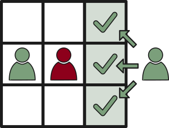
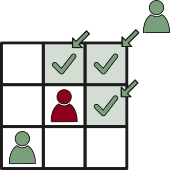
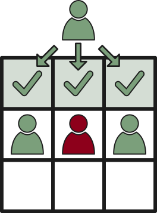
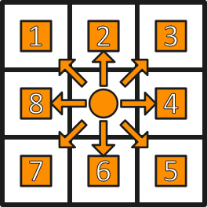

- [Introduction](#introduction)
- [How to Play](#how-to-play)
  - [Dice](#dice)
  - [Before the Game](#before-the-game)
  - [The Session](#the-session)
    - [Retell the Previous Session](#retell-the-previous-session)
    - [During the Session](#during-the-session)
    - [Intent \& Action](#intent--action)
    - [Spending Time](#spending-time)
  - [After the Session](#after-the-session)
  - [Tests](#tests)
    - [Testing an Attribute](#testing-an-attribute)
    - [Testing a Skill](#testing-a-skill)
    - [Types of Test](#types-of-test)
      - [Binary Test](#binary-test)
      - [Stepped Test](#stepped-test)
      - [Graduated Test](#graduated-test)
      - [Creative Test](#creative-test)
      - [Opposed Test](#opposed-test)
    - [Tests Bring about Learning](#tests-bring-about-learning)
    - [Providing Assistance](#providing-assistance)
      - [Helpers Learn](#helpers-learn)
    - [Time](#time)
    - [Compensation Points](#compensation-points)
- [Character](#character)
  - [Abilities](#abilities)
    - [Attributes](#attributes)
      - [Agility \[Agi\]](#agility-agi)
      - [Awareness \[Awar\]](#awareness-awar)
      - [Strength \[Str\]](#strength-str)
      - [Toughness \[Tough\]](#toughness-tough)
      - [Wit \[Wit\]](#wit-wit)
      - [Advancing Attributes](#advancing-attributes)
        - [Practicing Attributes](#practicing-attributes)
      - [Base Initiative](#base-initiative)
    - [Skills](#skills)
      - [Skill Forking](#skill-forking)
      - [Learning Skills](#learning-skills)
      - [Advancing Skills](#advancing-skills)
        - [Practicing Skills](#practicing-skills)
        - [Teaching Skills](#teaching-skills)
      - [Specialization Skills](#specialization-skills)
      - [Expertise](#expertise)
    - [Innate Abilities](#innate-abilities)
  - [Personality](#personality)
    - [Ambition](#ambition)
    - [Aspiration](#aspiration)
    - [Reaction](#reaction)
    - [Personality Traits](#personality-traits)
  - [Health \& Exhaustion](#health--exhaustion)
    - [Hit Points (HP)](#hit-points-hp)
      - [Bludgeoned to 0 HP](#bludgeoned-to-0-hp)
    - [Grit Points (GP)](#grit-points-gp)
    - [Toughness Progress from Damage](#toughness-progress-from-damage)
    - [Injury](#injury)
      - [Injury States \& Treatment](#injury-states--treatment)
    - [Exhaustion](#exhaustion)
    - [Condition](#condition)
    - [Illness](#illness)
    - [Scar](#scar)
    - [Damage Types](#damage-types)
    - [Damage Resistances](#damage-resistances)
    - [Boons \& Penalties](#boons--penalties)
  - [Assets](#assets)
    - [Bulk](#bulk)
    - [Worn \& Equipped](#worn--equipped)
    - [Luggage](#luggage)
      - [Carrying Capacity](#carrying-capacity)
      - [Overweight](#overweight)
    - [Property](#property)
  - [Non-Player Character (NPC)](#non-player-character-npc)
- [Fate Points](#fate-points)
  - [Minor Fate Points](#minor-fate-points)
  - [Major Fate Points](#major-fate-points)
  - [Ambition Fate Points](#ambition-fate-points)
  - [Hand of Fate](#hand-of-fate)
- [Time-Management](#time-management)
  - [Initiative](#initiative)
    - [Surprise Round](#surprise-round)
  - [Down-Time](#down-time)
    - [Travel](#travel)
    - [Crafting](#crafting)
      - [Crafting Time Chart](#crafting-time-chart)
    - [Trade](#trade)
      - [Seller's Chart](#sellers-chart)
      - [Buyer's Chart](#buyers-chart)
    - [Recovery](#recovery)
    - [Training](#training)
  - [Scenario-Time](#scenario-time)
- [Combat](#combat)
  - [Action Points (AP)](#action-points-ap)
    - [Action Point Saving](#action-point-saving)
  - [Combat Movement](#combat-movement)
    - [Disengage](#disengage)
    - [Flee Combat](#flee-combat)
    - [Push Through](#push-through)
    - [Swap-Out](#swap-out)
  - [Attacking](#attacking)
    - [Damage](#damage)
    - [Attacks of Opportunity](#attacks-of-opportunity)
    - [Flanking](#flanking)
    - [Stealth Attacks](#stealth-attacks)
  - [Defending](#defending)
    - [Armor \& Shields](#armor--shields)
    - [Defending an Ally](#defending-an-ally)
    - [Defense Stunts](#defense-stunts)
    - [Cover](#cover)
    - [Speed aids Defense](#speed-aids-defense)
  - [Throwing](#throwing)
    - [Throwing-Distance](#throwing-distance)
    - [Throwing-Accuracy](#throwing-accuracy)
    - [Throwing-Damage](#throwing-damage)
- [General Interactions](#general-interactions)
  - [Appraisal](#appraisal)
  - [Persuasion, Intimidation \& Deception](#persuasion-intimidation--deception)
    - [Are they lying?](#are-they-lying)
- [Appendix](#appendix)
  - [Character Creation](#character-creation)
    - [Determine Life Path](#determine-life-path)
      - [Origin](#origin)
      - [Youth](#youth)
      - [The Last Few Years](#the-last-few-years)
    - [Determine Name](#determine-name)
    - [Species, Sex \& Appearance](#species-sex--appearance)
    - [Determine Personality](#determine-personality)
      - [Determine Ambition, Aspirations \& Reactions](#determine-ambition-aspirations--reactions)
        - [Choosing an Ambition](#choosing-an-ambition)
        - [Choosing Aspirations](#choosing-aspirations)
        - [Choosing Reactions](#choosing-reactions)
    - [Determine Abilities](#determine-abilities)
      - [Choosing Attributes](#choosing-attributes)
        - [Manual Attribute Assignment](#manual-attribute-assignment)
        - [Semi-Random Attribute Assignment](#semi-random-attribute-assignment)
        - [Determine Attribute Advancing Thresholds](#determine-attribute-advancing-thresholds)
      - [Choosing Skills](#choosing-skills)
      - [Determine Boons from Heritage](#determine-boons-from-heritage)
    - [Determine Assets](#determine-assets)
    - [Determine Max HP \& Injury Maximum](#determine-max-hp--injury-maximum)
    - [Determine Exhaustion Limit](#determine-exhaustion-limit)
  - [Asset Appendix](#asset-appendix)
    - [List of General Assets](#list-of-general-assets)
    - [Weapon Properties](#weapon-properties)
  - [Lists of Skills](#lists-of-skills)
    - [Physical Skills](#physical-skills)
      - [Acrobatics (Agi/Str)](#acrobatics-agistr)
      - [Berserking (Tough/Tough)](#berserking-toughtough)
      - [Fishing (Agi/Awar)](#fishing-agiawar)
      - [Instrument-Playing \< instrument \> (Agi/Awar)](#instrument-playing--instrument--agiawar)
      - [Running (Str/Tough)](#running-strtough)
      - [Stealth (Agi/Awar)](#stealth-agiawar)
      - [Swimming (Agi/Tough)](#swimming-agitough)
      - [Thievery (Agi/Awar)](#thievery-agiawar)
      - [Observation (Awar/Awar)](#observation-awarawar)
      - [Path-finding (Awar/Wit)](#path-finding-awarwit)
      - [Shield (Str/Tough)](#shield-strtough)
      - [Throwing (Agi/Agi)](#throwing-agiagi)
      - [Unarmed Combat (Agi/Str)](#unarmed-combat-agistr)
      - [Weapon \< weapon type \> (\< attribute \>)](#weapon--weapon-type---attribute-)
    - [Social Skills](#social-skills)
      - [Acting (Awar/Wit)](#acting-awarwit)
      - [Animal Handling (Awar/Awar)](#animal-handling-awarawar)
      - [Commanding (Tough/Wit)](#commanding-toughwit)
      - [Entertainment (Agi/Wit)](#entertainment-agiwit)
      - [Mercantilism (Awar/Wit)](#mercantilism-awarwit)
      - [Riding (Agi/Awar)](#riding-agiawar)
      - [Self-Control (Tough/Tough)](#self-control-toughtough)
    - [Knowledge Skills](#knowledge-skills)
      - [Architecture (Awar/Wit)](#architecture-awarwit)
      - [Archeology (Awar/Wit)](#archeology-awarwit)
      - [Creature-Lore \<category?\> (Awar/Wit)](#creature-lore-category-awarwit)
      - [Geography (Awar/Wit)](#geography-awarwit)
      - [Geology (Awar/Wit)](#geology-awarwit)
      - [History \< subject \> (Wit/Wit)](#history--subject--witwit)
      - [Language \< language \> (Wit/Wit)](#language--language--witwit)
      - [Law and politics (Wit/Wit)](#law-and-politics-witwit)
      - [Mathematics (Wit/Wit)](#mathematics-witwit)
      - [Mechanics (Agi/Wit)](#mechanics-agiwit)
      - [Metallurgy (Awar/Wit)](#metallurgy-awarwit)
      - [Nature (Awar/Wit)](#nature-awarwit)
      - [Mysticism and Religion (Wit/Wit)](#mysticism-and-religion-witwit)
      - [Medicine (Agi/Wit)](#medicine-agiwit)
      - [Reading and Writing \< language \> (Awar/Wit)](#reading-and-writing--language--awarwit)
      - [Surgery (Agi/Wit)](#surgery-agiwit)
      - [Warfare (Tough/Wit)](#warfare-toughwit)
    - [Craftsmanship Skills](#craftsmanship-skills)
      - [Artistry (Agi/Awar)](#artistry-agiawar)
      - [Cooking (Awar/Wit)](#cooking-awarwit)
    - [Specializations](#specializations)
      - [Warcrobatics (Agi/Awar)](#warcrobatics-agiawar)
  - [List of Conditions](#list-of-conditions)
    - [Berserk](#berserk)
    - [Burning](#burning)
    - [Bleeding](#bleeding)
    - [Death's Door](#deaths-door)
    - [Dissolving](#dissolving)
    - [Drug-Addicted](#drug-addicted)
    - [Electrified](#electrified)
    - [Exhausted](#exhausted)
    - [Frostbitten](#frostbitten)
    - [Grappled](#grappled)
    - [Hasted](#hasted)
    - [Jealous](#jealous)
    - [Pacified](#pacified)
    - [Poisoned](#poisoned)
    - [Prone](#prone)
    - [Rooted](#rooted)
    - [Stunned](#stunned)
    - [Terrified](#terrified)
    - [Unconscious](#unconscious)
  - [List of Injuries](#list-of-injuries)
    - [Acid Injuries](#acid-injuries)
    - [Bleeding Injuries](#bleeding-injuries)
    - [Burning Injuries](#burning-injuries)
    - [Bludgeoning Injuries](#bludgeoning-injuries)
    - [Electrical Injuries](#electrical-injuries)
    - [Freezing Injuries](#freezing-injuries)
    - [Piercing Injuries](#piercing-injuries)
    - [Poison Injuries](#poison-injuries)
    - [Slashing Injuries](#slashing-injuries)
  - [List of Illnesses](#list-of-illnesses)
  - [List of Mutations](#list-of-mutations)
  - [List of Scars](#list-of-scars)
  - [Targeting-Types](#targeting-types)
    - [Single Target (ST)](#single-target-st)
    - [Multiple Single Target (MST)](#multiple-single-target-mst)
    - [Area of Effect (AoE)](#area-of-effect-aoe)

Version 18 (Playtest)

A role-playing game by Nicolas H.

# Introduction
**STRIVE** is a table-top role-playing game (**TTRPG**), requiring a **game master** (**GM**) and at least one **player** to play. 

At its core, **STRIVE** is about emergent storytelling and tactical combat. Players experience the evolution of their characters by defining convictions that **drive** them to action and which are based on the events they experience. In that way, players also **drive** the story forward and guide the evolution of the world. 

On the spectrum of *narrative-driven*, *game-y* and *simulationist*, **STRIVE** aims for the region between *game-y* and *narrative-driven*, while leaning heavily towards *game-y*. It understands itself as a *game*, not a *simulation*. The rules outlined herein will often reflect that by making broad abstractions and even some unrealistic assertions, with the goal of keeping the game easier to learn and more fun to experience. 

Most rules have a certain degree of vagueness to them. This is at least partially deliberate. The situations that can come up during play are simply too varied and numerous to be possible to completely cover with rules, without requiring epic tomes filled to the brim with highly specific rulings for highly specific situations. Instead, the game relies on the **GM** to arbitrate in most situations. The descriptions in the rules here should serve as a point of orientation for the **GM**. How they interpret the rules, is how they're to be understood. 

The system is best suited for long-term "sandbox" style games, running over several real-world sessions. One-shots are possible but may not provide the best experience, as several of the system's mechanics require breaks in play. More narrowly directed experiences are possible, but may require some shortcuts to be taken when it comes to *time* - how long it takes to recover from injuries and illnesses, how long it takes to craft and to practice. 

More details about the system:
* Player character evolution is baked into the rules. 
  * Characters have long-term and short-term goals, which drive them onward and which change over time. 
  * Characters learn and improve their abilities (**attributes** and **skills**) as they are used. Generalist characters benefit from varied knowledge, while specialists enjoy unique abilities. 
* Role-playing is encouraged by game mechanics. 
  * A meta-currency, called **fate points** is earned by *players*, based on what they and their character do in a session. 
  * Characters can help each other in game mechanical ways, encouraging co-operative play. 
* Combat is a risky affair and requires tactical and strategic thinking, or the readiness to retreat, when things go awry. 
  * When a character suffers **injuries**, they are in *serious trouble*. 
  * Recovery from injuries is expected to take several in-game weeks. This implies plenty of down-time for combat-heavy parties, which is time that can be spent on professions, hobbies and scheming. 
* Players are expected to manage various resources, such as their **fate points**, their character's HP, stamina and luggage. 

Extensibility and adaptability are an important component of the system. You are encouraged to add skills, assets or whatever else you desire. And if a rule doesn't work for you, change it to make it your own! 

# How to Play
As **STRIVE** is a **roleplaying game**, there are certain rules to follow and expectations made of both players and **GM**. 

The **GM** and the players work ***together*** to create a unique experience and weave a story of glorious triumph, tragic defeat or anything in-between. Ultimately, the **GM**'s job is to provide interesting conundrums to the players and their job is to provide interesting answers, in-line with what their characters believe and *want*. Remember that everyone at the table is looking to have fun and that includes the **GM**. 

Each player only directly controls a single character. The **GM** is in control of every single [non-player character (**NPC**)](#non-player-character-npc), the world and the story. A player character is abbreviated as **PC**. 

In some places, where distances are concerned, both feet and meters are noted as units. What attentive readers will notice, is that the conversion between the numbers won't always be correct. This is a deliberate decision to make the math easier, whenever distances are concerned. If a battlemap is used, one square on the grid should represent either a three foot, or one meter square. Furthermore, a single, ordinary human, should occupy an entire such square. 

## Dice
**STRIVE** uses a **dice pool** system of **six-sided dice** (henceforth referred to as **D6**) to resolve [tests](#tests). *Dice pool* means a variable number of dice will be rolled, based on a character's [attributes](#attributes), [skills](#skills), [boons](#boons--penalties) and circumstance of the situation they're in. 

The following types of dice come into play:
* **D4** - four-sided dice. Four of these will be enough for most situations. 
* **D6** - six-sided dice. You will need a lot of these. Ten should be enough for most situations. 
* **D8** - eight-sided dice. Three of these will be enough for most situations. 
* **D10** - ten-sided dice. Three of these will be enough for most situations. 
* **D20** - twenty-sided dice. Just one of these will be enough. Can also be substituted with `2 D10`s. 

## Before the Game
The very first step of preparing for play, is to decide on a theme, world and setting of the game. Ideally, the players and **GM** decide together, but ultimately, the **GM**'s preferences should hold a greater weight. When a **GM** isn't really interested in the theme, world and setting, the game will quickly start feeling like a chore to them. The result is they lose motivation to keep running the game. No one wants that. But not to worry! As long as you communicate and respect your **GM**'s wishes, you'll have no problem finding common ground. 

* The **theme** describes the types of adventures the **PC**s will experience and what tone they'll have. Is it grimdark or heroic? Is it survival-horror or calm and relaxing? Will politics be important?
* The **setting** determines the framework that holds the world - what technology, what kinds of creatures and what kinds of environments can be expected? Is it medieval fantasy? Contemporary? The wild-west? Perhaps science-fiction?
* And ultimately, the **world** is the manifestation of theme and setting. 

Then, still before anyone can start to play, the players have to [create their characters](#character-creation). Ideally, this process should be done in cooperation with the **GM** and each other, to make sure the character concepts fit into the world and planned narrative. Also, it is advisable to design characters that will work well together, as a group. You *could* plan for a discordant group of PCs, but make sure the characters find concrete reasons to stick together! Otherwise, you may find the **GM** eventually running several solo-games that all just *happen* to be played at the same time. 

## The Session
This is the time when the magic happens. The players and **GM** have come together and begin or continue the story. 

### Retell the Previous Session
At the start of a session, one of the players, or perhaps the **GM**, should recall and retell the events of the previous session. This lets everyone refamiliarize themselves with the story so far. It also provides the staging ground for events and actions to come. 

This is also the time when players choose new [aspirations](#aspiration) for their character and to buy [fate-cards](#hand-of-fate). 

### During the Session
[Fate points](#fate-points) cannot be awarded during play and neither can cards be bought from the [hand of fate](#hand-of-fate). However, players and the **GM** should take note of every situation they believe a **PC** (their own included) could have earned a [fate point](#fate-points).

It is up to the **GM** to get the ball rolling. They first frame the local area of the world the PCs find themselves in. They describe the scenario at hand - where the **PC**s are, what they can see, hear, smell and feel - and then ask "who does what?"

Then, the players must keep the ball rolling. In a given scenario, every **PC** should have something they wish to do. You could take turns or rely on first-come-first-serve, as long as everyone gets to state their character's [intent and action](#intent--action). Every action taken is then resolved, either formally through a [test](#tests) or informally with a direct description of what happens. 

A [test](#tests) must be made whenever there is an **obstacle** to overcome - some **action** whose outcome is uncertain. 

> For example, stating your character will leave the room shouldn't warrant a [test](#tests), if there is no obstacle to overcome. Opening an unlocked door in a calm situation should be a "risk-free" thing to do. 
>
> However, when the same situation takes place during a time-critical phase, for example in a burning house and the door being locked, then a [test](#tests) to quickly force the lock or break down the door would be warranted. 

### Intent & Action
The players drive the story and the action. They decide what their character will try to do and the **GM** will help them figure out if things will go as planned. 

As a player, when deciding on what to do, make sure you state the **intent** of your action, like "I want to find incriminating evidence against a merchant". Then, the **GM** will need to know *how* you aim to follow up on your intent. Describe the **action** you will take. The clearer, the better. "I will ask around", would allow the **GM** to guide you along. But there are still details left to fill in. Who and where will you ask? What will you ask them? So, a better intent would be "I will ask the other merchants at the market what they think about this one merchant". That leaves no room for doubt *how* you wish to achieve your goal, which makes the **GM**'s job easier and the game flow better. The **GM** could now have each merchant tell the **PC** some rumours or observed past activities and behaviors of that one merchant, some of which may be of a sketchy nature, like "I swear I saw him down at the docks, speaking to some shady looking people" or "He always seems wary of people walking behind him".

Of course, how appropriate a certain [attribute](#attributes) or [skill](#skills) is for the resolution of a given situation, is ultimately up to the **GM** and the specifics of the situation itself. 

When deciding on what to do, keep in mind your character's [personality](#personality) as that should inform you of the kinds of actions they might take. 

### Spending Time
Everything the **PC**s do takes time. How much time, exactly, is variable and depends on the point in the narrative the **PC**s are in. There are two levels of time-management. 

On the more abstract level, **PC**s commit to very abstract long-term actions. They might pursue their profession or recover from an injury. This level is called [down-time](#down-time). 

In contrast, on the more concrete level, **PC**s only commit to fine-grained short-term actions. This is when detailled descriptions and fine time slices come into play. Every action is as small as deciding to open a door that is right in front, or deciding to talk to someone in the same room. This is considered the **scenario** or **encounter** level. 

Typically in RPGs, a fight is considered a **[combat](#combat) encounter**. Non-bloody interaction that involves speaking to [NPCs](#non-player-character-npc) or the **PC**s amongst themselves is considered a **social encounter**. There are also scenarios of exploration, investigation and survival. 

## After the Session
After a session is done, the players and **GM** stick around to discuss which players earned [fate points](#fate-points). This is where players are nominated for [fate points](#fate-points), by each other and by the **GM**. If everyone agrees, the [fate points](#fate-points) are awarded. Players can and should lobby for their [fate points](#fate-points), but shouldn't beg. If most everyone else says no, then that decision stands. 

Also after the session, players and the **GM** discuss whether a **PC** should lose a [reaction](#reaction), because they have acted against it or haven't gotten to play it out at all. 

Players may now spend earned [fate points](#fate-points) to buy cards (boons) from the [hand of fate](#hand-of-fate) and adjust their character's [personality](#personality) and [aspirations](#aspiration). This may also be postponed to the start of the next session. 

## Tests
Whenever the outcome of an action or situation is uncertain, a **test** may be called for by the **GM**, in order to resolve it. 

As a basis for a **test**, either an [attribute](#attributes) or [skill](#skills) is used. More specifically, their **modified level** determines the number of **D6** available for a **test**. The **modified level** is the result of adding and subtracting [boons and penalties](#boons--penalties) (the sum of which is referred to as **modifier**) to or from the **raw level**. Note that while no [boons or penalties](#boons--penalties) are present on the character, their **modified level** is equal to their **raw level**. 

Either a **six** or a **five** rolled on a single die counts as a **hit**. Other values are considered **misses**. **hits** are required in order to succeed a **test**. 

How many **hits** are needed to succeed a **test**, is determined by the **GM** or by other characters, via a mechanism called **obstacle** (henceforth referred to as **Ob**). The **test** can only succeed, if at least as many **hits** are rolled, as the given **Ob**. 

> For example, to succeed a **test** at **Ob 3**, at least three **hits** must be rolled to succeed the **test**. Any less, and outcome is a failure. 

The **Ob** isn't always determined directly by the **GM**. Whenever an [opposed test](#opposed-test) must be made, the **Ob** is determined by another character. 

For every **test**, one of three outcomes is possible: 
* **Complete Success**: There are enough or more than enough required **hits**.
* **Partial Failure**: There are not enough **hits**, but more than none. 
* **Complete Failure**: There are no **hits**, only **misses**. 

### Testing an Attribute
To resolve an **attribute test**, the number of **D6** determined by the **attribute's modified level** must be rolled. 

> A **PC** has an [agility](#agility-agi) of 3 and an [injury](#injury) that imposes a [penalty](#boons--penalties) of -1 to their **agility**. 
>
> When asked to test their **agility**, their player takes their **raw level** (3), subtracts the **penalty** (1) and thus knows their **modified level** to be 2. 
>
> This means they get to roll 2 **D6** for their **test**. 

Unlike with [skills](#skills), it is **not** possible to [fork](#skill-forking) **attributes**. 

### Testing a Skill
To resolve a **skill test**, the number of **D6** indicated by the **skill's modified level**, plus *one* of its two **base attributes' modified level** as additional **D6** must be rolled. You must choose, which of the two base attributes to roll. 

The **modified level** is the result of adding and subtracting [boons and penalties](#boons--penalties) from the **raw level**. 

> A **PC** has an [agility](#agility-agi) at **modified level** 3 and [strength](#strength-str) at **modified level** 1. 
> 
> In order to test their [acrobatics](#acrobatics-agistr) skill at **modified level** 2, they get to roll (3 or 1) + 2 = 5 or 3 **D6**, if they don't have any other skills to [fork](#skill-forking) into the test. 

It possible to [fork](#skill-forking) **skills**, allowing even more dice to be used in a test. **Do not forget to fork your skills in tests!**

> A **PC** has an [agility](#agility-agi) at **modified level** 2, **awareness** at **modified level** 1 and [thievery](#thievery-agiawar) at **modified level** 1. 
>
> They are asked to roll a test for their [thievery](#thievery-agiawar) at **Ob** 4. With their **base attributes** and [thievery](#thievery-agiawar) combined, they can only roll (2 or 1) + 1 = 3 or 2 **D6** for the test, which means the **Ob** 4 test would be impossible to succeed. 
>
> But since they also *know* [stealth](#stealth-agiawar), they can petition the **GM** to allow them to [fork](#skill-forking) their [stealth](#stealth-agiawar) into their [thievery](#thievery-agiawar) test. The **GM** agrees and thus allows an additional **D6** to be added to the roll. 
>
> Thus, the **PC** gets to roll 4 **D6** for their test. While still difficult to succeed, the test _can_ now be succeeded, where before such a feat was impossible. 

### Types of Test
There are the following types of tests. The **GM** decides when to use which. 

#### Binary Test
The outcome of the test is either a **complete success** or **complete failure**. A **partial failure** is treated as if it were a **complete failure**. 

#### Stepped Test
A stepped test is really just a series of [binary tests](#binary-test). This allows for finer-grained results, while still not behaving like a [graduated test](#graduated-test). 

This type of test is useful for situations where the **GM** decides to create very fine *time slices* and allow more chances for success. This makes it easier to allow a **PC** to *fail forward* or prevent a *one roll to end it all* situation. 

> For example, a **PC** is attempting to cross a suspension bridge, but upon setting foot on the bridge, the ropes holding it up, suddenly snap. The **PC** can make an [acrobatics](#acrobatics-agistr) test, to try and quickly jump off and back onto solid ground. They fail, and get to make another [acrobatics](#acrobatics-agistr) test at greater **Ob**, to try and grab a root sticking out of the ground beneath the bridge. They fail again! As a last chance for that **PC** to survive, the **GM** asks one of the other players if their character will attempt an [acrobatics](#acrobatics-agistr) test at high **Ob**, to try and grab their falling ally's hand in a daring rescue. Finally, their ally succeeds and the **PC**'s life is saved. 
> 
> Obviously, such a situation should not arise often, as stepped tests can quickly grow exasperating. 

#### Graduated Test
The outcome of the test is graduated. That means, the number of **hits** rolled during the test factor into the outcome. This is called the **degree of success**. 

> For example, when crafting a work of art, the number of **hits** achieved may result in a more impressive piece, which can then be sold at a higher price or which could make for a more impressive gift. 

A **graduated test** can occur in two forms. The first is without an **Ob** threshold for failure and the second is *with* such a threshold. When a graduated test has an **Ob**, then at least that number of **hits** must be rolled, in order to succeed the test, at all. Any **hits** rolled past the **Ob**, determine the **degree of success**. However, not achieving at least **Ob** number of **hits** results in the test being counted as a **complete failure**. 

On the other hand, even a **complete failure** doesn't have to be *absolute*. The number of **hits** *missing* to reach the **Ob** threshold determine the **degree of failure**. Therefore, there might be a chance to "fail forward" - a success, but with complications, whose severity depends on the **degree of failure**. 

> For a test, a **PC** has to do a **graduated test** of one of their **craftsmanship** **skills**, at **Ob** 3. They only achieve only 2 **hits**, which results in a **degree of failure** of 1. 
> 
> Seeing such a low **degree of failure**, the **GM** rules that the PC *does* succeed their test, but also loses more materials in the process than a **complete success** would have cost them. 

#### Creative Test
This type of test asks the player(s) to pick and justify the [skill(s)](#skills) or [attribute](#attributes) to use in a given situation. Players are encouraged to think creatively, come up with and describe their solutions. 

Whether the [attribute](#attributes) or [skill(s)](#skills) in question can apply to resolve the situation at hand, lies at the **GM**'s discretion. 

#### Opposed Test
This type of test occurs, when two characters come into opposition. Who wins, and by how much, is determined by comparing the number of **hits** each achieves. The one with the most **hits** is the winner. But if there is a tie, the **defending** character is considered the winner. 

The character whose action requires the opposed test to be made is considered the *attacker*. The other character is considered the *defender*, because they are forced to react. 

> For example, a character tries to sneak past another, the sneaking character will have to succeed a [stealth](#stealth-agiawar) test, while the other character will have to succeed an [observation](#observation-awarawar) test. In this scenario the character testing their **stealth** is considered the *attacker*, while the passive character being *forced* to test their **observation** is considered the defender. 

The defender first rolls a test of their respective skill, against **Ob 0** (this 'automatic success' does **not** count towards skill progression) and the number of **hits** that result, plus one, is the resulting **Ob** for the attacker to match or exceed. 

> In combat, a defender rolls a defense and achieves 3 **hits**. Thus, the attacker must achieve at least 4 **hits**, in order to win the opposed test. 

Whoever actually wins the opposed test, gets to note a success on their respective skill, while the loser must note a failure on their respective skill. 

> In combat, a defender rolls for defense and achieves 3 **hits**.
> 
> The attacker rolls an attack and achieves 3 **hits**. The **hits** being tied with the defenders', means the defender wins, by default. 
> 
> Thus, the defender notes a success on their respective defense skill, while the attacker must note a failure on their respective attack skill. 

The defender **cannot** [fork](#skill-forking) other skills into their test, whereas the attacker **can**.

If a tie occurs in which a **defender** cannot be clearly determined, the result is a deadlock and neither side gains anything. Mind you, this shouldn't normally happen. Avoid this type of situation to the best of your ability. 

### Tests Bring about Learning
Whenever a [skill](#skills) or [attribute](#attributes) is tested, its outcome must be noted. Once a certain threshold number is reached, the [skill](#skills) or [attribute](#attributes) advances to a higher level. 

For [skills](#skills), whether the test was a success or failure matters. But for [attributes](#attributes), only the number of tests matters. 

When a [skill](#skills) is tested, both it **and** its base [attributes](#attributes) are progressed. See also:
* [advancing skills](#advancing-skills)
* [advancing attributes](#advancing-attributes)

**Ob** 0 tests only count towards progression, if they are made in an [opposed test](#opposed-test). 

### Providing Assistance
Characters can help each other in tests. In order to help with a test, a character must know a relevant [skill](#skills) and the one being helped must accept the help. 

Helping in a test works similar to [forking](#skill-forking) a [skill](#skills). The character being helped receives **+1D6** to roll for each *character* helping them. The number of relevant [skills](#skills) a helping character has is irrelevant, as is the level of those [skills](#skills). Just one [skill](#skills) and one level in it are enough to allow them to help and only one **+1D6** is granted by the helping character. However, *which* [skill](#skills) is used to help with, matters. 

If a **PC** is helping another, their player must describe *how* they're using their relevant [skill](#skills) to help. Only if the **GM** agrees, may the helping die be granted. 

> For example, a **PC** is currently using their [thievery](#thievery-agiawar) to lockpick a door. Their allied **PC** is *helping*, by using their [observation](#observation-awarawar) [skill](#skills) to *keep an eye out for guards*, which allows the one on the door to work without having to constantly look over their shoulder. The **GM** finds that description agreeable and allows the use of the [skill](#skills) to help. 

#### Helpers Learn
A character helping in a test, also gains [progress](#advancing-skills) towards the [skill](#skills) and [attribute](#attributes) they've helped with. The outcome of the test for the character they've helped, is their own outcome. 

> If the character who was helped succeeded their test, the helper also gains a success to mark on their [skill](#skills). 

### Time
Not all tests are created equal - some actions require more time than others. 

While the **GM** decides on how much time a given test will need, the following guidelines should provide a good basis. 

* (Near) instantaneous: Combat actions, recalling knowledge, noticing things in passing. 
* A matter of minutes: inspecting an environment, quickly skimming the contents of a book, a short conversation, first aid. 
* A matter of hours: Simple crafts, surgery, scrutinizing an environment, researching something simple and common, engaging in lengthy and difficult negotiations.
* A matter of days and months: Complex crafts and artistry, researching a complex or obscure subject. 

### Compensation Points
**Compensation points** allow turning the faces of dice that came up as **misses** up to the next higher number, until they become a **hit**, instead. 

> When rolling 3D6, with 2 **compensation points** and achieving 5, 3, 4 in the roll, then 1 of those **compensation points** can be used to turn the 4 into a 5 or both of the **compensation points** could turn the 3 into a 5. There are not enough **compensation points** to turn all **misses** into **hits**, but at least one die is guaranteed to become a **hit**! 

# Character
A character is a representation of a sentient creature in the game world. They're an amalgam of their [abilities](#abilities), [personality](#personality), [health](#health--exhaustion) and [assets](#assets). 

A guide on character creation can be found [in the appendix](#character-creation). It has been placed there based on the assumption you won't have to look up character creation as often as the other core rules. 

## Abilities
All characters have innate and learned abilities. These are described as [attributes](#attributes) and [skills](#skills). 

These abilities determine the chance a character will succeed at the tasks they perform and improve as they're used. 

### Attributes
**Attributes** describe a character's basic, inherent abilities. 

Two values must be tracked for every **attribute**: Its **raw level** and its current **modifier**, which results from the sum of [boons and penalties](#boons--penalties) affecting it. The result of adding or subtracting the modifier to/from the **raw level** yields the **modified level**, which is used in [tests](#tests). The higher the **level**, whether **raw** or **modified**, the better. 

For [testing](#tests) an **attribute**, see the [Testing an attribute](#testing-an-attribute) section. 

**Attributes** [advance](#advancing-attributes), as they or [skills](#skills) that depend on them are [tested](#tests). It is also possible to [practice](#practicing-attributes) **attributes**, but **not** to teach them. 

#### Agility [Agi]
Nimbleness, swiftness and hand-eye coordination. 

For every point in this **attribute**, a character can [sprint](#combat-movement) an additional 3'/1m per [AP](#action-points-ap) spent or every 5 seconds. 

#### Awareness [Awar]
Keen senses and empathic understanding. 

#### Strength [Str]
Strength of limb. 

Governs the [carrying capacity](#carrying-capacity) of a character. Each point in this **attribute** raises the [carrying capacity](#carrying-capacity) of the character by 3. 

For every 3 points in this **attribute**, past the initial **modified level**, every [asset slot](#worn--equipped) of a character can hold **assets** of one bulk higher. 

> At **modified level** 3 in this **attribute**, a character can still only hold **assets** of bulk 2 in each hand. 
> 
> Starting at **modified level** 4 in this **attribute**, a character can hold **assets** of bulk 3 in each hand. Then, the next increase is at level 7, then level 10 and so on.

#### Toughness [Tough]
Enduring physical and mental strains. 

For **every** level in **toughness**, a character...
* ...gains `+10` maximum [HP](#hit-points-hp). All characters have base [HP](#hit-points-hp) of `10`. 
* ...raises their [exhaustion limit](#exhaustion) by `+1`. All characters have a base limit of `1`. 
* ...gains around `3` minutes of holding their breath. 
* ...gains one additional die with which to try and shrug off an [injury](#injury).

For **every second** level in **toughness**, a character...
* ...reduces the maximum [HP](#hit-points-hp) penalty from [injuries](#injury) by `1`. 

For your convenience, the table below lists the numbers per level.

| Level                        | 1   | 2   | 3   | 4   | 5   | 6   | 7   | 8   | 9   | 10  |
| ---------------------------- | --- | --- | --- | --- | --- | --- | --- | --- | --- | --- |
| Max. HP                      | 20  | 30  | 40  | 50  | 60  | 70  | 80  | 90  | 100 | 110 |
| Max. HP reduction per injury | 10  | 9   | 9   | 8   | 8   | 7   | 7   | 6   | 6   | 5   |
| Exhaustion Limit             | 2   | 3   | 4   | 5   | 6   | 7   | 8   | 9   | 10  | 11  |

Every time a character suffers at least 10 [HP](#hit-points-hp) of damage **in a single attack**, they gain +1 [advancement progress](#advancing-attributes) to **toughness**. For 20 or more [HP](#hit-points-hp) of damage, they gain +2 [advancement progress](#advancing-attributes). There is no greater progression past this point. 

> A character suffering 15 points of damage **in a single attack**, gains +1 advancement progress to their **toughness** automatically. 
>
> A character suffering 22 points of damage **in a single attack**, gains +2 advancement progress to their **toughness** automatically. 
> 
> A character suffering 41 points of damage **in a single attack**, still only gains +2 advancement progress to their **toughness** automatically. 

#### Wit [Wit]
Sharpness of mind and tongue. 

#### Advancing Attributes
Whenever a **PC** [tests](#tests) an [attribute](#attributes) or a [skill](#skills) that depends on it, progress towards advancing the [attribute](#attributes) must be noted. See also: [Tests Bring about Learning](#tests-bring-about-learning)

Note that *level* in this section refers to the **raw level** of an **attribute**. That is, the level as it is **before** [boons and penalties](#boons--penalties) are applied to it. 

**Attribute** levels and advancement are divided into three tiers: **Underdeveloped**, **Average** and **Exceptional**. 
* Attributes are considered **underdeveloped** at level 1 and 2. 
* Attributes are considered **average** at level 3 and 4. 
* Attributes are considered **exceptional** starting from level 5. 

The advancement formulae are shown in the following table. *N* is the current level in the **attribute** and the resulting number is the number of [tests](#tests) required to advance. Successes and failures are not tracked for **attributes** and thus irrelevant for **attribute advancement**. 

| underdeveloped | average             | exceptional         |
| -------------- | ------------------- | ------------------- |
| `N * 10`       | `N * 7`             | `N * 8`             |

For your convenience, the following table contains the precalculated requirements to advance an **attribute** level. 
* In the table, 'Level' is the character's *current level* in the **attribute**. 
* Note it is possible to go past level 10, but you shouldn't hope for it any time soon. 

| Level | Tests |
| ----- | ----- |
| 1     | 10    |
| 2     | 20    |
| 3     | 21    |
| 4     | 28    |
| 5     | 40    |
| 6     | 48    |
| 7     | 56    |
| 8     | 64    |
| 9     | 72    |
| 10    | 80    |

Whenever an **attribute** advances (= its level increases), advancement progress must be reset to `0` and it must be marked as "advanced" this session. Once it has advanced, no more progress can be noted for it, for the remainder of the session and an in-game week (although you may wish to relax the in-game time requirement if it doesn't work at your table). The body and mind need time to adjust and to rest after all that exercise. 

##### Practicing Attributes
It is possible to advance attributes *passively*. Whenever a large period of time is spent outside of active adventure, **PC**s can practice an attribute of choice. 

A **PC** can only actively practice one **attribute**. Furthermore, a **PC** can not both be actively practicing an **attribute** *and* a **skill**. They must choose - either practice an **attribute** *or* a **skill**. 

For every **cycle** that passes of active practice, the **PC** can roll a [test](#tests) for the chosen **attribute** with **Ob** at half of their **raw attribute** (rounded up). 

A **cycle** is 1 month, regardless of attribute being practiced. 

> A **PC** spends 3 months practicing their [wit](#wit-wit). In this case, 3 tests can be made and the progress noted. 

#### Base Initiative
Whenever the order in which characters act matters, their **base initiative** comes into play. It, together with a die roll, determines how early a character gets to take action in a given scenario. 

The **base initiative** of a character is **not an attribute** in the pure sense. It *cannot* be improved directly and is instead derived from the sum of the character's [agility](#agility-agi), [wit](#wit-wit) and [awareness](#awareness-awar). 

> A character with an **agility** of 3, **wit** of 4 and **awareness** of 5, has a **base initiative** of (3 + 4 + 5 =) 12. 

See also [initiative](#initiative). 

### Skills
A **skill** is any acquired knowledge and experience regarding a specific subject. 

Two values must be tracked for every **skill**: Its **raw level** and its current **modifier**, which results from the sum of [boons and penalties](#boons--penalties) affecting it. The result of adding or subtracting the modifier to/from the **raw level** yields the **modified level**, which is used in [tests](#testing-a-skill). The higher the **level**, whether **raw** or **modified**, the better. 

Every skill has two [attributes](#attributes) it relies on - its so-called *base* [attributes](#attributes). The level of a chosen one of these base [attributes](#attributes) also factors into [tests](#testing-a-skill) of the **skill**. 

**Skills** [advance](#advancing-skills), as they're tested. It is also possible to [practice](#practicing-skills) and [teach](#teaching-skills) **skills**. 

#### Skill Forking
When [testing](#testing-a-skill) a **skill**, it is possible to **fork** other *related* **skills** into the test, granting more dice to roll and thus a better chance of succeeding. 

For every other **skill** you **fork** into a test, you always receive **+1D6**. The level of the **skill** being **forked** into a test does **not** matter!

It is possible to **fork** as many other **skills** as you want into a test. But:
* The **skills** you wish to **fork** into the test must be *known*.
* You must *ask* permission for every **skill** you wish to **fork** into your test with a plausible explanation of how it may be helpful. Only if the **GM** agrees, may you **fork** that **skill** into your test. 

> Imagine a large forked rivermouth. One of the forks feeding into it is also a large river, which represents the **skill** primarily being tested. The other, smaller forks of the river represent the supporting **skills**. They all combine together at the rivermouth. A primary and its supporting **skills** flow together into the test! 

Always keep in mind that *players* lobby for **skill forking**, not the **GM**! When the **GM** asks you to test a **skill**, ***you*** present the **skills** *you* wish to **fork**. The **GM** should not tell you which **skills** to **fork**! That is not their job. 

> For example, a **PC** is asked to test their [thievery](#thievery-agiawar) **skill** to pick a lock. They also know [stealth](#stealth-agiawar) and know a mechanics skill. Their player thus asks for permission to fork their mechanics skill into their thievery test, explaining their experience with mechanics helps them understand the lock's mechanism. The **GM** agrees. 
>
> Then, the player asks to also fork their stealth into the test. The **GM** disagrees, as they explain there is currently no need to be stealthy. There are no guards nearby who could possibly perceive the lock-picking attempt. 
>
> In the end, the **PC** gets **+1D6** from their mechanics skill for their thievery test. 

> Anothery thievery example. Let's assume a **PC** is trying to quickly unlock a door using their [thievery](#thievery-agiawar), because they're being chased by guards and desperately need to get away. They could argue to fork their [stealth](#stealth-agiawar) skill into the test, but ultimately, what use is stealth when you've already been detected? Unless you can make yourself *unseen* somehow, the **GM** should rule that stealth cannot apply in that situation. 

#### Learning Skills
Whenever asked to test a skill a **PC** does not yet know, it will be added or progressed in the *currently learning* section of the character sheet. 

A **skill** in learning can only be tested with its base [attributes](#attributes). 

> A player is asked to test their character's [cooking](#cooking-awarwit) at **Ob** 2. Their character lacks that skill and thus adds it to the *currently learning* section on their character sheet. Assuming their character has the **base attributes** at level 2 and 3, they get to roll `2 + 3 = 5` **D6**. 

[Forking](#skill-forking) **learning skills** into [tests](#tests) is **not** allowed. But **forking** *into* [tests](#tests) of **learning skills** **is** allowed. [Specialization skills](#specialization-skills) *always* and *automatically* receive **forking** from their **prerequisite skills**. 

#### Advancing Skills
Whenever a **PC** uses a **skill** in a [test](#tests), the outcome must be noted, both on the skill **and** its associated [attribute](#attributes). See also: [Tests Bring about Learning](#tests-bring-about-learning)

Note that *level* in this section refers to the *raw level* of a **skill**. That is, the level as it is **before** [boons and penalties](#boons--penalties) are applied to it. 

Skill levels and advancement are divided into three tiers: **Dabbling**, **Apprentice** and **Master**. 
* Skills at **dabbling level** are any skills at level `0`, which means any [learning skill](#learning-skills). 
* Skills at **apprentice level** are easy to improve and range from the levels `1` to and including `4`. 
* Skills at **master level** are difficult to improve and start at level `5`. Mastery is open-ended, which means it doesn't, technically, stop. 

The advancement formulae are shown in the following table. *N* is the current level in the **skill**. *S* stands for **complete successes**. *F* stands for any **failure** - that means **partial failures** and **complete failures**. For advancement, no distinction between the type of failure is made. 

|   | dabbling       | apprentice          | master              |
| - | -------------- | ------------------- | ------------------- |
| S | `6`            | `N + 3`             | `N + 4`             |
| F | `9`            | `(N * 2) + 4`       | `(N * 2) + 5`       |

> A character has a [nature](#nature-int) **skill** at level `2`. 
> 
> To advance their **skill** to level `3`, they would need `2 + 1 = 3` **complete successes** and `(2 * 2) + 1 = 5` **failures**.

For your convenience, the following table contains the precalculated requirements to advance a **skill** level. 
* In the table, 'Level' is the character's *current level* in the **skill**. 
* Note it is possible to go past level `10`, but you shouldn't hope for it any time soon. 

| Level | Successes | Failures |
| --- | --- | --- |
| 0   | 6   | 9   |
| 1   | 4   | 6   |
| 2   | 5   | 8   |
| 3   | 6   | 10  |
| 4   | 7   | 12  |
| 5   | 9   | 15  |
| 6   | 10  | 17  |
| 7   | 11  | 19  |
| 8   | 12  | 21  |
| 9   | 13  | 23  |
| 10  | 14  | 25  |

Whenever a **skill** advances, its associated successes and failures must each be reset to `0`. Successes and failures accumulated past the threshold do **not** carry over. They're *lost*. Also, the **skill** must be marked as "advanced" this session. Once it has advanced, no more progress can be noted for it, for the remainder of the session and an in-game week (although you may wish to relax the in-game time requirement if it doesn't work at your table). The body and mind need time to adjust and to rest after all that exercise. 

##### Practicing Skills
It is possible to advance **skills** *passively*. Whenever a large period of time is spent outside of active adventure, **PC**'s can practice a skill of choice. 

A **PC** can only actively practice one **category of skills**. For every **cycle** that passes of active practice, the **PC** can roll a [test](#tests) of a skill of the corresponding category. Furthermore, a **PC** can not both be actively practicing a **skill** *and* an **attribute**. They must choose - either practice a **skill** *or* an **attribute**. 

The **Ob** for such practice [tests](#tests) is always half of the **skill's raw level** (rounded up). 

| Skill Category | Cycle    |
| -------------- | -------- |
| Physical       | 3 Weeks  |
| Social         | 2 Weeks  |
| Craftsmanship  | 1 Month  |
| Knowledge      | 2 Months |

> A **PC** spends seven weeks practicing their [fishing](#fishing-awar), while waiting for their comrade to recover from their [injuries](#injury). [fishing](#fishing-awar) being a physical skill, has a test cycle of 3 weeks. In this case, 2 tests can be made and their outcomes noted. 

##### Teaching Skills
Much like it is possible for a character to [practice](#practicing-skills) on their own, they can also be taught by another, who knows more than them. 

Both teacher and pupil must actively spend time together, furthering the pupil's skill. The teacher's skill must be at least one **raw level** higher than that of their student.

The rules for cycle and test are the same as with [practice](#practicing-skills), but the cycles noted in the table below are used, instead. Also, the student can use an extra **+1D6** to resolve their tests of the skill they're being taught. 

Pupils benefit from getting twice the amount of advancement progress to note, per test. 

| Skill Category | Cycle    |
| -------------- | -------- |
| Physical       | 2 Weeks  |
| Social         | 1 Week   |
| Craftsmanship  | 3 Weeks  |
| Knowledge      | 1 Month  |

#### Specialization Skills
Some **Skills** can only be learned, if other *prerequisite* **skills** are known. Such **skills** represent a further direction of *specialization*, which can in some circumstances replace usage of one of the prerequisite **skills**, or provide a new set of [expertises](#expertise) to extend what the prerequisites were capable of. Furthermore, the prerequisites may be required to be known at *at least* a certain given level. Unless the prerequisite **skills** are *known* at that level, the specialization **skill cannot** be learned. 

A **specialization skill** [advances](#advancing-skills) as any other **skill**. Their prerequisite **skills** do **not** [advance](#advancing-skills) along with the **specialization skill**! 

For a [test](#tests), any prerequisite **skills** are *always automatically* [forked](#skill-forking) into the [test](#tests). 

> A character knows skill A and skill B. These are prerequisite skills for skill C, which the character has just begun learning and has at level 0. 
>
> For a test of skill C, they get to roll **+2D6** from their prerequisite skills.

#### Expertise
**Skills** can offer **expertises**, which further define what the **skill** may be used for. An **expertise** is either a *passive* [boon](#boons--penalties) or an *active* **action**, with effects that apply when used.  

**Expertises** incentivize specialization, by granting special abilities at higher **skill** levels. 

"*Owning* **skill**" refers to the **skill** an **expertise** belongs to. 

Every **expertise** can have the following properties:
* A **required level** at which they unlock. This is the **modified level** of their *owning* **skill**. 
  * An **expertise** may only be used, if the character has the *owning* **skill** with at least this level. 
  * An **expertise** noting level 0 or no level at all, can be used right away, even without any levels in the **skill** it belongs to. 
* An [AP](#action-points-ap) cost. 
  * During [combat](#combat) how often **expertises** may be used is restricted by how much a character can do in a single **turn**. 
  * A cost of 0 implies the use of the **expertise** is free and can potentially be repeated multiple times in a single **turn**. 
* A **condition** which restricts when and how often they can be used. Some **expertises** can only be used as a *reaction* to another character's **action**, while others can only be used once per scenario, once per day or only when other specific circumstances align. 
* An **Ob**. 
  * When an **Ob** is noted, the *owning* skill must be [tested](#tests) at this **Ob**. It is also possible that instead of a fixed **Ob**, a dynamic number is used. For example, whenever an [opposed test](#opposed-test) is required. In case of an [opposed test](#opposed-test), the opposing **skill** will also be noted. The opposing character must use that **skill** to oppose the use of this **expertise**. In some cases, the opposing character may abstain from resisting. 
  * An **expertise** without a noted **Ob** does *not* require a [test](#tests) to be made. 
* A [targeting-type](#targeting-types), which restricts how many targets may be affected at once. 
* A **maximum distance** at which it may apply to targets. 
* One or more **damage** values of a specified [type](#damage-types). 
  * When successfully used, damage can be applied to the [HP](#hit-points-hp) of one or more targets. 
  * Damage can be noted either as a *flat* value, or a formula, which may involve dice rolls for variable damage. E. g. "3D4 + 5". 

Using an **expertise** counts as an **action**. 

[Weapon skills](#weapon--weapon-type--str) use **expertises** to denote the ways one can attack with them. 

### Innate Abilities
An **innate ability** is an [attribute](#attributes) or [skill](#skills) unique to a specific species or individual. 

Especially for animals and monsters, **innate abilities** represent natural weapons, such as talons, stingers, sharp teeth and such. They are noted in a special "innate abilities" section on the character sheet. 

An **innate ability** **cannot** be learned and there is no advancement for **innate abilities**. 

Even **PC**s might receive **innate abilities**, based on their chosen species or heritage.

## Personality
All **PC**s have a **personality**, which is an expression of their [personality traits](#personality-traits), [ambition](#ambition), [aspirations](#aspiration) and [reactions](#reaction). 

The [ambition](#ambition), [aspirations](#aspiration) and [reactions](#reaction) are grouped together and referred to as the character's **drivers**. These **drivers** prevent inaction and thus also prevent stagnation of the character's development. That is because the [ambition](#ambition) and the [aspirations](#aspiration) define goals for the character to always work towards. 

All aspects of a **PC**'s **personality** may change, as the game is played, through their actions and the events of the story. It is from this fluidity, that a character becomes so interesting to explore, because even as their player, you might not know the paths they'll take. They're a book you start writing from the beginning - not the ending. 

This is not to say you have no control. On the contrary - *you* define your character's [ambition](#ambition) and [aspirations](#aspiration). But when you do, keep in mind that priorities may change due to the events of the story. 

> A **PC** might have an **aspiration** to create a fantastic work of art. On their way to the market or store, to buy supplies for their craft, they catch a child trying to pickpocket them. 
>
> Of course, at first, they're angry with the child and demand to be brought to its parents. But the child explains they're an orphan and have no one to care for them. The **PC**, being very empathic and knowing what it's like to go hungry, decides to go buy a loaf of bread for the child. 
>
> After the session, the player decides to switch out one of their **PC**'s **aspirations**. Instead of wanting to create that work of art, they now want to help that child find adoptive parents, to take the child into their family. 
>
> The player did not predict these events, but after thinking about them, found they affected their character in decisive ways. 

It is the **GM**'s job to present the **PC**s with conflicts that will challenge their **personality** and it is the players' job to provide answers. Through these challenges, characters can grow and evolve. 

By playing their character either in accordance with their **personality**, or by dramatically breaking with it, players can earn a meta-currency called [fate points](#fate-points). With this meta-currency, they can buy [fate-cards](#hand-of-fate), which are powerful meta-abilities that may help shift the odds in a tough situation. 

Of course, [NPCs](#non-player-character-npc) have a **personality**, too. But unlike **PC**s, this is not cemented through rules and they **cannot** earn [fate points](#fate-points). 

### Ambition
Every **PC** must have one **ambition** - a life-fulfilling long-term goal to pursue. This can be anything from "found a family" to "become king of the world!". No matter how unrealistic, an **ambition** is a primary driver for a character, to guide them onward. The important part is to think *big* and include some sort of "call for adventure". Something easily achievable would make for a dull **ambition** and defeat the point of it. An ideal **ambition** draws your character out of their comfort zone and safe space, imbuing them with a willingness to leave home and go out into the world! 

An **ambition** is not *expected* to change often. An ideal **ambition** would accompany a character a long time. But that isn't to say you mustn't ever change it. On the contrary, if events play out that shake up your character's deepest desires, then changing their **ambition** may be a very appropriate action to take.

Whenever a **PC** acts in accordance with their **ambition**, their player earns [fate points](#fate-points). 

### Aspiration
Every **PC** must have three **aspirations** - immediate goals to pursue in the current game session. They're usually born from immediate circumstance and are expected to change frequently. 

**Aspirations** should be written down as a *conviction*, followed by an *actionable* goal to pursue. Any **aspiration** that includes the words "I will ..." is usually *actionable* - the character wants to **do** something, which will possibly achieve their goal. A *conviction* is a statement of *why* the character has set this goal. The **action** is the critical piece of information here - what your character *aims to do*. 

> For example, a **PC** learns of a conspiracy against their lord during the session. After the session, they decide they'll change one of their **aspirations** to "My lord's safety is paramount! I will uncover the plot against them!"
>
> The first part is the *conviction* - the *why*. The second part the action they want to take - that which makes the **aspiration** *actionable*. 
> 
> With that they set the stage for their character when the next session arrives. The **GM** thus has an idea of what story elements to prepare for and the other players know why the one **PC** suddenly acts more suspiciously and inquisitively. 

Whether fulfilling an aspiration is realistic or not, is not as important as making sure it reflects what your character believes in. You may very much have unrealistic goals, but they must be in line with what you expect your character to *want*. 

> Someone very selfish is unlikely to want to help poor orphans living on the street to find a loving family and new home, without any promise of reward for themselves. Even if helping those orphans would likely be very easy to accomplish in the next session, unless it can be plausibly explained, the character should probably not receive an aspiration to help those orphans. 
>
> On the other hand, that same character may want to become president. It is unlikely they will succeed (at least any time soon), but this is what they strongly desire. And so they might receive an aspiration for it, regardless of how unlikely this goal is. 

**Aspirations** can be directed towards anyone - including the world itself, **NPC**s and even other **PC**s - but **only** if their player agrees. Always keep in mind not to do anything *too* drastic or antagonistic towards fellow **PC**s! After all, why should people who actually hate each other's guts stick together as a group? Perhaps you can find a good reason, but this should be a **deliberate decision** that the **entire player group agrees on**. This is why it cannot be overstated how important it is that everyone is on the same page regarding **every character's aspirations**. 

> For example, a **PC** learns their ally is a member of a secretive and potentially dangerous cult. After the session, the player determines the new **aspiration** "I look out for my allies! I will get my ally to leave that dangerous cult!" The player of that other **PC** accepts, because they understand that aspiration to follow a well-meaning conviction. 
> 
> Whether successful or not, this **aspiration**, in play, will create an **interesting conflict** between the two **PC**s, if they so choose. 

Should anyone feel uncomfortable with an aspiration someone has chosen, then do not hesitate to bring it up. Perhaps the aspiration is crossing a line, touching on a taboo-subject for you. Everyone should be able to agree with the aspirations the players have chosen. If that is ever not the case, then the problematic aspirations must be changed! 

If you cannot think of three **aspirations**, don't hesitate to ask the **GM** and the other players for ideas and suggestions! Once you have all three **aspirations**, make sure to run them by your **GM** and fellow players. Again, this is to ensure that everyone understands and agrees with the aspirations that have been chosen. If an aspiration seems unclear, then pose the question "does it contain a **clear action** that **PC** is going to try and take?". If you cannot answer that question without doubt, then the phrasing of the aspiration may need some refinement. This is especially important for the  **GM**, who must be able to understand your **aspirations** to properly run the game. 

Whenever a **PC** acts in accordance with their **aspirations**, their player earns [fate points](#fate-points). 

### Reaction
A player must determine three **reactions** for their character. A **reaction** is an automatic behavior - something the character is *expected* to do *automatically* and without question, when a given situation triggers it. But *expected* doesn't mean *have to*. A player can *choose* to have their character act against a **reaction** - and that may cause them to lose it. 

A **reaction** is an "if/then" and "always/never" statement, which can be be beneficial or detrimental to the character. 

As such, there are two types of **reactions**:
* **Troublemaker**: A detrimental **reaction**, that will get the character in *trouble*.
  * A **troublemaker** allows earning [fate points](#fate-points). 
  * *Trouble* is defined as any situation in which a mild conflict arises, from the **PC**'s **reaction**. This conflict does not have to be violent, mind you. It should be preferable for a social conflict to arise, that is entirely non-violent. Things could always escalate, of course.
* **Assurance**: A beneficial **reaction** that acts as *insurance*, that the character won't be caught by surprise. 
  * An **assurance** does not allow earning [fate points](#fate-points). 
  * *Insurance* is defined as a *behavior* that allows entering a given situation under more favorable circumstances. An *insurance* can also help prevent or resolve a conflict. 
  * An **assurance** cannot alter the facts of the narrative. It **only** serves to give a **PC** an advantage in a situation that triggers this **reaction**. 

> For example: "Whenever someone praises the state religion, I start ranting against it." - This is a **troublemaker**, as the **GM** can use it to cause the **PC** trouble, by presenting them with non-player characters that praise the state religion while around the **PC**. 

> Another example: "Whenever a violent fight breaks out, I have my weapons in hand!" - This is insurance, that even when the **PC** narratively might not have their weapons at the ready (for example, when sleeping), they will, in fact, have them at the ready. 

**Reactions** are expected to change whenever a character (decides) to act against them. A **PC** cannot keep a **reaction** they keep contradicting. Players and the **GM** are expected to discuss at the end or beginning of a session, whether anyone should give up one of their **reactions**. 

### Personality Traits
Every **PC** has several values that help inform their player what their character is like - how they act. 

This personality is codified by the following matrix. Each row is a scale, with two opposing traits. Whenever A trait reaches the "signature" column, a **PC** is *known* for that trait! In fact, they can hardly *not* act that way! In order for behaviour to deviate from a signature trait, a [self-control](#self-control-toughtough) test at **Ob** 2 or half of of its raw level (rounded up) - take the higher number - must be made. Only if it is a **success**, can the player choose to deviate from the signature trait's dictated behavior. 

Whenever **PC**s very strongly act in a certain way, their value in a **personality trait** may change. Take note during play, how the characters have acted. After the session, discuss whether any of the **PC**s have shown a very strong drift towards either side of the scale. And if everyone agrees, a personality change is in order!

| Trait       | Signature | Very | A little | Undecided | A little | Very | Signature |  Trait      |
| ----------- | --------- | ---- | -------- | --------- | -------- | ---- | --------- | ----------- |
| Arrogant    |           |      |          |           |          |      |           |  Humble     |
| Cowardly    |           |      |          |           |          |      |           |  Courageous |
| Cruel       |           |      |          |           |          |      |           |  Merciful   |
| Deceitful   |           |      |          |           |          |      |           |  Honest     |
| Lazy        |           |      |          |           |          |      |           |  Energetic  |
| Paranoid    |           |      |          |           |          |      |           |  Naive      |
| Reckless    |           |      |          |           |          |      |           |  Prudent    |
| Selfish     |           |      |          |           |          |      |           |  Considerate|
| Vengeful    |           |      |          |           |          |      |           |  Forgiving  |

These values can even have an impact on your [tests](#tests)! For example, a character who is known to be merciful may find it easier to convince their enemies to surrender to them. On the other hand, if that same **PC** tries intimidation, they will find it harder to succeed. 

Keep your character's **personality traits** in mind and remember to ask your **GM** for a bonus die to roll in [tests](#tests), where your "very" strong or "signature" traits might aid you!

Additionally, playing to or even against their character's **personality traits** allows earning a player [fate points](#fate-points). 

## Health & Exhaustion
Every character has **Hit Points (HP)** and a maximum number of **injuries** they can endure (= their **injury limit**), before they die. 

### Hit Points (HP)
Whenever a character is hurt, the **damage** that has been inflicted upon them is deducted from their **HP**. When their **HP** reach `0`, they **die**.  
An exception to this rule applies when the [damage type](#damage-types) that brought them to `0` **HP** was [bludgeoning](#damage-types). For that, see [bludgeoned to 0 HP](#bludgeoned-to-0-hp).  
A further exception applies, but only for player characters, who upon reaching `0` **HP** are brought to [death's door](#deaths-door) (unless they are knocked unconscious). 

Whenever a `10` **HP** segment threshold is reached, an [injury](#injury) *may* be suffered. For more details, see the [injury](#injury) section. **HP** segments are always based on the character's maximum **HP**. 

> A character with 30 maximum **HP** has 3 **HP** segments. The current **HP** do not factor into the segments, at all. 

A [graduated](#graduated-test) [medicine](#medicine-agiwit) test can restore `hits * D8` **HP**. This test requires and consumes one unit of [medical supplies](#list-of-general-assets)! 

> For `3` hits out of `7` rolled dice, a medic can restore `3D8` **HP** for themselves or an ally. 

**HP** also replenish on their own, albeit much slower. For every hour outside of combat, **1 D4** **HP** are regained, up to the current maximum. 

See the [toughness attribute](#toughness-tough) to determine the **maximum HP**. 

#### Bludgeoned to 0 HP
When a character was **bludgeoned** to `0` [HP](#hit-points-hp), they might survive and fall [unconscious](#unconscious), instead of dying. For that, they must succeed a [toughness](#toughness-tough) [test](#tests) at **Ob** equal to the the number of times that `10` fits in the damage that was inflicted. If they succeed the [test](#tests), they immediately fall [unconscious](#unconscious). If they fail, they die.

> A character suffers 24 points of **bludgeoning damage** and are brought to 0 **HP**. They must now succeed a **toughness** test at **Ob** 2, if they are to survive (albeit unconscious). 

### Grit Points (GP)
A **grit point** lets a character stand up in defiance of their [injuries](#injury) and make a last-ditch effort to turn the wheel of fate around. Every time a character suffers an [injury](#injury), they gain `1` **grit point**. 

**Grit points** are one-time use and last until they are spent or until an [injury](#injury) has fully healed. 

You may spend **grit points** at any time during a round for the following effects (but only one **grit point** per effect, per round): 
* On a [test](#tests), gain `+2D`. 
* On a [test](#tests), gain `+1` [compensation point](#compensation-points). 
* Reduce [exhaustion](#exhaustion) by `1D4`. 
* On your attack, deal `+1D6` points of additional damage of your weapon's strongest [type of damage](#damage-types). 
* Gain `+1D4` [AP](#action-points-ap). 

### Toughness Progress from Damage
Every time a character suffers at least 10 [HP](#hit-points-hp) of damage **in a single attack**, they gain +1 [advancement progress](#advancing-attributes). For 20 or more [HP](#hit-points-hp) of damage, they gain +2 [advancement progress](#advancing-attributes). 

> A character suffering 15 points of damage **in a single attack**, gains +1 advancement progress to their toughness automatically. 
>
> A character suffering 22 points of damage **in a single attack**, gains +2 advancement progress to their toughness automatically. 
> 
> A character suffering 41 points of damage **in a single attack**, still only gains +2 advancement progress to their toughness automatically. 

### Injury
An **injury** is a serious health impediment of a character. It reduces the maximum [HP](#hit-points-hp) and imposes other [penalties](#boons--penalties). 

Whenever a character loses a `10` [HP](#hit-points-hp) segment (whether from a single or multiple consecutive sources of damage doesn't matter), they *may* suffer an **injury**. To shrug off an injury, they must succeed a [toughness](#toughness-tough) test at **Ob** equal to their current number of **injuries** plus `1` and plus the number of successful shrug offs. 
* If they succeeded, they suffer no **injury**! They must note this success, as every time an **injury** is shrugged off, it becomes `+1` **Ob** harder to shrug off the next! For every rest of at least six uninterrupted hours, this counter is reduced by `1`.
* If failed, a **D100** must be rolled and the corresponding result from the [damage type](#damage-types) specific [list of injuries](#list-of-injuries) added to the character. In such a case, if multiple [types of damage](#damage-types) are incurred in the same instant, then the **injury** is based on the type of which the most damage got through armor and thus dealt the most [HP](#hit-points-hp) damage. If there is a tie, the [damage type](#damage-types) that the armor reduces less causes the **injury**. If there is still a tie, a coin flip could decide.

> A character with no injuries, who has just been brought down to 30 HP from an attack, must now test whether they suffer an injury. They have already successfully shrugged off an attack once before. 
>
> Thus, their Ob for their toughness test is `0 (current injury count) + 1 (always) + 1 (from an earlier shrugged off injury) = 2`. 

For every **injury** incurred, a character's maximum [HP](#hit-points-hp) is reduced - by how much is determined by their [toughness](#toughness-tough) - and a [grit point](#grit-points-gp) is earned. An **injury** can also apply further [penalties](#boons--penalties). A penalty to [toughness](#toughness-tough) **does not** further reduce the current maximum [HP](#hit-points-hp)! The reduction from the **injury** is enough penalty. 

> A character with toughness 4, suffering an injury, loses `8` maximum **HP**. 

An **injury** must be [treated](#injury-states--treatment) to reduce its negative effects and begin the healing process. [Treatment](#injury-states--treatment) is made with a [skill](#skills) noted on the **injury**. The difficulty of [treatment](#injury-states--treatment) is determined by the type of **injury**, that is to say, by the [type of damage](#damage-types) that inflicted it. The time to heal depends on its type. When an **injury** is fully healed and removed, it may leave behind a [scar](#scar), which can also impose [boons & penalties](#boons--penalties). 

**Injuries** apply their penalties only once, upon being suffered. That means that if an **injury** applies a penalty of +1 [bleeding](#bleeding), the [bleeding](#bleeding) [condition](#condition) can be removed separately from the **injury**, after it has been suffered. Treating such an **injury** would only remove the 1 point of [bleeding](#bleeding) it inflicted. [Bleeding](#bleeding) suffered from other sources would remain. 

#### Injury States & Treatment
There are two possible states of an [injury](#injury): **active** or **treated**. Note that regardless of current state, **all** [injuries](#injury) **always** reduce the **maximum HP**! 

The type of [injury](#injury) dictates various aspects of treatment:
* The [skill](#skills) to use.
* The [required supplies](#list-of-general-assets) for a treatment attempt. These supplies are consumed on every treatment attempt! 
* The **Ob** for the treatment [test](#tests). Note that the minimum **Ob** is always 1. 
* The time to heal and the reduction in time to heal when properly treated. The reduction is subtracted from the time to heal, but cannot be reduced to less than one time increment. E. g. a time to heal of 2 weeks, reduced by 3 weeks, results in 1 week of actual time to heal. 

Only an **active** [injury](#injury) imposes negative effects *in addition* to the reduction of **maximum HP**. This is the initial state for any newly added [injury](#injury). Some [injuries](#injury) may become **treated** on their own, with a successful [test](#tests) of a specific [attribute](#attributes) or [skill](#skills), made at a specific interval and **Ob**.

An [injury](#injury) can be properly **treated** via a successful [test](#tests) of the required treatment skill at the noted **Ob**. A **treated** [injury](#injury)'s time to heal is reduced significantly (minimum 1 time increment). Only one **treatment** attempt can be made every 24 hours on a per-character basis. 

### Exhaustion
**Exhaustion** is the measure of a character's maximum physical and mental strain they can endure. 

For every point in [toughness](#toughness-tough), a character raises their [exhaustion limit](#exhaustion) by 1. All characters have a base [exhaustion limit](#exhaustion) of 1. 

> At **toughness** 1, you already have an **exhaustion limit** of 2. 

If a character's exhaustion reaches their threshold, they become [exhausted](#exhausted) from over-exertion. While **exhausted**, a character suffering further [exhaustion](#exhaustion), must succeed a [self-control](#self-control-toughtough) [test](#tests) at **Ob** equal to their current level of [exhaustion](#exhaustion), or else fall [unconscious](#unconscious).

Exhaustion is gained through performing **exhausting actions** and **exhausting equipment**. 

Exhaustion gained from **exhausting actions** can be reduced by resting. An hour of uninterrupted rest will remove `1` point of exhaustion. The [exhausted](#exhausted) [condition](#condition) is automatically removed, once **exhaustion** is **below** the limit. 

> If a character has a limit of 3 and exhaustion of 4, then they must rest for at least 2 hours to clear their **exhausted condition**. 

Exhaustion gained from **exhausting equipment**, can be reduced, by dropping the equipment in question. A character trying to carry more than they can endure, should not immediately fall [unconscious](#unconscious), mind you. Apply common sense - the character in question would probably try to carry the extra equipment, only find out right away it is simply too much for them and thus drop the equipment. 

### Condition
A **character** can have positive or negative effects on them, represented by **conditions**. They can have any number of **conditions** applying to them simultaneously. 

A bit of terminology to keep in mind about health **conditions**:
* A **tick** is the instant in time, when a health **condition's** effects (such as the damage from [bleeding](#bleeding)) is suffered by the character. 
  * This is always the **start of a character's turn** during combat or every 5 seconds outside of combat. This also applies to characters whose turn is skipped (for example, because they're [unconscious](#unconscious)). 
* A **graded** **condition** has a *degree*, which is a number that represents how strong the **condition's** effects are/will be. A *point* of a **condition** is one such *degree*. 
* To *shrug off* a *point* of a **condition** means to reduce the *degree* through a [test](#tests) performed by the affected character. It may often be possible to immediately cancel out a **condition** with external help (e. g. an antidote against [poison](#poisoned)).
  * Keep in mind that an attempt to *shrug off* counts as an [action](#action-points-ap) during combat. 
  * An attempt to *shrug off* can only be made *after* the **tick** of the effect. 
* A **greedy condition** automatically increases in *degree* by 1 *point* **after** every *tick*. 

Even outside of combat, for as long as a character in the current scene is suffering one of these **conditions**, it is advisable to use very fine and [discrete time-slices](#scenario-time). 

For all **graded** **conditions**, keep in mind they last until their *degree* is reduced to 0. 

A listing of all **conditions** can be found [in the appendix](#list-of-conditions). 

### Illness
An **illness** can affect a character over a perod of time and cause various negative effects. 

**Illnesses** can be contracted in a variety of ways, although most of them involve an open wound exposed to bacterial breeding grounds, such as bogs, sewers, mass graves and trash dumps. Or from something ingested, such as spoiled or poisoned food. 

When a character is about to contract an **illness**, they must make a [toughness](#toughness-tough) [test](#tests):
* On a **complete success**, the **illness** is shrugged off. 
* On a **partial failure** or **complete failure**, the **illness** is contracted and will immediately apply its effects to the character. 
  * Unless a specific **illness** has been contracted, you must determine a random one by rolling a **D100** and picking the corresponding **illness** from the [list of illnesses](#list-of-illnesses). 
  * Once the **illness** has been determined, its duration and severity must also be determined through rolls, as noted on the **illness** itself. 

Most illnesses have a duration, during which their effects are active and after which, all ill-effects go away. In some cases, an **illness** may have a duration of "until cured", which means it will never go away, if not treated. 

Treatment of an **illness** is possible through [medicine](#medicine-agiwit) or [surgery](#surgery-agiwit). Which skill is required, will be noted on the **illness**. Treatment will often be able to reduce the ill-effects and sometimes to remove the **illness**, altogether. A treatment attempt can only be made once every 24 hours. 

Any **illness** when treated has its duration reduced and can only have its duration reduced once. If a treatment would also suspend any ill-effects, that would still be applicable. That way, treating an **illness** which already had its duration reduced can still be useful. 

An **illness** can only be suffered once, at a time. It may be suffered again later, but you could also expect that a certain level of immunity within the body has built up, after the previous time it was suffered through. A character gains **+2D** to any [toughness](#toughness-tough) [test](#tests) for any **illness** they have suffered in the past. Make sure to note past **illnesses** on your character sheet for this reason. 

### Scar
Some [injuries](#injury), once fully healed and removed, may leave a **scar** behind. If they do, this information will be specified on the [injury](#injury) in question. See also the [list of scars](#list-of-scars). 

Often times, a **scar** is little more than a reminder of past misfortunes, but some **scars** may infer [boons and/or penalties](#boons--penalties). 

Scars may be removed by [surgery](#surgery-agiwit), at the **GM**'s discretion. 

### Damage Types
All damage inflicted, is inflicted with one of these types, which dictate the type of [injury](#injury) suffered when brought to 0 [HP](#hit-points-hp). 

| Damage Type | Description |
| ----------- | ----------- |
| Acid        | Dissolves anything it touches, depending on circumstance. Causes [acid injuries](#acid-injuries). |
| Bleeding    | Inflicted by [bleeding](#bleeding). The result of open wounds. Causes [bleeding injuries](#bleeding-injuries). |
| Bludgeoning | Inflicted by blunt weapons and [unarmed](#unarmed-combat-agistr) attacks. Can cause a character to fall [unconscious](#unconscious), for that, see [bludgeoned to 0 HP](#bludgeoned-to-0-hp). |
| Burning     | Inflicted by extreme heat. Causes [burning injuries](#burning-injuries). |
| Electrical  | Inflicted by eletrical shock. Causes [electrical injuries](#electrical-injuries). |
| Freezing    | Inflicted by extreme cold. Causes [freezing injuries](#freezing-injuries). |
| Piercing    | Usually inflicted by any sort of stabbing weapon, like a spear, or an animal's stinger. Causes [piercing injuries](#piercing-injuries). |
| Poison      | Inflicted over time, by imbibed or injected substances. Causes [poison injuries](#poison-injuries). Beware, poison quickly grows more potent. |
| Slashing    | Usually inflicted by any sort of cutting/slashing weapon, like a blade, or a talon. Causes [slashing injuries](#slashing-injuries). |

### Damage Resistances
Some creatures can resist certain [types of damage](#damage-types) naturally, while others may cover themselves in armor to the same effect. 

How much **damage** is resisted, depends on the specifics of the creature or character and their [equipment](#worn--equipped). 

### Boons & Penalties
Boons and penalties to the level of an [attribute](#attributes) or [skill](#skills) can be incurred from several different sources, such as [injuries](#injury), [illnesses](#illness), [mutations](#list-of-mutations), [scars](#scar) and [conditions](#condition). Boons and penalties may be temporary or permanent, depending on their source. 

A boon to an [attribute](#attributes) or [skill](#skills) usually increase their **modified level**. If a boon awards an [attribute](#attributes) or [skill](#skills) that the character does not yet have, they gain it automatically. 

A penalty to an [attribute](#attributes) or [skill](#skills) decreases their **modified level**. A penalty **cannot** reduce an [attribute](#attributes) or [skill](#skills) to 0. The minimum reduction is to 1. But there is an exception - when the character's only reason for having the [attribute](#attributes) or [skill](#skills) is a boon. In that case, the penalty **can** reduce the **modified level** to 0, effectively removing the [attribute](#attributes) or [skill](#skills). 

Whenever a boon or penalty alters the **modified level** of an [attribute](#attributes) or [skill](#skills), it does **not** affect the **successes** and **failures** required to advance. 

## Assets
A character may *have* things, such as [worn equipment](#worn--equipped) and [luggage](#luggage), as well as the things they *own*, but don't have on person. Collectively, all of these things are referred to as **assets**. 

An **asset** is anything from money, to weapons and ammunition, to food and supplies, to cars and planes, to houses and castles, to space ships and whatever else they might own. 

When choosing the assets to [wear on person](#worn--equipped) and have in your [luggage](#luggage), keep in mind that *container* type assets **are always implied**. A container type asset is an asset that is dedicated to holding other assets, e. g. a quiver, a sword sheath, a gun holster, a backpack or any type of bag and so on. An archer having a quiver to hold their arrows or a gunman having an ammunition belt or ammunition pouches is implied and need not be tracked explicitly, other than for flavor reasons. This means you *can* still include a sword sheath or a backpack and other such container type assets on your character sheet, but do **not have to**. You may choose to include a container type asset for flavor reasons, for example when it is especially decorated or has some other unique trait that helps define your character. **When doing so, set its bulk to 0.** You can have as many container type assets as you like, but they will **not** increase your carrying capacity! 

### Bulk
Every non-static asset (= any object that can reasonably be picked up) has a **bulk** associated with it. This value determines how easy to handle the asset is.

A lower bulk means an easier to handle asset. Both weight and size increase an object's bulk. Bulk can be derived in the following way, but is ultimately up to the situation and **GM**'s discretion. Obviously, not all objects' bulk can be estimated this way. A truck may have a much higher bulk than "7", just as a huge boulder or even an entire mountain may have way more bulk than you should even need to discuss. Unless of course if your **PC**s are super-heros or gods who reasonably *could* move a mountain. In such a case, you will have to find your own means of estimating bulk. 

| weight >  size v | low | moderate | high | very high | 
| --------------- | --- | -------- | ---- | --------- |
| tiny            | 0   | 1        | 2    | 3         |
| small           | 1   | 2        | 3    | 4         |
| moderate        | 2   | 3        | 4    | 5         | 
| large           | 3   | 4        | 5    | 6         |
| huge            | 4   | 5        | 6    | 7         |

### Worn & Equipped
Every character can have **assets** they wear or carry on person. These things do not factor into their used [carrying capacity](#carrying-capacity) and are listed on their character sheet in a separate section. Every asset on person has to be placed in a so called **asset slot**. 

Every **asset slot** has a maximum **bulk** it can hold. Two or more **slots** of the **same type** can be combined to hold a single asset that is too bulky for just one slot. The amount of **bulk** each slot can hold can be increased with greater [strength](#strength-str). 

Every humanoid character has the following **slots** for worn & equipped **assets** available:
* One slot for clothing of up to 4 **bulk**. 
* One slot for armor of up to 4 **bulk**. 
* A slot for every hand of up to 2 **bulk**. 
  * This would allow creatures with more than two appendages to potentially hold a lot more things. 
* One slot for a back-strapped thing of up to 3 **bulk**. 
  * A backpack or similar thing need not be listed, as it is implied by the ability to have [luggage](#luggage) on person. 
* Slots for any number of worn jewelry or other ornaments.
  * This only considers *light* jewelry and ornaments. Things that wouldn't encumber their wearer noticeably. Such as rings, bracelets, amulets or similar. 

### Luggage
In addition to the things a character can *wear* on their person, they can also carry around things in a backpack, in pouches, slung over the shoulder or using whatever on person storage solution available. These things are considered a character's **luggage**. 

Things such as money, valuables, camping equipment, tools, provisions, ammunition and so on, all count as **luggage**. 

How much **luggage** a character can have on them, is determined by their [carrying capacity](#carrying-capacity). For every point of it, a character gets one *slot* for a piece of **luggage**. 

#### Carrying Capacity
How much [luggage](#luggage) a character can comfortably have on them, is determined by their **carrying capacity**, which is a **bulk** limit of **assets** that a person can be carrying around on their person. [Worn & equipped](#worn--equipped) **assets** are *excluded* and don't count towards this limit. 

A character's **carrying capacity** is determined by their [strength](#strength-str). For each point in this **attribute**, a character raises their **carrying capacity** by 3. 

#### Overweight
A character *may* carry more than their [carrying capacity](#carrying-capacity) comfortably allows, *if* they succeed a [strength](#strength-str) test, once every 6 hours. The **Ob** is equal to the number of increments of 3 of **bulk** that they're over their limit. If they fail, they must drop some of their [luggage](#luggage). If they succeed, they may proceed, but suffer a penalty of **-1D** to all [tests](#tests) (except the [strength](#strength-str) test) for every 3 **bulk** increment over the limit. 

> A character with a **carrying capacity** of 6 and currently with 5 bulk in their **luggage**, tries to pick up a bulk 5 **asset**. This brings them to a current bulk of 10 in their luggage, which is 4 points over their limit. This represents two increments of 3. Thus they must succeed a [strength](#strength-str) at **Ob** 2 and suffer **-2D** to all **tests** (except *this* [strength](#strength-str) test). 

### Property
Often times, characters will also own things they don't currently have on their person, or which they couldn't reasonably carry on person. 

Things such as an owned plot of land, a house, money in the bank, equipment and tools left at home and so on, all count as **property**. Technically, it wouldn't be incorrect to consider things a character has on person as **property**, as well, but it would bloat up a character sheet unnecessarily to list those things twice. 

There is no limit for how much **property** a character can have. Except, perhaps, how much they can keep safe from greedy hands. 

## Non-Player Character (NPC)
Non-player characters (**NPC**s) are all the people, animals and monsters of a world, that aren't the player characters (**PC**s) and are controlled by the **GM**. 

**NPC**s are built differently from **PC**s. Not all the same rules apply to them as **PC**s. The following differences exist:
* **NPCs** **cannot** earn [fate points](#fate-points). 
* **NPC**s don't *need* the [personality](#personality) section. A **GM** *may choose* to include it for the *main actor* **NPC**s, but for your average animal or passing acquaintance, no personality need be marked down. 
* **NPC**s don't *need* advancement progress to be tracked. Thus, [learning skills](#learning-skills) are also optional. 

# Fate Points
Fate points (**FP**) represent a meta-currency that *players* can earn and use to buy boons for their character or the group as a whole. At the end of every session, players and the **GM** should discuss who earned which **FP**, followed by awarding those **FP**. 

There are three types of **FP**: [Minor](#minor-fate-points), [major](#major-fate-points) and [ambition](#ambition-fate-points). 

**FP** are earned, by playing to the character's [personality](#personality). Most **FP** are earned by a single player, but some may also be earned by the players as a group. 

**FP** are downwards-convertible, meaning if you need to, you can turn a single more significant **FP** into several less significant **FP**. Note that converting "upwards" is **not** possible. 

## Minor Fate Points
**Minor Fate Points (MiFP)** are the least significant and most common type of **FP**, earned immediately through the mechanics of the game. 

**MiFP** can be earned in the following ways: 
* **Aspiration**: Playing to one's **aspirations**. This only counts *working towards* an **aspiration**. 
* **Personality**: Playing in accordance to one's signature **personality traits**. 
* **Specialist**: Driving the story forward, when no one else could - having the right skill to employ at the right time. 
* **Trouble**: Playing to one's **reactions** - if they get their character, or their allies, into [trouble](#reaction). 

## Major Fate Points
**Major Fate Points (MaFP)** take more effort from the *player* to earn, as they're earned through convincing roleplaying, creative efforts and accomplishing long-term goals. 

A single **MaFP** can be converted into 5 **MiFP**. 

**MaFP** can be earned in the following ways: 
* **Achievements**: Whenever a major plot point or story arc is concluded - a great journey, uncovering a plot of assassination, fulfilling a contract to clear out a bandit camp or discovering an ancient artifact, all count as *achievements*, which earn this award **for all the players, as a group**. 
* **Aspiration**: Accomplishing an **aspiration**, achieving its goal. 
* **Collaboration**: Working with the **GM** to further the world and the story in creative ways and helping the **GM** out when possible. Secret plots that only one of the players is involved in, which causes gasps and applause from the other players, when the plot is finally revealed, for example. 
* **Creative Solutions**: Coming up with a very creative way to solve a problem. This may be a diplomatic solution, where the **GM** thought one impossible. Or, perhaps an unexpected use of the environment during **combat**, which yielded the **PC**s a distinct advantage on the battlefield, in a way the **GM** didn't foresee. 
* **Embodiment**: Capturing their character and personifying them, in the moment. For example, by giving a great speech, acting scared, enjoying a bitter revenge with glee or convincingly portraying an inner conflict (for example, when contradicting an **aspiration** or **reaction**). 
* **Helper**: Helping an ally out at a *critical* time - during or out of [combat](#combat). 
* **The Gears**: Being *the gears*, without which nothing would move. Doing the laborious work during session, nobody wants to do, but which has to happen to keep the story moving. Always making sure to pitch the tents in the right spot, watching out for traps or doing the boring question-asking all earn this award!

## Ambition Fate Points
**Ambition Fate Points (AFP)** are very rare and only earned through outstanding achievements, by character and player, which leave a significant impact on the world. 

A single **AFP** can be converted into 15 **MaFP**. 

**AFP** can be earned in the following ways: 
* **Achiever**: Achieving and thus concluding an **ambition**. 
* **Selfless**: Going above and beyond to achieve something, a betterment, not for oneself, but for others and at great cost. 
* **World-Shaper**: Changing the world around oneself in a significant way. 

## Hand of Fate
The **Hand of Fate** is a deck of cards a player can draw from, using their **FP** as currency to buy cards. 

A player can play any of their cards **whenever** appropriate. A played card is discarded. The play of some cards may be exclusive to some others. If that is the case, then only one of the two cards may apply at the same time. A player may even play their own cards on another player's behalf, but both players must agree to this. 

There are no limits to how many of a given card a player can own, but they may only hoard a maximum of 5 cards at a time. 

| Cost    | Name                | Effect             |
| ------- | ------------------- | ------------------ |
| 2 MiFP  | Single Re-Roll      | Repeat a single test you just made. |
| 6 MiFP  | Clotter             | One **active** [injury](#injury) of choice is now **treated**. |
| 8 MiFP  | Cascading Re-Roll   | Repeat a single test you just made. With this card, you keep any **hits** you achieved from the previously made test and add them to the **hits** rolled when you repeat the test. Exclusive with "Double the Fun". |
| 8 MiFP  | Learning Boost      | For the duration of the session, you gain **twice** the [progress](#advancing-skills) towards your [skills](#skills) and [attributes](#attributes) whenever you test them. |
| 8 MiFP  | Hastened            | +1 **AP** during your turns for the entirety of a [combat](#combat) encounter. |
| 3 MaFP  | Double the Fun      | Double the number of dice to roll on your next/current test and every rolled **hit** counts double - which means every rolled **hit** actually counts as 2 **hits**! Exclusive with "Cascading Re-Roll". |
| 3 MaFP  | Scar? What Scar?    | Remove one scar [scar](#scar) of choice. |
| 5 MaFP  | Fact Check          | Change a minor plot point in a way you prefer. Work with your **GM** to make sure it fits the narrative, but they should respect your wish. This could be something like avoiding an **NPC** death or changing a fact about the plot. |
| 5 MaFP  | Just a Flesh Wound  | Avoid or remove an [injury](#injury)! |
| 1 AFP   | Defy Death          | Return from the dead, remove 1 **active** [injury](#injury) of choice and be at 1 **HP**; Alternatively, avoid a narratively-driven death. The **GM** will decide the character's alternative fate. They could be captured, very badly injured or become indebted to someone or something. Note that this card can only be played *after* the character lost their [battle with death](#deaths-door). |
| 1 AFP   | Yes, my liege       | Work with your **GM** to create a follower/hireling who will now be at your command/employ. |

# Time-Management
The speed at which time flows, in-game, is variable and depends on the current circumstances of the narrative. 

There are two broad disctinctions of time-flow made: 
* [Down-time](#down-time) has time flowing very rapidly, as events unfold on a fairly abstract level. 
* [scenario-time](#scenario-time) has time flowing very slowly, sometimes even on a second-by-second basis, as the way events unfold must be carefully considered. 

There will be times when the order in which characters act matters. For this, see the [initiative](#initiative) section. Most often, though, **PC**s will act at irregular times, depending on circumstance. 

## Initiative
When the order in which characters act matters, rolls for **initiative** are needed. **Initiative** is the number that determines when a character should get a chance to act. 

The **initiative** of all involved parties is collected and sorted, which forms the so called **initiative order**. The first character in the **initiative order** gets to act first, then the character after them gets to act and so on. Higher **initiative** allows for an earlier turn. 

The steps to determine the **initiatve order** are as follows: 
1. Every character who rolls for **initiative**, must do so with a `D20`. 
2. They add their [base initiative](#base-initiative) to the number they rolled. 
3. If a character enters the **initiative order** more than once, then every consecutive **initiative roll** of theirs is divided by its order. So the first **initiative roll** is the same as for other characters. But the second **initiative roll** is halved (= divided by 2), the third is divided by 3 and so on. The resulting number is rounded up. There is no need for fractions here. 
4. If two characters achieve the same number, they must each roll a `D20` again, until one of the numbers is higher. The character with the higher number gets to act before the other. 
5. The result, is their place in the **initiative order**.
6. A higher **initiative** results in an earlier **turn** while lower **initiative** results in a later **turn**. 

The point in time when a character gets to act (or abstain from their action) is called their **turn**. When all characters have had their **turn**, a **round** is concluded. After that, the first person in the **initiative order** gets to act again and a new **round** is begun. This cycle continues, until **initiative order** is no longer needed. 

A character can abstain from their action willingly. They get a final chance to act at the end of the **round**. They can abstain from that action, too, which ends the **round** for them. Then, in the next **round**, their time to act is back to what the **initiative order** dictates. If multiple characters abstain from their action, they'll get another chance at the end of a **round**, in the same order they normally would have. In other words, the last character to abstain from their action is the last person to get another chance at the end of a **round**. 

Most prominently, **initiative order** is used during [combat](#combat). But it could also find application during other times, such as a chase-sequence, negotiations, or during [down-time](#down-time). **Initiative** could even be used on a more abstract level, to determine in what order characters get to try out their political schemes. The concrete instances when **initiative** is to be used, will be up to the **GM** to decide. 

Some characters may be granted the ability to enter the **initiative order** multiple times, meaning they get to make multiple **initiative rolls** for a **round**. 

### Surprise Round
If one party is surprised, for example during an ambush, then the ambushing party gets to act for a full **round**, without the ambushed party getting a chance to act. This is called a **surprise round**. After the **surprise round** **initiative** is handled as normal. Additionally, any surprised characters **do not** get their starting [AP](#action-points-ap), until the end of the surprise round! 

To determine whether a **round** is a **surprise round**, determine awareness with [stealth](#stealth-agiawar) opposed by [observation](#observation-awarawar) [tests](#tests). 

> **Surprise round** does not apply to opponents standing right in front of each other in conversation, when one of them suddenly draws a dagger and attacks. The attacker can be clearly seen by the defender (assuming they can see) and thus does not result in a **surprise round**. Of course, the specifics are always up to the scenario at hand and to the **GM**'s ruling. 

## Down-Time
When not currently dealing with events on a detailed level - there and in the moment - **PC**'s can spend their time on a more abstract level. This applies especially to activities that take greater amounts of time, such as recovering from injuries, travel, engaging in their trade, honing their [skill](#skills) and so on. 

### Travel
People travel around the world all the time, for the most diverse reasons. Be they a trade caravan on the move between cities, a pilgrim on the way to a holy site, a craftsman going to town to sell their crafts, a roaming mercenary or a mother visiting their children - everyone has to spend time, travelling. 

How much time it takes, exactly, to get from *A* to *B*, depends heavily on the *distance* to and the *means* of travel. If horses are the fastest means of transportation, expect to be travelling across countries for days if not weeks. But if means of instantaneous teleportation makes travel a trivial issue, then you might not even need to consider it, at all. These details are strongly tied to your **GM**'s world, so they'll ultimately be the one to determine your travel times. 

If there is a world map, the **GM** could overlay it with tiles of squares or hexagons, which may help with determining distance. If your group desires, you could even play it so that your characters only travel from tile to tile. Moving from one tile to another may then always take a set time, unless faster means of travel are available. That way, travel would be simplified and abstract. But discuss with your group, whether you want to play it this way. Travel may also provide interesting opportunities for role-playing and *conflicts*. The abstract level draws attention away from these opportunities. 

### Crafting
All [craftsmanship skills](#craftsmanship) require a time investment proportional to the *quality* and *complexity* of the desired product, as well as the innate *effort* required to create it. 

Making use of a [craftsmanship skill](#craftsmanship) to create something requires a [graduated test](#graduated-test) be made. The number of dice in play dictate both the time required and the maximum achievable quality. Each [skill](#skills) in question notes how much time one die "costs". It is possible to roll with fewer dice, than would be available for the [graduated test](#graduated-test). [Forked skills](#skill-forking) can also provide a die each, but note that *every* die, including those from [forked skills](#skill-forking), increase the time required. The number of **hits** and **misses** achieved has no effect on the time taken. Merely the *number* of dice that were rolled matters. 

Most **skills** do not allow for failure and the outcome of the test simply denotes the achieved quality of the product. But there are some **skills**, which can be failed, entirely. In such a case, an **Ob** threshold will be noted. Failing to achieve **Ob** number of **hits**, will result in a **complete failure** of the test - there is no resulting product and the materials used are wasted. 

The number of **hits** achieved denote the quality that has been achieved. Note this number on the product. 1-2 **hits** result in a **poor**, 3-4 in an **average**, 5 in a **good**, 6 in an **excellent** and 7+ in a **masterwork** product.

Also keep in mind that to craft anything, you must have the materials required. The [craftsmanship skill](#craftsmanship) in question will provide an overview of the kinds of products you can make and what they require. Note, however, that things are kept vague on purpose. No encyclopedic listing of all possible products and required materials can be found, because such lists could never completely encompass the full spectrum of creativity available. The things listed on the skills are only meant to provide guidance. So, be creative and have your **GM** help you figure out what you need to make your product. 

Depending on how easy to acquire the materials are, you may act on a more abstract level and "go shopping", simply spending the time and money required up front, without turning it into a scene or adventure of its own, that must be played out. Of course, the more difficult to acquire materials may require you to *actually* go and find them. 

> For example, a **PC** might have decided they want to create an elaborately decorated piece of furniture, with bands of gold and colored glass inlays. Even though the corresponding skill does not list gold as a material for its product, the **PC** should have to procure the gold, if they are to finish their piece of furniture. 

#### Crafting Time Chart
The following matrix denotes the time that work will take, based on its inherent *complexity* and *workload*. 

| **Complexity >**   **Workload v** | **Low** | **Moderate** | **High** | **Very High** | 
| ------------- | ---------- | ---------- | ---------- | ---------- | 
| **Low**       | 5 Minutes  | 15 Minutes | 1 Hour     | 1 Week     | 
| **Moderate**  | 10 Minutes | 1 Hour     | 1 Day      | 2 Weeks    | 
| **High**      | 30 Minutes | 12 Hours   | 3 Days     | 3 Weeks    | 
| **Very High** | 1 Hour     | 1 Day      | 1 Week     | 1 Month    | 

A **very high** complexity requires the work to be done in a highly specialized environment, with equally specialized tools. The other end of the spectrum is a **low** complexity, which describes work that can be done practically anywhere - even on the road - and with any tool at least somewhat fit for the job. 

Workload is the result of processes that naturally take a long time, the difficulty in processing materials and the amount of work that has to be done. A **very high** workload will take months to complete, while a **low** workload may be finished in a matter of minutes. 

### Trade
Selling and buying things can take a surprising amount of time. If prices are too high and demand or reputation too low, chances are, you won't be able to sell your goods. But even when people do show interest in your wares, you still have to *sell it* to them. An uncharismatic merchant will have a difficult time making a pretty profit, regardless of the quality of their goods. On the other hand, buying things may prove equally difficult, when what you're looking for isn't really available. 

For trade, there is really only one [skill](#skills) - the [mercantilism](#mercantilism-awarwit) skill. Using this [skill](#skills) requires a [graduated test](#graduated-test) with an **Ob** threshold to be made. The **degree of success** factors into getting a better price.

The number of dice in play for a [graduated test](#graduated-test) of this skill determine both the chance to successfully trade something and the time it takes to trade it. It is the **GM**'s duty to determine demand and supply of the thing being sold on the market, as well as how well known the **PC** is as a reputable trader. A low demand, coupled with a low reputation as a trader, should result in a high **Ob** for the test (such as a 4 or even 5). On the other hand, if demand is high, reputation might not matter much and result in a much lower **Ob**. 

It is possible to roll with fewer dice, than would be available for the [graduated test](#graduated-test). [Forked skills](#skill-forking) can also provide a die each, but note that *every* die, including those from [forked skills](#skill-forking), increase the time required. The number of **hits** and **misses** achieved has no effect on the time taken. Merely the *number* of dice that were rolled matters. 

To get an ear on the ground and figure out what the local market is like, a character can spend time to walk around, talk to people, ask for prices of common goods and get a feel for the wealth of the local populace. How long that will take, depends on circumstance, of course. The more technologically advanced a society is, the less time it will take to figure out the market's condition. 

#### Seller's Chart
The following matrix provides an overview of how long it may take to sell things on the market. Note that the **GM** has the final say on how long it will actually take and on how difficult it will be. 

Denoted are both the time it takes to get a chance at a [mercantilism](#mercantilism-awarwit) [test](#tests), what the **Ob** threshold is and what margins can be expected. The margins are relative to the goods' *listing price* or *normal* value. 200% means the goods can be sold at twice what they're worth. 

| **Supply >**   **Demand v** | **Very High** | **High** | **Moderate** | **Low** | 
| ------------- | --------- | --------- | --------- | --------- |
| **Low**       | 4 Days   Ob 6    50%   | 3 Days   Ob 5    60%   | 2 Days   Ob 4    70%   | 1 Day   Ob 3    80%      | 
| **Moderate**  | 1 Day   Ob 5    80%    | 20 Hours   Ob 4    90% | 16 Hours   Ob 3   100% | 14 Hours   Ob 2   110%   | 
| **High**      | 12 Hours   Ob 4   110% | 10 Hours   Ob 3   120% | 8 Hours   Ob 2   130%  | 6 Hours   Ob 1   140%    | 
| **Very High** | 4 Hours   Ob 3   140%  | 2 Hours   Ob 2   160%  | 1 Hour   Ob 1   180%   | 30 Minutes   Ob 0   200% | 

#### Buyer's Chart
The following matrix provides an overview of how long it may take to buy things on the market. Note that the **GM** has the final say on how long it will actually take and on how difficult it will be. 

Denoted are both the time it takes to get a chance at a [mercantilism](#mercantilism-awarwit) [test](#tests), what the **Ob** threshold is and what price inflation can be expected. The prices are relative to the goods' *listing price* or *normal* value. 200% means the goods must be bought at twice what they're worth. 

The supply is assumed to be relative to the demand. The more something is in demand, the more likely it is to be kept in stock and by more merchants, which makes it easier to find, even if there are more other buyers to compete with. 

| **Supply >**   **Demand v** | **Very High** | **High** | **Moderate** | **Low** | 
| ------------- | --------- | --------- | --------- | --------- |
| **Low**       | 1 Day   Ob 0    50%      | 2 Days   Ob 1    60%   | 3 Days   Ob 2    70%    | 4 Days   Ob 3    80%   | 
| **Moderate**  | 14 Hours   Ob 1    80%   | 16 Hours   Ob 2    90% | 20 Hours   Ob 3   100%  | 1 Day   Ob 4   110%    | 
| **High**      | 6 Days   Ob 2   110%     | 8 Hours   Ob 3   120%  | 10 Hours   Ob 4   130%  | 12 Hours   Ob 5   140% | 
| **Very High** | 30 Minutes   Ob 3   140% | 1 Hour    Ob 4   160%  | 2 Hours   Ob 5   180%   | 4 Hours   Ob 6   200%  | 

### Recovery
When [injured](#injury), a character should prepare to spend time away from adventure for a while. Since the process of healing can take several weeks, this time is best handled abstractly with the other **PC**s going about their business during the same time. 

### Training
When not busy with work and adventure, **PC**s may train, in order to passively improve their [attributes](#practicing-attributes) or [skills](#practicing-skills). This time is usually best handled abstractly, by not playing out the details of the training. 

## Scenario-Time
In contrast to [down-time](#down-time), scenario-time describes the point in the narrative when the PCs are dealing with a specific situation on a fine-grained level, where the amount of time that is spent matters. 

This is especially the case in scenarios of [combat](#combat), tense negotiation, risky exploration, survival and the like, where each individual step on the path matters as much as the path itself. 

There is also the distinction to be made whether the order in which characters act in matters. If it does, then the rules for [initiative](#initiative) must be used. [Combat](#combat) is the most prominent example of such a case. 

# Combat
When diplomacy fails, hostilities ensue. This is when the game enters into a state that is handled very carefully. How time is *sliced* and when characters get to act, is crucial. 

The steps to *prepare* for combat are as follows:
1. Determine a [surprise round](#surprise-round), if required, with [stealth](#stealth-agiawar) versus [observation](#observation-awarawar) [opposed tests](#opposed-test). 
   1. Sometimes, not everyone may be immediately aware of a fight breaking out. This is usually the case when characters cannot clearly see, hear or perhaps even smell a fight breaking out. In every other case, this step can be skipped. 
   2. Only the first **round** of combat can be a [surprise round](#surprise-round). 
   3. In a [surprise round](#surprise-round), any surprised characters **do not** get their starting [AP](#action-points-ap), until the end of the [surprise round](#surprise-round). 
3. Determine [Initiative order](#initiative). 
   1. Before any action during a combat scenario can be taken, [Initiative order](#initiative) must first be determined. 
   2. This includes *everyone*, not just the active combatants. This way, should anyone join the fight, they're easier to work into the [initiative order](#initiative). Or, if they stay out of the fight, it's easier to determine when they get to act out-of-combat. 
4. Any not surprised characters start with their initial amount of [AP](#action-points-ap). 

During combat, when a character gets their **turn**, they can choose to perform an action. How many actions they get to perform, depends on the [action points](#action-points-ap) they have available for that turn. 

Active actions during combat are:
* [Attacking](#attacking)
  * [Throwing](#throwing)
  * [Unarmed combat](#unarmed-combat-agistr)
* [Moving](#combat-movement)
  * [Disengaging](#disengage)
  * [Fleeing](#flee-combat)
  * [Pushing Through](#push-through)
  * [Swapping out](#swap-out)
* Speaking
* Waiting (= abstaining from an action)

Reactions during combat are:
* [Attacks of Opportunity](#attacks-of-opportunity)
* [Defending](#defending)
  * [Defending an ally](#defending-an-ally)

Combat ends, when neither side has the ability or will left to fight. 

## Action Points (AP)
Every **turn**, every character gets 3 **Action Points (AP)** to spend on actions during their **turn**. Some [skills](#skills), [boons and penalties](#boons--penalties) can alter this number. 

At the start of a combat encounter, **all non-surprised characters** start with 3 **AP**. After that, **AP** are only regained per-character, upon the start of their turn. 

* Any basic action, that is, any action not requiring a [test](#tests), costs 1 **AP**. 
  * Speaking or shouting a short phrase is free. If you want to have a proper conversation, that will cost you more **AP**, depending on how much you have to say. 
  * [Basic movement](#combat-movement) counts as a basic action. 
  * Handing an object over to a character adjacent to you, is a basic action (assuming you don't have to force it on them). 
  * Pulling something from your bag or getting a weapon ready (from your back, scabbard or wherever you keep it) also counts as a movement action and costs 1 **AP**. 
* Any action requiring a [test](#tests), costs 2 **AP**. 
* [Expertises](#expertise) can cost varying amounts of **AP**. The exact number will be noted on the [expertise](#expertise) in question. 

Once per turn, it is possible to **push yourself** to gain +1 **AP**, at the cost of +1 [exhaustion](#exhaustion). **Pushing yourself** when the additional point of [exhaustion](#exhaustion) would bring you to your threshold is not allowed. 

### Action Point Saving
If a character ends their **turn** with any **AP** unspent, those **AP** will be saved up and be available as additional **AP** at the start of their next **turn**. 

Until the start of their next **turn**, they can keep up to 5 **AP**, which they can use for [active defense](#defending) or *reactions* during the turns of other characters. 

At the start of their next **turn**, only up to 2 of the saved **AP** transfer to this next **turn**. This means a character can normally start their next **turn** with at most 5 **AP**. 

It may be possible to go past this limit via some [expertises](#expertise) or [boons](#boons--penalties). 

> Assuming a character has 4 unspent **AP** at the end of their **turn**, and they are attacked, they can use one of those **AP** to actively defend themselves. This costs them 1 **AP**, meaning they still have 3 unspent **AP**. 
>
> At the start of their next **turn**, they get to keep 2 of those unspent **AP** and are forced to discard the third **AP**. They get 3 more **AP** because it is the start of their turn. Thus, they begin their turn with 5 **AP** available to them. 

## Combat Movement
Under normal circumstances, a character (an average human) can move up to `12'/4m` (= 4 fields on a grid) per **AP** spent. In **difficult terrain**, the distance moved per **AP** is half that, at `6'/2m` (= 2 fields on a grid). **Difficult terrain** is any space that slows movement, but does not prevent it outright. Examples would be waist-high water, a surface of glue or a slowing force field. 

It is also possible to **sprint**, increasing the distance one can move per **AP** spent, at the cost of 1 point of [exhaustion](#exhaustion) for every **AP** spent **sprinting**. The movement distance is increased by `3'/1m` for every level in [running](#running-strtough), per **AP**. 

### Disengage
It is possible to move out of an enemy's [range of opportunity](#attacks-of-opportunity) without provoking an [attack of opportunity](#attacks-of-opportunity). This action costs 2 [AP](#action-points-ap) and the disengaging character **must** move in a direction that will get them out of the [range of opportunity](#attacks-of-opportunity) the fastest and safest, as far as 1 **AP** of movement would get them. 

> Just because jumping off a cliff would be the fastest way out of a **range of opportunity**, doesn't mean this is the safest direction to go. A character trying to disengage is trying to move safely, after all. If the safest direction is through the **range of opportunity**, then so be it. 

When disengaging from more than one [range of opportunity](#attacks-of-opportunity) in the same action, every additional [range of opportunity](#attacks-of-opportunity) past the first adds a cost of 1 [AP](#action-points-ap). 

### Flee Combat
When [combat](#combat) is a decidedly bad idea, one can try to flee from it. A fleeing character can no longer perform any *hostile actions*. That means, they can no longer attack or hinder any other characters until the end of [combat](#combat). 

In turn for giving up their offensive capacity, they gain +50% of movement (for an average human on foot, that is +6'/2m) per [AP](#action-points-ap) spent. Rules for [difficult terrain](#combat-movement) still apply. 

### Push Through
It is possible to **push through** a [range of opportunity](#attacks-of-opportunity), without spending any [AP](#action-points-ap), but in doing so, the [attack of opportunity](#attacks-of-opportunity) is **guaranteed** to land successfully, without any attack [test](#tests) necessary (this counts as an automatic success for the attacker). 

### Swap-Out
It is possible to swap positions with an adjacent ally, without provoking an [attack of opportunity](#attacks-of-opportunity) for either character. 

This **action** costs 2 [AP](#action-points-ap). 

The ally in question can **oppose** this action with [strength](#strength-str) (both characters will have to compete with this **attribute**). 

## Attacking
Attacks are made with an [expertise](#expertise) of a [weapon](#weapon--weapon-type--str), the [unarmed](#unarmed-combat-agistr) or the [throwing](#throwing-agiagi) [skill](#skills). 

An attack generally requires an [opposed test](#opposed-test) to be made. If the attacker wins, [damage](#damage) is determined and applied to the defender. If the defender wins, they suffer no damage, **unless** if they're parrying in melee with a weapon that has 2 bulk less than the weapon they've parried. In such a case, half the damage (rounded up) still goes through, regardless of the successful parry.  
* A defender must *choose* how to defend, if no a specific skill is required. The defender may choose to defend with a [weapon skill](#weapon--weapon-type---attribute), [acrobatics](#acrobatics-agistr) or a [shield](#shield-strtough). 
* Defending against a ranged attack with a melee weapon skill or vice-versa is possible, but at a penalty of only being able to use half the dice, rounded down. 
  * Depending on the projectile's speed or other properties, it may even be impossible to defend against it with a melee weapon skill. 

In case of an [aoe](#area-of-effect-aoe) attack, a defender may be able to halve the [damage](#damage) (rounded up), if they win the [opposed test](#opposed-test). 

Sometimes, special circumstances apply, which make certain attacks easier or harder to land. These are at the **GM's** discretion. They can impose an **Ob** penalty or boon whenever appropriate. 

Also keep in mind there may be times when rolling for an attack is entirely unnecessary, such as against a helpless victim. In such a case, you may apply your malevolence with impunity, to the extent of your choosing. 

### Damage
Damage dealt to an opponent reduces their [HP](#hit-points-hp). When their **HP** reaches `0`, they die. Damage can also inflict [injuries](#injury). 

[Armor](#armor) can reduce the amount of damage that is actually applied. 

### Attacks of Opportunity
When a character is within weapon's reach of another hostile character, they're considered within the other's **range of opportunity**. Whenever a character in an enemy's **range of opportunity** moves away from or more than 6'/2m *around* that enemy, that enemy can *choose* to perform an **attack of opportunity**. It is possible to avoid an **attack of opportunity** with a [disengage](#disengage) combat action. 

Performing an **attack of opportunity** costs 1 [AP](#action-points-ap) at a **-1D** penalty and will **halt** the enemy in question, preventing their movement, regardless of whether the attack lands. The attacked party can still choose to [push through](#push-through), thus still getting to move, but if they do, the **attack of opportunity** is **guaranteed** to land successfully, without any attack [test](#tests) necessary (this counts as an automatic success for the attacker). 

An **attack of opportunity** is a **combat action** and a **reaction**. 

### Flanking
In a normal duel situation, a person in armor or with a shield will always have an advantage over the person without. There are still ways to get around these defenses, but they usually involve managing to throw the opponent to the ground or using specific [expertises](#expertise). Simply continuing trying to hit someone in armor in a straight fight will not yield you the results you seek. 

This circumstance changes, when the opponent is flanked and surrounded. Most armor and all shields are designed to protect the most from frontal attacks and even the more masterful armors must still allow some cracks in between armor plates. Also, armor is usually thinner on the back, which means it's easier to find a spot where the material is weak. Therefore, by flanking an armored opponent, you can negate at least some of the armor's effect. 

To **flank** an opponent, two allies must be within their weapons' range to and on **opposite sides** of the opponent. If both are attacking from the same side, then the armor and shield will continue protecting fully. This appplies both for melee and ranged attacks. 

Three allies can **surround** the opponent, further reducing their armor's and shield's effectiveness. Four or more allies can **overwhelm** the opponent, rendering their defenses completely useless. The third and fourth (or any beyond that number) ally can **freely** choose a spot within weapon's reach. 

* When **unthreatened**, the armor and shield protects fully. 
* When **flanked**, the armor and shield protects only half (rounded up) as much. 
* When **surrounded**, the armor and shield protects only one fourth (rounded up) as much. 
* When **overwhelmed**, the armor and shield no longer protects **at all**. 

If one of the allies is using a weapon with a property to increase its reach, for example [long reach](#weapon-properties), then they need not be adjacent to the enemy to count towards the flanking effect (but still within their weapon's reach to the enemy). 

The following two graphics illustrate valid spots for a second ally to enter, to **flank** the character in the center. 

</img> </img>

The following graphic illustrates valid spots for a third ally to enter, to **surround** the character in the center (not shown here is that the third ally could also approach from the south. In that case, the valid spots would simply be mirrored on the opposite side). 

</img>

### Stealth Attacks
When attacking another character from stealth, the moment of surprise can make all the difference. An attack from stealth counts as an automatic success and you may go on to roll damage right away. 

In addition to an automatic success, add half of the damage (rounded up) to be dealt as additional damage. In the case of multiple damage types in one attack, add half of *each* (and each rounded up). 

When attacking with [bludgeoning](#damage-types), you may knock another character [unconscious](#unconscious) with one fell swoop. For this, their [toughness](#toughness-tough) must not be more than 2 levels greater than your [strength](#strength-str). Otherwise, the normal stealth damage bonus applies. 

> For example, two ordinary humans: one is attacking from stealth with a club and has **strength** 2, while the victim has **toughness** 4. The victim is knocked unconscious right away. 
>
> On the other hand, the same human attacking a giant from stealth with a club cannot knock that giant unconscious, assuming that giant to have a **toughness** of 10. The difference of 8 levels is simply too great. 

## Defending
There are two types of defense:
* **Active defense**: Costs 1 [AP](#action-points-ap) and uses all available dice for the [test](#tests). 
  * This defense can only happen as a *reaction* and a deliberate choice, during another character's turn. 
* **Passive defense**: Does not cost any [AP](#action-points-ap), but uses only half (rounded down, minimum 1) of the available dice for the [test](#tests).
  * This defense happens automatically as a *reaction*, if no **active defense** is attempted. 
  * This defense can *not* be used against attacks that cost more than 1 [AP](#action-points-ap) to defend against. 

To defend, an [opposed test](#opposed-test) must be made. If successful, the attack is negated, entirely, **unless** if you're parrying in melee with a weapon that has 2 [bulk](#bulk) less than the weapon you've parried. In such a case, half the damage (rounded up) still goes through, regardless of the successful parry.  

The defender must *choose* how to defend themselves, if no specific "opposed by" skill is noted. They can use a [weapon skill](#weapon--weapon-type---attribute), [acrobatics](#acrobatics-agistr) or [shield skill](#shield-strtough). 

Defending against [area of effect](#area-of-effect) attacks is *only* possible as a **passive defense** and can *not* negate the attack. It can only halve (rounded up) its [damage](#damage). 

### Armor & Shields
Armor serves as life insurance, because it can negate or at least reduce the damage taken, after a defense test has failed. 

Shields on the other hand provide bonuses to defense, making it harder for an enemy to succesfully land a hit in the first place. 

The specifics of armors and shields can be found asset appendix of whatever module you're using. 

### Defending an Ally
It is possible for a character to defend an adjacent ally when they're being attacked. This costs `1` [AP](#action-points-ap) and results in the ally taking over the defense being forced to roll the defense test, instead of the originally attacked character. 

Defending an ally is a **combat action** and a **reaction**. 

### Defense Stunts
If you succeed an **active defense** and achieve at least 2 **hits** over your attacker, then you may perform one of the following stunts, at the cost of `+1` [exhaustion](#exhaustion) (but only if that won't bring you to your [exhaustion limit](#exhaustion)): 

* **Disarm** your opponent (if they have a detachable weapon).
* **Displace your opponent**. They are forced to stumble backwards by `6'/2m` in a direction of your choosing. This may provoke [attacks of opportunity](#attacks-of-opportunity). 
* **Displace yourself**. You move `6'/2m` in a direction of your choosing. This does **not** provoke [attacks of opportunity](#attacks-of-opportunity). 
* Throw your opponent to the ground, making them [proned](#prone). This may provoke [attacks of opportunity](#attacks-of-opportunity). 
* Launch a **counter-attack**, for half your weapon's regular damage (rounded up). You'll have to roll a regular attack, which your opponent can choose to defend against. This attack does not cost you any additional [AP](#action-points-ap). 
* If defending against a ranged attack, you catch the projectile (if such a feat could be "reasonably" done). You may immediately throw it back at the attacker, for no additional cost. Normal [throwing](#throwing) rules apply. 

### Cover
It is possible for characters to hide behind stationary things to make it harder to hit them. This mostly applies to ranged combat, but may also find use in melee, depending on circumstance. 

There are two categories of cover: 
* **Low cover**: +1 **Ob** against a target that is behind low cover. 
  * Low cover is any static object to hide behind that doesn't fully cover the body, like a tree stump or low wall. 
  * If the type of cover allows (like a low wall), going [prone](#prone) may turn your low cover to high cover. 
* **High cover**: +2 **Ob** against a target that is behind high cover. 
  * High cover is any static object to hide behind that fully covers the body, like a tall wall or large boulder. 

### Speed aids Defense
It is possible for a victim of an attack to be moving too fast for the attacker's ability to keep tracking them effectively. 

What speed exactly that is, depends heavily on circumstance. As always, the **GM**'s estimate determines whether a bonus can apply to a defense [test](#tests). A fast moving target may increase the attacker's **Ob** by 1, up to 3, depending on _how many degrees of too fast_ they are moving. 

> In a sci-fi setting, an automated turret may have a tracking system that can easily keep up with targets moving at high speeds, which will only fail if the target performs some extreme maneuvers. 
> 
> In a medieval fantasy setting, even just someone in a full sprint may be fast enough to throw off an archer's aim. Someone on horse back, riding at speed may be very hard to hit with an arrow or melee weapon. 

## Throwing
Throwing things is a special type of action, that follows the rules outlined below. 

### Throwing-Distance
**The maximum distance** something can be thrown is determined by the object's [bulk](#bulk) and the character's [strength](#strength-str):
* For every point in [strength](#strength-str), an object can be thrown an additional **15'/5m**. 
* For every point in bulk past 1, the [strength](#strength-str) value for throwing is reduced by 1. 

The steps to determine **distance** to throw are as follows:
1. Reduce the object's [bulk](#bulk) by 1. 
2. Reduce [strength](#strength-str) by the remaining [bulk](#bulk). 
3. Multiply by 15'/5m. 

> A character with **strength** 1 can throw an object of [bulk](#bulk) 1 up to 15'/5m and cannot throw an object of bulk 2 or higher, at all. 
> 
> A character with **strength** 5 can throw an object of [bulk](#bulk) 1 up to 75'/25m and an object of [bulk](#bulk) 3 up to 45'/15m. 

### Throwing-Accuracy
How likely the object is to impact where intended is determined by the object's [bulk](#bulk), the distance to throw and the character's skill in the [throwing](#throwing-agiagi) skill. If throwing _at_ another character, then their defense also factors into the chance to hit. 
* For every **15'/5m** interval, the **Ob** increases by 1. 
  * That means up to 15'/5m is **Ob** 1. Starting at 18'/6m, up to and including 30'/10m it's **Ob** 2. Starting at 33'/11m, it's **Ob** 3, and so on.

The steps to determine **Ob** to throw are as follows:
1. Divide distance to throw by 15'/5m.
  1. Round up.
2. If throwing _at_ another character, add the **hits** of the defender's defense [test](#tests).

> A character must succeed a test at **Ob** 1 for a distance of 15'/5m. They must succeed a test at **Ob** 2 for a distance of 18'/6m and a test at **Ob** 3 for a distance of 33'/11m. 

> A character is throwing their weapon at an enemy standing 24'/8m away. The distance sets the base **Ob** to 2. Additionally, the defender gets to roll their defense test and achieves 1 **hit**. This raises the **Ob** to hit to 3. 

In case of an unsuccessful throw, the object lands only near the intended spot, instead of on it. In order to determine where a missed throw lands, roll a **D8**. A 1 designates the object landed north-west of the intended spot. Then, going clock-wise, a 2 would designate north, 3 north-east and so on. 

A roll of **1D4** determines how far along that axis, measured from the intended spot, the object lands. 

> A character missed their throw. They roll **1D8**, yielding a 4, which means east of the intended spot. Then they roll **1D4**, yielding a 3, which means a distance of 9'/3m (= 3 fields). 
>
> So, the object lands 9'/3m (= 3 fields) east of the intended spot. 

Note, that in case a spot determined this way would be farther than the character can throw, you must correct the distance by moving it closer towards the character that threw the object, until it is within their allowed distance. 

For your convenience, you can refer to the following chart: 

</img>

### Throwing-Damage
If throwing a weapon that isn't specifically made or especially suitable to throwing, then the damage that is dealt on successful hit is halved (rounded down). 

When throwing non-weapons, the damage dealt is calculated the following way: [strength](#strength-str) * ([bulk](#bulk) - 1). Note if [bulk](#bulk) were to be less than 1, use 1 instead. 

Even if the `bulk - 1` formula would result in 0, instead use 1. The resulting multiplicator must not be less than 1. 

The [damage type](#damage-types) to use, depends on the type of object and how it hits the target. For most non-weapons, **bludgeoning** should be appropriate. 

> A character with [strength](#strength-str) 5, throwing a [bulk](#bulk) 3 object, can deal 5 * (3 - 1) = 10 points of damage. 

# General Interactions
These are rules pertaining to specific social interactions or otherwise non-combat interactions that aren't immediately covered by a single [skill](#skills). 

## Appraisal
In order to appraise the value, weight, size or other properties of something, a [test](#tests) with a [skill](#skills) pertaining to _what_ is being appraised must be made. 

> For example, to determine the value and weight of a gold-nugget, one could test [metallurgy](#metallurgy-awarwit). 

The **Ob** depends on circumstance. How much time is available to appraise? How unusual or uncommon is the thing being appraised? How easy is it to appraise such things? 

Of course, a trader may be experienced in the goods and wares they peddle. [Mercantilism](#mercantilism-awarwit) may be used as a catch-all for appraisal, but at a penalty of increased **Ob**, as a pure trader will never be able to ascertain the quality as well as a craftsperson could. As such, when using **mercantilism** for appraisal, the **Ob** is increased by 1. 

## Persuasion, Intimidation & Deception
There are no dedicated "social interaction" [skills](#skills) for the purposes of persuading people. Instead, characters *choose* one of their known **skills** relevant to the topic they wish to change another character's view about. 

Unlike violent actions (= [combat](#combat)), where outcomes are clear and binary results (you hit or you miss), social maneuvering is much more complex and varied. Generally, you have three methods available: **persuasion**, **deception** and **intimidation**. Outside influences factor into the success of each of these methods. 

When deciding on whether dice rolls are needed, keep in mind that a roll is only necessary, if the outcome is unclear. Only if the **NPC** has no clear reason to obey or believe as desired, should a roll be necessary. 

That is the difference to combat. Combat cannot be played out in reality and will always have to be an abstraction, which only the dice can resolve. But social interaction *can* be played out at the table. After all, the medium for social interaction is communication, which is what you're already doing, just by playing the game. 

Despite that, sometimes you may not clearly know how a **NPC** will react. That is when dice rolls may help to resolve the situation. 

To ***persuade*** someone to see your point, you choose a *known* **skill** pertaining to the subject and make a roll. If you have no *known* **skill** to roll with, you may fall back to rolling your [wit](#wit-wit) or [awareness](#awareness-awar). The other character may [oppose](#opposed-test) your roll with the same **skill** or **attribute**.  

> For example, to convince another character that their methods for treating an ailment are incorrect, you might try to *persuade* with an opposed **medicine** test. 
> 
> If you achieve more **hits** than them, they should understand you might be correct in your assessment and begin to doubt their own opinion. But if you don't, then they may just as well stick with their beliefs. 

Given the circumstances and what you're trying to achieve, the **GM** may determine that your **Ob** will be greater or less. Does the other character know and trust you? Do you have knowledge they do not? Do you have evidence? These and other such questions should affect the difficulty in convincing someone. 

> For example, convincing a guard that accepting a bribe to let you pass may be in their own best interest, because you're about to prevent a plot that could lead to war, may be a lot harder when the guard has no reason to believe you. 
> 
> In that case, no matter how well you present your argument, if the guard has absolutely never heard or seen any evidence prior to your visit, then convincing them should be much harder than if the guard already had their suspicions about a secret plot. 

For the purposes of convincing someone, you needn't always speak truthfully. You may ***deceive*** another character to the same effect as speaking the truth - at least for as long as the lie is not discovered. For this method, the [acting](#acting-awarwit) **skill** may be invaluable. But you could also lie about a subject that you know well. You could invent facts, based on facts that your character and the other character may have. 

And lastly, ***intimidation*** is another method to try and get what you want, by forcing another character to obey. Mechanically, this is no different from persuasion. Pick a **skill** and explain how you use it. After all, intimidation isn't always just the threat of violence. Blackmailing also falls into this category. 

Just as with persuasion, how much power you can exert over another character also depends on circumstance. Can you procure incriminating evidence to make them believe you mean business? Perhaps you can threaten their family, but why should they believe you have the means to follow up on your threats? A **GM** may and should adjust the **Ob** as they see fit. 

Always be mindful about when to use which of the three methods. 

* **Persuasion** is the most difficult method and perhaps the slowest, but doesn't harm trust. In fact, in can even help build trust. This is the healthy way to build and maintain relationships.
* **Deception**, while not easy, may be easier and quicker. Most people don't take kindly to deception. This method is very harmful to trust, but only if the deception is discovered. 
* **Intimidation** is perhaps the easiest and quickest way to progress, but is also sure to produce **enemies**. 

### Are they lying?
Of course, all of this begs the question - how to know if another character is lying? "Does my character believe them?" Barring any evidence or knowledge to determine the answer, characters can only determine whether they believe the *act* of the other character. Does it *seem* like they're speaking the truth?

At that point an [opposed test](#opposed-test) may be made. The defender is the character being scrutinized. The defender tests [acting](#acting-awarwit) versus the attacker testing [observation](#observation-awarawar). For this procedure it does not matter, whether the defender was actually lying. Someone speaking the truth is tested the same way as someone speaking a lie. That is because the attacker can only go by whether it *looks*, *sounds* or *feels* like they're being deceived. 

* If the attacker wins...
  * ...and the other character was lying, they are given a hint that the other character doesn't seem trustworthy. They are **not** told how exactly it was a lie, only that it *seems* that something is off about *what* was said or *how* it was said. 
  * ...and the other character wasn't lying, they are told the other character seems trustworthy. 
* If the attacker loses, then they're told the other character seems trustworthy, regardless of whether they were lying. 

# Appendix
The appendix contains important and less important lists, for reference only when needed. 

## Character Creation
Imagine for the longest time of their life, your character has led an ordinary existence, until one day, something life-changing happened. Perhaps something terrible, perhaps something wonderful, but something significant that has forced them out of their comfort zone into a world full of adventure. 

Creating an interesting and life-like character is a challenging, but ultimately, very rewarding task. Thinking of their existence up to the point they start adventuring, can really help with paving the path of their future and give you a good idea of what they're like, and why.

If you don't feel inspired, the following sections can provide tips and randomization tables that allow you write up a character faster. 

The procedure of creating a character consists of the following steps:
1. [Determine life path](#determine-life-path). 
2. [Determine species, sex & appearance](#species-sex--appearance).
3. [Determine name](#determine-name).
4. [Determine abilities](#determine-abilities).
6. [Determine **carrying capacity** and **assets**](#determine-assets).
7. [Determine **Max HP** and **Injury Maximum**](#determine-max-hp--injury-maximum)
8. [Determine exhaustion limit](#determine-exhaustion-limit).

### Determine Life Path
Where and when does the story of your character begin? Under what circumstances are they born and how were they raised? Until adulthood, did they lead a life of carelessness or did they have to fight for every scrap of food? How did they lead their life up until the point they picked up adventuring? 

Answering these questions will help you figure out what your character could be like, as a person and what kinds of **ambitions**, **aspirations** and **reactions** they might develop. 

If you need inspiration, the following tables might help a spark along:
#### Origin
| Range **D6** | Origin | 
| -------- | ------ |
| 1 | You were born into the life of a noble. |
| 2 | You were born as the only child of a merchant. |
| 3 | You were found as an orphaned infant and grew up in the hands of a kind foster family. |
| 4 | You were found as an abandoned infant at the doors to an orphanage. |
| 5 | You were born as the fifth child of a farmer. |
| 6 | You were born to a craftsman. |

#### Youth
| Range **D10** | Youth | 
| --------- | --------- |
| 1 | You developed a passion for a craft and found a master willing to teach you his art. |
| 2 | You never quite found your place in the world and never found a passion for honest work. Instead, you took to a life of lowly crime, pickpocketing and extorting what you could. |
| 3 | You spent much time with books and scrolls, reading about the world and its wonders. |
| 4 | You were drafted into the military and remained in service for a few years. |
| 5 | You went where the wind took you, doing lowly hireling pay when necessary and otherwise exploring and enjoying life as it came. |
| 6 | You preferred life in the wilderniss and either took to the hermit's life or simply camped out in the woods as much as possible. |
| 7 | You were wrongfully imprisoned for a crime you didn't commit. Or, perhaps, you did? |
| 8 | You, by chance, met a wise mentor, who sensed your lust for power. They taught you their knowledge, in secret, whenever they were available. |
| 9 | You found yourself wanting to better the world. You helped others where possible and eventually picked up on the healing arts, perhaps even learning under a tutor. |
| 10 | You were taught by a wealthy and successful merchant (perhaps your parent) and helped with running their business for a few years. |

#### The Last Few Years
| Range **D6** | The Last Few Years | 
| -------- | --------- |
| 1 | You made an enemy you couldn't beat and were thus forced to leave town. Since then, you've been on the run. |
| 2 | You've been given an important task to carry out in secret. A piece of parchment holds your orders, but the task is simply too great for you to complete on your own. |
| 3 | You've found yourself with an insatiable curiosity and decided to go see the world and its wonders. |
| 4 | You decided to go on a pilgrimage, but were distracted from your path. |
| 5 | You swore an oath and intend to keep it. You swore to rescue someone, or bring honor to your clan, or perhaps to bring justice to a known criminal. |
| 6 | You lost someone or something you held dear. Now, you're on a quest to get it back, or your revenge. |

### Determine Name
Any interesting character should have an interesting name. Whether you set a name or personality first, is entirely up to you. Although, you might prefer to delay this step until much later, once you've determined the other aspects of your character. Whichever you find easier is fine. 

If you can't come up with a name, you can ask your **GM** for inspiration, since they'll likely know the world and the culture(s) your character can stem from and what kinds of names are common there. 

### Species, Sex & Appearance
Species is a bit difficult to provide a randomization table for, because the world your **GM** is running, might have different species available, that could not be anticipated here. For simplicity's sake, it is assumed you are generating a human. 

Gender is personal preference, but could also be decided by a die. 

The following table provides appearance traits for you to pick via the roll of a **D10**. 

| Range **D10** | Physique    | Face       | Skin       | Hair     |
| --------- | ----------- | ---------- | ---------- | -------- |
| 1         | Athletic    | Bloated    | Rough      | Bald     |
| 2         | Brawny      | Blunt      | Birthmark  | Braided  |
| 3         | Corpulent   | Bony       | Makeup     | Curly    |
| 4         | Delicate    | Chiseled   | Tattooed   | Cropped  |
| 5         | Gaunt       | Delicate   | Weathered  | Frizzy   |
| 6         | Hulking     | Elongated  | Perfect    | Long     |
| 7         | Lanky       | Patrician  | Tanned     | Ponytail |
| 8         | Stout       | Pinched    | War Paint  | Oily     |
| 9         | Short       | Narrow     | Pale       | Wavy     |
| 10        | Scrawny     | Broken     | Pierced    | Greased  |

### Determine Personality
Perhaps more important than a name, is the personality that it represents. Think about what you want your character to be like - are they very sociable? Or perhaps a taciturn brute who'd rather let their actions speak? A cruel man of science? A socialite with friends everywhere? The options are plentiful!

Refer to the table in the [personality traits](#personality-traits) section. You can choose freely, where to place your "x", for every row. You can even leave every trait at "undecided" and find out through play what your character is like. If you prefer, you can even let chance decide for you! For that, roll a **D6** for every row. A 0 results in a "signature" trait on the left side of the scale, while a 6 results in a "signature" trait on the right side of the scale. Using this method, you will **not** have *any* "undecided" traits in the end. 

#### Determine Ambition, Aspirations & Reactions
This is where things may get a little difficult. Work together with your **GM**, as they know their world and what kinds of agendas the people in it might have. 

Don't worry too much about your first **aspirations** and **reactions**, as they're expected to change frequently and through the events your character has yet to experience. 

Only your **ambition** will require some thought beforehand, but even so, you don't have to plan your character's entire future, at all. But keep in mind that your character's **ambition** tells your **GM**, what kind of stories you'd like to explore and what's more, how your character will fit into them. Again, working with your **GM** to determine a fitting **ambition** is paramount. 

##### Choosing an Ambition
At the core of every character stands their [ambition](#ambition), which is the primary force driving them. A good **ambition** should last you a long time and give the **GM** a hint what kind of story you want to explore with your character. 

Talk to your **GM** about the **ambition** you want your character to have. On the one hand, it allows them to determine the kind of story you want to explore and on the other hand they can guage whether the **ambition** is a suitable long-term goal. 

Keep in mind the **ambition** you can randomly determine here is kept most basic and generic. Work with your **GM** to fill in the details. 

| Range **D10** | Ambition           |
| --------- | ------------------ |
| 1         | Revenge            |
| 2         | Pilgrimage         |
| 3         | Wealth             |
| 4         | Power              |
| 5         | Fame/Glory         |
| 6         | Knowledge          |
| 7         | Family & Belonging |
| 8         | Atonement          |
| 9         | Altruism           |
| 10        | Fire               |

##### Choosing Aspirations
Now, the time to determine your three [aspirations](#aspiration) has come. Yet again, your **GM** is integral in finding them. However, the other **PC**s are also of interest now. You can have **aspirations** whose subject is one of the other **PC**s. You could even have the game begin with two or more of the **PC**s knowing each other, this way. 

> Two **PC**s begin the game knowing each other. One starts with a background as a criminal, the other as a former monk. The former monk has an **aspiration** stating "Stealing isn't right! I will help my friend pick up honest work!" The thief, on the other hand has the **aspiration** "My friend has my back, but they really need to start looking after themselves! I will teach them to be more like me." 
> 
> These two **aspirations** allow these characters to come into conflict, despite their good intentions. How it will play out, no one can say. And that makes for an interesting conflict!

##### Choosing Reactions
Lastly, you need three [reactions](#reaction) for your character. Ideally, at least one of them should allow your **GM** getting your **PC** into *trouble*. 

For reactions, you're fairly free to pick and choose, so long as you keep in mind that **reactions** cannot alter facts of the narrative. **Reactions** can only allow you to *enter* a situation with an advantage - or to get your character in trouble in a situation that triggers it. 

> A reaction like "Allies around me don't die" is a bad **reaction**, as it tries to alter facts, but isn't allowed to. The **GM** can't do much with this kind of reaction. 
>
> An improved version would be "Whenever an ally near me is in trouble, I come to their aid". 

### Determine Abilities
Next up, you can reinforce your character's [personality](#personality) with the abilities they have. Or even prepare a conflict of what your character *can* do and what they *think* they can do. 

Note this section implies **raw level** of [attributes](#attributes) and [skills](#skills). 

#### Choosing Attributes
There are two methods for determining your character's attributes: manual and semi-random. 

Please keep in mind the values here are representative for an ordinary human about to enter an adventuring life. Other species may have modifiers on their attributes, making them better or worse in some of them. But that depends on the world your **GM** is running. 

##### Manual Attribute Assignment
* You can spend **8 points** on your attributes. 
* All attributes start at level `1`. 
* Your attribute-total must not be greater than `13`.
* No attribute may have a level less than `1` nor higher than `4`.
* Only two attributes may have a level of `4`. 

##### Semi-Random Attribute Assignment
1. Roll **5 D4**
2. Row up your dice to form a line, then read them from one end to the other and note each value. The order in which they are written down, is the order in which they'll be applied to the attributes. 
3. If there is more than two `4`s, start lowering their value by one, starting from the left or the right, until there is only two `4`s left. 
4. Count up the total of your values. 
   1. Subtract your total from `13`.
   2. If the number is negative, that's the number of levels you'll have to go down.  
   If the number is positive, that's the number of levels you'll have to go up. 
5. Starting from the left or right, start adjusting each value.
   1. If your levels have to go down, subtract one from each value. **But** skip `1`s. 
   2. If your levels have to go up, add one to each value. **But** skip `4`s. 
6. Repeat from the step of counting up your total and adjusting as necessary, until no more adjustments are necessary. 
7. Lastly, apply the adjusted values to your attributes. 

##### Determine Attribute Advancing Thresholds
Once attribute values have been set, you can determine the required number of successes and failures each attribute requires, in order to advance. 

For this, see the rules on [attribute advancing](#advancing-attributes).

#### Choosing Skills
When choosing skills, consider your character's background. What are their core competences? What fields of knowledge might they be well versed in? Which have they only dabbled in?
* Choose 1 skill at level 4. This is your character's strongest skill. 
* Choose 2 skills at level 3. These complement your character's strength. 
* Choose 1 [social](#social-skills) or [knowledge](#knowledge-skills) skill at level 3. This is something your character is particularly knowledgable about. 
* You can now spend **8** points to freely *learn* additional skills and raise their level, with the following limitations:
  * No skill can be higher level than 3. 
  * You can add at most 7 skills. 
  * No skills can be set to *learning* (= added at level 0).

Once you've chosen skills, you can determine the required number of successes and failures each skill requires, in order to advance. 

For this, see the rules on [skill advancing](#advancing-skills).

#### Determine Boons from Heritage
It is possible for a character to receive permanent boons or penalties during character creation, based upon their cultural heritage. This is entirely at the **GM**'s discretion and subject to their world. When choosing heritage-based skill boons, keep the number down. One or two boons at most. These are narratively based and fairly unique starting conditions for a character. 

### Determine Assets
In most cases, your character will have left home with their everyday clothes and some of their **property**. 

First, determine your character's [worn & equipped assets](#worn--equipped). Every slot may be filled, but keep in mind your character's background. Someone with the background of a peasant is unlikely to wear a crown, for example. 

Then, determine your character's [carrying capacity](#carrying-capacity). Refer to the [strength](#strength-str) attribute to do so. Once you have this number, you know how much [luggage](#luggage) your character can carry around. Again, your character's background should dictate what kinds of things and how many they should have. 

Always make sure to talk to your **GM** and fellow players and have them agree to the **assets** you want your character to start with. 

### Determine Max HP & Injury Maximum
Determine your character's **max HP** and **injury limit**, by referring to the [toughness](#toughness-tough) attribute. 

### Determine Exhaustion Limit
Determine your character's [exhaustion limit](#exhaustion), by referring to the [toughness](#toughness-tough) attribute. 

## Asset Appendix
The following list does not and cannot aim to be a complete listing of all possible assets in game. Adding new assets as necessary will have to be done by the **GM**. 

### List of General Assets
The following is a list of general assets. Of course, the following list is non-exhaustive. Invent more at your own need. 

| Name                   | Bulk | Max. Stack Size | Description                                                              |
| ---------------------- | ---- | --------------- | ------------------------------------------------------------------------ |
| Antidote               | 1    | 2               | This unassuming liquid can make the difference between life and death. Is used in the [treatment of poison](#list-of-poison-injuries). |
| Herbal Remedy Potion   | 1    | 2               | The sickly green tint and strong odor of the liquid within might not seem enticing, but its efficacy is well worth it. Upon imbibing, restores all currently missing [HP](#hit-points-hp) of a character. |
| Medical Supplies       | 1    | 2               | A small satchel of clean bandages, thread and needle for suturing, a clean and sharp knife, a splint and straps for binding. Is used in the [treatment](#injury-states--treatment) of various [injuries](#injury). |

### Weapon Properties
Weapon type assets can have the following **traits**:
* **Long Reach**: Allows attacking a target two fields (6'/2m) away. 
* **Very long Reach**: Allows attacking a target three fields (9'/3m) away. 
* **Range Only**: Implies a weapon cannot be used against any targets adjacent to self. 
* **Prefer Range**: +2 **Ob** to using the weapon against an adjacent target.
* **Slow Reload**: Reloading the weapon costs 2 [AP](#action-points-ap).
* **Very Slow Reload**: Reloading the weapon costs 3 [AP](#action-points-ap).
* **Ranged (throwable: < attack name >)**: No damage penalty is incurred when throwing this type of weapon. The damage formula for the given attack is to be used on hit. 
* A **counter-attack** is a *reaction* that allows a fighter being attacked to attack their attacker, at the cost of 1 [AP](#action-points-ap). 

## Lists of Skills
The following list does not and cannot aim to be a complete listing of all possible skills in game. Adding new skills as necessary will have to be done by the **GM**. Nevertheless, most general scenarios should be covered by these skills. 

Many Expertises will be most useful in combat scenarios, but you are encouraged to find uses for them outside of combat! 

When reading through the Expertises, some terminology is involved:
* A **passive** Expertise is always active, when certain conditions are met. 
* A **reaction** Expertise either automatically or optionally activates when certain conditions are met. If the reaction is not automatic, you may *choose* to activate it, or abstain from its use. 
* The **primary damage** is that damage of an attack which is the highest, before any modifications are applied to it. For example, if by default a weapon deals `1D8 slashing + 1D4 bludgeoning`, then the slashing damage is considered its primary damage. 

### Physical Skills
These skills have a dominant physical aspect and are directly tied to a character's *physical attributes*. 

#### Acrobatics (Agi/Str)
Performing acrobatic feats, such as jumping, tumbling and climbing, without injuring oneself in the process. 

| Level | Name                 | AP | **Ob**  | Effect(s)          | Condition(s) |
| ----- | -------------------- | -- | ------- | ------------------ | ------------ |
| 1     | Deft Evasion         | /  | /       | Passive: While not wearing any [armor](#armor) and not wielding a shield of bulk 2 or more, gain `+1` [compensation point](#compensation-points) to any [defense test](#defending) made using this skill. | / |
| 2     | Wind Out Of It       | 1  | 2       | When hit by a [single-target](#single-target-st) attack, wind out of the hit and suffer only half the damage. Can be used even when a much bulkier weapon is breaking through your successful defense, to halve the damage *again*, effectively resulting in you suffering only 1/4th (rounded up) of the damage. | / |
| 3     | Bob, Weave, Jab      | 1  | Opposed | When succeeding a defense test, launch a [counter-attack](#defense-stunts) against the enemy who attacked you, but for your weapon's **full damage** and without suffering any [exhaustion](#exhaustion)! | / |
| 3     | Be My Shield         | 2  | /       | Reaction: If grappling an enemy and being hit with an attack, make *them* take the hit, instead. The grappled enemy gets **no chance** to defend themself. | Grappling an enemy. |

#### Berserking (Tough/Tough)
Whether as a well-honed skill and way of life, or through a disappointing childhood of misery and pain, berserking is a talent for fighting angrily and recklessly. It allows a fighter to keep fighting at surprising strength, even when wounded. 

However, the price for this strength is steep. The chance of death is greatly increased for anyone who embraces this way of fighting. 

| Level | Name                 | AP | **Ob**  | Effect(s)          | Condition(s) |
| ----- | -------------------- | -- | ------- | ------------------ | ------------ |
| 0     | Reckless Assault     | 1  | /       | Deal half of the damage (rounded up) as additional damage on your next successful attack. Suffer a **-1D** penalty to all [defense tests](#defending) until the start of your next turn. | / |
| 1     | Grit Your Teeth      | 1  | /       | Reaction: Upon suffering an [injury](#injury), gain an *additional* [grit point](#grit-points-gp). | / |
| 2     | Pain is Strength     | 3  | Opposed | Perform a [single-target](#single-target-st) melee attack against an opponent of choice. For every active [injury](#injury) you currently have, deal one extra **D6** of [bludgeoning](#damage-types) damage. You suffer one point of [exhaustion](#exhaustion). | Cooldown: 3 turns. |
| 4     | Injury Collector     | 0  | 3       | Reaction: Upon suffering an [injury](#injury), with a successful test of this Expertise, remove all additional [penalties](#boons--penalties) (i. e. everything but the [HP](#hit-points-hp) malus) from the [injury](#injury). | / |

#### Fishing (Agi/Awar)
The ability to efficiently catch fish. 

#### Instrument-Playing < instrument > (Agi/Awar)
Playing an instrument of choice. 

The instrument in question must be noted. 

#### Running (Str/Tough)
Running at speed, for extended periods of time. 

For every level in this skill, the [sprinting distance](#combat-movement) is increased by `3'/1m` per **AP** spent. 

| Level | Name                 | AP | **Ob**  | Effect(s)          | Condition(s) |
| ----- | -------------------- | -- | ------- | ------------------ | ------------ |
| 1     | Grapple from Sprint  | 2  | Opposed | Lunge at someone from full sprint and grapple them, pulling them to the ground, rendering them [proned](#prone). | You must know Unarmed Combat at level 1+; You must be [sprinting](#combat-movement). |
| 2     | Seasoned Runner      | 0  | /       | Resist the exhaustion cost from sprinting. | Once per rest. |

#### Stealth (Agi/Awar)
Moving silently and performing actions undetected. 

| Level | Name                 | AP | **Ob**  | Effect(s)          | Condition(s) |
| ----- | -------------------- | -- | ------- | ------------------ | ------------ |
| 3     | Muffled Fumble       | 0  | 2       | When failing a **stealth test**, re-roll two of your **misses**. If you now succeed, treat that as the outcome of your original roll. | Failed a **stealth test**;  Once per rest. |
| 4     | Pocket-Sand          | 3  | Opposed | If you succeed a **stealth test** against a single designated target's [observation](#observation-awarawar), you can disappear from their sight and run up to 2 **AP** worth of distance. | Once per rest. |

#### Swimming (Agi/Tough)
The ability to safely stay afloat and move around in water. 

For every point in **swimming**, a character can move an additional 3'/1m per [AP](#action-points-ap) spent or every 5 seconds. 

#### Thievery (Agi/Awar)
Pickpocketing and lockpicking. 

| Level | Name                 | AP | **Ob**  | Effect(s)          | Condition(s) |
| ----- | -------------------- | -- | ------- | ------------------ | ------------ |
| 3     | Nimble Recovery      | 2  | Opposed | When failing a **thievery test**, roll another **thievery test**, against the target's [observation](#observation-awarawar) to see if you've been found out. If you win, you're not discovered, but you don't succeed at pick-pocketing, either. | Once per rest. |
| 4     | Feel the Mechanism   | 2  | 4       | Instantly succeed at picking even a very difficult lock. | Once per rest. |

#### Observation (Awar/Awar)
Actively looking out for and detecting hidden things or characters. 

#### Path-finding (Awar/Wit)
Orienting oneself in the world and finding and following tracks. 

| Level | Name                 | AP | **Ob** | Effect(s)          | Condition(s) |
| ----- | -------------------- | -- | ------ | ------------------ | ------------ |
| 3     | Find your Bearings   | 1  | 2      | Figure out your current heading and time of day, even when in complete darkness or in a place without landmarks. | Once per rest. |

#### Shield (Str/Tough)
Expertise at defending oneself using a shield. 

For any ally next to you, who's also using a shield, you both gain **+1D** on your defense tests. 

| Level | Name                 | AP | **Ob**  | Effect(s)          | Condition(s) |
| ----- | -------------------- | -- | ------- | ------------------ | ------------ |
| 2     | Shield Slam          | 2  | Opposed | Perform a [single-target](#single-target-st) melee attack to knock your opponent down with your shield. | Using shield. |

#### Throwing (Agi/Agi)
General expertise at throwing things. This includes weapons as well as non-weapon objects. 

See [throwing](#throwing). 

#### Unarmed Combat (Agi/Str)
Sometimes, your own body is your greatest weapon. Fists and feet can cause a surprising amount of damage. 

* Melee

| Level | Name                       | AP | **Ob**                               | Damage/Effect         | Condition |
| ----- | -------------------------- | -- | ------------------------------------ | --------------------- | --------- |
| 0     | Punch, Kick, Headbutt      | 2  | Opposed                              | `Str * 2` Bludgeoning |  |
| 0     | Shove                      | 2  | Opposed by [strength](#strength-str) | Push an enemy away from you for 3'/1m * *N*, where *N* is the number of **hits** more than the opponent achieved. |  |
| 1     | Grapple                    | 2  | Opposed by **Unarmed Combat**        | If **completely successful**, the target is unable to move and suffers **-1D** to their defense tests, for as long as they're grappled. Someone grappled can attempt to break free with an opposed **Unarmed Combat** test, on their turn. The grappler can not use at least one of their hands for as long as they're grappling. |  |
| 2     | Wrestle and Disarm         | 2  | Opposed by **Unarmed Combat**        | Disarm your opponent and wrestle them to the ground, making them [prone](#prone), if you so choose. | Disarm only if enemy is using detachable weapon. |
| 3     | Barge In                   | 3  | Opposed by [strength](#strength-str) | Push an enemy away from you for 3'/1m * *N*, where *N* is the number of **hits** more than the opponent achieved. Take their previous position and do **not** provoke **attacks of opportunity**. |  | 

#### Weapon < [weapon type](#weapon-types) > (< attribute >)
Expertise at handling a close-quarters or ranged weapon of a specific [weapon type](#weapon-types). 

### Social Skills
These skills have a dominant social aspect and are strongly related to a character's *social attributes*. 

#### Acting (Awar/Wit)
Changing one's visual language, mannerisms, tone of voice and forms of speech to imitate someone else. 

A vital skill in stage-play for honest entertainment and just as important to liars and cheats who prefer to entertain only themselves. 

| Level | Name                 | AP | **Ob**  | Effect(s)          | Condition(s) |
| ----- | -------------------- | -- | ------- | ------------------ | ------------ |
| 0     | Taunt                | 2  | Opposed by [self-control](#self-control-toughtough) | Force a designated target to attack *you* on their next turn. | |
| 3     | Vicious Mockery      | 2  | Opposed by [self-control](#self-control-toughtough) | Lower a designated target's defense by **-1D** until the end of their next turn and force them to attack *you*. | |

#### Animal Handling (Awar/Awar)
Gaining an animal's trust, directing it and training it to obey simple commands. 

Is opposed by [self-control](#self-control-toughtough). 

| Level | Name                 | AP | **Ob**  | Effect(s)          | Condition(s) |
| ----- | -------------------- | -- | ------- | ------------------ | ------------ |
| 0     | Command Animal       | 2  | Opposed by [self-control](#self-control-toughtough) | Issue a *simple* command to a tamed/friendly animal. | / |
| 2     | Calm Animal          | 2  | Opposed by [self-control](#self-control-toughtough) | Calm an aggressive/hostile/frightened animal down. | Once per scene. |

#### Commanding (Tough/Wit)
Speaking commands others will respect and follow to the letter. 

| Level | Name                   | AP | **Ob** | Effect(s)          | Condition(s) |
| ----- | ---------------------- | -- | ------ | ------------------ | ------------ |
| 1     | Inspire                | 1  | 1      | Grant another character **+1D** for their next test. |  |
| 3     | Pep Talk               | 2  | 3      | Remove another character's [exhausted](#exhausted) or [terrified](#terrified) [condition](#condition). |  |
| 3     | War Cry                | 1  | 2      | All allies who can hear it, gain **+1D** on their next attack test. | Ally can hear the command. |
| 5     | Unquestionable Command | 2  | 3      | An ally of choice, gains **+2D** on their next test. | Ally can hear the command. |
| 6     | Spur                   | 2  | 2      | An ally of choice, is [hastened](#hasted) for one turn of combat, or five seconds out of combat. | Ally can hear the command. |

#### Entertainment (Agi/Wit)
The ability to juggle, perform tricks with cards, to perform "magic" tricks and such - anything requiring nimble fingers and flashy presentation, for the entertainment of others. 

#### Mercantilism (Awar/Wit)
Skill at knowing or getting to know the value of goods and services. Also useful in determining the availability and demand of such things. 

See [trade](#trade) on how to use this **skill** on a more abstract level. 

Can also be used as a sort of catch-all **skill** for [appraisal](#appraisal), but at a penalty of +1 **Ob**. 

#### Riding (Agi/Awar)
Riding and controling a mount.

In and outside of [combat](#combat), a rider will inherit the [speed](#combat-movement) of the mount they're on. 

| Level | Name                 | AP | **Ob** | Effect(s)          | Condition(s) |
| ----- | -------------------- | -- | ------ | ------------------ | ------------ |
| 1     | Spur                 | 1  | 2      | Gain an additional 2 **AP** worth of movement from your mount. The mount suffers +1 exhaustion. | At most once per round. |
| 3     | Mounted Charge       | 3  | 3      | Perform a mounted charge attack, dealing **2D4** extra damage of whatever weapon type you are using. | Mounted on a fast and strong animal; Must have enough distance to target to gain enough speed - refer to **GM**'s judgement. |

#### Self-Control (Tough/Tough)
Mastery of one's own impulses. Used to stay awake past the point of exhaustion and to not act on emotional impulse. 

### Knowledge Skills
These skills have a dominant mental aspect and are strongly related to a character's *mental attributes*. 

#### Architecture (Awar/Wit)
Analysing and planning buildings. Discerning weak points in a structure. 

#### Archeology (Awar/Wit)
An eye for historic detail, the ability to date such things and the capacity to plan and lead archeological digs and expeditions. 

| Level | Name                 | AP | **Ob**  | Effect(s)          | Condition(s) |
| ----- | -------------------- | -- | ------- | ------------------ | ------------ |
| 2     | Look For Curios      | 1  | 2       | Look around for curios - things from a bygone age - and if successful, then the number of hits past the Ob you score, determine its significane and worth. Can only be used in places lost to time and only once per location. Your **GM** will determine the specifics in terms of money value and [bulk](#bulk). |  |

#### Creature-Lore <category?> (Awar/Wit)
Knowledge about a specific type/family of creature. You can recollect knowledge regarding the strengths and weaknesses, as well as behavior, origin and occurrence. 

Types/families are the broad terms that describe multiple specific creatures as sharing many similarities. These will be specific to the world and setting and examples could be such as "undead", "human", "abomination", "beast" and so on.

| Level | Name                 | AP | **Ob**  | Effect(s)          | Condition(s) |
| ----- | -------------------- | -- | ------- | ------------------ | ------------ |
| 1     | I Know Your Weakness | /  | /       | Passive/Reaction: Every creature has weak-points. You know how to aim for them and deal `+1D4` points of your primary damage on a successful attack, *if* this is a creature of the category you are familar with. |  |
| 2     | I Know Your Strength | /  | /       | Passive/Reaction: When you are hit by a creature you are familiar with, you suffer `1D4` fewer points of their primary damage. Their effective damage against you cannot be reduced to less than `1` by this. |  |

#### Geography (Awar/Wit)
Knowledge about the geography of the world. Used to recall the location of places in relation to each other. 

#### Geology (Awar/Wit)
Knowledge about minerals, sediments, rock and geothermal activity. Useful to find ore veins, to tell when damp stone implies a nearby underwater river or lakes and when hot stone implies volcanic activity. Can also be useful to determine how deep underground one finds themself. 

Every miner will have at least some amount of geological knowledge, even if they're not explicitly aware of it. 

#### History < subject > (Wit/Wit)
Knowledge about past events and locations. 

Specific historical knowledge should be noted. 

#### Language < language > (Wit/Wit)
Speaking and understanding a specific language. The language in question must be noted. 

#### Law and politics (Wit/Wit)
The ability to understand laws and politics, as well as the ability to direct politics. 

#### Mathematics (Wit/Wit)
The ability to work with numbers. Useful for anyone handling large sums of money, but also for engineers and architects. 

#### Mechanics (Agi/Wit)
Understanding, designing and maintaining complex mechanical machines and devices. 

#### Metallurgy (Awar/Wit)
Knowledge of metallurgical processes and the qualities (such as weight, conductivity, value and so on) of various metals. 

#### Nature (Awar/Wit)
The ability to tell flora and fauna apart and to know of their attributes, such as what is edible or poisonous or how to hunt a deer, and so on. 

| Level | Name                 | AP | **Ob** | Effect(s)          | Condition(s) |
| ----- | -------------------- | -- | ------ | ------------------ | ------------ |
| 1     | Dirty Weapon         | 2  | 2      | Grab some dirt or filth and rub it on a melee weapon. When an [attack](#attacking) with that weapon inflicts an [injury](#injury), the victim suffers 2 points of [poisoned](#poisoned) and the **injury** is always an [infection](#list-of-injuries). | Dirt or filth nearby. |
| 1     | Dirty Ammo           | 2  | 2      | Grab some dirt or filth and rub it on a select amount of kinetic ammunition (such as arrows or bullets). When an [attack](#attacking) with that ammunition inflicts an **injury**, the victim suffers 1 point of [poisoned](#poisoned) and the [injury](#injury) is always an [infection](#list-of-injuries). | Dirt or filth nearby; Ammunition easily accessible during combat. |

#### Mysticism and Religion (Wit/Wit)
Knowledge about religions, legends and myths. May be used to recall knowledge about mythical creatures, artifacts and locations, as well as understand the local religion more easily. 

#### Medicine (Agi/Wit)
Diagnosing and treating mundane [injuries](#injury), [illnesses](#illness) and [poisons](#poisoned). 

This skill may also find use in forensics, to identify poisons or the type of weapon that inflicted a wound. The Ob will depend on the rarity of the poison/weapon. 

#### Reading and Writing < language > (Awar/Wit)
The ability to both read and write in a specific language. 

The language in question must be noted in addition to this skill. 

#### Surgery (Agi/Wit)
The ability to invasively treat ailments without making things worse for the patient. 

This skill may also find use in forensics, to identify poisons or the type of weapon that inflicted a wound. The Ob will depend on the rarity of the poison/weapon. At the cost of `1` [medical supplies](#list-of-general-assets), finger prints, organic samples like blood and similar can be retrieved and identified. 

#### Warfare (Tough/Wit)
The ability to understand and direct large-scale combat movements, the logistics and psychology of war. 

This governs the understanding of what makes defensive structures effective and how to circumvent them. This entails a functional understanding of siege engines, but not their construction. 

### Craftsmanship Skills
All craftsmanship requires a mix of physical and mental attributes, for the purpose of creating a wide variety of things.

#### Artistry (Agi/Awar)
The ability to paint and draw well, as well as a general sense of aesthetics. 

| Product                              | Complexity | Workload  | Materials                              | Quality Bonus   |
| ------------------------------------ | ---------- | --------- | -------------------------------------- | --------------- | 
| 1 painting or sculpture.             | Moderate   | Moderate  | Any paintable or shapeable object, such as a canvas or chunk of marble. | / |

#### Cooking (Awar/Wit)
The ability to cook hearty and sweet meals that can strengthen and invigorate. Poor cooks are prone to losing ingredients due to burning them or overcooking them to the point of inedibility. 

Tools: cooking utensils, a pot or pan, a strong heat source

A cook may choose to make the meal confer certain boons, at the expense of increasing the Ob by `+1`, once for each of the following boons:
* Increase maximum HP by `Q D4`, for an hour. 
* Increase [base initiative](#base-initiative) by `Q`, for an hour. 
* Increase [strength](#strength-str) or [toughness](#toughness-tough) by `Q / 2 (rounded up)`, for an hour. 
* Resist half of all [freezing](#damage-types) or [burning](#damage-types) or [bleeding](#damage-types), for an hour. 

All meals always restore `Q HP` and reduce exhaustion by `Q`. 

The boons from meals do not stack. Eating a second meal will have it override all of a previous meal's boons. The strength of boons is determined at the time of creation and are the same for all characters who share in the meal. 

[Crafting](#crafting)
| Product                              | Complexity | Workload  | Ob | Materials                              | Quality Bonus   |
| ------------------------------------ | ---------- | --------- | -- | -------------------------------------- | --------------- | 
| Meal                                 | Low        | High      | 1  | Foodstuffs                             | Restores `Q HP` and reduces exhaustion by `Q`. |

### Specializations
These skills always require other skills to be **known** at a given level or at least at level 1, before they can be learned. 

Additionally, it may be impossible to learn these without a teacher, at the **GM**'s discretion.

#### Warcrobatics (Agi/Awar)
Combining agility with deadliness, elevating mere skill at arms to an elegant art. 

Requires knowing [Acrobatics](#acrobatics-agistr) and a [weapon skill](#weapon--weapon-type---attribute-), each at least at level 3. 

| Level | Name                 | AP | **Ob**      | Effect(s)          | Condition(s) |
| ----- | -------------------- | -- | ----------- | ------------------ | ------------ |
| 0     | Vault & Jab          | 2  | Opposed - 1 | Vault over an enemy, placing yourself directly behind them, and strike them with a weapon, for half (rounded up) of its damage and pushing them back `3'/1m`. | / |
| 1     | Bounce Back          | /  | /           | Reaction: When knocked down immediately get back up, at no AP cost. You must not be wearing armor. | / |
| 1     | Area Evasion         | /  | /           | Passive/Reaction: When succeeding a defense test against an [aoe](#area-of-effect-aoe), you suffer only 1/4th (rounded up) of the damage. | / |
| 3     | Shield Breaker       | /  | /           | Passive: You know to exploit the lethargy of shields and can circumvent their defensive bonuses. Against you, shields always count as [overwhelmed](#flanking)! | / |

## List of Conditions
The following is a list of all [conditions](#condition) present in the core rules. 

### Berserk
A character who is in **berserk**, **must** attack the creature nearest to them, regardless of whether it is friend or foe, until it is dead or unconscious. The **berserked** character **must** then move on to the next available and closest victim. 

* Graded
* Shrug off: 1 *point* with a [self-control](#self-control-toughtough) [test](#tests) with **Ob** equal to the current *degree*. 
* Immediate cancel: When the character is made [unconscious](#unconscious) or no other creatures remain alive and/or conscious.

### Burning
For every *point* in **burning**, a character suffers **1 D4** points of [burning](#damage-types) damage every *tick*. 

* Graded
* Greedy
* Shrug off: 1 *point* per [AP](#action-points-ap) spent actively patting out flames, rolling on the floor, dousing oneself in water and so on. 

Adjacent allies can also help pat out the flames, by spending an [AP](#action-points-ap) for every point reduction of **burning**. 

### Bleeding
For every *point* in **bleeding**, a character suffers **1 D4** points of [bleeding](#damage-types) damage every *tick*. 

* Graded
* Shrug off: 1 *point* with a [toughness](#toughness-tough) [test](#tests) with **Ob** equal to the current *degree*. 
* Immediate cancel: With a successful [medicine](#medicine-agiwit) [test](#tests), requiring 1 [medical supplies](#list-of-general-assets) with **Ob** at the current *degree*.

### Death's Door
**Death's door** is a **condition** only a **PC** can enter and represents their final battle with death. 

A **PC** at **death's door** must succeed at least one [toughness](#toughness-tough) test out of a possible of three. If they never succeed, they perish, irrevocably*. The **Ob** is determined as half of the character's [toughness](#toughness-tough), rounded up. 
* If the character is at **death's door** during [combat](#combat), they must make a [toughness](#toughness-tough) test at the end of every **round**. 
* If the character is at **death's door** out of [combat](#combat), they must make a test every minute. 

A character can be helped out of the **death's door** **condition**, if their [HP](#hit-points-hp) are brought back up to at least `1`. 

### Dissolving
For every point in **dissolving**, a character suffers **1 D4** points of [acid](#damage-types) damage every *tick*. 

* Graded
* Shrug off: 1 *point* is automatically removed after every *tick*. 
* Immediate cancel: With a successful [medicine](#medicine-agiwit) [test](#tests), requiring 1 [medical supplies](#list-of-general-assets) with **Ob** at the current *degree*.

### Drug-Addicted
A **drug-addicted** character must take their drug once every 24 hours, or else enter **withdrawal**. 

For every 24 hours that a character is in **withdrawal**, they suffer **-1D** to **all** tests. For every 12 hours that they are in **withdrawal** they have to pass a [toughness](#toughness-tough) test at **Ob** 2, or else be forced to dedicate their every bit of strength into acquiring and taking a new dose of the drug. 

After 72 consecutive hours (= 3 full days) of having being in **withdrawal**, the character breaks free from their addiction, removing this **condition**.

### Electrified
An **electrified** character suffers **-1D** for their every [test](#tests) requiring [agility](#agility-agi). That means [attribute](#attributes) and [skills](#skills). 

* Graded
* Shrug off: 1 *point* is automatically removed after the character's next *action*. 
* Immediate cancel: After a minute of last suffering one *point* of **electrified** or at the end of combat. 

### Exhausted
An **exhausted** character begins their turn with -2 **AP** and can run at most only half the distance they normally could. [Sprinting](#combat-movement) is impossible. In addition, they suffer a penalty of **-1D** to all [tests](#tests). The number of dice for a [test](#tests) cannot be reduced to less than 1 by this penalty. 

While **exhausted**, a character suffering further [exhaustion](#exhaustion), must succeed a [self-control](#self-control-toughtough) [test](#tests) at **Ob** equal to their current level of [exhaustion](#exhaustion), or else fall [unconscious](#unconscious).

This **condition** can be recovered from by **actively resting** for at least **six uninterrupted hours**. 

### Frostbitten
A **frostbitten** character suffers -1 [AP](#action-points-ap) during combat and **-1D** to all [tests](#tests) outside of combat. 

* Graded
* Shrug off: 1 *point* is automatically removed after the character's turn or next *action*. 
* Immediate cancel: After a minute of last suffering one *point* of **frostbitten** or at the end of combat. 

### Grappled
A **grappled** character is unable to move and suffers **-1D** to all defense [tests](#tests), for as long as they are **grappled**. A **grappled** character can break free, by **completely succeeding** an [unarmed combat](#unarmed-combat-agistr) [test](#tests) against the other character grappling them. 

### Hasted
A **hasted** character has an additional [AP](#action-points-ap) to spend and an additional 9'/3m of [movement](#combat-movement) per [AP](#action-points-ap) or every 5 seconds. 

### Jealous
A character who has been made unnaturally **jealous**, will do anything in their power to take, whatever it may be, from whoever might have *it*. 

* Graded
* Shrug off: 1 *point* with a [self-control](#self-control-toughtough) [test](#tests) with **Ob** equal to the current *degree*. 
* Immediate cancel: When the character is made [unconscious](#unconscious), the source of the jealousy is removed or the character acquires that which they covet. 

### Pacified
A character who is **pacified**, is unable to *willingly* take any action that would directly or indirectly harm any other creature. Note, the character is not physically unable to cause harm, but they **really** don't want to. 

* Graded
* Shrug off: 1 *point* with a [self-control](#self-control-toughtough) [test](#tests) with **Ob** equal to the current *degree*. 
* Immediate cancel: When the character is made [unconscious](#unconscious) or the source of the pacification is removed.

### Poisoned
A **poisoned** character suffers **1 D4** points of [poison](#damage-types) damage every *tick*. 

* Graded
* Shrug off: 1 *point* with a [toughness](#toughness-tough) [test](#tests) with **Ob** equal to the current *degree*. 
* Immediate cancel: With proper [treatment](#poison-injuries). 

### Prone
A character who is prone, is harder to hit with ranged attacks, but easier to hit with melee attacks. A character who is prone, counts as [flanked](#flanking) in melee. If they're *also* [grappled](#grappled), they count as [surrounded](#armor). 

* **-1D** to melee defense tests. 
* **-1D** to any melee attack tests. 
* **+1D** to ranged defense tests. 

It costs 1 [AP](#action-points-ap) to stand up. 

### Rooted
A **rooted** character can no longer move their legs. They cannot move from the spot, but can still move their upper body freely. 

This **condition** is usually tied to some condition, before it is removed. 

### Stunned
A **stunned** character is unable to act, at all. During combat, their turn is skipped. 

* Graded
* Shrug off: 1 *point* at the end of every turn or every 5 seconds. 

### Terrified
A **terrified** character suffers **-2D** to defense tests and **has to** flee from whatever it is that terrified them, until they can no longer perceive it. 

* Graded
* Shrug off: 1 *point* with a [self-control](#self-control-toughtough) [test](#tests) with **Ob** equal to the current *degree*. 
* Immediate cancel: When the character is made [unconscious](#unconscious), the source of terror is removed or the character can no longer perceive the source of terror in any way for a short wile (1-2 turns or 5-10 seconds).

### Unconscious
An **unconscious** character is unable to act and is unaware of their surroundings. 

## List of Injuries
How many times a specific type of **injury** can be suffered, can be limited. In the table below, the *limit* is the maximum number of times the **injury** can be suffered by the same character. If there is a slash (/), there is no limit. If a roll would result in an already maxed out **injury**, pick the next **injury** below it, instead or roll again. 

Also noted below for each group of **injuries** are: 
* The [treatment skill](#injury-states--treatment).
* The treatment **Ob**.
* The time to heal and reduction in time to heal when [treated](#injury-states--treatment).
* The **Ob** for a self (= automatic) treatment and the interval for such a test, if at all possible.
* The supplies required to be able to make a treatment test.

Note that "Cosmic Fortune" is not an actual **injury**. When it is rolled for, **do not** add it to the character sheet! 

### Acid Injuries
* Automatic treatment: [Toughness](#toughness-tough) at **Ob** 3 every day. 
* Treatment skill: [medicine](#medicine-agiwit)
* Required supplies: 1 [medical supplies](#list-of-general-assets)
* **Ob**: 1D6
* Time to heal: 4D4 weeks
* Treated heal time reduction: 3D4 weeks

| Range D100 | Injury              | Limit     | Description                      | Scar                |
| ---------  | ------------------- | --------- | -------------------------------- | ------------------- |
| 1 - 25     | Molten Skin         | /         | -1 [awareness](#awareness-awar). Acid has laid part of you bare. | Burned skin |
| 26 - 50    | Dissolved Arm       | Arm Count | -1 [strength](#strength-str); Actions and equipment requiring two hands cannot be used. If incurred *limit* times, any actions requiring arm movement is impossible. | Scarred arm |
| 51 - 75    | Dissolved Leg       | Leg Count | -6'/2m of [movement](#combat-movement). If incurred *limit* times, any actions requiring leg movement is impossible. | Scarred leg |
| 76 - 100   | Molten Muscles      | /         | -1 [toughness](#toughness-tough). | / |

### Bleeding Injuries
* Automatic treatment: [Toughness](#toughness-tough) with **Ob** at level of [bleeding](#bleeding) at end of every turn / every minute. 
* Treatment skill: [medicine](#medicine-agiwit)
* Required supplies: 1 [medical supplies](#list-of-general-assets)
* **Ob**: 1D4
* Time to heal: 1D4 days
* Treated heal time reduction: 1D4 days

| Range D100 | Injury              | Limit     | Description                      | Scar                |
| ---------  | ------------------- | --------- | -------------------------------- | ------------------- |
| 1 - 33     | Infection           | /         | Within a day, the character will contract an [illness](#illness). This can be avoided, but only if the [injury](#injury) is properly [treated](#injury-states--treatment) within 24 hours. | / |
| 34 - 66    | Exsanguinated       | /         | -1 [strength](#strength-str); -1 [wit](#wit-wit). The skin is pale and the body feels heavy. | / |
| 67 - 100   | Weakened            | /         | -1 [strength](#strength-str); -1 [toughness](#toughness-tough). You feel weak. | / |

### Burning Injuries
* Automatic treatment: [Toughness](#toughness-tough) at **Ob** 3 every day. 
* Treatment skill: [medicine](#medicine-agiwit)
* Required supplies: 1 [medical supplies](#list-of-general-assets)
* **Ob**: 1D6
* Time to heal: 4D4 weeks
* Treated heal time reduction: 3D4 weeks

| Range D100 | Injury              | Limit     | Description                      | Scar                |
| ---------  | ------------------- | --------- | -------------------------------- | ------------------- |
| 1 - 25     | Molten Skin         | /         | +1 [burning](./core-rules.md#burning); -1 [awareness](#awareness-awar). Flame's greed has laid part of you bare. | Burned skin |
| 26 - 50    | Ash Lung            | /         | +1 [burning](./core-rules.md#burning); -1 [toughness](#toughness-tough). The heat and stench of your own self burning cause difficulty breathing. | / |
| 51 - 75    | Burned Face         | /         | +1 [burning](./core-rules.md#burning); -1 [awareness](#awareness-awar). Involuntarily, you close your eyes in hopes of protecting them from the fire. In vain. Speech is impaired from your pain contorted face. | Burned face |
| 76 - 100   | Molten Muscles      | /         | +1 [burning](./core-rules.md#burning); -1 [strength](#strength-str). Heat induced atrophy. | / |

### Bludgeoning Injuries
* Automatic treatment: [Toughness](#toughness-tough) at **Ob** 3 every day.
* Treatment skill: [surgery](#surgery-agiwit)
* Required supplies: 1 [medical supplies](#list-of-general-assets)
* **Ob**: 1D4
* Time to heal: 4D6 weeks
* Treated heal time reduction: 3D6 weeks

| Range D100 | Injury              | Limit     | Description                      | Scar                |
| ---------  | ------------------- | --------- | -------------------------------- | ------------------- |
| 1  - 10    | Battered Head       | /         | +1 [exhaustion](#exhaustion); -1 [wit](#wit-wit). Headache plagues you and pain dulls your mind. | / |
| 11 - 20    | Broken Bone         | /         | -1 [strength](#strength-str). _Some_ bone is broken. And the pain causes you to tensen up, weakening you. | / |
| 21 - 30    | Broken Nose         | 1         | -1 [awareness](#awareness-awar); Cannot smell. | Disfigured nose |
| 31 - 40    | Bruise              | /         | +1 [exhaustion](#exhaustion); -1 [agility](#agility-agi). A bruised limb is harder to control, due to pain. | / |
| 41 - 50    | Concussion          | /         | -1 [awareness](#awareness-awar). The pain and the impact disorient you. | / |
| 51 - 60    | Dizzy               | /         | +1 [exhaustion](#exhaustion); -1 [awareness](#awareness-awar). You feel dizzy. Focusing is difficult. | / |
| 61 - 70    | Fractured Rib       | /         | -1 [toughness](#toughness-tough). A rib has cracked and is now pointing the wrong way. | Crooked rib cage |
| 71 - 80    | Shaken              | /         | +1 [exhaustion](#exhaustion); -1 [toughness](#toughness-tough). Rattled and shaken, it is harder to control yourself. | / |
| 81 - 90    | Skull Fracture      | /         | -1 [wit](#wit-wit). Thoughts come to you slower than before. | / |
| 91 - 100   | Smashed Jaw         | /         | -1 [wit](#wit-wit). Your jaw no longer hinges the way it should and speech is impaired. | Crooked jaw |

### Electrical Injuries
* Automatic treatment: [Toughness](#toughness-tough) at **Ob** 3 every day. 
* Treatment skill: [medicine](#medicine-agiwit)
* Required supplies: 1 [medical supplies](#list-of-general-assets)
* **Ob**: 1D6
* Time to heal: 4D4 weeks
* Treated heal time reduction: 3D4 weeks

| Range D100 | Injury              | Limit     | Description                      | Scar                |
| ---------  | ------------------- | --------- | -------------------------------- | ------------------- |
| 1  - 20    | Burned Skin         | /         | -1 [awareness](#awareness-awar). The rage of electricity has ravaged your skin. | Burned skin |
| 21 - 40    | Short-Circuited     | /         | -1 [wit](#wit-wit). Your mind dulls and thoughts are difficult to grasp. | / |
| 41 - 60    | Tremors             | /         | -1 [agility](#agility-agi). Your muscles escape your control. | / |
| 61 - 80    | Spasms              | /         | Move 3'/1m in a random direction for 3 turns or 15 seconds. To determine where, you may use the [throwing accuracy](#throwing-accuracy) rules for misses. This movement can trigger [attacks of opportunity](#attacks-of-opportunity). | / |
| 81 - 100   | Distracted          | /         | -1 [awareness](#awareness-awar). It has become difficult to focus on what is happening around you. | / |

### Freezing Injuries
* Automatic treatment: [Toughness](#toughness-tough) at **Ob** 1 every day. 
* Treatment skill: [medicine](#medicine-agiwit)
* Required supplies: 1 [medical supplies](#list-of-general-assets)
* **Ob**: 1D4
* Time to heal: 2D4 weeks
* Treated heal time reduction: 2D4 weeks

| Range D100 | Injury              | Limit     | Description                      | Scar                |
| ---------  | ------------------- | --------- | -------------------------------- | ------------------- |
| 1  - 25    | Frostbitten Skin    | /         | -1 [toughness](#toughness-tough). The cold bites. The pain is unbearable. | Discolored skin |
| 26 - 50    | Deep Freeze         | /         | -1 [toughness](#toughness-tough). Chilled to the bone! Every movement hurts and causes difficulty breathing. | / |
| 51 - 75    | Arresting Cold      | /         | -1 [agility](#agility-agi). Your limbs have to fight for every movement, as the cold causes them to seize up. | / |
| 76 - 100   | Brain Freeze        | /         | -1 [wit](#wit-wit). Like too much ice cream, the cold shoots to your head and slows your thoughts. | / |

### Piercing Injuries
* Automatic treatment: [Toughness](#toughness-tough) at **Ob** 3 every day. 
* Treatment skill: [surgery](#surgery-agiwit)
* Required supplies: 1 [medical supplies](#list-of-general-assets)
* **Ob**: 1D4
* Time to heal: 3D4 weeks
* Treated heal time reduction: 2D4 weeks

| Range D100 | Injury              | Limit     | Description                      | Scar                |
| ---------  | ------------------- | --------- | -------------------------------- | ------------------- |
| 1  - 14    | Pierced Limb        | /         | -1 [agility](#agility-agi). Pain causes difficulty moving. | Scarred limb |
| 15 - 29    | Pierced Body        | /         | -1 [strength](#strength-str). An invader has injured something within. You feel weaker. | Scarred body |
| 30 - 43    | Punctured Lung      | /         | -1 [toughness](#toughness-tough); Whenever [exhaustion](#exhaustion) is suffered, it is added +1 times. Breathing has become difficult. | Heavy breathing |
| 44 - 57    | Bone Fracture       | /         | -1 [strength](#strength-str). A bone has been cracked, causing it to buckle under the weight of the flesh it once carried. | Crooked limb |
| 58 - 71    | Torn Artery         | /         | +1 [bleeding](#bleeding). The blood is everywhere. | Scarred body |
| 72 - 86    | Infection           | /         | Within a day, the character will contract an [illness](#illness). This can be avoided, but only if the [injury](#injury) is properly [treated](#injury-states--treatment) within 24 hours. | / |
| 87 - 100   | Pierced Eye         | Eye Count | -1 [awareness](#awareness-awar); If incurred *limit* times, cannot see. | Scarred eye |

### Poison Injuries
* Automatic treatment: [Toughness](#toughness-tough) at **Ob** 3 every day. 
* Treatment skill: [medicine](#medicine-agiwit)
* Required supplies: 1 [antidote](#list-of-general-assets)
* **Ob**: 1D4
* Time to heal: 2D4 days
* Treated heal time reduction: 1D4 + 1 days

| Range D100 | Injury              | Limit     | Description                      | Scar                |
| ---------  | ------------------- | --------- | -------------------------------- | ------------------- |
| 1  - 17    | Sickly Color        | /         | +1 [poisoned](#poisoned). -1 [toughness](#toughness-tough). Your skin turns a sickly green. | Discolored skin |
| 18 - 33    | Vomiting            | /         | +1 [poisoned](#poisoned). -1 [toughness](#toughness-tough). Your body convulses, as you involuntarily bend over and vomit. | / |
| 34 - 50    | Poisoned Thoughts   | /         | +1 [poisoned](#poisoned). -1 [wit](#wit-wit). Your mind dulls and thoughts are difficult to grasp. | / |
| 51 - 67    | Distracted          | /         | +1 [poisoned](#poisoned). -1 [awareness](#awareness-awar). It has become difficult to focus on what is happening around you. | / |
| 68 - 83    | Panic               | /         | +1 [poisoned](#poisoned). Become [terrified](#terrified). The inevitability of what is to come has dawned upon you. But you cannot let it end like this! | / |
| 84 - 100   | Frenzy              | /         | +1 [poisoned](#poisoned). Become [berserked](#berserk). To some, this may be a fun afternoon, but to you, the pain of the fire in your veins is unbearable, causing unquenchable rage to broil within you. | / |

### Slashing Injuries
* Automatic treatment: [Toughness](#toughness-tough) at **Ob** 3 every day. 
* Treatment skill: [surgery](#surgery-agiwit)
* Required supplies: 1 [medical supplies](#list-of-general-assets)
* **Ob**: 1D4
* Time to heal: 2D4 weeks
* Treated heal time reduction: 1D4 weeks

| Range D100 | Injury              | Limit     | Description                      | Scar                |
| ---------  | ------------------- | --------- | -------------------------------- | ------------------- |
| 1  - 11    | Butchered Arm       | Arm Count | +1 [Bleeding](#bleeding). -1 [strength](#strength-str); Actions and equipment requiring two hands cannot be used. If incurred *limit* times, any actions requiring arm movement is impossible. | Scarred arm |
| 12 - 22    | Butchered Leg       | Leg Count | +1 [Bleeding](#bleeding). -6'/2m of [movement](#combat-movement). If incurred *limit* times, any actions requiring leg movement is impossible. | Scarred leg |
| 23 - 33    | Butchered Body      | /         | +1 [Bleeding](#bleeding). -1 [toughness](#toughness-tough); | Scarred body |
| 34 - 44    | Maimed Ear          | Ear Count | +1 [Bleeding](#bleeding). -1 [awareness](#awareness-awar); If incurred *limit* times, cannot hear. | Disfigured ear |
| 45 - 56    | Maimed Nose         | 1         | +1 [Bleeding](#bleeding). -1 [awareness](#awareness-awar); Cannot smell. | Disfigured nose |
| 57 - 67    | Slashed Eye         | Eye Count | +1 [Bleeding](#bleeding). -1 [awareness](#awareness-awar); If incurred *limit* times, cannot see. A surface-level cut has grazed your eye, forcing you to keep it shut from pain. | Scarred eye |
| 68 - 78    | Torn Tendon         | /         | +1 [Bleeding](#bleeding). -1 [agility](#agility-agi). A tendon has abandoned its duty to you. The limb it once controlled loses strength. | Creaky limb |
| 79 - 89    | Deep Cut            | /         | +2 [Bleeding](#bleeding). The blood is everywhere. | Scarred body |
| 90 - 100   | Infection           | /         | +1 [Bleeding](#bleeding). Within a day, the character will contract an [illness](#illness). This can be avoided, but only if the [injury](#injury) is properly [treated](#injury-states--treatment) within 24 hours. | / |

## List of Illnesses
| Range D100 | Name              | Duration          | Effect      | Treatment |
| ---------- | ----------------- | ----------------- | ----------- | --------- |
| 1 - 8      | Strength Sap      | **1D10 + 3** Days | The muscles atrophy, despite any physical exercise. If not treated quickly, the victim will quickly find themselves unable to move, at all. **-1D4** [strength](#strength-str); Max 6'/2m movement distance. | [Medicine](#medicine-agiwit) **Ob** 1D4; Reduces the duration by **2D4** days. |
| 9 - 16     | Lung Fever        | **1D10 + 1** Days | The victim finds themselves easily winded, even by simple acts, such as walking to the privy at night. **-(1D4 + 1)** [toughness](#toughness-tough). | [Medicine](#medicine-agiwit) **Ob** 1; The ill-effects are suspended for 24 hours. |
| 17 - 24    | Water's Curse     | **1D10 + 1** Days | The victim sweats uncontrollably and has watery stools, thus dehydrating rapidly and losing consciousness frequently. **-1D4** [toughness](#toughness-tough); [exhausted](#exhausted). | [Medicine](#medicine-agiwit) **Ob** 1D4; Reduces the duration by **1D10** days and suspends the ill-effects for 24 hours. |
| 25 - 32    | Jazz-Hands        | **1D10 + 3** Days | The victim can't stop the tremors in their arms. Any action requiring precise movements is impossible. **-1D4** [agility](#agility-agi). | [Medicine](#medicine-agiwit) **Ob** 1; The ill-effects are suspended for 24 hours. |
| 33 - 40    | Brain Rot         | **2D10** Days     | The victim's mind dulls. They find it difficult to form coherent thoughts. **-1D4** [wit](#wit-wit). | [Medicine](#medicine-agiwit) **Ob** 1; The ill-effects are suspended for 24 hours. |
| 41 - 48    | Feeble Tounge     | **1D10 + 3** Days | The tounge flops and waggles around uncontrollably. Speech is impaired. **-1D4** [wit](#wit-wit). | [Medicine](#medicine-agiwit) **Ob** 1D4; Reduces the duration by **2D4** days. |
| 49 - 56    | Wound Fever       | Until cured       | [Injuries](#injury) of the victim refuse *any* **treatment**. | [Medicine](#medicine-agiwit) **Ob** 2; Sets the duration to **1D10** days. |
| 57 - 64    | Filth Fever       | **1D10 + 1** Days | The victim coughs uncontrollably and violently, with awful-smelling breath. **-1D4** [toughness](#toughness-tough). | [Medicine](#medicine-agiwit) **Ob** 1D4 + 1; Removes the illness on the next day. |
| 65 - 80    | Coldness of Heart | **1D10 + 1** Days | The victim feels distant, as if they were only spectators in their own body. **-1D4** [awareness](#awareness-awar). | [Medicine](#medicine-agiwit) **Ob** 1D4; Reduces the duration by **2D4** days. |
| 81 - 88    | Rot Plague        | **4D10** Days     | The skin starts developing a nasty rash, before flaking off. Not only unsightly, the bare flesh underneath smells like it's rotting. **-(1D4 + 1)** [toughness](#toughness-tough). | [Surgery](#surgery-agiwit) **Ob** 2; The ill-effects are suspended for 24 hours. |
| 89 - 95    | Organ Mold        | Until cured       | Causes an [injury](#injury) every day it is active. | [Surgery](#surgery-agiwit) **Ob** 1D4 + 1; The illness is removed within a day. |
| 96 - 100   | Red Death         | Until cured       | The victim starts bleeding from all of their orifices, with no end in sight. Causes 3 points of [bleeding](#bleeding) every day it is active. | [Surgery](#surgery-agiwit) **Ob** 2; The illness is removed within a day. |

## List of Mutations
One should always keep in mind that despite the game mechanical effects of a mutation, the appearance of an affected individual will also be severly altered. Other characters and creatures may react with disgust, fear, disdain, pity, and so on. 

| Range D100 | Name                   | Effect                            |
| ---------- | ---------------------- | --------------------------------- |
| 1 - 5      | Cosmic Fortune         | Suffer no mutation! |
| 6 - 12     | Deformed Arm           | The arm deforms and bends in ways it was never meant to. -1 [agility](#agility-agi). |
| 13 - 19    | Grotesque Claws        | The entire lower arm morphs into three large claws. Unable to hold *anything* with that arm, but able to perform claw attacks that deal **3D6** **slashing** damage. |
| 20 - 25    | Deformed Leg           | The leg deforms and bends in ways it was never meant to. -1 [agility](#agility-agi). |
| 26 - 32    | Deformed Face          | A morphed visage, forever stuck in agony, horror and anger. +1 [commanding](#commanding-toughwit), -1 [acting](#acting-awarwit). |
| 33 - 39    | Internal Changes       | Something deep within isn't quite right. -1 [toughness](#toughness-tough). |
| 40 - 46    | Bulbous Head           | Part of the cranium grows tumurously. The brain is weighed down and slowed down. -1 [wit](#wit-wit). |
| 47 - 53    | Animal Ears            | The ears morph into something resembling animal ears (or another animal's ears). Despite the obvious reason for ridicule, there are no penalties. +1 [awareness](#awareness-awar) (hearing). |
| 54 - 59    | Animal Tail            | A tail sprouts where there was perhaps never meant to be one. Or an additional tail sprouts. Despite the obvious reason for ridicule, there are no penalties. +1 [acrobatics](#acrobatics-agistr). |
| 60 - 66    | Atrophy                | The muscles deflate and unnatural weakness takes hold. -2 [strength](#strength-str) |
| 67 - 73    | Blackened Nails        | Every finger and toe nail turns a goth black. That's about it. |
| 74 - 80    | Hairless               | Every single hair falls from the body. A terminal case of baldness ensues. |
| 81 - 86    | Special Needs Eyes     | The eyes turn a deep red and go cross-eyed. -1 [awareness](#awareness-awar) (seeing) |
| 87 - 93    | Fetid Stench           | Whether from the mouth, or in general, a fetid stench emanates from the body, even assaulting the victim's own nose. -1 [awareness](#awareness-awar), -1 [stealth](#stealth-agiawar) (when smell is concerned). |
| 94 - 100   | Living Cadaver         | The body withers and pales. It is as if it had just risen from the grave. -1 [toughness](#toughness-tough). |

## List of Scars
An [injury](#injury) may heal, but its [scars](#scar) remain. 

Most [scars](#scar) can only be incurred once, but some may be incurred multiple times, which will be indicated by a slash (/). 

| Name                    | Limit     | Description                       |
| ----------------------  | --------- | --------------------------------- |
| Burned skin             | /         | Something has melted parts of the skin. Those areas are irritable and itchy. |
| Burned face             | /         | Something has melted parts of the face. A powerful reminder of insufferable pain, which cannot be overlooked. |
| Creaky limb             | /         | Every movement is painful, even if ever so slightly and causes you to halt your movement every once in a while. |
| Crooked jaw             | 1         | The jaw hangs a little looser than before, causing your speech to sound a little odd. Some may take you for some kind of dullard, because of it. |
| Crooked limb            | /         | It may have healed, but will never be quite as before. Your limb moves in slightly odd ways. |
| Crooked rib cage        | 1         | There is a dent in your rib cage where there shouldn't be one. It looks and feels a little odd. |
| Crooked skull           | 1         | There is a dent in your skull where there shouldn't be one. It looks and feels a little odd. Some may take you for some kind of dullard, because of it. |
| Discolored skin         | /         | Spots on your skin have permanently discolored. It may be a dark, sickly green or a darkened blue or black color. |
| Disfigured ear          | Ear Count | The ear is unrecognizable. It may look bad, but the ear still does its job. Mostly. |
| Disfigured nose         | 1         | An unnaturally crooked nose makes breathing slightly more difficult and is sure to be memorable. |
| Heavy breathing         | 1         | Your lung doesn't work quite right anymore. The wheezing and occasional coughing is quite distinguishing. |
| Scarred arm             | Arm Count | A reminder of a past injury to your arm. |
| Scarred body            | /         | A reminder of a past injury. |
| Scarred eye             | /         | A rather dashing scar stretching from above to below the eye tells a story of adventure. Or of a really unfortunate accident. |
| Scarred leg             | /         | A reminder of a past injury to your leg. |
| Scarred limb            | /         | A reminder of a past injury to a limb. |

## Targeting-Types
The number of targets that an [expertise](#expertise) can apply to, with a single use, is defined through the **targeting-types**. 

### Single Target (ST)
A **single-target** (**ST**) action affects only a single target. 

### Multiple Single Target (MST)
A **multiple-single-target** (**MST**) action affects at least one and up to a maximum number of targets. 

### Area of Effect (AoE)
**Area of Effect** (**aoe**) actions affect *every* target that is in the area of effect. 
