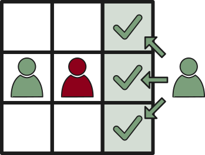
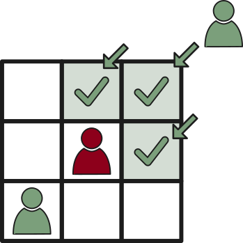
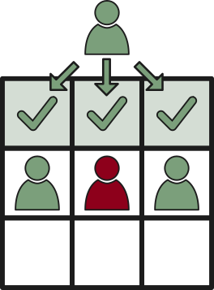

STRIVE

Version 26 (Playtest)

# Introduction
**STRIVE** is a table-top role-playing game (**TTRPG**), requiring a **game master** (**GM**) and at least one **player** to play and at its core, is about **emergent storytelling** and **tactical combat**. Players experience the **evolution** of their player character (**PC**) by defining convictions that **drive** them to action, based on the events they experience. In that way, players also **drive** the story forward and guide the evolution of the world. 

Play itself works as a conversation, in which players tell the **GM** what their characters attempt to do and the **GM** determines what happens when they do. These rules outlined in this document and supplementary documents and dice are used to determine whether things play out as the players have planned. 

**STRIVE** understands itself first and foremost as a rule system. *This* document is designed as an unobtrusive reference which you are expected to read once, and after that only open to quickly look up whatever rule you currently need to refamiliarize yourself with. The system is aimed at **GM**s who enjoy doing their own world-building or who want to bring a particular world they like to the table. As such, no setting or theme is imposed, so that you may choose your own. Of course, this implies that adaptability and extensibility are a key ingredient. You are expressly encouraged to hack the system, to make it fit whatever setting and theme you decide on. And if you'd like some guidance or inspiration along the way, one of the supplemental modules may provide what you seek. 

The system is best suited for long-term "sandbox" style games, running indefinitely. One-shots are possible but may not provide the best experience, as several of the system's mechanics require breaks in play. More narrowly directed experiences are possible, but may require some shortcuts to be taken when it comes to *time* - how long it takes to recover from injuries and illnesses, how long it takes to craft and to practice, and so on. 

On the spectrum of *narrative-driven*, *game-y* and *simulationist*, **STRIVE** aims for the region between *game-y* and *narrative-driven*, while leaning heavily towards *game-y*. It understands itself as a *game* and the rules contained herein will often reflect that by making broad abstractions and even some unrealistic assertions - all for the goal of keeping the game easier to learn and more fun to experience. 

Most rules have a certain degree of vagueness to them. This is at least partially deliberate. The situations that can come up during play are simply too varied and numerous to be possible to completely cover with rules, without requiring epic tomes filled to the brim with highly specific rulings for highly specific situations. Instead, the game relies on the **GM** to arbitrate in most situations. The descriptions in the rules here should serve as a point of orientation for the **GM**. How *they* interpret the rules, is how the rules are to be understood. 

## Tactical Combat
First of all, STRIVE is **not** a wargame. It is not about coordinating large troop movements, supply lines or chains of command (although you can feature such things in your game if you like). 

Secondly, the game is not *about* tactics, either. However, the combat *is tactical* in the sense that **PC**s stand and move on a grid, act in turns and that actions per turn are limited. Players will need to coordinate what their characters do. They have time to think about their current and next actions, to observe and learn what their own character and the other characters in the encounter are capable of. 

And it's the capabilities of characters, that in themselves are a puzzle. There are many options to choose from. There are multiple choices available for deciding *how* a character will move, how they will attack or defend. The position of enemies and allies matters and the battlefield itself may have an impact on the decisions to be made.

Lastly, while the game features hit points, it also features injuries. When a character suffers enough hit point loss, an injury is inflicted upon them. And injuries spell *serious trouble* that reduce that character's efficacy. Recovery from injuries is expected to take time. This implies plenty of down-time for combat-heavy parties, which is time that can be spent on professions, hobbies and scheming. 

## Character Evolution
Players define long-term and short-term goals for their characters. It is then the **GM**'s job to work those goals into the story. Thus, players directly influence the narrative on a meta-level that is guaranteed to be interesting to them and their character. 

Of course, a **GM**'s capabilities may be limited, either by experience, theme or setting of the game they've set up. And so, they don't *have* to make unreasonable goals be realisticaly achievable. In fact, unrealistic goals are just as acceptable, as achievable ones. 

And regardless of *what* the goals are, they are sure to drive the **PCs** into action. Every goal they pursue, is sure to leave an impact on the characters. What's more, recent and upcoming events of the narrative may also be picked up by **PCs** and become the basis of their goals and affect their personality. In this way, players and **GM** never quite know what direction the **PCs** will develop. They're like a book you start writing from the beginning - not the ending. 

Another aspect of character evolution, is manifested by their Attributes and Skills. These abilities are learned and improved over time. Generalist characters benefit from varied knowledge, while specialists enjoy unique abilities. Over the course of a long-running game, the abilities the characters have learned would be capable of telling stories of their own. 

Furthermore, a meta-currency, called **Fate Points** is earned by *players*, based on what they and their character do in a session. These allow buying Fate Cards, which give players access to powerful meta-powers that can be enacted at any time, allowing for truly decisive achievements. 

# Table of Contents
- [Introduction](#introduction)
  - [Tactical Combat](#tactical-combat)
  - [Character Evolution](#character-evolution)
- [Table of Contents](#table-of-contents)
- [Glossary](#glossary)
- [Credits](#credits)
- [License](#license)
- [How to Play](#how-to-play)
  - [Dice](#dice)
  - [Before the Game](#before-the-game)
  - [The Session](#the-session)
    - [Retell the Previous Session](#retell-the-previous-session)
    - [During the Session](#during-the-session)
    - [Intent \& Action](#intent--action)
    - [Spending Time](#spending-time)
  - [After the Session](#after-the-session)
  - [Tests](#tests)
    - [Rounded Up \& Rounded Down](#rounded-up--rounded-down)
    - [Testing an Attribute](#testing-an-attribute)
    - [Testing a Skill](#testing-a-skill)
    - [Raw vs. Modified Level](#raw-vs-modified-level)
    - [Types of Test](#types-of-test)
      - [Binary Test](#binary-test)
      - [Stepped Test](#stepped-test)
      - [Graduated Test](#graduated-test)
      - [Creative Test](#creative-test)
      - [Opposed Test](#opposed-test)
    - [Tests Bring about Learning](#tests-bring-about-learning)
    - [Providing Assistance](#providing-assistance)
      - [Helpers Learn](#helpers-learn)
    - [Compensation Points](#compensation-points)
    - [Time](#time)
    - [Test Success Likelihoods](#test-success-likelihoods)
- [Character](#character)
  - [Abilities](#abilities)
    - [Attributes](#attributes)
      - [Agility \[Agi\]](#agility-agi)
      - [Awareness \[Awar\]](#awareness-awar)
      - [Strength \[Str\]](#strength-str)
      - [Toughness \[Tough\]](#toughness-tough)
      - [Wit \[Wit\]](#wit-wit)
    - [Core, Favored, Secondary \& Penalized Attributes](#core-favored-secondary--penalized-attributes)
    - [Derived Characteristics](#derived-characteristics)
      - [Base Initiative \[BI\]](#base-initiative-bi)
      - [Sprinting Speed \[Sprint\]](#sprinting-speed-sprint)
      - [Stability \[Stabil\]](#stability-stabil)
    - [Skills](#skills)
      - [Skill Forking](#skill-forking)
      - [Learning Skills](#learning-skills)
      - [Expertise](#expertise)
      - [Momentum Action](#momentum-action)
      - [Concentration](#concentration)
    - [Advancement](#advancement)
      - [Experience Points \[XP\]](#experience-points-xp)
      - [Advancing Attributes](#advancing-attributes)
      - [Advancing Skills](#advancing-skills)
      - [Practice](#practice)
      - [Teaching](#teaching)
    - [Innate Abilities](#innate-abilities)
    - [Traits](#traits)
      - [Titles of Renown](#titles-of-renown)
  - [Personality](#personality)
    - [Ambition](#ambition)
    - [Aspiration](#aspiration)
    - [Reaction](#reaction)
    - [Personality Traits](#personality-traits)
  - [Health](#health)
    - [Hit Points (HP)](#hit-points-hp)
      - [Recovering HP](#recovering-hp)
      - [Bludgeoned to 0 HP](#bludgeoned-to-0-hp)
      - [Temporary Hit-Points](#temporary-hit-points)
    - [Injury](#injury)
      - [Suffering An Injury](#suffering-an-injury)
      - [Crippling Injury Count](#crippling-injury-count)
      - [Injury States \& Treatment](#injury-states--treatment)
      - [Injury \& Damage Type Table](#injury--damage-type-table)
      - [Grit Points](#grit-points)
    - [Exhaustion](#exhaustion)
    - [Condition](#condition)
    - [Illness](#illness)
    - [Damage Types](#damage-types)
    - [Damage Resistances](#damage-resistances)
    - [Boons \& Penalties](#boons--penalties)
  - [Assets](#assets)
    - [Bulk](#bulk)
    - [Worn \& Equipped](#worn--equipped)
    - [Luggage](#luggage)
      - [Carrying Capacity](#carrying-capacity)
      - [Overweight](#overweight)
    - [Property](#property)
- [Fate Points](#fate-points)
  - [Minor Fate Points](#minor-fate-points)
  - [Major Fate Points](#major-fate-points)
  - [Ambition Fate Points](#ambition-fate-points)
  - [Hand of Fate](#hand-of-fate)
- [Time-Management](#time-management)
  - [Initiative](#initiative)
    - [Surprise Round](#surprise-round)
  - [Ticks](#ticks)
  - [Down-Time](#down-time)
    - [Travel](#travel)
    - [Crafting \& Research Projects](#crafting--research-projects)
      - [Project Prerequisites](#project-prerequisites)
      - [Progressing a Project](#progressing-a-project)
      - [Project Boosters](#project-boosters)
      - [Research Projects](#research-projects)
      - [Invention Projects](#invention-projects)
      - [Complexity to Progress Increments](#complexity-to-progress-increments)
      - [Workload to Time Increments](#workload-to-time-increments)
    - [Trade](#trade)
      - [Seller's Chart](#sellers-chart)
      - [Buyer's Chart](#buyers-chart)
    - [Recovery](#recovery)
    - [Training](#training)
  - [Scenario-Time](#scenario-time)
- [Combat](#combat)
  - [Action Points (AP)](#action-points-ap)
    - [Action Point Saving](#action-point-saving)
  - [Combat Movement](#combat-movement)
    - [Forced Movement](#forced-movement)
    - [Gravity Hurts](#gravity-hurts)
    - [Disengage](#disengage)
    - [Flee Combat](#flee-combat)
    - [Push Through](#push-through)
    - [Swap-Out](#swap-out)
  - [Attacking](#attacking)
    - [Damage](#damage)
    - [Opportunity Attacks](#opportunity-attacks)
    - [Flanking](#flanking)
    - [Stealth Attacks](#stealth-attacks)
  - [Defending](#defending)
    - [Armor \& Shields](#armor--shields)
    - [Defending an Ally](#defending-an-ally)
    - [Defense Stunts](#defense-stunts)
    - [Cover](#cover)
    - [Speed aids Defense](#speed-aids-defense)
  - [Momentum](#momentum)
  - [Throwing](#throwing)
    - [Throwing-Distance](#throwing-distance)
    - [Throwing-Accuracy](#throwing-accuracy)
    - [Throwing-Damage](#throwing-damage)
- [General Interactions](#general-interactions)
  - [Appraisal](#appraisal)
  - [Persuasion, Intimidation \& Deception](#persuasion-intimidation--deception)
    - [Are they lying?](#are-they-lying)
- [Appendix](#appendix)
  - [Character Creation](#character-creation)
    - [Determine Life Path](#determine-life-path)
      - [Origin](#origin)
      - [Youth](#youth)
      - [The Last Few Years](#the-last-few-years)
    - [Determine Name](#determine-name)
    - [Species, Sex \& Appearance](#species-sex--appearance)
    - [Determine Personality](#determine-personality)
      - [Determine Ambition, Aspirations \& Reactions](#determine-ambition-aspirations--reactions)
        - [Choosing an Ambition](#choosing-an-ambition)
        - [Choosing Aspirations](#choosing-aspirations)
        - [Choosing Reactions](#choosing-reactions)
    - [Determine Abilities](#determine-abilities)
      - [Choosing Attributes](#choosing-attributes)
        - [Manual Attribute Assignment](#manual-attribute-assignment)
        - [Semi-Random Attribute Assignment](#semi-random-attribute-assignment)
      - [Choosing Skills](#choosing-skills)
      - [Determine Boons from Heritage](#determine-boons-from-heritage)
    - [Determine Assets](#determine-assets)
    - [Determine Max HP \& Injury Maximum](#determine-max-hp--injury-maximum)
    - [Determine Exhaustion Limit](#determine-exhaustion-limit)
  - [Asset Appendix](#asset-appendix)
    - [List of General Assets](#list-of-general-assets)
    - [Weapon Properties](#weapon-properties)
  - [Lists of Skills](#lists-of-skills)
    - [Physical Skills](#physical-skills)
      - [Acrobatics (Agi/Str)](#acrobatics-agistr)
      - [Berserking (Tough/Tough)](#berserking-toughtough)
      - [Fishing (Agi/Awar)](#fishing-agiawar)
      - [Instrument-Playing \< instrument \> (Agi/Awar)](#instrument-playing--instrument--agiawar)
      - [Stealth (Agi/Awar)](#stealth-agiawar)
      - [Swimming (Agi/Tough)](#swimming-agitough)
      - [Thievery (Agi/Awar)](#thievery-agiawar)
      - [Observation (Awar/Awar)](#observation-awarawar)
      - [Path-finding (Awar/Wit)](#path-finding-awarwit)
      - [Shield (Str/Tough)](#shield-strtough)
      - [Trapping (Awar/Wit)](#trapping-awarwit)
      - [Throwing (Agi/Str)](#throwing-agistr)
      - [Unarmed Combat (Agi/Str)](#unarmed-combat-agistr)
      - [Weapon \< weapon type \> (\< attribute \>)](#weapon--weapon-type---attribute-)
    - [Social Skills](#social-skills)
      - [Acting (Awar/Wit)](#acting-awarwit)
      - [Animal Handling (Awar/Awar)](#animal-handling-awarawar)
      - [Commanding (Tough/Wit)](#commanding-toughwit)
      - [Entertainment (Agi/Wit)](#entertainment-agiwit)
      - [Mercantilism (Awar/Wit)](#mercantilism-awarwit)
      - [Riding (Agi/Awar)](#riding-agiawar)
      - [Self-Control (Tough/Tough)](#self-control-toughtough)
    - [Knowledge Skills](#knowledge-skills)
      - [Architecture (Awar/Wit)](#architecture-awarwit)
      - [Archeology (Awar/Wit)](#archeology-awarwit)
      - [Creature-Lore \< category \> (Awar/Wit)](#creature-lore--category--awarwit)
      - [Geography (Awar/Wit)](#geography-awarwit)
      - [Geology (Awar/Wit)](#geology-awarwit)
      - [History (Wit/Wit)](#history-witwit)
      - [Language \< language \> (Wit/Wit)](#language--language--witwit)
      - [Law and politics (Wit/Wit)](#law-and-politics-witwit)
      - [Mathematics (Wit/Wit)](#mathematics-witwit)
      - [Mechanics (Agi/Wit)](#mechanics-agiwit)
      - [Metallurgy (Awar/Wit)](#metallurgy-awarwit)
      - [Nature (Awar/Wit)](#nature-awarwit)
      - [Mysticism and Religion (Wit/Wit)](#mysticism-and-religion-witwit)
      - [Medicine (Agi/Wit)](#medicine-agiwit)
      - [Reading and Writing (Awar/Wit)](#reading-and-writing-awarwit)
      - [Surgery (Agi/Wit)](#surgery-agiwit)
      - [Warfare (Tough/Wit)](#warfare-toughwit)
    - [Craftsmanship Skills](#craftsmanship-skills)
      - [Artistry (Agi/Awar)](#artistry-agiawar)
      - [Cooking (Awar/Wit)](#cooking-awarwit)
  - [List of Traits](#list-of-traits)
    - [Warcrobat](#warcrobat)
  - [List of Titles of Renown](#list-of-titles-of-renown)
    - [Heart of Stone](#heart-of-stone)
    - [Hero of Many Victories](#hero-of-many-victories)
    - [Loremaster of X (degree)](#loremaster-of-x-degree)
    - [Monster Hunter](#monster-hunter)
    - [Paragon](#paragon)
    - [Pugilist](#pugilist)
    - [Quite The Mercenary](#quite-the-mercenary)
    - [Savior Of The People](#savior-of-the-people)
    - [Wanted](#wanted)
    - [Zealot](#zealot)
  - [List of Conditions](#list-of-conditions)
    - [Berserk](#berserk)
    - [Burning](#burning)
    - [Bleeding](#bleeding)
    - [Death's Door](#deaths-door)
    - [Dissolving](#dissolving)
    - [Drug-Addicted](#drug-addicted)
    - [Electrified](#electrified)
    - [Exhausted](#exhausted)
    - [Frostbitten](#frostbitten)
    - [Grappled](#grappled)
    - [Hasted](#hasted)
    - [Jealous](#jealous)
    - [Marked](#marked)
    - [Pacified](#pacified)
    - [Poisoned](#poisoned)
    - [Prone](#prone)
    - [Rooted](#rooted)
    - [Stunned](#stunned)
    - [Terrified](#terrified)
    - [Unconscious](#unconscious)
  - [List of Illnesses](#list-of-illnesses)
  - [List of Mutations](#list-of-mutations)
  - [Targeting-Types](#targeting-types)
    - [Single Target (ST)](#single-target-st)
    - [Multiple Single Target (MST)](#multiple-single-target-mst)
    - [Area of Effect (AoE)](#area-of-effect-aoe)
- [Game Mastery](#game-mastery)
  - [The Role Of a Game Master](#the-role-of-a-game-master)
    - [Getting a Game Together](#getting-a-game-together)
    - [Your Game](#your-game)
    - [Your Players](#your-players)
- [Your World](#your-world)
  - [First Impressions Are Definitive](#first-impressions-are-definitive)
- [Non-Player Character (NPC)](#non-player-character-npc)
  - [Defense \[Def\]](#defense-def)
  - [Free Strike \[FS\]](#free-strike-fs)
  - [Challenge Rating \[CR\]](#challenge-rating-cr)
  - [NPC Squads](#npc-squads)
    - [Squad HP Pool](#squad-hp-pool)
    - [Squad Cohesion](#squad-cohesion)
    - [Squad Actions](#squad-actions)
    - [Squad Captains](#squad-captains)
  - [Bring NPCs To Life](#bring-npcs-to-life)
- [Running The Game](#running-the-game)
  - [Starting the Session](#starting-the-session)
    - [Recap The Last Session](#recap-the-last-session)
    - [Personality \& Driver Adjustments](#personality--driver-adjustments)
    - [Read Out Fate Point Purchases](#read-out-fate-point-purchases)
  - [During the Session](#during-the-session-1)
    - [Use The Senses](#use-the-senses)
    - [The Tools](#the-tools)
      - [Combat Challenges](#combat-challenges)
      - [Social Challenges](#social-challenges)
      - [Driver Challenges](#driver-challenges)
      - [Anchor Your PCs Down](#anchor-your-pcs-down)
      - [Limit \& Threaten Resources](#limit--threaten-resources)
      - [Allow World-Change](#allow-world-change)
    - [Keep Them Engaged](#keep-them-engaged)
      - [Keep That Spotlight On a Swivel](#keep-that-spotlight-on-a-swivel)
      - [Player Agency](#player-agency)
      - [Rewards!](#rewards)
      - [Fair Warning](#fair-warning)
    - [To Rule or Not To Rule](#to-rule-or-not-to-rule)
  - [Ending the Session](#ending-the-session)
    - [Hand Out Fate Points](#hand-out-fate-points)
    - [Gather Feedback](#gather-feedback)
  - [Introducing New Player Characters](#introducing-new-player-characters)
- [NPC Builder](#npc-builder)
  - [Combat Roles](#combat-roles)
  - [Traits](#traits-1)
    - [Mobility Traits](#mobility-traits)
      - [Burrower (-2 points; +2 CR)](#burrower--2-points-2-cr)
      - [Climber (-2 points; +1 CR)](#climber--2-points-1-cr)
      - [Fast (-2 points; +1 CR)](#fast--2-points-1-cr)
      - [Glider (-1 points; +1 CR)](#glider--1-points-1-cr)
      - [Leaper (-3 points; +2 CR)](#leaper--3-points-2-cr)
      - [Swimmer (-1 point; +1 CR)](#swimmer--1-point-1-cr)
    - [Defensive Traits](#defensive-traits)
      - [Armored (-2 points; +3 CR)](#armored--2-points-3-cr)
      - [Camouflage (-3 points; +3 CR)](#camouflage--3-points-3-cr)
      - [Danger Blood (-1 point; +1 CR)](#danger-blood--1-point-1-cr)
      - [Danger-Touch (-3 points; +2 CR)](#danger-touch--3-points-2-cr)
      - [Death Rattle (-2 points; +2 CR)](#death-rattle--2-points-2-cr)
      - [Fortified Mind (-4 points; +1 CR)](#fortified-mind--4-points-1-cr)
      - [Immovable (-2 points; +1 CR)](#immovable--2-points-1-cr)
      - [Insurmountable (-4 points; +3 CR)](#insurmountable--4-points-3-cr)
      - [Unstoppable (-2 points; +1 CR)](#unstoppable--2-points-1-cr)
      - [Unstunnable (-3 points; +1 CR)](#unstunnable--3-points-1-cr)
      - [Regenerator (-5 points; +3 CR)](#regenerator--5-points-3-cr)
    - [Offensive Traits](#offensive-traits)
      - [Cannot Miss (-3 points; +3 CR)](#cannot-miss--3-points-3-cr)
      - [Disease-Ridden (-1 point; +1 CR)](#disease-ridden--1-point-1-cr)
      - [Forceful (-2 points; +1 CR)](#forceful--2-points-1-cr)
    - [Weakness Traits](#weakness-traits)
      - [Drowner (+1 point; -1 CR)](#drowner-1-point--1-cr)
      - [Light-weight (+2 points; -1 CR)](#light-weight-2-points--1-cr)
      - [Shambler (+2 points; -2 CR)](#shambler-2-points--2-cr)
      - [Sluggish (+4 points; -2 CR)](#sluggish-4-points--2-cr)
      - [Vulnerable (+2 points; -1 CR)](#vulnerable-2-points--1-cr)
    - [Legendary Traits](#legendary-traits)
      - [Gritty (-5 points; +4 CR)](#gritty--5-points-4-cr)
      - [Hyperactive (-7 points; +4 CR)](#hyperactive--7-points-4-cr)
      - [Inexorable (-5 points; +4 CR)](#inexorable--5-points-4-cr)
      - [Moon Affinity (-7 points; +4 CR)](#moon-affinity--7-points-4-cr)
  - [Choosing NPC Characteristics](#choosing-npc-characteristics)
  - [Choosing NPC Skills](#choosing-npc-skills)
    - [Bite (Agi/Str)](#bite-agistr)
    - [Create Sticky Surface (Tough/Tough)](#create-sticky-surface-toughtough)
    - [Charge (Str/Tough)](#charge-strtough)
    - [Obscure Vision (Awar/Tough)](#obscure-vision-awartough)
  - [Hostility Actions](#hostility-actions)
    - [Advance! (-4 points; +2 CR)](#advance--4-points-2-cr)
    - [Collect Bounty (-4 points; +3 CR)](#collect-bounty--4-points-3-cr)
    - [Get Off Me! (-5 points; +3 CR)](#get-off-me--5-points-3-cr)
    - [Resonance Cascade (-4 points; +2 CR)](#resonance-cascade--4-points-2-cr)
    - [Slip Away (-5 points; +3 CR)](#slip-away--5-points-3-cr)
    - [Seething Hatred (-5 points; +2 CR)](#seething-hatred--5-points-2-cr)
    - [Sinkhole (-8 points; +2 CR)](#sinkhole--8-points-2-cr)
    - [Trap Storm (-4 points; +3 CR)](#trap-storm--4-points-3-cr)
    - [I Don't Bleed (-5 points; +4 CR)](#i-dont-bleed--5-points-4-cr)
    - [No, I Am The Hero! (-10 points; +6 CR)](#no-i-am-the-hero--10-points-6-cr)
- [Encounter Builder](#encounter-builder)

# Glossary
As STRIVE is meant primarily as a rule-book to help you quickly find what you need, the glossary is intentionally placed here, prominently. If you know what term you are looking for, this will help you find its description. 

| Term                                         | Meaning / Description   |
| -------------------------------------------- | ----------------------- |
| [AFP](#ambition-fate-points)                 | Ambitions Fate-Point    |
| [Agi](#agility-agi)                          | The Agility Attribute   |
| [AOE](#area-of-effect-aoe)                   | Area of Effect          |
| [AP](#action-points-ap)                      | Action Point            |
| [Awar](#awareness-awar)                      | The Awareness Attribute |
| [Base Attribute](#skills)                    | One of the two Attributes a Skill relies on. |
| [Base Initiative / BI](#base-initiative-bi)  | Determines the order in which characters act in combat. |
| [Concentration](#concentration)              | A Skill or Expertise whose effects last as long as desired |
| [D10](#dice)                                 | A ten-sided die         |
| [D20](#dice)                                 | A twenty-sided die      |
| [D4](#dice)                                  | A four-sided die        |
| [D6](#dice)                                  | A six-sided die         |
| [D8](#dice)                                  | An eight-sided die      |
| [Difficult Terrain](#combat-movement)        | Halves movement per AP  |
| [FP](#fate-points)                           | Fate-Point              |
| [GM](#introduction)                          | Game-Master             |
| [Hit Limit](#testing-a-skill)                | Determines how many rolled **hits** may actually factor into the result of a test. |
| [hit](#tests)                                | Positive result of an individual die-roll |
| [HP](#hit-points-hp)                         | Hit-Points              |
| [MaFP](#major-fate-points)                   | Major Fate-Point        |
| [MiFP](#minor-fate-points)                   | Minor Fate-Point        |
| [miss](#tests)                               | Negative result of an individual die-roll |
| [MST](#multiple-single-target-mst)           | Multiple Single Target  |
| [NPC](#non-player-character-npc)             | Non-Player Character    |
| [Ob](#tests)                                 | Obstacle                |
| [PC](#introduction)                          | Player Character        |
| [RD](#rounded-up--rounded-down)              | Rounded down            |
| [RU](#rounded-up--rounded-down)              | Rounded up              |
| [ST](#single-target-st)                      | Single-Target           |
| [Stability / Stab](#stability-stabil)          | Counter-acts forced movement. |
| [Str](#strength-str)                         | The Strength attribute  |
| [Sprinting Speed / Sprint](#sprinting-speed-sprint) | Can extend a character's movement per AP. |
| [Tough](#toughness-tough)                    | The Toughness attribute |
| [Temporary HP](#temporary-hit-points)        | Hit Points that may exceed the character's limit, but only for a limited time.  |
| [Wit](#wit-wit)                              | The Wit attribute       |
| [XP](#experience-points-xp)                  | Experience Point(s)     |

# Credits
**Designer**: Nicolas 'Krubi' H.

My two small, yet inexorable groups of playtesters, whose feedback has been invaluable, without whom this game would not be any where near where it is now and who keep me motivated!

# License
STRIVE may be freely available, but that does not mean you may do everything you want with it. If you only want to play STRIVE, this license needn't worry you too much (you should still read and know it) and while I still stand by my claim that STRIVE lives off its extensibility and that you are absolutely encouraged to create your own works based on STRIVE, also know that STRIVE has been a lot of work and a labor of love that I ask to be respected. Basically, the license outlined below (this paragragh is not part thereof) covers my butt legally, while stating I want STRIVE to be credited in your own works based upon it. What's not covered by the license is that I would love to hear about your own works based on STRIVE! Whether it be adventures, themes, settings, more Skills, more mechanics or what you consider improvements or corrections for existing mechanics would be most interesting to hear about! Now be careful, there be *Legalese* ahead.

By using STRIVE (that includes but is not limited to viewing, reading, referencing and playing it), for whatever purpose, you agree to the following terms:

* By adhering to these terms, you are allowed to publish your own original works based upon and/or compatible with STRIVE, without requiring express permission from the designer ("Nicolas 'Krubi' H.", "Me", "I", "My" or "Mine"), both for personal and commercial use. 
* You may only use and/or reference STRIVE starting from version 26 and onward. Older versions of this document may still be available for viewing only, but you may not base your own works upon or declare them compatible with such versions. 
* You agree not to copy or reproduce any art, icon, illustration or font contained in this document without My explicit permission in writing. 
  * However, you may produce your own original art, icons, illustrations and fonts in the same style, without requiring permission.
* You may freely reuse and reference any gameplay mechanics (= rules) in this document and even use the same names and terminology. 
  * You may even reuse the text describing the mechanics. However, in doing so, you also agree to place the following text in a visible location of your product (e. g. the website where you promote it or in the credits section of your own product): "This product uses and/or references mechanics from the STRIVE-TTRPG, version 26"
* You may not claim or give the impression that your product is an official STRIVE product, that I endorse or sponsor it or that it is in any other way affiliated with Me.  
  * You may however freely state your product to be compatible with or based upon STRIVE. 
* I take no responsibility for any legal claims against your product. You agree not to bring any claim against Me based upon or arising from your use of STRIVE and its content. 
* Any legal disputes, controversies or claims related to this license shall be governed and construed in accordance with the laws of Hamburg and be heard before a court in Germany.
* You agree to defend, indemnify, and hold Me and My afilliates harmless from and against any liability, claims, actions, demands, and damages (including attorney's fees and costs) arising from or relating to your product or your exercise of any rights granted in this license. 
* You agree that your product will not violate or infringe the intellectual property rights of any third party. 
* I may modify or revise this license at any time at My sole discretion, and by posting a notice about the change in a visible place (i. e. the Releases section https://github.com/CodeWringer/strive-ttrpg/releases). The modification or revision will become effective immediately upon such a posting. You are responsible for checking the license regularly for changes, and you waive any right to receive specific notice of changes. 
  * License amendments or modifications will not become effective retroactively. They become effective immediately upon posting, but only for the version of this document they were posted with. If you do not agree to a newer version of the license, your work may continue to be based on an older version of STRIVE, but only starting from STRIVE version 26, and in doing so, you also agree to visibly state which version of STRIVE your work is based on. 
* If you fail to comply with this license, your rights under this license terminate automatically and without notice. On termination of this license, you agree to immediately stop sharing or distributing any product created under this license. 

# How to Play
As **STRIVE** is a **roleplaying game**, there are certain rules to follow and expectations made of both players and **GM**. 

The **GM** and the players work ***together*** to create a unique experience and weave a story of glorious triumph, tragic defeat or anything in-between. Ultimately, the **GM**'s job is to provide interesting conundrums to the players and their job is to provide interesting answers, in-line with what their characters believe and *want*. Remember that everyone at the table is looking to have fun and that includes the **GM** and the players. 

Each player only directly controls a single character. The **GM** is in control of every single [non-player character (**NPC**)](#non-player-character-npc), the world and the story. A player character is abbreviated as **PC**. 

In some places, where distances are concerned, both feet and meters are noted as units. What attentive readers will notice, is that the conversion between the numbers won't always be correct. This is a deliberate decision to make the math easier, whenever distances are concerned. If a battlemap is used, one square on the grid should represent either a three foot, or one meter square. Furthermore, a single, ordinary human, should occupy an entire such square. 

## Dice
**STRIVE** uses a **dice pool** system of **six-sided dice** (henceforth referred to as **D6**) to resolve [tests](#tests). *Dice pool* means a variable number of dice will be rolled, based on a character's [attributes](#attributes), [skills](#skills), [boons](#boons--penalties) and circumstance of the situation they're in. 

The following types of dice come into play:
* **D4** - four-sided dice. Four of these will be enough for most situations. 
* **D6** - six-sided dice. You will need a lot of these. Ten should be enough for most situations. 
* **D8** - eight-sided dice. Three of these will be enough for most situations. 
* **D10** - ten-sided dice. Three of these will be enough for most situations. 
* **D20** - twenty-sided dice. Just one of these will be enough. Can also be substituted with `2 D10`s. 

## Before the Game
The very first step of preparing for play, is to decide on a theme, world and setting of the game. Ideally, the players and **GM** decide together, but ultimately, the **GM**'s preferences should hold a greater weight. When a **GM** isn't really interested in the theme, world and setting, the game will quickly start feeling like a chore to them. The result is they lose motivation to keep running the game. No one wants that. But not to worry! As long as you communicate and respect your **GM**'s wishes, you'll have no problem finding common ground. 

* The **theme** describes the types of adventures the **PC**s will experience and what tone they'll have. Is it grimdark or heroic? Is it survival-horror or calm and relaxing? Will politics be important?
* The **setting** determines the framework that holds the world - what technology, what kinds of creatures and what kinds of environments can be expected? Is it medieval fantasy? Contemporary? The wild-west? Perhaps science-fiction?
* And ultimately, the **world** is the manifestation of theme and setting. 

Then, still before anyone can start to play, the players have to [create their characters](#character-creation). Ideally, this process should be done in cooperation with the **GM** and each other, to make sure the character concepts fit into the world and planned narrative. Also, it is advisable to design characters that will work well together, as a group. You *could* plan for a discordant group of PCs, but make sure the characters find concrete reasons to stick together! Otherwise, you may find the **GM** eventually running several solo-games that all just *happen* to be played at the same time. 

## The Session
This is the time when the magic happens. The players and **GM** have come together and begin or continue the story. 

### Retell the Previous Session
At the start of a session, one of the players, or perhaps the **GM**, should recall and retell the events of the previous session. This lets everyone refamiliarize themselves with the story so far. It also provides the staging ground for events and actions to come. 

This is also the time when players choose new [aspirations](#aspiration) for their character and to buy [fate-cards](#hand-of-fate). 

### During the Session
[Fate points](#fate-points) cannot be awarded during play and neither can cards be bought from the [hand of fate](#hand-of-fate). However, players and the **GM** should take note of every situation they believe a **PC** (their own included) could have earned a [fate point](#fate-points).

It is up to the **GM** to get the ball rolling. They first frame the local area of the world the PCs find themselves in. They describe the scenario at hand - where the **PC**s are, what they can see, hear, smell and feel - and then ask "who does what?"

Then, the players must keep the ball rolling. In a given scenario, every **PC** should have something they wish to do. You could take turns or rely on first-come-first-serve, as long as everyone gets to state their character's [intent and action](#intent--action). Every action taken is then resolved, either formally through a [test](#tests) or informally with a direct description of what happens. 

A [test](#tests) must be made whenever there is an **obstacle** to overcome - some **action** whose outcome is uncertain. 

> For example, stating your character will leave the room shouldn't warrant a [test](#tests), if there is no obstacle to overcome. Opening an unlocked door in a calm situation should be a "risk-free" thing to do. 
>
> However, when the same situation takes place during a time-critical phase, for example in a burning house and the door being locked, then a [test](#tests) to quickly force the lock or break down the door would be warranted. 

### Intent & Action
The players drive the story and the action. They decide what their character will try to do and the **GM** will help them figure out if things will go as planned. 

As a player, when deciding on what to do, make sure you state the **intent** of your action, like "I want to find incriminating evidence against a merchant". Then, the **GM** will need to know *how* you aim to follow up on your intent. Describe the **action** you will take. The clearer, the better. "I will ask around", would allow the **GM** to guide you along. But there are still details left to fill in. Who and where will you ask? What will you ask them? So, a better intent would be "I will ask the other merchants at the market what they think about this one merchant". That leaves no room for doubt *how* you wish to achieve your goal, which makes the **GM**'s job easier and the game flow better. The **GM** could now have each merchant tell the **PC** some rumours or observed past activities and behaviors of that one merchant, some of which may be of a sketchy nature, like "I swear I saw him down at the docks, speaking to some shady looking people" or "She always seems wary of people walking behind her".

Of course, how appropriate a certain [attribute](#attributes) or [skill](#skills) is for the resolution of a given situation, is ultimately up to the **GM** and the specifics of the situation itself. 

When deciding on what to do, keep in mind your character's [personality](#personality) as that should inform you of the kinds of actions they might take. 

### Spending Time
Everything the **PC**s do takes time. How much time, exactly, is variable and depends on the point in the narrative the **PC**s are in. There are two levels of time-management. 

On the more abstract level, **PC**s commit to very abstract long-term actions. They might pursue their profession or recover from an injury. This level is called [down-time](#down-time). 

In contrast, on the more concrete level, **PC**s only commit to fine-grained short-term actions. This is when detailled descriptions and fine time slices come into play. Every action is as small as deciding to open a door that is right in front, or deciding to talk to someone in the same room. This is considered the **scenario** or **encounter** level. 

Typically in RPGs, a fight is considered a **[combat](#combat) encounter**. Non-bloody interaction that involves speaking to [NPCs](#non-player-character-npc) or the **PC**s amongst themselves is considered a **social encounter**. There are also scenarios of exploration, investigation and survival. 

## After the Session
After a session is done, the players and **GM** stick around to discuss which players earned [fate points](#fate-points). This is where players are nominated for [fate points](#fate-points), by each other and by the **GM**. If everyone agrees, the [fate points](#fate-points) are awarded. Players can and should lobby for their [fate points](#fate-points), but shouldn't beg. If most everyone else says no, then that decision stands. 

Also after the session, players and the **GM** discuss whether a **PC** should lose a [reaction](#reaction), because they have acted against it or haven't gotten to play it out at all. 

Players may now spend earned [fate points](#fate-points) to buy cards (boons) from the [hand of fate](#hand-of-fate) and adjust their character's [personality](#personality) and [aspirations](#aspiration). This may also be postponed to the start of the next session. 

## Tests
Whenever the outcome of an action or situation is uncertain, a **test** may be called for by the **GM**, in order to resolve it. 

Either a `6` or a `5` rolled on a single die counts as a **hit**. Other values are considered **misses**. **Hits** are required in order to succeed a **test**. 

How many **hits** are needed to succeed a **test**, is determined by the **GM** or by other characters, via a mechanism called **Obstacle** (henceforth referred to as **Ob**). The **test** can only succeed, if at least as many **hits** are rolled, as the given **Ob**. 

> For example, to succeed a **test** at **Ob** `3`, at least `3` **hits** must be rolled to succeed the **test**. Any less, and the outcome is a failure. 

The **Ob** isn't always determined directly by the **GM**. Whenever an [opposed test](#opposed-test) must be made, the **Ob** is determined by another character. 

For every **test**, one of three outcomes is possible: 
* **Complete Success**: There are enough or more than enough required **hits**.
* **Partial Failure**: There are not enough **hits**, but more than none. Most of the time, this is the same as a Complete Failure, but can also imply a "failing forward", at the **GM's** discretion. 
* **Complete Failure**: There are no **hits**, only **misses**. 

### Rounded Up & Rounded Down
Often times, numbers are to be rounded up or down. To keep formulae short, these terms are often abbreviated as **RU** (= rounded up) and **RD** (= rounded down). 

### Testing an Attribute
To resolve an **Attribute test**, roll `ND6`, where *N* is the **Attribute's [Modified Level](#raw-vs-modified-level)**. 

It is **not** possible to [fork](#skill-forking) into Attribute tests, *at all*. 

### Testing a Skill
To resolve a **Skill test**, roll `ND6`, where *N* is the sum of both **Base Attributes' [Modified Levels](#raw-vs-modified-level)**. All Skills have two Attributes they're based on / rely on, noted in parentheses next to the Skill's name. They are called the Skill's **Base Attributes**. 

The [Modified Level](#raw-vs-modified-level) of the Skill itself, plus `1`, governs the maximum number of **hits** that may count towards the result. Only that many of the achieved **hits** may, at most, factor into the test's outcome. This is called the **Hit Limit**. If [Compensation Points](#compensation-points) are used in the test, each of them always and automatically raises the Hit Limit by `+1`!

It is possible to [fork](#skill-forking) into Skill tests, granting more dice and raising the Hit Limit by `+1`, for **each** forked Skill! **Do not forget to fork your Skills into your tests!**

> A character is asked to test a Skill, which is level `2`. Its two Base Attributes have the Modified Levels of `3` and `4`. Their sum of `7`, is the number of **D6** available for the test. 
> 
> They roll `6`, `6`, `5`, `5`, `3`, `2` and `1`, of which `4` are **hits**! But because their Skill is only level `2`, they may only take `2 (from the Skill's level) + 1 (always) = 3` of those **hits** for the test's result. 
>
> *However*, they are afforded `1` Compensation Point for the test. While the Compensation Point would not be enough to turn one of the **misses** into a **hit**, it raises the Hit Limit by `+1`. Thus allowing all `4` rolled **hits** to factor into the result, after all! 

### Raw vs. Modified Level
Attributes and Skills have two level numbers. One is the **Raw Level**, while the other is the **Modified Level**. 

The **Modified Level** results from adding and subtracting [boons and penalties](#boons--penalties) - the sum of which is referred to as **modifier** - to/from the **Raw Level**. It is **always** the Modified Level that is used in tests!

> A **PC** has an Agility with level `3`. That is its Raw Level. 
>
> From a Trait, they gain a boon of `+2` to the Attribute. 
> 
> However, they also suffered an Injury, which imposes a `-1` penalty to the Attribute. The sum of boons and penalties (`+2` from the Trait, `-1` from the Injury), results in the **modifier** of `+1`. Applying that modifier yields the Modified Level of `4`. This is the number to use in tests! 

### Types of Test
There are the following types of tests. The **GM** decides when to use which. 

#### Binary Test
The outcome of the test is either a **complete success** or **complete failure**. A **partial failure** is treated as if it were a **complete failure**. 

#### Stepped Test
A stepped test is really just a series of [binary tests](#binary-test). This allows for finer-grained results, while still not behaving like a [graduated test](#graduated-test). 

This type of test is useful for situations where the **GM** decides to create very fine *time slices* and allow more chances for success. This makes it easier to allow a **PC** to *fail forward* or prevent a *one roll to end it all* situation. 

> For example, a **PC** is attempting to cross a suspension bridge, but upon setting foot on the bridge, the ropes holding it up, suddenly snap. The **PC** can make an [acrobatics](#acrobatics-agistr) test, to try and quickly jump off and back onto solid ground. They fail, and get to make another [acrobatics](#acrobatics-agistr) test at greater **Ob**, to try and grab a root sticking out of the ground beneath the bridge. They fail again! As a last chance for that **PC** to survive, the **GM** asks one of the other players if their character will attempt an [acrobatics](#acrobatics-agistr) test at high **Ob**, to try and grab their falling ally's hand in a daring rescue. Finally, their ally succeeds and the **PC**'s life is saved. 
> 
> Obviously, such a situation should not arise often, as stepped tests can quickly grow exasperating. 

#### Graduated Test
The outcome of the test is graduated. That means, the number of **hits** rolled during the test factor into the outcome. This is called the **degree of success**. 

> For example, when crafting a work of art, the number of **hits** achieved may result in a more impressive piece, which can then be sold at a higher price or which could make for a more impressive gift. 

A **graduated test** can occur in two forms. The first is without an **Ob** threshold for failure and the second is *with* such a threshold. When a graduated test has an **Ob**, then at least that number of **hits** must be rolled, in order to succeed the test, at all. Any **hits** rolled past the **Ob**, determine the **degree of success**. However, not achieving at least **Ob** number of **hits** results in the test being counted as a **complete failure**. 

On the other hand, even a **complete failure** doesn't have to be *absolute*. The number of **hits** *missing* to reach the **Ob** threshold determine the **degree of failure**. Therefore, there might be a chance to "fail forward" - a success, but with complications, whose severity depends on the **degree of failure**. 

> For a test, a **PC** has to do a **graduated test** of one of their **craftsmanship** **skills**, at **Ob** 3. They only achieve only 2 **hits**, which results in a **degree of failure** of 1. 
> 
> Seeing such a low **degree of failure**, the **GM** rules that the PC *does* succeed their test, but also loses more materials in the process than a **complete success** would have cost them. 

#### Creative Test
For this type of test, a scenario is played through fairly abstractly. The **GM** outlines various challenges that must be overcome and what consequences the players may expect if they succeed or fail in overcoming these challenges. Then, the players pick a [Skill](#skills) or [Attribute](#attributes) with which they will solve one of the challenges. Every player can solve only one challenge. Players are encouraged to think creatively! If the proposed solution to a challenge sounds reasonable, it should be possible. 

The solutions are then [Tested](#tests). Successful tests help the **PCs** resolve the scenario in their favor. Failures introduce new complications. You may play out each solution in detail, if you wish, but aren't required to. 

Creative Tests are a great solution to quickly handle chase sequences or travel across perilous terrain. 

> For example, when crossing a bog, the **GM** may outline the challenges: the PCs may get lost in the trackless mire, sink into and get stuck in the mud, fall into the bog, contract an illness from the dirty water or pesky insects or similar such challenges. If the **PCs** succeed, they arrive at their destination in a timely fashion and without too much trouble. If they fail, they may accrue Exhaustion, illnesses, end up in a different location, and so on.

#### Opposed Test
This type of test occurs, when two characters come into opposition. Who wins, and by how much, is determined by comparing the number of **hits** each achieves. The one with the most **hits** is the winner. But if there is a tie, the **defending** character is considered the winner. 

The character whose action requires the opposed test to be made is considered the *attacker*. The other character is considered the *defender*, because they are forced to react. 

> For example, a character tries to sneak past another, the sneaking character will have to succeed a [stealth](#stealth-agiawar) test, while the other character will have to succeed an [observation](#observation-awarawar) test. In this scenario the character testing their **stealth** is considered the *attacker*, while the passive character being *forced* to test their **observation** is considered the defender. 

The defender first rolls a test of their respective skill, against **Ob 0** (this 'automatic success' does **not** count towards skill progression) and the number of **hits** that result, plus one, is the resulting **Ob** for the attacker to match or exceed. 

> In combat, a defender rolls a defense and achieves 3 **hits**. Thus, the attacker must achieve at least 4 **hits**, in order to win the opposed test. 

Whoever actually wins the opposed test, gets to note a success on their respective skill, while the loser must note a failure on their respective skill. 

> In combat, a defender rolls for defense and achieves 3 **hits**.
> 
> The attacker rolls an attack and achieves 3 **hits**. The **hits** being tied with the defenders', means the defender wins, by default. 
> 
> Thus, the defender notes a success on their respective defense skill, while the attacker must note a failure on their respective attack skill. 

The defender **cannot** [fork](#skill-forking) other skills into their test, whereas the attacker **can**.

If a tie occurs in which a **defender** cannot be clearly determined, the result is a deadlock and neither side gains anything. Mind you, this shouldn't normally happen. Avoid this type of situation to the best of your ability. 

### Tests Bring about Learning
Every time a character's [Skills](#skills) **or** [Attributes](#base-characteristics) are tested, they earn `+1` [XP](#experience-points-xp). *And* [Skills](#skills) progress individually, whenever they are tested. 

See also [Advancement](#advancement). 

### Providing Assistance
Characters can help each other in tests. In order to help with a test, a character must know a relevant [skill](#skills) and the one being helped must accept the help. 

Helping in a test works similar to [forking](#skill-forking) a [skill](#skills). The character being helped receives `+1D6` to roll for each *character* helping them. The number of relevant [skills](#skills) a helping character has is irrelevant, as is the level of those [skills](#skills). Just one [skill](#skills) and one level in it are enough to allow them to help and only one `+1D6` is granted by the helping character. However, *which* [skill](#skills) is used to help with, matters. 

If a **PC** is helping another, their player must describe *how* they're using their relevant [skill](#skills) to help. Only if the **GM** agrees, may the helping die be granted. 

> For example, a **PC** is currently using their [thievery](#thievery-agiawar) to lockpick a door. Their allied **PC** is *helping*, by using their [observation](#observation-awarawar) [skill](#skills) to *keep an eye out for guards*, which allows the one on the door to work without having to constantly look over their shoulder. The **GM** finds that description agreeable and allows the use of the [skill](#skills) to help. 

#### Helpers Learn
A character helping in a test, gains `+1` [XP](#experience-points-xp). 

### Compensation Points
**Compensation points** allow turning the faces of dice that came up as **misses** up to the next higher number, until they become a **hit**, instead. Also, Compensation Points **always** raise the Hit Limit for the test, by `+1` for each! 

> When rolling `3D6`, with `2` Compensation Points and achieving `5`, `3` and `4` in the roll, then `1` Compensation Point can be used to turn the `4` into a `5` or both Compensation Points could turn the `3` into a `5`. There are not enough Compensation Points to turn all **misses** into **hits**, but at least one die is guaranteed to become a **hit**! 

They may not sound grandiose, but make no mistake, Compensation Points are a ***big deal***! Always seek to earn yourself as many of these as possible! 

### Time
Not all tests are created equal - some actions require more time than others. 

While the **GM** decides on how much time a given test will need, the following guidelines should provide a good basis. 

* (Near) instantaneous: Combat actions, recalling knowledge, noticing things in passing. 
* A matter of minutes: inspecting an environment, quickly skimming the contents of a book, a short conversation, first aid, superficial surgery. 
* A matter of hours: Simple crafts, complicated surgery, scrutinizing an environment, researching something simple and common, engaging in lengthy and difficult negotiations.
* A matter of days and months: Complex crafts and artistry, researching a complex or obscure subject. 

### Test Success Likelihoods
As is the nature of dice pool systems, it is difficult to know how many dice you need to 'succeed' a test. While there are stochastic formulae that can help us figure out a mathematical answer, such formulae are often too complex to make use of when playing the game. Instead, the following guidelines and numeric table may help.

Before you are overwhelmed by the wealth of numbers below, see this summary, which is really all you need:
* **Ob** `1` tests are **trivially easy**. As a **GM**, pick this **Ob** only when you want the **PC** to succeed their test, but want to leave room for failure in extremely unlucky cases. Or, if you want to find out _how well_ they will succeed. If they do fail, let them fail forward - a success, with a complication!
* **Ob** `2` tests are **still easy**, but require *some* effort. A test which is still expected to be succeeded, but with a realistic chance of failure. 
* **Ob** `3` tests are **challenging**! As a **GM**, pick this **Ob** for any test only those proficient in the task should reliably succeed. In practice, this may be the **Ob** you will use the most. 
* **Ob** `4` tests are **difficult**! As a **GM**, pick this **Ob** for any test where even those proficient in the task should *struggle*! 
* **Ob** `5+` tests are **monumental**! Outside of combat, such **Obs** should be reserved for tasks that only masters of their craft should even stand a realistic chance of succeeding. 
* You can expect **around one third** of your dice to turn up as **hits**.

Now stop here and ask yourself, would knowing all the test success rates ruin the experience for you? If so, you may skip reading the rest of this chapter. It's all just nerdy numbers, anyway.

----

To keep in mind for the table: noted in percentile are the odds of success and `~N` notes the *average* number of **hits** you can expect. For any mathematically impossible (e. g. **Ob** `2` with only `1` die) result, the cell is left empty. These numbers were generated by a program that rolled the dice `1000` times, for each cell in the table. Therefore, **do not rely on these numbers** as a **hard and fast rule!** These are *guidelines*. In actual play, the dice will often find a way to surprise you!

| Dice     | Hits | Ob 1   | Ob 2   | Ob 3   | Ob 4   | Ob 5   | Ob 6   | Ob 7   | Ob 8   | Ob 9   | Ob 10  |
| -------- | ---- | ------ | ------ | ------ | ------ | ------ | ------ | ------ | ------ | ------ | ------ |
| **1D6**  | `~0` | `34%`  |        |        |        |        |        |        |        |        |        |
| **2D6**  | `~1` | `55%`  | `11%`  |        |        |        |        |        |        |        |        |
| **3D6**  | `~1` | `70%`  | `25%`  | `3% `  |        |        |        |        |        |        |        |
| **4D6**  | `~1` | `79%`  | `42%`  | `11%`  | `2%`   |        |        |        |        |        |        |
| **5D6**  | `~2` | `86%`  | `54%`  | `18%`  | `4%`   | `0%`   |        |        |        |        |        |
| **6D6**  | `~2` | `90%`  | `64%`  | `30%`  | `9%`   | `1%`   | `0%`   |        |        |        |        |
| **7D6**  | `~2` | `94%`  | `73%`  | `43%`  | `17%`  | `5%`   | `0%`   | `0%`   |        |        |        |
| **8D6**  | `~3` | `96%`  | `78%`  | `51%`  | `25%`  | `10%`  | `2%`   | `0%`   | `0%`   |        |        |
| **9D6**  | `~3` | `97%`  | `88%`  | `64%`  | `35%`  | `15%`  | `3%`   | `1%`   | `0%`   | `0%`   |        |
| **10D6** | `~3` | `99%`  | `89%`  | `71%`  | `44%`  | `21%`  | `7%`   | `2%`   | `0%`   | `0%`   | `0%`   |
| **11D6** | `~4` | `99%`  | `93%`  | `77%`  | `53%`  | `30%`  | `11%`  | `4%`   | `0%`   | `0%`   | `0%`   |
| **12D6** | `~4` | `99%`  | `95%`  | `82%`  | `61%`  | `35%`  | `16%`  | `6%`   | `2%`   | `1%`   | `0%`   |
| **13D6** | `~4` | `99%`  | `96%`  | `86%`  | `67%`  | `42%`  | `22%`  | `10%`  | `3%`   | `1%`   | `0%`   |
| **14D6** | `~5` | `100%` | `98%`  | `90%`  | `74%`  | `54%`  | `32%`  | `14%`  | `4%`   | `2%`   | `0%`   |
| **15D6** | `~5` | `100%` | `98%`  | `93%`  | `80%`  | `59%`  | `39%`  | `21%`  | `10%`  | `4%`   | `1%`   |
| **16D6** | `~5` | `100%` | `98%`  | `93%`  | `82%`  | `65%`  | `43%`  | `24%`  | `11%`  | `3%`   | `1%`   |
| **17D6** | `~6` | `100%` | `99%`  | `96%`  | `86%`  | `72%`  | `51%`  | `33%`  | `17%`  | `7%`   | `2%`   |
| **18D6** | `~6` | `100%` | `99%`  | `96%`  | `89%`  | `76%`  | `60%`  | `38%`  | `22%`  | `10%`  | `3%`   |
| **19D6** | `~6` | `100%` | `100%` | `97%`  | `92%`  | `81%`  | `66%`  | `46%`  | `28%`  | `16%`  | `7%`   |
| **20D6** | `~7` | `100%` | `100%` | `98%`  | `95%`  | `85%`  | `70%`  | `51%`  | `35%`  | `21%`  | `10%`  |

Interesting key points that can be observed are:
* You can expect around one third of your dice to turn up as **hits**.
* For every step of increased **Ob**, you need around `+3` dice for a `~50%` success rate. 
* Specific thresholds:
  * **Ob** `1`: `1` die for `33%` and `3` dice for `70%` success rates. 
  * **Ob** `2`: `5` dice for `54%` and `7` for `73%` success rates. 
  * **Ob** `3`: `8` dice for `51%` and `10` for `71%` success rates. 
  * **Ob** `4`: `11` dice for `53%` and `14` for `74%` success rates. 
  * **Ob** `5`: `14` dice for `54%` and `17` for `72%` success rates. 

Looking at these numbers, it is easy to believe **Ob** `4` and `5` tests to be impossibly difficult. And under normal circumstances, this may be true. However, aside [Skill Forking](#skill-forking) and [helpers](#providing-assistance) granting more dice, there is another major factor - [Compensation Points](#compensation-points). Just one of these can have a huge impact on these test success rates.

With `1` [Compensation Point](#compensation-points):
  * **Ob** `1`: `1` die for `50%` and `2` dice for `74%` success rates.
  * **Ob** `2`: `4` dice for `63%` and `5` for `76%` success rates.
  * **Ob** `3`: `6` dice for `54%` and `8` for `76%` success rates.
  * **Ob** `4`: `9` dice for `56%` and `11` for `75%` success rates.
  * **Ob** `5`: `11` dice for `49%` and `14` for `72%` success rates.

With `2` [Compensation Points](#compensation-points):
  * **Ob** `1`: `1` die for `66%` and `2` dice for `89%` success rates.
  * **Ob** `2`: `3` dice for `65%` and `4` for `80%` success rates.
  * **Ob** `3`: `5` dice for `58%` and `6` for `72%` success rates.
  * **Ob** `4`: `7` dice for `48%` and `9` for `74%` success rates.
  * **Ob** `5`: `9` dice for `47%` and `12` for `75%` success rates.

As you can see, [Compensation Points](#compensation-points) decrease the number of dice you need to reach significant thresholds. But this is not the same as lowering the **Ob**, as on average, each [Compensation Point](#compensation-points) grants `+1` average number of **hits**. For tests where the number of **hits** matters, this is a big deal!

And then there are the [Fate-Cards](#hand-of-fate), which can also provide significant boosts to odds of success, for those tests where success *really* matters!

In conclusion, what can be said is, dice pool systems are complex, but also flexible. While the exact numbers are too plentiful to remember and the success likelihoods concealed by the number of dice, you rarely actually need to know them. What you need to know are the **Ob** thresholds and that you *really should* seek out [Compensation Points](#compensation-points). 

# Character
A character is a representation of a sentient creature in the game world. They're an amalgam of their [abilities](#abilities), [personality](#personality), [health](#health) and [assets](#assets). These rules apply to all Player Characters (PCs). 

A guide on character creation can be found [in the appendix](#character-creation). It has been placed there based on the assumption you won't have to look up character creation as often as the other core rules. 

## Abilities
All characters have innate and learned abilities. These are described as **Base Characteristics** and [Skills](#skills). The values assigned to them represent a character's level of mastery - how likely they are to succeed tests and what [Expertises](#expertise) they have access to. 

**Base Characteristics** are a character's [Attributes](#attributes) and [Derived Characteristics](#derived-characteristics). 

Two values must be tracked for every **Attribute**: Its **raw level** and its current **modifier**, which results from the sum of [boons and penalties](#boons--penalties) affecting it. The result of adding or subtracting the modifier to/from the **raw level** yields the [Modified Level](#raw-vs-modified-level), which is used in [tests](#tests). The higher the **level**, whether **raw** or **modified**, the better. 

For [testing](#tests) an **Attribute**, see the [Testing an attribute](#testing-an-attribute) section. 

### Attributes
Attributes represent a character's most basic abilities. 

#### Agility [Agi]
</img> Nimbleness, swiftness and hand-eye coordination. 

#### Awareness [Awar]
</img> Keen senses and empathic understanding. 

#### Strength [Str]
 Physical strength. 

Governs the [carrying capacity](#carrying-capacity) of a character. Each level in this **Attribute** raises the [carrying capacity](#carrying-capacity) of the character by `+3`. 

For every `2` levels in this **Attribute**, past level `2` (i. e. starting at level `4`, then continuing at levels `6`, `8` and `10`), every [asset slot](#worn--equipped) of a character can hold **assets** of `+1` bulk higher. 

#### Toughness [Tough]
 Enduring physical and mental strains. 

For every level in **Toughness**, a character...
* ...gains `+10` maximum [HP](#hit-points-hp). All characters have base [HP](#hit-points-hp) of `10`. 
* ...raises their [exhaustion limit](#exhaustion) by `+1`. All characters have a base limit of `1`. 
* ...gains around `3` minutes of holding their breath. 
* ...gains one additional die with which to try and shrug off an [injury](#injury).

| Level                        | 1   | 2   | 3   | 4   | 5   | 6   | 7   | 8   | 9   | 10  |
| ---------------------------- | --- | --- | --- | --- | --- | --- | --- | --- | --- | --- |
| Max. HP                      | 20  | 30  | 40  | 50  | 60  | 70  | 80  | 90  | 100 | 110 |
| Exhaustion Limit             | 2   | 3   | 4   | 5   | 6   | 7   | 8   | 9   | 10  | 11  |

#### Wit [Wit]
 Sharpness of mind and tongue. 

### Core, Favored, Secondary & Penalized Attributes
All **PCs** have **one Core Attribute**, which defines their main strength, by being easier to [advance](#advancing-attributes). All other Attributes are considered **Secondary** Attributes, by default. 

A character may have Traits, such as ancestral heritages, which may impose boons or penalties to the advancement cost. A boon results in a **Favored** Attribute, which means it is easier to advance, same as their Core Attribute. A **Penalized** Attribute is harder to advance. A PC may define a Penalized Attribute as their Core, which **neutralizes the Penalty**, elevating the Attribute to Secondary. 

### Derived Characteristics
These characteristics depend on others, such as [Attributes](#attributes). They cannot be improved directly. 

#### Base Initiative [BI]

Whenever the order in which characters act matters, their Base Initiative comes into play. It, together with a die roll, determines how early a character gets to take action in a given scenario. 

Base Initiative is derived from the sum of the character's [Agility](#agility-agi), [Awareness](#awareness-awar) and [Wit](#wit-wit). 

> A character with an Agility of `3`, Awareness of `4` and Wit of `5`, has a Base Initiative of `3 + 4 + 5 = 12`. 

See also [initiative](#initiative). 

#### Sprinting Speed [Sprint]

The Sprinting Speed of a character represents the additional distance they can move, per [AP](#action-points-ap) spent, when [sprinting in combat](#combat-movement). 

It is derived from the sum of their [Agility](#agility-agi) and [Toughness](#toughness-tough), divided by two and rounded up. 

> A character with an Agility of `3` and Toughness of `5`, has a Sprinting Speed of `(3 + 5) / 2 (RU) = 4`. 

This Characteristic can also be used to determine whether a character can outrun another. For that, both characters roll via this derived Characteristic. Whoever achieves more **hits**, succeeds at outrunning the other character. 

#### Stability [Stabil]

The Stability of a character represents their resistance to [forced movement](#forced-movement). For every point in this derived Characteristic, a character is moved `3'/1m` less and suffers this amount fewer points of damage from the impact. 

It is derived from the sum of their [Strength](#strength-str) and [Toughness](#toughness-tough), divided by three and rounded up. 

### Skills
A **skill** is any acquired knowledge and experience regarding a specific subject. You will predominantly [test](#tests) these. 

Two values must be tracked for every **skill**: Its **raw level** and its current **modifier**, which results from the sum of [boons and penalties](#boons--penalties) affecting it. The result of adding or subtracting the modifier to/from the **raw level** yields the [Modified Level](#raw-vs-modified-level), which is used in [tests](#testing-a-skill). The higher the **level**, whether **raw** or **modified**, the better. 

Every skill has two [attributes](#attributes) it relies on - its so-called *base* [attributes](#attributes). The level of a chosen one of these base [attributes](#attributes) also factors into [tests](#testing-a-skill) of the **skill**. 

**Skills** [advance](#advancing-skills), as they're tested. It is also possible to [teach](#teaching) **skills**. 

Characters may also be granted "innate" skills, which cannot be learned the normal way, but rather are inherited from a character's ancestry (such as species) or are granted by superior powers (such as gods or ancient alien machines). 

#### Skill Forking
When [testing](#testing-a-skill) a **skill**, it is possible to **fork** other *related* **skills** into the test, granting more dice to roll and raising the Hit Limit, thus granting a better chance of succeeding. 

For every other **skill** you **fork** into a test, you always receive `+1D6` and raise the Hit Limit by `+1`. The levels of the **skills** being **forked** into a test do **not** matter!

It is possible to **fork** as many other **skills** as you want into a test. But:
* The **skills** you wish to **fork** into the test must be *known*.
* You must *ask* permission for every **skill** you wish to **fork** into your test with a plausible explanation of how it may be helpful. Only if the **GM** agrees, may you **fork** that **skill** into your test. 

> Imagine a large forked rivermouth. One of the forks feeding into it is also a large river, which represents the **skill** primarily being tested. The other, smaller forks of the river represent the supporting **skills**. They all combine together at the rivermouth. A primary and its supporting **skills** flow together into the test! 

Always keep in mind that *players* lobby for **skill forking**, not the **GM**! When the **GM** asks you to test a **skill**, ***you*** present the **skills** *you* wish to **fork**. The **GM** should not tell you which **skills** to **fork**! That is not their job. 

> For example, a **PC** is asked to test their [thievery](#thievery-agiawar) **skill** to pick a lock. They also know [stealth](#stealth-agiawar) and know a mechanics skill. Their player thus asks for permission to fork their mechanics skill into their thievery test, explaining their experience with mechanics helps them understand the lock's mechanism. The **GM** agrees. 
>
> Then, the player asks to also fork their stealth into the test. The **GM** disagrees, as they explain there is currently no need to be stealthy. There are no guards nearby who could possibly perceive the lock-picking attempt. 
>
> In the end, the **PC** gets `+1D6` from their mechanics skill for their thievery test. 

> Anothery thievery example. Let's assume a **PC** is trying to quickly unlock a door using their [thievery](#thievery-agiawar), because they're being chased by guards and desperately need to get away. They could argue to fork their [stealth](#stealth-agiawar) skill into the test, but ultimately, what use is stealth when you've already been detected? Unless you can make yourself *unseen* somehow, the **GM** should rule that stealth cannot apply in that situation. 

#### Learning Skills
Whenever asked to test a skill a **PC** does not yet *know*, it will be added or progressed and noted as a *Learning Skill*. A Learning Skill can only be tested with its Base Attributes. A Skill is considered *known* when its raw level is at least `1`. Inversely, a level `0` Skill is a *Learning Skill*. 

> A player is asked to test their character's [cooking](#cooking-awarwit) at **Ob** `2`. Their character lacks that skill and thus adds it at level `0` and marks it as a Learning Skill. Assuming their character has the corresponding Base Attributes at level `2` and `3`, they get to roll `2 + 3 = 5D6`. 

[Forking](#skill-forking) Learning Skills into other [tests](#tests) is **not** allowed. But **forking** *into* [tests](#tests) of Learning Skills **is** allowed. 

#### Expertise
**Skills** can offer **Expertises**, which further define what the **skill** may be used for. An **Expertise** is either a *passive* [boon](#boons--penalties) or an *active* **action**, with effects that apply when used. Many Expertises will be most useful in combat scenarios, but you are encouraged to find uses for them outside of combat! 

**Expertises** incentivize specialization, by granting special abilities at higher **skill** levels. 

"*Owning* **skill**" refers to the **skill** an **expertise** belongs to. 

Every **expertise** can have the following properties:
* A **required level** at which they unlock. This is the [Modified Level](#raw-vs-modified-level) of their *owning* **skill**. 
  * An **expertise** may only be used, if the character has the *owning* **skill** with at least this level. 
  * An **expertise** noting level `0` or no level at all, can be used right away, even without any levels in the **skill** it belongs to. 
* An [AP](#action-points-ap) cost. 
  * During [combat](#combat) how often **expertises** may be used is restricted by how much a character can do in a single **turn**. 
  * A cost of `0` implies the use of the **expertise** is free and can potentially be repeated multiple times in a single **turn**. 
* A **condition** which restricts when and how often they can be used. Some **expertises** can only be used as a *reaction* to another character's **action**, while others can only be used once per scenario, once per day or only when other specific circumstances align. 
* An **Ob**. 
  * When an **Ob** is noted, the *owning* skill must be [tested](#tests) at this **Ob**. It is also possible that instead of a fixed **Ob**, a dynamic number is used. For example, whenever an [opposed test](#opposed-test) is required. An opposing **skill** may also be noted. If so, then the opposing character must use that **skill** to oppose the use of this **expertise**. In some cases, the opposing character may abstain from resisting. 
  * An **expertise** without a noted **Ob** does *not* require a [test](#tests) to be made. 
* A [targeting-type](#targeting-types), which restricts how many targets may be affected at once. 
* A **maximum distance** at which it may apply to targets. 
* One or more **damage** values of a specified [type](#damage-types). 
  * When successfully used, damage can be applied to the [HP](#hit-points-hp) of one or more targets. 
  * Damage can be noted either as a *flat* value, or a formula, which may involve dice rolls for variable damage. E. g. `3D4 + 5`. 
  * The **primary damage** is that damage of an attack which is the highest, before any modifications are applied to it. For example, if by default a weapon deals `1D8 slashing + 1D4 bludgeoning`, then the slashing damage is considered its primary damage. 

* A **passive** Expertise is always active, when certain conditions are met. 
* A **reaction** Expertise either automatically or optionally activates when certain conditions are met. If the reaction is not automatic, you may *choose* to activate it, or abstain from its use. 
* All other **Expertises** are **actions** that a character can choose to use whenever applicable. 

[Weapon skills](#weapon--weapon-type--str) use **expertises** to denote the ways one can attack with them. 

#### Momentum Action
A Heroic Act always has a counter-part - a Desperate Measure. This pairing is called a **Momentum Action**. Skills may allow access to a Momentum Action, if the character knows the Skill at the required level. 

See also [Momentum](#momentum).

#### Concentration
A **Concentration** Skill or Expertise upholds its effect(s) once successfully enacted, for as long as the user desires or is conscious. Under normal circumstances, a character may only have one active Concentration effect at a time. On such Skills and Expertises "Concentration" will be noted. 

### Advancement
Through [tests](#tests), characters learn and improve. For every [test](#tests), `+1` [XP](#experience-points-xp) is earned. If testing a Skill, then *additionally*, the advancement progress of that Skill is incremented by `+1`. 

Note that *level* in this and section and its sub-sections refers to the [Raw Level](#raw-vs-modified-level). Whenever advancement thresholds are concerned, then always assume them to be based on the [Raw Level](#raw-vs-modified-level).

Also note that advancement is open ended. It technically never stops, although it should slow down considerably, the higher you climb. 

#### Experience Points [XP]
</img> Experience Points (XP) are a meta-currency that characters earn through [tests](#tests). For **every** [test](#tests), `+1` XP is earned, no questions asked. 

XP may be spent on advancing (i. e. "leveling up") [Attributes](#attributes) and on Skill advancement progress. The conversion rate is `1` to `1`, meaning for every XP spent, a Skill's advancement progress is incremented by the same amount. **But**, XP may only be spent **before or after the session**! 

It is only possible to spend XP at the start or end of a session, or in times of calm, like when characters are resting, or during [Down-Time](#down-time). 

#### Advancing Attributes
[Attributes](#attributes) can only be advanced (i. e. "leveled up"), by spending [XP](#experience-points-xp). 

The cost of advancing an Attribute depends on its current raw level and whether it is a [Core, Favored, Secondary or Penalized Attribute](#core-favored-secondary--penalized-attributes). The formula to calculate the [XP](#experience-points-xp) cost of advancing is as follows: `20 + (N * N)`, Where *N* is the current level. 

A **Core** and **Favored** Attribute's advancement cost is always calculated as if one level lower (minimum `1`). **Secondary Attributes** follow the normal cost. **Penalized** Attributes are always one and a half times (= `150%` RU) as expensive. 

For your convenience, the following table contains the precalculated requirements to advance an Attribute to the next level. 
* In the table, 'Level' is the character's *current level* in the Attribute. 
* Note it is technically possible to go past level `10`, but you shouldn't hope for it any time soon. 

| Level | Secondary | Core/Favored | Penalized |
| ----- | --------- | ------------ | --------- |
| 1     | 21        | 21           | 32        |
| 2     | 24        | 21           | 36        |
| 3     | 29        | 24           | 44        |
| 4     | 36        | 29           | 54        |
| 5     | 45        | 36           | 68        |
| 6     | 56        | 45           | 84        |
| 7     | 69        | 56           | 104       |
| 8     | 84        | 69           | 126       |
| 9     | 101       | 84           | 152       |
| 10    | 120       | 101          | 180       |

#### Advancing Skills
Whenever a Skill is [tested](#tests), its current advancement progress must be incremented by `+1`. When it reaches a certain threshold, it advances (= "levels up"), thereby increasing its raw level by `+1` and resetting all its advancement progress to `0`. The formula to determine the threshold is as follows: `8 + (N * 3)`, where *N* is the current raw level. Note an exception applies to [Learning Skills](#learning-skills), whose threshold to advance is instead always `15`. 

For your convenience, the following table contains the precalculated requirements to advance a **skill** level. 
* In the table, 'Level' is the character's *current level* in the **skill**. 
* Note it is technically possible to go past level `10`, but you shouldn't hope for it any time soon. 

| Level | Threshold |
| ----- | --------- |
| 0     | 15  |
| 1     | 11  |
| 2     | 14  |
| 3     | 17  |
| 4     | 20  |
| 5     | 23  |
| 6     | 26  |
| 7     | 29  |
| 8     | 32  |
| 9     | 35  |
| 10    | 38  |

#### Practice
Whenever the character's enjoy some down-time, away from adventuring, they may spend that time practicing. For every week (or day, or whatever time increment works best for your group), of practice, they gain `+1` [XP]. 

#### Teaching
Much like it is possible for a character to [practice](#practice) on their own, they can also be taught by another, who knows more than them. Only [Skills](#skills) can be taught and the teacher's raw [Skill](#skills) level must be at least one level greater than that of their pupil. For every week (or day, or whatever time increment works best for your group), of tutoring, the pupil gains `+2` advancement progress to the [Skill](#skills) in question. 

### Innate Abilities
An Innate Ability is an [Attribute](#attributes) or [Skill](#skills) unique to a specific ancestry, based on species, profession, culture and so on. 

Especially for animals and monsters, Innate Abilities represent natural weapons, such as talons, stingers, sharp teeth and such. They must be noted as "Innate" on a character sheet. 

An Innate Ability **cannot** be learned through regular means. Only a **GM** may decide whether a character may acquire such an ability. 

Even **PC**s might receive Innate Abilities, based on their chosen ancestry, or through events that unfold during play.

### Traits
A Trait is an entirely passive characteristic, that may grant access to unique abilities, affect other abilities of the character or grant an advantage in certain narrative situations. 

Traits may be inherent to a character, based on their ancestry and background, may be awarded by Skills, purchased from the [list of Traits](#list-of-traits) or awarded through events in the story.

Unlike [Skills](#skills), it is **not possible** to test Traits. 

#### Titles of Renown
As the **PCs** adventure, they are bound to eventually achieve great and terrible things. When they do, they may be rewarded with a **Title of Renown**, which, as a Trait, can award them certain [boons and penalites](#boons--penalties). All Titles of Renown are granted by the **GM**, when they deem it deserved. 

Titles of Renown are great achievements. They should not be handed out, lightly. They're both a testament to the **PCs'** deeds, as well as their reputation! 

> In a world that features vicious little green-skinned humanoids, called, *Goblins*, if the **PCs** were to slay *a lot* of them, they may be awarded the *Goblin Slayer* Title. Henceforth, their reputation preceeds them. They will find it easier to intimidate and scare Goblins. Even just the mere presence of the **PCs** may send a whole tribe of Goblins running for their lives, thus quickly resolving any threat those creatures may have been to the nearby village. 

Titles of Renown can also be used to declare a character an expert in a certain field of knowledge. Having researched long lost lore on an obscure subject may grant them the *Lorekeeper of X* title, where *X* is the subject they researched. 

No matter how much a **PC** adventures, there is a limit to how much of a reputation they can build. A **PC** may hold at most `5` Titles of Renown. When they are granted another, they may choose to reject it, or replace one of their existing Titles with it. After all, at the end of the day, the people won't remember every single deed of a great hero or villain. And so, old deeds - and their Title - fade into obscurity. 

## Personality
All **PC**s have a **personality**, which is an expression of their [personality traits](#personality-traits), [ambition](#ambition), [aspirations](#aspiration) and [reactions](#reaction). 

The [ambition](#ambition), [aspirations](#aspiration) and [reactions](#reaction) are grouped together and referred to as the character's **drivers**. These **drivers** prevent inaction and thus also prevent stagnation of the character's development. That is because the [ambition](#ambition) and the [aspirations](#aspiration) define goals for the character to always work towards. 

All aspects of a **PC**'s **personality** may change, as the game is played, through their actions and the events of the story. It is from this fluidity, that a character becomes so interesting to explore, because even as their player, you might not know the paths they'll take. They're a book you start writing from the beginning - not the ending. 

This is not to say you have no control. On the contrary - *you* define your character's [ambition](#ambition) and [aspirations](#aspiration). But when you do, keep in mind that priorities may change due to the events of the story. 

> A **PC** might have an **aspiration** to create a fantastic work of art. On their way to the market or store, to buy supplies for their craft, they catch a child trying to pickpocket them. 
>
> Of course, at first, they're angry with the child and demand to be brought to its parents. But the child explains they're an orphan and have no one to care for them. The **PC**, being very empathic and knowing what it's like to go hungry, decides to go buy a loaf of bread for the child. 
>
> After the session, the player decides to switch out one of their **PC**'s **aspirations**. Instead of wanting to create that work of art, they now want to help that child find adoptive parents, to take the child into their family. 
>
> The player did not predict these events, but after thinking about them, found they affected their character in decisive ways. 

It is the **GM**'s job to present the **PC**s with conflicts that will challenge their **personality** and it is the players' job to provide answers. Through these challenges, characters can grow and evolve. 

By playing their character either in accordance with their **personality**, or by dramatically breaking with it, players can earn a meta-currency called [fate points](#fate-points). With this meta-currency, they can buy [fate-cards](#hand-of-fate), which are powerful meta-abilities that may help shift the odds in a tough situation. 

Of course, [NPCs](#non-player-character-npc) have a **personality**, too. But unlike **PC**s, this is not cemented through rules and they **cannot** earn [fate points](#fate-points). 

### Ambition
Every **PC** must have one **ambition** - a life-fulfilling long-term goal to pursue. This can be anything from "found a family" to "become king of the world!". No matter how unrealistic, an **ambition** is a primary driver for a character, to guide them onward. The important part is to think *big* and include some sort of "call for adventure". Something easily achievable would make for a dull **ambition** and defeat the point of it. An ideal **ambition** draws your character out of their comfort zone and safe space, imbuing them with a willingness to leave home and go out into the world! 

An **ambition** is not *expected* to change often. An ideal **ambition** would accompany a character a long time. But that isn't to say you mustn't ever change it. On the contrary, if events play out that shake up your character's deepest desires, then changing their **ambition** may be a very appropriate action to take.

Whenever a **PC** acts in accordance with their **ambition**, their player earns [fate points](#fate-points). 

### Aspiration
Every **PC** must have three **aspirations** - immediate goals to pursue in the current game session. They're usually born from immediate circumstance and are expected to change frequently. 

**Aspirations** should be written down as a *conviction*, followed by an *actionable* goal to pursue. Any **aspiration** that includes the words "I will ..." is usually *actionable* - the character wants to **do** something, which will possibly achieve their goal. A *conviction* is a statement of *why* the character has set this goal. The **action** is the critical piece of information here - what your character *aims to do*. 

> For example, a **PC** learns of a conspiracy against their lord during the session. After the session, they decide they'll change one of their **aspirations** to "My lord's safety is paramount! I will uncover the plot against them!"
>
> The first part is the *conviction* - the *why*. The second part the action they want to take - that which makes the **aspiration** *actionable*. 
> 
> With that they set the stage for their character when the next session arrives. The **GM** thus has an idea of what story elements to prepare for and the other players know why the one **PC** suddenly acts more suspiciously and inquisitively. 

Whether fulfilling an aspiration is realistic or not, is not as important as making sure it reflects what your character believes in. You may very much have unrealistic goals, but they must be in line with what you expect your character to *want*. 

> Someone very selfish is unlikely to want to help poor orphans living on the street to find a loving family and new home, without any promise of reward for themselves. Even if helping those orphans would likely be very easy to accomplish in the next session, unless it can be plausibly explained, the character should probably not receive an aspiration to help those orphans. 
>
> On the other hand, that same character may want to become president. It is unlikely they will succeed (at least any time soon), but this is what they strongly desire. And so they might receive an aspiration for it, regardless of how unlikely this goal is. 

**Aspirations** can be directed towards anyone - including the world itself, **NPC**s and even other **PC**s - but **only** if their player agrees. Always keep in mind not to do anything *too* drastic or antagonistic towards fellow **PC**s! After all, why should people who actually hate each other's guts stick together as a group? Perhaps you can find a good reason, but this should be a **deliberate decision** that the **entire player group agrees on**. This is why it cannot be overstated how important it is that everyone is on the same page regarding **every character's aspirations**. 

> For example, a **PC** learns their ally is a member of a secretive and potentially dangerous cult. After the session, the player determines the new **aspiration** "I look out for my allies! I will get my ally to leave that dangerous cult!" The player of that other **PC** accepts, because they understand that aspiration to follow a well-meaning conviction. 
> 
> Whether successful or not, this **aspiration**, in play, will create an **interesting conflict** between the two **PC**s, if they so choose. 

Should anyone feel uncomfortable with an aspiration someone has chosen, then do not hesitate to bring it up. Perhaps the aspiration is crossing a line, touching on a taboo-subject for you. Everyone should be able to agree with the aspirations the players have chosen. If that is ever not the case, then the problematic aspirations must be changed! 

If you cannot think of three **aspirations**, don't hesitate to ask the **GM** and the other players for ideas and suggestions! Once you have all three **aspirations**, make sure to run them by your **GM** and fellow players. Again, this is to ensure that everyone understands and agrees with the aspirations that have been chosen. If an aspiration seems unclear, then pose the question "does it contain a **clear action** that **PC** is going to try and take?". If you cannot answer that question without doubt, then the phrasing of the aspiration may need some refinement. This is especially important for the  **GM**, who must be able to understand your **aspirations** to properly run the game. 

Whenever a **PC** acts in accordance with their **aspirations**, their player earns [fate points](#fate-points). 

### Reaction
A player must determine three **reactions** for their character. A **reaction** is an automatic behavior - something the character is *expected* to do *automatically* and without question, when a given situation triggers it. But *expected* doesn't mean *have to*. A player can *choose* to have their character act against a **reaction** - and that may cause them to lose it. 

A **reaction** is an "if/then" and "always/never" statement, which can be be beneficial or detrimental to the character. 

As such, there are two types of **reactions**:
* **Troublemaker**: A detrimental **reaction**, that will get the character in *trouble*.
  * A **troublemaker** allows earning [fate points](#fate-points). 
  * *Trouble* is defined as any situation in which a mild conflict arises, from the **PC**'s **reaction**. This conflict does not have to be violent, mind you. It should be preferable for a social conflict to arise, that is entirely non-violent. Things could always escalate, of course.
  * A **troublemaker** may also represent a character's *fears*. Things they will want to avoid, even to the detriment of their other goals. Like a fear of the open sea, of fire, of space and so on. 
* **Assurance**: A beneficial **reaction** that acts as *insurance*, that the character won't be caught by surprise. 
  * An **assurance** does not allow earning [fate points](#fate-points). 
  * *Insurance* is defined as a *behavior* that allows entering a given situation under more favorable circumstances. An *insurance* can also help prevent or resolve a conflict. 
  * An **assurance** cannot alter the facts of the narrative. It **only** serves to give a **PC** an advantage in a situation that triggers this **reaction**. 

> For example: "Whenever someone praises the state religion, I start ranting against it." - This is a **troublemaker**, as the **GM** can use it to cause the **PC** trouble, by presenting them with non-player characters that praise the state religion while around the **PC**. 

> Another example: "Whenever a violent fight breaks out, I have my weapons in hand!" - This is insurance, that even when the **PC** narratively might not have their weapons at the ready (for example, when sleeping), they will, in fact, have them at the ready. 

**Reactions** are expected to change whenever a character (decides) to act against them. A **PC** cannot keep a **reaction** they keep contradicting. Players and the **GM** are expected to discuss at the end or beginning of a session, whether anyone should give up one of their **reactions**. 

### Personality Traits
Every **PC** has several values that help inform their player what their character is like - how they act. 

This personality is codified by the following matrix. Each row is a scale, with two opposing traits. Whenever A trait reaches the "signature" column, a **PC** is *known* for that trait! In fact, they can hardly *not* act that way! In order for behaviour to deviate from a signature trait, a [self-control](#self-control-toughtough) test at **Ob** 2 or half of of its raw level (RU) - take the higher number - must be made. Only if it is a **success**, can the player choose to deviate from the signature trait's dictated behavior. 

Whenever **PC**s very strongly act in a certain way, their value in a **personality trait** may change. Take note during play, how the characters have acted. After the session, discuss whether any of the **PC**s have shown a very strong drift towards either side of the scale. And if everyone agrees, a personality change is in order!

| Trait       | Signature | Very | A little | Undecided | A little | Very | Signature |  Trait      |
| ----------- | --------- | ---- | -------- | --------- | -------- | ---- | --------- | ----------- |
| Arrogant    |           |      |          |           |          |      |           |  Humble     |
| Cowardly    |           |      |          |           |          |      |           |  Courageous |
| Cruel       |           |      |          |           |          |      |           |  Merciful   |
| Deceitful   |           |      |          |           |          |      |           |  Honest     |
| Lazy        |           |      |          |           |          |      |           |  Energetic  |
| Paranoid    |           |      |          |           |          |      |           |  Naive      |
| Reckless    |           |      |          |           |          |      |           |  Prudent    |
| Selfish     |           |      |          |           |          |      |           |  Considerate|
| Vengeful    |           |      |          |           |          |      |           |  Forgiving  |

These values can even have an impact on your [tests](#tests)! For example, a character who is known to be merciful may find it easier to convince their enemies to surrender to them. On the other hand, if that same **PC** tries intimidation, they will find it harder to succeed. 

Keep your character's **personality traits** in mind and remember to ask your **GM** for a bonus die to roll in [tests](#tests), where your "very" strong or "signature" traits might aid you!

Additionally, playing to or even against their character's **personality traits** allows earning a player [fate points](#fate-points). 

## Health
Every character has **Hit Points (HP)** and may suffer **Injuries**. Additionally, [Health Conditions](#condition) can apply a variety of [boons and penalties](#boons--penalties). 

**PCs** may shrug off Injuries and earn [Grit Points](#grit-points). 

### Hit Points (HP)
**Hit Points (HP)** are a broad abstraction for the overall healthiness of a character. 

Whenever a character is hurt, the **damage** that has been inflicted upon them is deducted from their **HP**. When their **HP** reach `0`, they **die**.  
An exception to this rule applies when the [damage type](#damage-types) that brought them to `0` **HP** was [bludgeoning](#damage-types). For that, see [bludgeoned to 0 HP](#bludgeoned-to-0-hp).  
A further exception applies, but only for PCs, who upon reaching `0` **HP** are brought to [Death's Door](#deaths-door) (unless they are knocked unconscious). 

Whenever a `10` **HP** segment threshold is reached, an [injury](#injury) *may* be suffered. For more details, see the [injury](#injury) section. **HP** segments are always based on the character's maximum **HP**. 

> A character with `30` **maximum HP** has `3` **HP** segments. The thresholds are: `0` (death), `10` (Injury) and `20` (Injury). The *current* **HP** do not factor into the segments, at all. 

See the [toughness attribute](#toughness-tough) to determine the **maximum HP**. Also, the **maximum HP** cannot be reduced to less than `10`, for any reason. 

#### Recovering HP
A [graduated](#graduated-test) [medicine](#medicine-agiwit) test can restore `hits * D8` **HP**, up to the current maximum. This test requires and consumes one unit of [medical supplies](#list-of-general-assets)! 

> For `3` hits out of `7` rolled dice, a medic can restore `3D8` **HP** for themselves or an ally. 

**HP** also replenish on their own, albeit much slower. For every hour outside of combat, `1 D4` **HP** are regained, up to the current maximum. 

#### Bludgeoned to 0 HP
When a character is **bludgeoned** to `0` [HP](#hit-points-hp), they might survive and fall [Unconscious](#unconscious), instead of dying. For that, they must succeed a [Toughness](#toughness-tough) [test](#tests) at **Ob** `3`. If they fail, they die, after all.

#### Temporary Hit-Points
**Temporary HP** are added to the current HP of a character. The difference to regular HP is, that Temporary HP may exceed the maximum HP limit, but last only for the current scene or session!

> A character with `28` current and `30` maximum HP, is awarded `10` Temporary HP. This takes their current HP to `38`, thus exceeding their limit of `30`, but which is permissive for Temporary HP. 

### Injury
An **Injury** is a serious health impediment of a character. It reduces the maximum [HP](#hit-points-hp) and imposes other [penalties](#boons--penalties), such as temporary reductions to [Attributes](#attributes).

Whenever a character loses a `10` [HP](#hit-points-hp) segment, they *may* suffer an Injury, if they fail to **shrug it off**. Note that **does not** require `10+` damage dealt in a single stroke! In fact, even just losing `1` HP can cause an Injury, if it happens to take HP below a segment of `10`, for example from `40` down to `39`. At most `2` Injuries can be suffered from a single source of damage. 

> For example, someone unfortunate enough to suffer `30+` points of damage in a single attack need only fear suffering at most `2` Injuries from it. 

Note that only **PCs** may shrug off Injuries. **NPCs** simply suffer Injuries, no shrug-offs are rolled. 

To shrug off an Injury, they must succeed a [Toughness](#toughness-tough) test with **Ob** at `N + 1`, where *N* is the number of successful Shrug-Offs, so far. 
* If they succeed, they suffer no Injury! They must note this success, as every time an Injury is shrugged off, it becomes `+1` **Ob** harder to shrug off the next! 
* If failed, they suffer an Injury! See [Suffering An Injury](#suffering-an-injury), below. Also, a **PC** earns a [Grit Point](#grit-points). 

For every rest of at least six uninterrupted hours, the Shrug-Off counter is reduced by `1`.

> A PC with `23` HP, has just suffered `4` points of damage, bringing them down to `19` HP. They should now suffer an Injury, if they fail to shrug it off. They have already successfully shrugged off an Injury once before. 
>
> Thus, their Ob for their Toughness test is `1 (from an earlier shrugged off injury) + 1 (always) = 2`. 

For every Injury incurred, a character's [maximum HP](#hit-points-hp) are reduced by `-10`! A penalty to [Toughness](#toughness-tough) from an Injury **does not** further reduce the [maximum HP](#hit-points-hp)! Only by treating and fully healing an Injury, is its [maximum HP](#hit-points-hp) penalty removed, along with the Injury. A treated Injury still applies the [maximum HP](#hit-points-hp) penalty!

#### Suffering An Injury
An Injury always applies a [penalty](#boons--penalties) of `-1` to a randomly selected attribute. To determine which one, roll a `D10` and see the table below: 

| D10 Result | Attribute    |
| ---------- | ------------ |
| 1 - 2      | Agility      |
| 3 - 4      | Awareness    |
| 5 - 6      | Strength     |
| 7 - 8      | Toughness    |
| 9 - 10     | Wit          |

Additionally, the primary [Damage Type](#damage-types) that caused the Injury may apply further penalties. See the [Injury & Damage Type Table](#injury--damage-type-table) below. The primary Damage Type is the one of which most got through [armor](#armor--shields) and reduced [HP](#hit-points-hp) the most. If there is a tie, the Damage Type that the armor reduces less is the primary one. If there is still a tie, a coin flip could decide. Note that Injuries apply their **additional penalties only once, upon being suffered**! 

Also keep in mind that whenever a **PC** suffers an Injury, they earn a [Grit Point](#grit-points)! 

#### Crippling Injury Count
Once accruing more Injuries than your `Toughness + 1` will result in your character getting crippled. Every Injury past this threshold will impose a penalty of **Ob** `+1` to **ALL** tests!

> A character with Toughness `1`, suffers their third Injury. This now cripples their character, meaning **all** their tests are now `+1` **Ob** harder to succeed. If they get yet another Injury - their fourth - they suffer `+2` **Ob**!

#### Injury States & Treatment
There are two possible states of an Injury: **active** or **treated**. 
* An **active** Injury reduces [maximum HP](#hit-points-hp) *and* imposes additional penalites, such as to [Attributes](#attributes). 
* A **treated** Injury *only* imposes a penalty to maximum HP.

An Injury **must** be treated, if it is to begin healing. There are two ways to treat an Injury:
1. Through use of a treatment Skill, as dictated by the Damage Type that caused the Injury. See the [Injury & Damage Type Table](#injury--damage-type-table) below. The injured character or another character may attempt this treatment. 
2. The injured character may do a test of their [Toughness](#toughness-tough), against the treatment **Ob**, however, this test is `+1` **Ob** harder. 

The treatment **Ob** is determined once, by a `D4` roll. 

Only one treatment attempt may be made every `24` hours on a per-character basis. **Every** treatment attempt costs `1` [medical supplies](#list-of-general-assets). 

A `2D10 + 10` roll determines the number of **days** the Injury takes to fully heal, once treated. Every `24` hours the time left to heal is reduced by `-1` day. A **treated** Injury can be treated again, once every `24` hours, reducing the time left to heal by `-2` days, every time the treatment test is successful. However, failing the treatment test increases the time by `+1` day. 

#### Injury & Damage Type Table

| Damage Type | Treatment Skill              | Additional Penalty               |
| ----------- | ---------------------------- | -------------------------------- |
| Acid        | [Medicine](#medicine-agiwit) | `-1` [AP](#action-points-ap)     |
| Bleeding    | [Medicine](#medicine-agiwit) | `+1` [Bleeding](#bleeding)       |
| Bludgeoning | [Surgery](#surgery-agiwit)   | `+1` [Exhaustion](#exhaustion)   |
| Burning     | [Surgery](#surgery-agiwit)   | `+1` [Burning](#burning)         |
| Electrical  | [Medicine](#medicine-agiwit) | `+1` [Electrified](#electrified) |
| Freezing    | [Medicine](#medicine-agiwit) | `+1` [Frostbitten](#frostbitten) |
| Piercing    | [Surgery](#surgery-agiwit)   | `+1` [Bleeding](#bleeding)       |
| Poison      | [Medicine](#medicine-agiwit) | Flip a coin. On heads - `+1` [Berserk](#berserk), on tails - `+1` [Terrified](#terrified) |
| Pure        | [Surgery](#surgery-agiwit)   | /                                |
| Slashing    | [Medicine](#medicine-agiwit) | `+1` [Bleeding](#bleeding)       |

#### Grit Points
**Grit Points** let a character stand up in defiance of their [Injuries](#injury) and make a last-ditch effort to turn the wheel of fate around. 

Every time a character suffers an [Injury](#injury), they gain `+1` Grit Point. These are a one-time use resource and last until they are spent or until *any* [Injury](#injury) has fully healed. 

You may spend Grit Points at any time during a round for the following effects (but only one Grit Point per effect, per round): 
* On a [test](#tests), gain `+2D`. 
* On a [test](#tests), gain `+1` [compensation point](#compensation-points). 
* Reduce [Exhaustion](#exhaustion) by `1D4`. 
* On your next successful attack, deal `+8` points of [Pure damage](#damage-types). 
* Gain `+1D4` [AP](#action-points-ap). 

### Exhaustion
**Exhaustion** is the measure of a character's maximum **physical and mental strain** they can endure. 

For every point in [Toughness](#toughness-tough), a character raises their Exhaustion limit by `+1`. All characters have a base Exhaustion limit of `1`. 

> At Toughness `1`, you already have an Exhaustion limit of `2`. 

If a character's exhaustion **exceeds** their limit, they become [Exhausted](#exhausted) from over-exertion. While Exhausted, a character suffering further Exhaustion, must succeed a [Self-Control](#self-control-toughtough) [test](#tests) at **Ob** equal to their current level of Exhaustion, or else fall [Unconscious](#unconscious).

Exhaustion is gained through performing **exhausting actions** and by wearing **exhausting equipment**. Exhaustion gained from **exhausting actions** can be reduced by resting. **An hour of uninterrupted rest** will remove `1` point of Exhaustion. Once Exhaustion is back **at or below** the limit, the [Exhausted](#exhausted) [Condition](#condition) is automatically removed. 

> If a character has an Exhaustion limit of `3` and current Exhaustion of `5`, then they must rest for at least `2` hours to clear their Exhausted Condition.  

Exhaustion gained from **exhausting equipment**, can be reduced, by dropping the equipment in question. It is not possible to put on exhausting equipment that would push your character past their limit. 

### Condition
A **character** can have positive or negative effects on them, represented by **conditions**. They can have any number of **conditions** applying to them simultaneously. 

A bit of terminology to keep in mind about health **conditions**:
* A health condition applies on a [Tick](#ticks). 
* A **graded** **condition** has a *degree*, which is a number that represents how strong the **condition's** effects are/will be. A *point* of a **condition** is one such *degree*. 
* To *shrug off* a *point* of a **condition** means to reduce the *degree* through a [test](#tests) performed by the affected character. It may often be possible to immediately cancel out a **condition** with external help (e. g. an antidote against [poison](#poisoned)).
  * Keep in mind that an attempt to *shrug off* counts as an [action](#action-points-ap) during combat. 
  * An attempt to *shrug off* can only be made *after* the [Tick](#ticks) of the effect. 
* A **greedy condition** automatically increases in *degree* by 1 *point* **after** every [Tick](#ticks). 

Even outside of combat, for as long as a character in the current scene is suffering one of these **conditions**, it is advisable to use very fine and [discrete time-slices](#scenario-time). 

For all **graded** **conditions**, keep in mind they last until their *degree* is reduced to 0. 

A listing of all **conditions** can be found [in the appendix](#list-of-conditions). 

### Illness
An **illness** can affect a character over a perod of time and cause various negative effects. 

**Illnesses** can be contracted in a variety of ways, although most of them involve an open wound exposed to bacterial breeding grounds, such as bogs, sewers, mass graves and trash dumps. Or from something ingested, such as spoiled or poisoned food. 

When a character is about to contract an **illness**, they must make a [toughness](#toughness-tough) [test](#tests):
* On a **complete success**, the **illness** is shrugged off. 
* On a **partial failure** or **complete failure**, the **illness** is contracted and will immediately apply its effects to the character. 
  * Unless a specific **illness** has been contracted, you must determine a random one by rolling a **D100** and picking the corresponding **illness** from the [list of illnesses](#list-of-illnesses). 
  * Once the **illness** has been determined, its duration and severity must also be determined through rolls, as noted on the **illness** itself. 

Most illnesses have a duration, during which their effects are active and after which, all ill-effects go away. In some cases, an **illness** may have a duration of "until cured", which means it will never go away, if not treated. 

Treatment of an **illness** is possible through [medicine](#medicine-agiwit) or [surgery](#surgery-agiwit). Which skill is required, will be noted on the **illness**. Treatment will often be able to reduce the ill-effects and sometimes to remove the **illness**, altogether. A treatment attempt can only be made once every 24 hours. 

Any **illness** when treated has its duration reduced and can only have its duration reduced once. If a treatment would also suspend any ill-effects, that would still be applicable. That way, treating an **illness** which already had its duration reduced can still be useful. 

An **illness** can only be suffered once, at a time. It may be suffered again later, but you could also expect that a certain level of immunity within the body has built up, after the previous time it was suffered through. A character gains **+2D** to any [toughness](#toughness-tough) [test](#tests) for any **illness** they have suffered in the past. Make sure to note past **illnesses** on your character sheet for this reason. 

### Damage Types
All damage inflicted, is inflicted with one of these types, which dictate the type of [injury](#injury) suffered when brought to 0 [HP](#hit-points-hp). 

| Damage Type | Description |
| ----------- | ----------- |
| Acid        | Dissolves anything it touches, depending on circumstance. |
| Bleeding    | Inflicted by [bleeding](#bleeding). The result of open wounds. |
| Bludgeoning | Inflicted by blunt weapons and [unarmed](#unarmed-combat-agistr) attacks. Can cause a character to fall [Unconscious](#unconscious), for that, see [bludgeoned to 0 HP](#bludgeoned-to-0-hp). |
| Burning     | Inflicted by extreme heat. |
| Electrical  | Inflicted by eletrical shock. |
| Freezing    | Inflicted by extreme cold. |
| Piercing    | Usually inflicted by any sort of stabbing weapon, like a spear, or an animal's stinger. |
| Poison      | Inflicted over time, by imbibed or injected substances. |
| Pure        | A special damage type that cannot be reduced by [armor](#armor--shields). |
| Slashing    | Usually inflicted by any sort of cutting/slashing weapon, like a blade, or a talon. |

### Damage Resistances
Some creatures can resist certain [types of damage](#damage-types) naturally, while others may cover themselves in armor to the same effect. 

How much **damage** is resisted, depends on the specifics of the creature or character and their [equipment](#worn--equipped). 

### Boons & Penalties
Boons and penalties to the level of an [attribute](#attributes) or [skill](#skills) can be incurred from several different sources, such as [injuries](#injury), [illnesses](#illness), [mutations](#list-of-mutations) and [conditions](#condition). Boons and penalties may be temporary or permanent, depending on their source. 

A boon to an [attribute](#attributes) or [skill](#skills) usually increases their [Modified Level](#raw-vs-modified-level). If a boon awards an [attribute](#attributes) or [skill](#skills) that the character does not yet have, they gain it automatically. 

A penalty to an [attribute](#attributes) or [skill](#skills) decreases their [Modified Level](#raw-vs-modified-level). A penalty **cannot** reduce an [attribute](#attributes) or [skill](#skills) to `0` - the minimum reduction is to `1`. But there is an exception - when the character's only reason for having the [attribute](#attributes) or [skill](#skills) is a boon, in the first place. In that case, the penalty **can** reduce the [Modified Level](#raw-vs-modified-level) to `0`, effectively removing the [attribute](#attributes) or [skill](#skills). 

## Assets
A character may *have* things, such as [worn equipment](#worn--equipped) and [luggage](#luggage), as well as the things they *own*, but don't have on person. Collectively, all of these things are referred to as **assets**. 

An **asset** is anything from money, to weapons and ammunition, to food and supplies, to cars and planes, to houses and castles, to space ships and whatever else they might own. 

When choosing the assets to [wear on person](#worn--equipped) and have in your [luggage](#luggage), keep in mind that *container* type assets **are always implied**. A container type asset is an asset that is dedicated to holding other assets, e. g. a quiver, a sword sheath, a gun holster, a backpack or any type of bag and so on. An archer having a quiver to hold their arrows or a gunman having an ammunition belt or ammunition pouches is implied and need not be tracked explicitly, other than for flavor reasons. This means you *can* still include a sword sheath or a backpack and other such container type assets on your character sheet, but do **not have to**. You may choose to include a container type asset for flavor reasons, for example when it is especially decorated or has some other unique trait that helps define your character. **When doing so, set its bulk to 0.** You can have as many container type assets as you like, but they will **not** increase your carrying capacity! 

### Bulk
Every non-static asset (= any object that can reasonably be picked up) has a **bulk** associated with it. This value determines how easy to handle the asset is.

A lower bulk means an easier to handle asset. Both weight and size increase an object's bulk. Bulk can be derived in the following way, but is ultimately up to the situation and **GM**'s discretion. Obviously, not all objects' bulk can be estimated this way. A truck may have a much higher bulk than "7", just as a huge boulder or even an entire mountain may have way more bulk than you should even need to discuss. Unless of course if your **PC**s are super-heros or gods who reasonably *could* move a mountain. In such a case, you will have to find your own means of estimating bulk. 

| weight >  size v | low | moderate | high | very high | 
| --------------- | --- | -------- | ---- | --------- |
| tiny            | 0   | 1        | 2    | 3         |
| small           | 1   | 2        | 3    | 4         |
| moderate        | 2   | 3        | 4    | 5         | 
| large           | 3   | 4        | 5    | 6         |
| huge            | 4   | 5        | 6    | 7         |

### Worn & Equipped
Every character can have **assets** they wear or carry on person. These things do not factor into their used [carrying capacity](#carrying-capacity) and are listed on their character sheet in a separate section. Every asset on person has to be placed in a so called **asset slot**. 

Every **asset slot** has a maximum **bulk** it can hold. Two or more **slots** of the **same type** can be combined to hold a single asset that is too bulky for just one slot. The amount of **bulk** each slot can hold can be increased with greater [strength](#strength-str). 

Every humanoid character has the following **slots** for worn & equipped **assets** available:
* One slot for clothing of up to `4` **bulk**. 
* One slot for armor of up to `4` **bulk**. 
* A slot for every hand of up to `2` **bulk**. 
  * This would allow creatures with more than two appendages to potentially hold a lot more things. 
* One slot for a back-strapped thing of up to `3` **bulk**. 
  * A backpack or similar thing need not be listed, as it is implied by the ability to have [luggage](#luggage) on person. 
* Slots for any number of worn jewelry or other ornaments.
  * This only considers *light* jewelry and ornaments. Things that wouldn't encumber their wearer noticeably. Such as rings, bracelets, amulets or similar. 

### Luggage
In addition to the things a character can *wear* on their person, they can also carry around things in a backpack, in pouches, slung over the shoulder or using whatever on person storage solution available. These things are considered a character's **luggage**. 

Things such as money, valuables, camping equipment, tools, provisions, ammunition and so on, all count as **luggage**. 

How much **luggage** a character can have on them, is determined by their [carrying capacity](#carrying-capacity). For every point of it, a character gets one *slot* for a piece of **luggage**. 

#### Carrying Capacity
How much [luggage](#luggage) a character can comfortably have on them, is determined by their **carrying capacity**, which is a **bulk** limit of **assets** that a person can be carrying around on their person. [Worn & equipped](#worn--equipped) **assets** are *excluded* and don't count towards this limit. 

A character's **carrying capacity** is determined by their [strength](#strength-str). For each point in this **attribute**, a character raises their **carrying capacity** by `3`. 

#### Overweight
A character *may* carry more than their [carrying capacity](#carrying-capacity) comfortably allows, *if* they succeed a [strength](#strength-str) test, once every 6 hours. The **Ob** is equal to the number of increments of 3 of **bulk** that they're over their limit. If they fail, they must drop some of their [luggage](#luggage). If they succeed, they may proceed, but suffer a penalty of **-1D** to all [tests](#tests) (except the [strength](#strength-str) test) for every 3 **bulk** increment over the limit. 

> A character with a **carrying capacity** of 6 and currently with 5 bulk in their **luggage**, tries to pick up a bulk 5 **asset**. This brings them to a current bulk of 10 in their luggage, which is 4 points over their limit. This represents two increments of 3. Thus they must succeed a [strength](#strength-str) at **Ob** 2 and suffer **-2D** to all **tests** (except *this* [strength](#strength-str) test). 

### Property
Often times, characters will also own things they don't currently have on their person, or which they couldn't reasonably carry on person. 

Things such as an owned plot of land, a house, money in the bank, equipment and tools left at home and so on, all count as **property**. Technically, it wouldn't be incorrect to consider things a character has on person as **property**, as well, but it would bloat up a character sheet unnecessarily to list those things twice. 

There is no limit for how much **property** a character can have. Except, perhaps, how much they can keep safe from greedy hands. 

# Fate Points
Fate points (**FP**) represent a meta-currency that *players* can earn and use to buy boons for their character or the group as a whole. At the end of every session, players and the **GM** should discuss who earned which **FP**, followed by awarding those **FP**. 

There are three types of **FP**: [Minor](#minor-fate-points), [major](#major-fate-points) and [ambition](#ambition-fate-points). 

**FP** are earned, by playing to the character's [personality](#personality). Most **FP** are earned by a single player, but some may also be earned by the players as a group. 

**FP** are downwards-convertible, meaning if you need to, you can turn a single more significant **FP** into several less significant **FP**. Note that converting "upwards" is **not** possible. 

## Minor Fate Points
**Minor Fate Points (MiFP)** are the least significant and most common type of **FP**, earned immediately through the mechanics of the game. 

**MiFP** can be earned in the following ways: 
* **Aspiration**: Playing to one's **aspirations**. This only counts *working towards* an **aspiration**. 
* **Personality**: Playing in accordance to one's signature **personality traits**. 
* **Specialist**: Driving the story forward, when no one else could - having the right skill to employ at the right time. 
* **Trouble**: Playing to one's **reactions** - if they get their character, or their allies, into [trouble](#reaction). 

## Major Fate Points
**Major Fate Points (MaFP)** take more effort from the *player* to earn, as they're earned through convincing roleplaying, creative efforts and accomplishing long-term goals. 

A single **MaFP** can be converted into 5 **MiFP**. 

**MaFP** can be earned in the following ways: 
* **Achievements**: Whenever a major plot point or story arc is concluded - a great journey, uncovering a plot of assassination, fulfilling a contract to clear out a bandit camp or discovering an ancient artifact, all count as *achievements*, which earn this award **for all the players, as a group**. 
* **Aspiration**: Accomplishing an **aspiration**, achieving its goal. 
* **Collaboration**: Working with the **GM** to further the world and the story in creative ways and helping the **GM** out when possible. Secret plots that only one of the players is involved in, which causes gasps and applause from the other players, when the plot is finally revealed, for example. 
* **Creative Solutions**: Coming up with a very creative way to solve a problem. This may be a diplomatic solution, where the **GM** thought one impossible. Or, perhaps an unexpected use of the environment during **combat**, which yielded the **PC**s a distinct advantage on the battlefield, in a way the **GM** didn't foresee. 
* **Embodiment**: Capturing their character and personifying them, in the moment. For example, by giving a great speech, acting scared, enjoying a bitter revenge with glee or convincingly portraying an inner conflict (for example, when contradicting an **aspiration** or **reaction**). 
* **Helper**: Helping an ally out at a *critical* time - during or out of [combat](#combat). 
* **The Gears**: Being *the gears*, without which nothing would move. Doing the laborious work during session, nobody wants to do, but which has to happen to keep the story moving. Always making sure to pitch the tents in the right spot, watching out for traps or doing the boring question-asking all earn this award!

## Ambition Fate Points
**Ambition Fate Points (AFP)** are very rare and only earned through outstanding achievements, by character and player, which leave a significant impact on the world. 

A single **AFP** can be converted into 15 **MaFP**. 

**AFP** can be earned in the following ways: 
* **Achiever**: Achieving and thus concluding an **ambition**. 
* **Selfless**: Going above and beyond to achieve something, a betterment, not for oneself, but for others and at great cost. 
* **World-Shaper**: Changing the world around oneself in a significant way. 

## Hand of Fate
The **Hand of Fate** is a deck of cards a player can draw from, using their **FP** as currency to buy cards. 

A player can play any of their cards **whenever** appropriate. A played card is discarded. The play of some cards may be exclusive to some others. If that is the case, then only one of the two cards may apply at the same time. A player may even play their own cards on another player's behalf, but both players must agree to this. 

There are no limits to how many of a given card a player can own, but they may only hoard a maximum of 5 cards at a time. 

| Cost    | Name                | Effect             |
| ------- | ------------------- | ------------------ |
| 2 MiFP  | Single Re-Roll      | Repeat a single test you just made. |
| 6 MiFP  | Clotter             | One **active** [Injury](#injury) of choice is now **treated**. |
| 8 MiFP  | Cascading Re-Roll   | Repeat a single test you just made. With this card, you keep any **hits** you achieved from the previously made test and add them to the **hits** rolled when you repeat the test. This also doubles your Hit Limit. Exclusive with "Double the Fun". |
| 8 MiFP  | Learning Boost      | For the duration of the session, you gain **twice** the [progress](#advancing-skills) towards your [skills](#skills) and twice the [XP](#experience-points-xp) every test. |
| 8 MiFP  | Hastened            | `+1` **AP** during your turns for the entirety of a [combat](#combat) encounter. |
| 3 MaFP  | Double the Fun      | Double the number of dice to roll on your next/current test and every rolled **hit** counts double - which means every rolled **hit** actually counts as `2` **hits**! This also doubles your Hit Limit. Exclusive with "Cascading Re-Roll". |
| 5 MaFP  | Fact Check          | Change a minor plot point in a way you prefer. Work with your **GM** to make sure it fits the narrative, but they should respect your wish. This could be something like avoiding an **NPC** death or changing a fact about the plot. |
| 5 MaFP  | Just a Flesh Wound  | Avoid or remove an [Injury](#injury)! |
| 1 AFP   | Defy Death          | Return from the dead, remove `1` **active** [Injury](#injury) of choice and be at `1` **HP**; Alternatively, avoid a narratively-driven death. The **GM** will decide the character's alternative fate. They could be captured, very badly injured or become indebted to someone or something. Note that this card can only be played *after* the character lost their [battle with death](#deaths-door). |
| 1 AFP   | Yes, my liege       | Work with your **GM** to create a follower/hireling who will now be at your command/employ. |

# Time-Management
The speed at which time flows, in-game, is variable and depends on the current circumstances of the narrative. 

There are two broad disctinctions of time-flow made: 
* [Down-time](#down-time) has time flowing very rapidly, as events unfold on a fairly abstract level. 
* [scenario-time](#scenario-time) has time flowing very slowly, sometimes even on a second-by-second basis, as the way events unfold must be carefully considered. 

There will be times when the order in which characters act matters. For this, see the [initiative](#initiative) section. Most often, though, **PC**s will act at irregular times, depending on circumstance. 

## Initiative
When the order in which characters act matters, rolls for **initiative** are needed. **Initiative** is the number that determines when a character should get a chance to act. 

The **initiative** of all involved parties is collected and sorted, which forms the so called **initiative order**. The first character in the **initiative order** gets to act first, then the character after them gets to act and so on. Higher **initiative** allows for an earlier turn. 

The steps to determine the **initiatve order** are as follows: 
1. Every character who rolls for **initiative**, must do so with a `D20`. 
2. They add their [base initiative](#base-initiative-bi) to the number they rolled. 
3. If a character enters the **initiative order** more than once, then every consecutive **initiative roll** of theirs is divided by its order. So the first **initiative roll** is the same as for other characters. But the second **initiative roll** is halved (= divided by 2), the third is divided by 3 and so on. The resulting number is rounded up. There is no need for fractions here. 
4. If two characters achieve the same number, they must each roll a `D20` again, until one of the numbers is higher. The character with the higher number gets to act before the other. 
5. The result, is their place in the **initiative order**.
6. A higher **initiative** results in an earlier **turn** while lower **initiative** results in a later **turn**. 

The point in time when a character gets to act (or abstain from their action) is called their **turn**. When all characters have had their **turn**, a **round** is concluded. After that, the first person in the **initiative order** gets to act again and a new **round** is begun. This cycle continues, until **initiative order** is no longer needed. 

A character can abstain from their action willingly. They get a final chance to act at the end of the **round**. They can abstain from that action, too, which ends the **round** for them. Then, in the next **round**, their time to act is back to what the **initiative order** dictates. If multiple characters abstain from their action, they'll get another chance at the end of a **round**, in the same order they normally would have. In other words, the last character to abstain from their action is the last person to get another chance at the end of a **round**. 

Most prominently, **initiative order** is used during [combat](#combat). But it could also find application during other times, such as a chase-sequence, negotiations, or during [down-time](#down-time). **Initiative** could even be used on a more abstract level, to determine in what order characters get to try out their political schemes. The concrete instances when **initiative** is to be used, will be up to the **GM** to decide. 

Some characters may be granted the ability to enter the **initiative order** multiple times, meaning they get to make multiple **initiative rolls** for a **round**. 

### Surprise Round
If one party is surprised, for example during an ambush, then the ambushing party gets to act for a full **round**, without the ambushed party getting a chance to act. This is called a **surprise round**. After the **surprise round** **initiative** is handled as normal. Additionally, any surprised characters **do not** get their starting [AP](#action-points-ap), until the end of the surprise round! 

To determine whether a **round** is a **surprise round**, determine awareness with [stealth](#stealth-agiawar) opposed by [observation](#observation-awarawar) [tests](#tests). 

> **Surprise round** does not apply to opponents standing right in front of each other in conversation, when one of them suddenly draws a dagger and attacks. The attacker can be clearly seen by the defender (assuming they can see) and thus does not result in a **surprise round**. Of course, the specifics are always up to the scenario at hand and to the **GM**'s ruling. 

## Ticks
A **Tick** is the instant in time, at the **start of a character's turn** during combat or every `5` seconds outside of combat. 

This is the point in time when a health [condition](#condition)'s effects (such as the damage from [bleeding](#bleeding)) is suffered by the character, before other turn effects (whatever those may be) apply. 

A **Tick** always occurs for a character, even when skipping their turn. 

## Down-Time
When not currently dealing with events on a detailed level - there and in the moment - **PC**'s can spend their time on a more abstract level. This applies especially to activities that take greater amounts of time, such as recovering from injuries, travel, engaging in their trade, honing their [skill](#skills) and so on. 

### Travel
People travel around the world all the time, for the most diverse reasons. Be they a trade caravan on the move between cities, a pilgrim on the way to a holy site, a craftsman going to town to sell their crafts, a roaming mercenary or a mother visiting their children - everyone has to spend time, travelling. 

How much time it takes, exactly, to get from *A* to *B*, depends heavily on the *distance* to and the *means* of travel. If horses are the fastest means of transportation, expect to be travelling across countries for days if not weeks. But if means of instantaneous teleportation makes travel a trivial issue, then you might not even need to consider it, at all. These details are strongly tied to your **GM**'s world, so they'll ultimately be the one to determine your travel times. 

If there is a world map, the **GM** could overlay it with tiles of squares or hexagons, which may help with determining distance. If your group desires, you could even play it so that your characters only travel from tile to tile. Moving from one tile to another may then always take a set time, unless faster means of travel are available. That way, travel would be simplified and abstract. But discuss with your group, whether you want to play it this way. Travel may also provide interesting opportunities for role-playing and *conflicts*. The abstract level draws attention away from these opportunities. 

### Crafting & Research Projects
</img>

In their own free time, characters can spend time and resources to create [Assets](#assets), research obscure subjects, make new scientific discoveries or create new inventions. 

If you enjoy inventing your own unique types of [Assets](#assets) that you wish to add to the game, chances are, some of them will be craftable by **PCs**. But how to choose the Progress Increment and Time Increment? For that, see the [Complexity to Progress Increments](#complexity-to-progress-increments) and [Workload to Time Increments](#workload-to-time-increments) sections below. 

#### Project Prerequisites
Typically, a project can only be worked on with access to necessary resources and know-how. Skills that detail how they can be used for crafting will also note the prerequisites required. As always, the **GM** has the final word. 

#### Progressing a Project
Every Project's **progress** is tracked numerically. All progress begins at `0` and is increased through use of a particular Skill, further called the Project Skill. 

Every Project has a **Progress Increment** and a **Time Increment**. The Progress Increment tells you how much progress is needed to finish the Project. For every Time Increment worth of time you spend on the Project, you may add your **Project Skill's level** as points of progress. Up to `3` assisting characters may also add `+1` point of progress every time, along with you. But of course, in the meantime, these characters cannot work on their own Projects. Note that progress isn't rolled for, it is simply added, when the Time Increment's worth of minutes/hours/days has been reached. 

Initially, your Project will begin with Quality level `1` and requires a total progress of the `Progress Increment * 2`. Every time you have arrive at full progress, you must make a choice. **Finish** the Project and accept its current Quality level, or **push on**. 

If you push on, the total required progress of your Project is increased by another Progress Increment and your current progress is reset to `0`, but you also give yourself a chance to further improve the resulting Quality level. After you have decided to push on, the next time you arrive at full progress, a **test of your Project Skill** is required of you. The **Ob** is `N + 1`, where *N* is the current number of times you have already pushed on. If you succeed the test, the resulting Quality level of your Project increases by `+1`. But if you fail, it loses `-1` Quality level, *unless* you accept a random **Complication** instead, see below. 

Note that failure cannot reduce the Quality level to less than `1`. After the test you may yet again decide to finish the Project, or push on. 

You can continue this cycle any number of times, but if you **fail twice in succession**, your Project is **botched**. You lose all resources and all progress towards it. This is a critical blunder. 

| D4 | Complication |
| -- | ------------ |
| 1  | Setback: you lose half of all your progress (RU). |
| 2  | Blockade: you realize you need to fulfill another prerequisite to continue your work. Consult your **GM**. |
| 3  | Overthinking it: from now on, the Progress Increment is **doubled**. |
| 4  | Drawback: once finished, the result of your Project will contain a drawback. Consult your **GM**. |

Note that even through a Quality level `1` Project, for which you needn't roll anything for, you get [advancement progress](#advancement)! And of course, for your Project Skill test, you may [fork](#skill-forking) and accept [help](#providing-assistance)!

#### Project Boosters
During their adventures, or while perusing the market or library, **PCs** may find things that can boost the progress of their Project. These **Project Boosters** can be varied - schematics, specialized tools, a rare artefact, advice from a knowledgeable **NPC**, and so on. 

These things can add progress to a Project or raise the base Quality level. How much they boost the Project, will be determined by the **GM**. A good baseline should be that a common booster adds `+10`, a rare adds `+30` and an enigmatic adds `+60`. But of course, these numbers are only suggestions. Boosters that increase base Quality level should be very rare and most valuable. Acquiring them should be an adventure of its own, or the reward for great deeds well performed. 

Typically, Project Boosters are one-time use. Once they have been used to add progress to the Project, they cannot be used again. However, this is not a hard-set rule. Some things, like a magic cauldron or high-tech lab equipment may of course be used again, provided no narrative reasons forbid it. 

#### Research Projects
A Project can be about the research of knowledge, but not about mundane every-day things. You must visit various libraries, study dusty old tomes or comb countless digital archives, go on archeological digs and so forth. This is a task requiring substantial effort. 

For all Research Projects, the Progress Increment is `25` and the Time Increment is `6` Hours. The Quality level you achieve in the end dictates the degree of knowledge you learned about your subject. You may always try to gain even deeper understanding of your topic, by researching the same subject matter again. Your previous knowledge will accelerate further studies by the listed **Progress Bonus**.

As a prerequisite to begin your studies, you must have access to the number of research objects as listed below. This can be anything, from old scrolls to data sticks, from shattered pieces of ancient machinery to intact but completely alien devices and of course **NPCs** who hold knowledge they might be willing to share. 

| Obscurity   | Quality Level | Progress Bonus | Research Objects | Description | 
| ----------- | ------------- | -------------- | ---------------- | ----------- | 
| Common      | 1 - 2         | 2              | 0                | Common knowledge can be easily researched. Even so, it's not so common that everyone knows it already. It may still take some effort to find the right pieces of writing or piece together what you need from questioning several other people. |
| Specialized | 3 - 4         | 5              | 1                | Only few individuals have deeper knowledge regarding the topic you seek to understand. Only few pieces of writing even make note of your topic. It will require substantial effort to track down sources of knowledge and then puzzle the pieces together. |
| Obscure     | 5 - 6         | 10             | 2                | Barely anyone, if anyone at all, even knows of this esoteric subject. Tracking down anyone with knowledge will be a considerable challenge. And whatever writing exists, may be stowed away, hidden in private collections, not easily accessible and not easily parted with. And even if access to these sources of knowledge can be secured, making sense of it all will be a challenge. |
| Lost        | 7 - 8         | 20             | 3                | No one alive still knows anything about this subject. Whatever writing may exist, is manifested in a long dead language, on a medium hidden in a remote and forgotten place. Even if you find this remnant of knowledge, how could you possibly make sense of it? |

When you finish the research Project, you'll have the answers you seek and may gain the title "Loremaster of *X* (degree)", where you replace *X* with the subject you researched and *degree* with the Quality level. 

#### Invention Projects
A Project can be about the invention of completely unique and new [Assets](#assets). The progress required will depend on the degree of complexity, as the **GM** will determine.  

| Complexity  | Progress Increment | Time Increment | Description | 
| ----------- | ------------------ | -------------- | ----------- | 
| Simple      | 20                 | 1 Hour         | How did no one come up with this, before? It's so simple! This is typically a variation of something else that already exists, but with a minor modification. Given your current access to tools and resources, it is easy to imagine how you might complete this Project. |
| Specialized | 25                 | 6 Hours        | A fairly unique idea, that is within the realm of the imaginable. This is typically a major variation or modification of something that already exists. It will require specialized tools and resources and some effort to achieve. |
| Complex     | 50                 | 6 Hours        | A highly challenging invention, that will require highly specialized tools, resources and knowledge to achieve. What you're trying to create is outside your world's current technological or arcanic level of progress, but not unimaginable. |
| Fantastical | 100                | 1 Day          | What you're trying to create simply doesn't exist. No one has ever thought of this idea before and it's difficult to imagine how such a feat could even be achieved. But should it be possible, you'll have a lot of groundwork to cover. You will need to make your own tools, gain access to very particular resources, double-crunch the numbers and make several prototypes before the real thing could possibly be manifested. |

For every Quality level you achieve, your invention may have one additional function or an existing function is one degree more potent. 

#### Complexity to Progress Increments
Think about complexity in terms of *how difficult is it to make the thing?*, *are specialized tools needed?*, *are special resources required?* and *does the task have any tolerance for failure?*

| Complexity         | Trivial     | Routine     | Specialized | Complex     | Monumental  |
| ------------------ | ----------- | ----------- | ----------- | ----------- | ----------- |
| Progress Increment | 5 - 10      | 10 - 20     | 25 - 40     | 50 - 75     | 100         |
|                    | A trivial craft can be done at any time, anywhere - even on the road. It barely requires any resources and you can improvise the tools you need. | A routine craft is routine only to a learned and experienced craftsperson. While the work won't put your skills to the test, it still requires some effort and experience to achieve. Improvised tools may still do, and some resources may still be substituted. But the work does demand focus. | A specialized craft is a bit more challenging. You need to sit down and actually focus on the work and need the proper tools and resources to get it done. But provided you bring those, your work can be done anywhere. | A complex craft requires specialized tools and rare resources, which may not be readily accessible to just anyone and the work must be done in a specialized environment. | A monumental craft requires tools that simply don't exist, anywhere. You will have to create them, yourself. The resources you need will require substantial effort to track down. Perhaps you'll even be the first discover their existence. The work can be done only in a highly specialized environment, to minimize the risk of delicate machinery getting dusty, aerosols mixing or vibrations in the earth agitating the wrong powder and so forth. |

#### Workload to Time Increments
Workload is the result of processes that naturally take a long time, the difficulty in processing materials and the amount of work that has to be done. A very high workload will take very long to complete, while a low workload may be finished in a matter of moments.

| Workload       | Low         | Moderate    | High        | Very High   |
| -------------- | ----------- | ----------- | ----------- | ----------- |
| Time Increment | 10 Minutes  | 1 Hour      | 6 Hours     | 24 Hours    |

### Trade
Selling and buying things can take a surprising amount of time. If prices are too high and demand or reputation too low, chances are, you won't be able to sell your goods. But even when people do show interest in your wares, you still have to *sell it* to them. An uncharismatic merchant will have a difficult time making a pretty profit, regardless of the quality of their goods. On the other hand, buying things may prove equally difficult, when what you're looking for isn't really available. 

For trade, there is really only one [skill](#skills) - the [mercantilism](#mercantilism-awarwit) skill. Using this [skill](#skills) requires a [graduated test](#graduated-test) with an **Ob** threshold to be made. The **degree of success** factors into getting a better price.

The number of dice in play for a [graduated test](#graduated-test) of this skill determine both the chance to successfully trade something and the time it takes to trade it. It is the **GM**'s duty to determine demand and supply of the thing being sold on the market, as well as how well known the **PC** is as a reputable trader. A low demand, coupled with a low reputation as a trader, should result in a high **Ob** for the test (such as a 4 or even 5). On the other hand, if demand is high, reputation might not matter much and result in a much lower **Ob**. 

It is possible to roll with fewer dice, than would be available for the [graduated test](#graduated-test). [Forked skills](#skill-forking) can also provide a die each, but note that *every* die, including those from [forked skills](#skill-forking), increase the time required. The number of **hits** and **misses** achieved has no effect on the time taken. Merely the *number* of dice that were rolled matters. 

To get an ear on the ground and figure out what the local market is like, a character can spend time to walk around, talk to people, ask for prices of common goods and get a feel for the wealth of the local populace. How long that will take, depends on circumstance, of course. The more technologically advanced a society is, the less time it will take to figure out the market's condition. 

#### Seller's Chart
The following matrix provides an overview of how long it may take to sell things on the market. Note that the **GM** has the final say on how long it will actually take and on how difficult it will be. 

Denoted are both the time it takes to get a chance at a [mercantilism](#mercantilism-awarwit) [test](#tests), what the **Ob** threshold is and what margins can be expected. The margins are relative to the goods' *listing price* or *normal* value. 200% means the goods can be sold at twice what they're worth. 

| **Supply >**   **Demand v** | **Very High** | **High** | **Moderate** | **Low** | 
| ------------- | --------- | --------- | --------- | --------- |
| **Low**       | 4 Days   Ob 6    50%   | 3 Days   Ob 5    60%   | 2 Days   Ob 4    70%   | 1 Day   Ob 3    80%      | 
| **Moderate**  | 1 Day   Ob 5    80%    | 20 Hours   Ob 4    90% | 16 Hours   Ob 3   100% | 14 Hours   Ob 2   110%   | 
| **High**      | 12 Hours   Ob 4   110% | 10 Hours   Ob 3   120% | 8 Hours   Ob 2   130%  | 6 Hours   Ob 1   140%    | 
| **Very High** | 4 Hours   Ob 3   140%  | 2 Hours   Ob 2   160%  | 1 Hour   Ob 1   180%   | 30 Minutes   Ob 0   200% | 

#### Buyer's Chart
The following matrix provides an overview of how long it may take to buy things on the market. Note that the **GM** has the final say on how long it will actually take and on how difficult it will be. 

Denoted are both the time it takes to get a chance at a [mercantilism](#mercantilism-awarwit) [test](#tests), what the **Ob** threshold is and what price inflation can be expected. The prices are relative to the goods' *listing price* or *normal* value. 200% means the goods must be bought at twice what they're worth. 

The supply is assumed to be relative to the demand. The more something is in demand, the more likely it is to be kept in stock and by more merchants, which makes it easier to find, even if there are more other buyers to compete with. 

| **Supply >**   **Demand v** | **Very High** | **High** | **Moderate** | **Low** | 
| ------------- | --------- | --------- | --------- | --------- |
| **Low**       | 1 Day   Ob 0    50%      | 2 Days   Ob 1    60%   | 3 Days   Ob 2    70%    | 4 Days   Ob 3    80%   | 
| **Moderate**  | 14 Hours   Ob 1    80%   | 16 Hours   Ob 2    90% | 20 Hours   Ob 3   100%  | 1 Day   Ob 4   110%    | 
| **High**      | 6 Days   Ob 2   110%     | 8 Hours   Ob 3   120%  | 10 Hours   Ob 4   130%  | 12 Hours   Ob 5   140% | 
| **Very High** | 30 Minutes   Ob 3   140% | 1 Hour    Ob 4   160%  | 2 Hours   Ob 5   180%   | 4 Hours   Ob 6   200%  | 

### Recovery
When [injured](#injury), a character should prepare to spend time away from adventure for a while. Since the process of healing can take several weeks, this time is best handled abstractly with the other **PC**s going about their business during the same time. 

### Training
When not busy with work and adventure, **PC**s may train, in order to passively improve their [attributes](#practicing-attributes) or [skills](#practice). This time is usually best handled abstractly, by not playing out the details of the training. 

## Scenario-Time
In contrast to [down-time](#down-time), scenario-time describes the point in the narrative when the PCs are dealing with a specific situation on a fine-grained level, where the amount of time that is spent matters. 

This is especially the case in scenarios of [combat](#combat), tense negotiation, risky exploration, survival and the like, where each individual step on the path matters as much as the path itself. 

There is also the distinction to be made whether the order in which characters act in matters. If it does, then the rules for [initiative](#initiative) must be used. [Combat](#combat) is the most prominent example of such a case. 

# Combat
When diplomacy fails, hostilities ensue. This is when the game enters into a state that is handled very carefully. How time is *sliced* and when characters get to act, is crucial. 

The steps to *prepare* for combat are as follows:
1. Determine a [surprise round](#surprise-round), if required, with [stealth](#stealth-agiawar) versus [observation](#observation-awarawar) [opposed tests](#opposed-test). 
   1. Sometimes, not everyone may be immediately aware of a fight breaking out. This is usually the case when characters cannot clearly see, hear or perhaps even smell a fight breaking out. In every other case, this step can be skipped. 
   2. Only the first **round** of combat can be a [surprise round](#surprise-round). 
   3. In a [surprise round](#surprise-round), any surprised characters **do not** get their starting [AP](#action-points-ap), until the end of the [surprise round](#surprise-round). 
3. Determine [Initiative order](#initiative). 
   1. Before any action during a combat scenario can be taken, [Initiative order](#initiative) must first be determined. 
   2. This includes *everyone*, not just the active combatants. This way, should anyone join the fight, they're easier to work into the [initiative order](#initiative). Or, if they stay out of the fight, it's easier to determine when they get to act out-of-combat. 
4. Any not surprised characters start with their initial amount of [AP](#action-points-ap). 

During combat, when a character gets their **turn**, they can choose to perform an action. How many actions they get to perform, depends on the [action points](#action-points-ap) they have available for that turn. 

Active actions during combat are:
* [Attacking](#attacking)
  * [Throwing](#throwing)
  * [Unarmed combat](#unarmed-combat-agistr)
* [Moving](#combat-movement)
  * [Disengaging](#disengage)
  * [Fleeing](#flee-combat)
  * [Pushing Through](#push-through)
  * [Swapping out](#swap-out)
* Speaking
* Waiting (= abstaining from an action)

Reactions during combat are:
* [Attacks of Opportunity](#opportunity-attacks)
* [Defending](#defending)
  * [Defending an ally](#defending-an-ally)

Combat ends, when neither side has the ability or will left to fight. 

## Action Points (AP)
Every **turn**, every character gets `+4` **Action Points (AP)** to spend on actions during their **turn**. If they do not have enough **AP** for an action, they may not perform it. 

At the start of a combat encounter, **all non-surprised characters** start with `4` **AP**. After that, **AP** are only regained per-character, upon the start of their turn. 

* Any **basic action**, that is, any action not requiring a [test](#tests), costs `1` **AP**. 
  * Speaking or shouting a short phrase is free. If you want to have a proper conversation, that will cost you more **AP**, depending on how much you have to say, at the **GM's** discretion. 
  * [Normal movement](#combat-movement) counts as a basic action. 
  * Handing an object over to a character adjacent to you, is a basic action (assuming you don't have to force it on them). 
  * Pulling something from your bag or getting a weapon ready (from your back, scabbard or wherever you keep it) also counts as a movement action and costs `1` **AP**. 
* Any action requiring a [test](#tests), usually costs `2` **AP**. 
* [Expertises](#expertise) can cost varying amounts of **AP**. The exact number will be noted on the [Expertise](#expertise) in question. 

### Action Point Saving
If a character ends their **turn** with any **AP** unspent, those **AP** will be saved up and be available as additional **AP** at the start of their next **turn**. 

However, even with saved-up **AP**, the maximum a character may **begin their turn with** remains `5`. 

## Combat Movement
Under normal circumstances, a character (an average human) can move up to `12'/4m` (= `4` fields on a grid) per **AP** spent. 

On **Difficult Terrain**, the distance moved per **AP** is half that, at `6'/2m` (= `2` fields on a grid). Difficult Terrain is any space that slows movement, but does not prevent it outright. Examples would be waist-high water, a surface of glue or a slowing force field. 

It is also possible to **sprint**, increasing the distance one can move per **AP** spent, at the cost of `1` point of [exhaustion](#exhaustion) for every **AP** spent **sprinting**. The movement distance is increased by a character's [sprinting speed](#sprinting-speed-sprint), per **AP**. 

> A character with a sprinting speed of `3` can increase their total movement distance to `21'/7m`, at the cost of `1` AP and `1` point of exhaustion. 

### Forced Movement
There are abilities and circumstances that can force a character to be moved against their will. When this happens, the character in question does not spend any [AP](#action-points-ap) on the movement, as they didn't initiate it. A character automatically reduces the distance they are moved by their `Stability * 3'/1m`. 

If a forced movement ends abruptly, meaning before the full distance to move was reached, for example by slamming into a wall, then this causes `N D4` points of bludgeoning damage, where *N* is the remaining movement (in `3'/1m` increments) that could not be reached. Each character then reduces the damage they suffer by their [Stability](#stability-stabil). 

> A character is thrown with enough force to move them `15'/5m`, but a wall stops them short of reaching that distance, after they were moved `6'/2m`. The remainder of `9'/3m` causes them to suffer `3 D4` points of bludgeoning damage, as they slam into the wall!

If a character slams into another when force moved, they both suffer half of the damage (RU). 

### Gravity Hurts
When a character falls more than `9'/3m` and impacts with the ground, then they suffer `N * 6` points of bludgeoning damage, where *N* is the number of `15'/5m` increments that they fell. The damage that is suffered may be reduced with an [Acrobatics](#acrobatics-agistr) test. Every **hit** achieved, reduces the damage by `D4` points. 

> A character falls of a suspension bridge, down a shallow ravine. They fall for `48'16m`. Upon impacting the ground, they would suffer `4 * 6 = 24` points of bludgeoning damage, which they try to dampen with an Acrobatics test and achieve `2` hits, which allow them to ignore `2D4` points of bludgeoning damage from the fall. They roll a `2` and a `3`, meaning they reduce the damage by `5` points. As a result, they suffer only `19` points of bludgeoning damage. 

> A character is shoved down a ditch and falls `12'/4m`. This is more than the minimum, and they will suffer `1 * 6 = 6` points of bludgeoning damage upon impact, unless they can reduce that amount with an Acrobatics test. 

### Disengage
It is possible to move out of an enemy's [Range of Opportunity](#opportunity-attacks) without provoking an [Opportunity Attack](#opportunity-attacks). This action costs 2 [AP](#action-points-ap) and the disengaging character **must** move in a direction that will get them out of the [Range of Opportunity](#opportunity-attacks) the fastest and safest, as far as 1 **AP** of movement would get them. 

> Just because jumping off a cliff would be the fastest way out of a **Range of Opportunity**, doesn't mean this is the safest direction to go. A character trying to disengage is trying to move safely, after all. If the safest direction is through the **Range of Opportunity**, then so be it. 

When disengaging from more than one [Range of Opportunity](#opportunity-attacks) in the same action, every additional [Range of Opportunity](#opportunity-attacks) past the first adds a cost of 1 [AP](#action-points-ap). 

### Flee Combat
When [combat](#combat) is a decidedly bad idea, one can try to flee from it. A fleeing character can no longer perform any *hostile actions*. That means, they can no longer attack or hinder any other characters until the end of [combat](#combat). 

In turn for giving up their offensive capacity, they gain double their [sprinting speed](#sprinting-speed-sprint) per [AP](#action-points-ap) spent. Rules for [Difficult Terrain](#combat-movement) and the exhaustion cost for sprinting still apply. 

### Push Through
It is possible to **push through** a [Range of Opportunity](#opportunity-attacks), without spending any [AP](#action-points-ap), but in doing so, the [Opportunity Attack](#opportunity-attacks) is **guaranteed** to land successfully, without any attack [test](#tests) necessary (this counts as an automatic success for the attacker). 

### Swap-Out
It is possible to swap positions with an adjacent ally, without provoking an [Opportunity Attack](#opportunity-attacks) for either character. 

This **action** costs 2 [AP](#action-points-ap). 

The ally in question can **oppose** this action with [strength](#strength-str) (both characters will have to compete with this **attribute**). 

## Attacking
Attacks are made with an [Expertise](#expertise) of a [Weapon](#weapon--weapon-type--str), the [Unarmed Combat](#unarmed-combat-agistr) or the [Throwing](#throwing-agistr) [Skill](#skills). 

An attack generally requires an [opposed test](#opposed-test) to be made. If the attacker wins, [damage](#damage) is determined and applied to the defender. If the defender wins, they suffer no damage. A defender must *choose* how to defend, unless a specific skill is required. Defense is possible with [weapon](#weapon--weapon-type---attribute), the [Acrobatics](#acrobatics-agistr) or the [Shield](#shield-strtough) Skills. 

Sometimes, special circumstances apply, which make certain attacks easier or harder to land. These are at the **GM's** discretion. They can impose an **Ob** penalty or boon whenever appropriate. Also keep in mind there may be times when rolling for an attack is entirely unnecessary, such as against a helpless victim. In such a case, you may apply your malevolence with impunity, to the extent of your choosing. 

### Damage
Damage dealt to an opponent reduces their [HP](#hit-points-hp). When their **HP** reaches `0`, they die. Damage can also inflict [injuries](#injury). 

[Armor](#armor) can reduce the amount of damage that is actually applied. 

### Opportunity Attacks
When a character is within weapon's reach of another hostile character, they're considered within the other's **Range of Opportunity**. Whenever a character in an enemy's **Range of Opportunity** moves away from or more than `6'/2m` *around* that enemy, that enemy can *choose* to perform an **Opportunity Attack**. It is possible to avoid an **Opportunity Attack** with a [disengage](#disengage) combat action. 

Performing an **Opportunity Attack** costs `-1` [AP](#action-points-ap) at a `-1D` penalty and will **halt** the enemy in question, preventing their movement, regardless of whether the attack lands. The attacked party can still choose to [push through](#push-through), thus still getting to move, but if they do, the **Opportunity Attack** is **guaranteed** to land successfully, without any attack [test](#tests) necessary (this counts as an automatic success for the attacker). 

An **Opportunity Attack** is a **combat action** and a **reaction**. 

### Flanking
In a normal duel situation, a person in armor or with a shield will always have an advantage over the person without. There are still ways to get around these defenses, but they usually involve managing to throw the opponent to the ground or using specific [expertises](#expertise). Simply continuing trying to hit someone in armor in a straight fight will not yield you the results you seek. 

This circumstance changes, when the opponent is flanked and surrounded. Most armor and all shields are designed to protect the most from frontal attacks and even the more masterful armors must still allow some cracks in between armor plates. Also, armor is usually thinner on the back, which means it's easier to find a spot where the material is weak. Therefore, by flanking an armored opponent, you can negate at least some of the armor's effect. 

To **flank** an opponent, two allies must be within their weapons' range to and on **opposite sides** of the opponent. If both are attacking from the same side, then the armor and shield will continue protecting fully. This applies to melee and ranged attacks. 

Three allies can **surround** the opponent, further reducing their armor's and shield's effectiveness. Four or more allies can **overwhelm** the opponent, rendering their defenses completely useless. The third and fourth (or any beyond that number) ally can **freely** choose a spot within weapon's reach. 

* When **unthreatened**, the armor and shield protect fully. No defense penalties. 
* When **flanked**, the armor and shield protect only half (RU) as much. `-1D` to any defense test. 
* When **surrounded**, the armor and shield protect only one fourth (RU) as much. `-2D` to any defense test. 
* When **overwhelmed**, the armor and shield no longer protect **at all**. `-3D` to any defense test. 

If one of the allies is using a weapon with a property to increase its reach, for example [long reach](#weapon-properties), then they need not be adjacent to the enemy to count towards the flanking effect (but still within their weapon's reach to the enemy). 

The following two graphics illustrate valid spots for a second ally to enter, to **flank** the character in the center. 

</img> </img>

The following graphic illustrates valid spots for a third ally to enter, to **surround** the character in the center (not shown here is that the third ally could also approach from the south. In that case, the valid spots would simply be mirrored on the opposite side). 

</img>

### Stealth Attacks
When attacking another character from stealth, the moment of surprise can make all the difference. An attack from stealth counts as an automatic success and you may go on to roll damage right away. 

When attacking with [Bludgeoning](#damage-types), you may knock another character [Unconscious](#unconscious) with one fell swoop. For this, their [Toughness](#toughness-tough) must not be more than `2` levels greater than your [Strength](#strength-str). 

> For example, two ordinary humans: one is attacking from stealth with a club and has Strength `2`, while the victim has Toughness `4`. The victim is knocked unconscious right away. 
>
> On the other hand, the same human attacking a giant from stealth with a club cannot knock that giant unconscious, assuming that giant to have a Toughness of `10`. The difference of `8` levels is simply too great. 

## Defending
A character being targeted with any other Skill may choose, as a *reaction*, to defend against it. Doing so costs `1` [AP](#action-points-ap) and calls for an [opposed test](#opposed-test). The attacker must achieve **more hits** than the defender, or else the defender wins and the attack is negated, entirely. 

A character without any, or not enough [AP](#action-points-ap) left to spend, **can not defend**. In this case, the attacker's Ob is simply `1` (plus any potential modifier from the Expertise or Skill they're attacking with). 

The defender must *choose* how to defend themselves, if no specific "opposed by" skill is noted. They can use a [weapon skill](#weapon--weapon-type---attribute), [acrobatics](#acrobatics-agistr) or the [shield skill](#shield-strtough). 

Defending against [area of effect](#area-of-effect) attacks costs `2` [AP](#action-points-ap) and causes the attack to deal only half (RD) damage. No test is made, simply spending the [AP](#action-points-ap) is sufficient. 

### Armor & Shields
Armor serves as life insurance, because it can negate or at least reduce the damage taken, after a defense test has failed. 

Shields on the other hand provide bonuses to defense, making it harder for an enemy to succesfully land a hit in the first place. 

The specifics of armors and shields can be found asset appendix of whatever module you're using. 

### Defending an Ally
It is possible for a character to defend an adjacent ally when they're being attacked. This costs `1` [AP](#action-points-ap) and results in the ally taking over the defense being forced to roll the defense test, instead of the originally attacked character. 

Defending an ally is a **combat action** and a **reaction**. 

### Defense Stunts
If you succeed a **defense** and achieve at least `2` **hits** over your attacker, then you may perform one of the following stunts, at the cost of `+1` [exhaustion](#exhaustion) (but only if that won't bring you to your [exhaustion limit](#exhaustion)): 

* **Disarm** your opponent (if they have a detachable weapon).
* **Displace your opponent**. They are forced to stumble backwards by `6'/2m` in a direction of your choosing. This may provoke [Attacks of Opportunity](#opportunity-attacks). 
* **Displace yourself**. You move `6'/2m` in a direction of your choosing. This does **not** provoke [Attacks of Opportunity](#opportunity-attacks). 
* **Throw your opponent to the ground**, making them [proned](#prone). 
* Launch an immediate **Counter-Attack**, for half your weapon's regular damage (RU). This attack does not cost you any additional [AP](#action-points-ap). 
* If defending against a ranged attack, you **catch the projectile** (if such a feat could be "reasonably" done). You may immediately throw it back at the attacker, for a guaranteed success. 

### Cover
It is possible for characters to hide behind stationary things to make it harder to hit them. This mostly applies to ranged combat, but may also find use in melee, depending on circumstance. 

There are two categories of cover: 
* **Low cover**: `+1` **Ob** against a target that is behind low cover. 
  * Low cover is any static object to hide behind that doesn't fully cover the body, like a tree stump or low wall. 
  * If the type of cover allows (like a low wall), going [prone](#prone) may turn your low cover to high cover. 
* **High cover**: `+2` **Ob** against a target that is behind high cover. 
  * High cover is any static object to hide behind that fully covers the body, like a tall wall or large boulder. 

### Speed aids Defense
It is possible for a victim of an attack to be moving too fast for the attacker's ability to keep tracking them effectively. 

What speed exactly that is, depends heavily on circumstance. As always, the **GM**'s estimate determines whether a bonus can apply to a defense [test](#tests). A fast moving target may increase the attacker's **Ob** by `1`, up to `3`, depending on _how many degrees of too fast_ they are moving. 

> In a sci-fi setting, an automated turret may have a tracking system that can easily keep up with targets moving at high speeds, which will only fail if the target performs some extreme maneuvers. 
> 
> In a medieval fantasy setting, even just someone in a full sprint may be fast enough to throw off an archer's aim. Someone on horse back, riding at speed may be very hard to hit with an arrow or melee weapon. 

## Momentum
Momentum is a resource that benefits **PCs**. It ranges from `-20` to `+20` and always starts at `0`. As the **PCs** make progress, they gain Momentum and as they suffer setbacks, they lose it. It is a resource that represents the **PCs** superiority - or the inverse - and is expected to be constantly in flux, like in a tug-of-war. 

When Momentum reaches `+18`, **Heroic Acts** become available. Inversely, when Momentum reaches `-18`, **Desperate Measures** become available. Any available Heroic Act and Desperate Measure may be enacted the moment they become available. 

A Heroic Act always has a counter-part - a Desperate Measure. This pairing is called a [Momentum Action](#momentum-action). 

The Momentum mechanics can make PCs feel very heroic! They allow them to finish a fight or turn the wheel of fate around, with decisive action and careful planning. If you desire a less heroic game, you may consider not using the Momentum rules, or perhaps weakening the power of Momentum Actions. 

| Gaining Momentum </img> | Losing Momentum </img> |
| -------------------------------------- | ----------------------------------------------------------- |
| Successfully attacking a foe: `+2`     | PC or ally being successfully attacked: `-2`                |
| Helping another PC or ally: `+2`       | A foe helping *their* ally: `-2`                            |
| Causing an Injury in a foe: `+5`       | PC or ally suffering an Injury: `-5`                        |
| Slaying a feeble foe: `+5`             | Ally struck down or PC brought to Death's Door: `-15`       |
| Slaying a non-feeble foe: `+15`        | PC struck down `-40`                                        |

| Heroic Act  </img> | Heroic Act Description | Desperate Measure Description | Desperate Measure  </img> |
| ----------------------- | ---------------------- | ----------------------------- | --------------------------- |
| Death Mark  </img>| Until the end of combat, a chosen enemy is [Marked](#marked). All damage they suffer causes them `+1` point of [Bleeding](#bleeding). This [Condition](#condition) cannot be removed normally. Decreases Momentum by `-15`. | Until the end of combat, a chosen **enemy and** **PC** are [Marked](#marked). All damage either suffers causes them `+1` point of [Bleeding](#bleeding). This [Condition](#condition) cannot be removed normally, unless either of the two characters strikes down their pactee. Also, when that happens, the survivor gains `+10` [Temporary HP](#temporary-hit-points). Increases Momentum by `+10`. | Death Pact  </img> |
| Finest Hour  </img>| A **PC** of choice gets an immediate turn, with `5` [AP](#action-points-ap). Decreases Momentum by `-30`. | All **PCs** get an immediate turn, with `2` [AP](#action-points-ap), but also suffer `+3` degrees of [Bleeding](#bleeding). Increases Momentum by `+20`. | Final Hour  </img> |
| Finish It!  </img>| A chosen **PC** launches an immediate attack against a chosen foe, with `1` [Compensation Point](#compensation-points). If successful, that foe suffers `(Injury count * 10) + 5` points of additional Pure damage. Decreases Momentum by `-30`. | A chosen **PC** launches an immediate attack against a chosen foe, with `1` [Compensation Point](#compensation-points). If successful, the foe suffers `(Injury count * 10) + 20` points of additional Pure damage. If unsuccessful, the **PC** instead suffers `(Injury count * 10) + 10` points of Pure damage. Increases Momentum by `+10`. | You or Me  </img> |
| Pre-Emptive Strikes  </img>| Until the end of combat, a chosen **PC's** first attack every round costs no [AP](#action-points-ap)! Decreases Momentum by `-30`. | All **PCs** may immediately make one attack against one or more chosen foes, with `1` [Compensation Point](#compensation-points). This attack costs no [AP](#action-points-ap), but every foe hit may launch a free [Counter-Attack](#defense-stunts), with `1` [Compensation Point](#compensation-points), after all **PCs** have acted. Increases Momentum by `+10`. | Breakout Strikes  </img> |
| Tactical Repositioning  </img>| All **PCs** may immediately re-position, moving up to `30'/10m`, without triggering any [Opportunity Attacks](#opportunity-attacks). Decreases Momentum by `-10`. | All **PCs** may immediately re-position, moving up to `30'/10m`, without triggering any [Opportunity Attacks](#opportunity-attacks). However, up to three foes immediately gain `+1`, or one foe `+3` [AP](#action-points-ap). Increases Momentum by `+5`. | Desperate Repositioning  </img> |
| Unyielding  </img>| A **PC** of choice gets `+1` [Compensation Point](#compensation-points) for all defense tests and may freely [Counter-Attack](#defense-stunts) all attacks directed against them or an adjacent ally, for `1` round. Decreases Momentum by `-10`. | Until the end of combat, a chosen **PC** may freely [Counter-Attack](#defense-stunts) all attacks directed against them or an adjacent ally. However, they suffer `+1` **Ob** for all attack tests. Increases Momentum by `+10`. | Cornered  </img> |
| Get Off Me!             | All foes adjacent to a chosen **PC** are pushed back `6'/2m`. That **PC** may then move up to `12'/4m`, without triggering [Opportunity Attacks](#opportunity-attacks). Decreases Momentum by `-10`. | A chosen **PC** switches places with an adjacent foe, and may then move up to `12'/4m`. Only the foe they switched with may react and launch an immediate free [Counter-Attack](#defense-stunts), with `+1` [Compensation Point](#compensation-points), but cannot prevent the **PC** from moving. Increases Momentum by `+10`. | Outta My Way! |
| Toughened Up            | All **PCs** gain up to `10` [Temporary HP](#temporary-hit-points), limited to them having at most this amount. All foes lose `1` [AP](#action-points-ap) and suffer `+1` [Exhaustion](#exhaustion). Decreases Momentum by `-15`. | All **PCs** gain `20` [Temporary HP](#temporary-hit-points), limited to them having at most this amount, but also suffer `+1` [Exhaustion](#exhaustion). Increases Momentum by `+10`. | Scarred Up |

## Throwing
Throwing things is a special type of action, that follows the rules outlined below. 

### Throwing-Distance
**The maximum distance** something can be thrown is determined by the object's [bulk](#bulk) and the character's [strength](#strength-str):
* For every point in [strength](#strength-str), an object can be thrown an additional `15'/5m`. 
* For every point in bulk past `1`, the [strength](#strength-str) value for throwing is reduced by `1`. 

The steps to determine **distance** to throw are as follows:
1. Reduce the object's [bulk](#bulk) by `1`. 
2. Reduce [strength](#strength-str) by the remaining [bulk](#bulk). 
3. Multiply by `15'/5m`. 

> A character with **strength** `1` can throw an object of bulk `1` up to `15'/5m` and cannot throw an object of bulk `2` or higher, at all. 
> 
> A character with **strength** `5` can throw an object of bulk `1` up to `75'/25m` and an object of bulk`3` up to `45'/15m`. 

### Throwing-Accuracy
How likely the object is to impact where intended is determined by the object's [bulk](#bulk), the distance to throw and the character's skill in the [throwing](#throwing-agistr) skill. If throwing _at_ another character, then their defense also factors into the chance to hit. 
* For every `15'/5m` interval, the **Ob** increases by `1`. 
  * That means up to `15'/5m` is **Ob** `1`. Starting at `18'/6m`, up to and including `30'/10m` it's **Ob** `2`. Starting at `33'/11m`, it's **Ob** `3`, and so on.

The steps to determine **Ob** to throw are as follows:
1. Divide distance to throw by `15'/5m` and round up.
2. If throwing _at_ another character, add the **hits** of the defender's defense [test](#tests).

> A character must succeed a test at **Ob** `1` for a distance of `15'/5m`. They must succeed a test at **Ob** `2` for a distance of `18'/6m` and a test at **Ob** `3` for a distance of `33'/11m`. 

> A character is throwing their weapon at an enemy standing `24'/8m` away. The distance sets the base **Ob** to `2`. Additionally, the defender gets to roll their defense test and achieves `1` **hit**. This raises the **Ob** to hit to `3`. 

In case of an unsuccessful throw, the object lands only near the intended spot, instead of on it. In order to determine where a missed throw lands, roll a `D8`. A `1` designates the object landed north-west of the intended spot. Then, going clock-wise, a `2` would designate north, `3` north-east and so on. 

A roll of `1D4` determines how far along that axis, measured from the intended spot, the object lands. 

> A character missed their throw. They roll `1D8`, yielding a `4`, which means east of the intended spot. Then they roll `1D4`, yielding a `3`, which means a distance of `9'/3m`. 
>
> So, the object lands `9'/3m` east of the intended spot. 

Note, that in case a spot determined this way would be farther than the character can throw, you must correct the distance by moving it closer towards the character that threw the object, until it is within their allowed distance. 

For your convenience, you can refer to the following chart: 

</img>

### Throwing-Damage
If throwing a weapon that isn't specifically made or especially suitable to throwing, then the damage that is dealt on successful hit is halved (RD). 

When throwing non-weapons, the damage dealt is calculated the following way: `strength * (bulk - 1)`. Note if [bulk](#bulk) were to be less than `1`, use `1` instead. 

The [damage type](#damage-types) to use, depends on the type of object and how it hits the target. For most non-weapons, **Bludgeoning** should be appropriate. 

> A character with strength `5`, throwing a bulk `3` object, can deal `5 * (3 - 1) = 10` points of damage. 

# General Interactions
These are rules pertaining to specific social interactions or otherwise non-combat interactions that aren't immediately covered by a single [skill](#skills). 

## Appraisal
In order to appraise the value, weight, size or other properties of something, a [test](#tests) with a [skill](#skills) pertaining to _what_ is being appraised must be made. 

> For example, to determine the value and weight of a gold-nugget, one could test [Metallurgy](#metallurgy-awarwit). 

The **Ob** depends on circumstance. How much time is available to appraise? How unusual or uncommon is the thing being appraised? How easy is it to appraise such things? 

Of course, a trader may be experienced in the goods and wares they peddle. [Mercantilism](#mercantilism-awarwit) may be used as a catch-all for appraisal, but at a penalty of `+1` **Ob**, as a pure trader will never be able to ascertain the quality as well as a craftsperson could.

## Persuasion, Intimidation & Deception
There are no dedicated "social interaction" [skills](#skills) for the purposes of persuading people. Instead, characters *choose* one of their known **skills** relevant to the topic they wish to change another character's view about. 

Unlike violent actions (= [combat](#combat)), where outcomes are clear and binary results (you hit or you miss), social maneuvering is much more complex and varied. Generally, you have three methods available: **persuasion**, **deception** and **intimidation**. Outside influences factor into the success of each of these methods. 

When deciding on whether dice rolls are needed, keep in mind that a roll is only necessary, if the outcome is unclear. Only if the **NPC** has no clear reason to obey or believe as desired, should a roll be necessary. 

That is the difference to combat. Combat cannot be played out in reality and will always have to be an abstraction, which only the dice can resolve. But social interaction *can* be played out at the table. After all, the medium for social interaction is communication, which is what you're already doing, just by playing the game. 

Despite that, sometimes you may not clearly know how a **NPC** will react. That is when dice rolls may help to resolve the situation. 

To ***persuade*** someone to see your point, you choose a *known* **skill** pertaining to the subject and make a roll. If you have no *known* **skill** to roll with, you may fall back to rolling your [Wit](#wit-wit) or [Awareness](#awareness-awar). The other character may [oppose](#opposed-test) your roll with the same **skill** or **attribute**.  

> For example, to convince another character that their methods for treating an ailment are incorrect, you might try to *persuade* with an opposed Medicine test. 
> 
> If you achieve more **hits** than them, they should understand you might be correct in your assessment and begin to doubt their own opinion. But if you don't, then they may just as well stick with their beliefs. 

Given the circumstances and what you're trying to achieve, the **GM** may determine that your **Ob** will be greater or less. Does the other character know and trust you? Do you have knowledge they do not? Do you have evidence? These and other such questions should affect the difficulty in convincing someone. 

> For example, convincing a guard that accepting a bribe to let you pass may be in their own best interest, because you're about to prevent a plot that could lead to war, may be a lot harder when the guard has no reason to believe you. 
> 
> In that case, no matter how well you present your argument, if the guard has absolutely never heard or seen any evidence prior to your visit, then convincing them should be much harder than if the guard already had their suspicions about a secret plot. 

For the purposes of convincing someone, you needn't always speak truthfully. You may ***deceive*** another character to the same effect as speaking the truth - at least for as long as the lie is not discovered. For this method, the [acting](#acting-awarwit) **skill** may be invaluable. But you could also lie about a subject that you know well. You could invent facts, based on facts that your character and the other character may have. 

And lastly, ***intimidation*** is another method to try and get what you want, by forcing another character to obey. Mechanically, this is no different from persuasion. Pick a **skill** and explain how you use it. After all, intimidation isn't always just the threat of violence. Blackmailing also falls into this category. 

Just as with persuasion, how much power you can exert over another character also depends on circumstance. Can you procure incriminating evidence to make them believe you mean business? Perhaps you can threaten their family, but why should they believe you have the means to follow up on your threats? A **GM** may and should adjust the **Ob** as they see fit. 

Always be mindful about when to use which of the three methods. 

* **Persuasion** is the most difficult method and perhaps the slowest, but doesn't harm trust. In fact, in can even help build trust. This is the healthy way to build and maintain relationships.
* **Deception**, while not easy, may be easier and quicker. Most people don't take kindly to deception. This method is very harmful to trust, but only if the deception is discovered. 
* **Intimidation** is perhaps the easiest and quickest way to progress, but is also sure to produce **enemies**. 

### Are they lying?
Of course, all of this begs the question - how to know if another character is lying? "Does my character believe them?" Barring any evidence or knowledge to determine the answer, characters can only determine whether they believe the *act* of the other character. Does it *seem* like they're speaking the truth?

At that point an [opposed test](#opposed-test) may be made. The defender is the character being scrutinized. The defender tests [acting](#acting-awarwit) versus the attacker testing [observation](#observation-awarawar). For this procedure it does not matter, whether the defender was actually lying. Someone speaking the truth is tested the same way as someone speaking a lie. That is because the attacker can only go by whether it *looks*, *sounds* or *feels* like they're being deceived. 

* If the attacker wins...
  * ...and the other character was lying, they are given a hint that the other character doesn't seem trustworthy. They are **not** told how exactly it was a lie, only that it *seems* that something is off about *what* was said or *how* it was said. 
  * ...and the other character wasn't lying, they are told the other character seems trustworthy. 
* If the attacker loses, then they're told the other character seems trustworthy, regardless of whether they were lying. 

# Appendix
The appendix contains important and less important lists, for reference only when needed. 

## Character Creation
Imagine for the longest time of their life, your character has led an ordinary existence, until one day, something life-changing happened. Perhaps something terrible, perhaps something wonderful, but something significant that has forced them out of their comfort zone into a world full of adventure. 

Creating an interesting and life-like character is a challenging, but ultimately, very rewarding task. Thinking of their existence up to the point they start adventuring, can really help with paving the path of their future and give you a good idea of what they're like, and why.

If you don't feel inspired, the following sections can provide tips and randomization tables that allow you write up a character faster. 

The procedure of creating a character consists of the following steps:
1. [Determine life path](#determine-life-path). 
2. [Determine species, sex & appearance](#species-sex--appearance).
3. [Determine name](#determine-name).
4. [Determine abilities](#determine-abilities).
6. [Determine **carrying capacity** and **assets**](#determine-assets).
7. [Determine **Max HP** and **Injury Maximum**](#determine-max-hp--injury-maximum)
8. [Determine exhaustion limit](#determine-exhaustion-limit).

### Determine Life Path
Where and when does the story of your character begin? Under what circumstances are they born and how were they raised? Until adulthood, did they lead a life of carelessness or did they have to fight for every scrap of food? How did they lead their life up until the point they picked up adventuring? 

Answering these questions will help you figure out what your character could be like, as a person and what kinds of **ambitions**, **aspirations** and **reactions** they might develop. 

If you need inspiration, the following tables might help a spark along:
#### Origin
| Range **D6** | Origin | 
| -------- | ------ |
| 1 | You were born into the life of a noble. |
| 2 | You were born as the only child of a merchant. |
| 3 | You were found as an orphaned infant and grew up in the hands of a kind foster family. |
| 4 | You were found as an abandoned infant at the doors to an orphanage. |
| 5 | You were born as the fifth child of a farmer. |
| 6 | You were born to a craftsman. |

#### Youth
| Range **D10** | Youth | 
| --------- | --------- |
| 1 | You developed a passion for a craft and found a master willing to teach you his art. |
| 2 | You never quite found your place in the world and never found a passion for honest work. Instead, you took to a life of lowly crime, pickpocketing and extorting what you could. |
| 3 | You spent much time with books and scrolls, reading about the world and its wonders. |
| 4 | You were drafted into the military and remained in service for a few years. |
| 5 | You went where the wind took you, doing lowly hireling pay when necessary and otherwise exploring and enjoying life as it came. |
| 6 | You preferred life in the wilderniss and either took to the hermit's life or simply camped out in the woods as much as possible. |
| 7 | You were wrongfully imprisoned for a crime you didn't commit. Or, perhaps, you did? |
| 8 | You, by chance, met a wise mentor, who sensed your lust for power. They taught you their knowledge, in secret, whenever they were available. |
| 9 | You found yourself wanting to better the world. You helped others where possible and eventually picked up on the healing arts, perhaps even learning under a tutor. |
| 10 | You were taught by a wealthy and successful merchant (perhaps your parent) and helped with running their business for a few years. |

#### The Last Few Years
| Range **D8** | The Last Few Years | 
| -------- | --------- |
| 1 | You made an enemy you couldn't beat and were thus forced to leave town. Since then, you've been on the run. |
| 2 | You've been given an important task to carry out in secret. A piece of writing holds your orders, but the task is simply too great for you to complete on your own. |
| 3 | You've found yourself with an insatiable curiosity and decided to go see the world and its wonders. |
| 4 | You decided to go on a pilgrimage, but were distracted from your path. |
| 5 | You swore an oath and intend to keep it. You swore to rescue someone, or bring honor to your clan, or perhaps to bring justice to a known criminal. |
| 6 | You lost someone or something you held dear. Now, you're on a quest to get it back, or your revenge. |
| 7 | Through your actions, or those of someone close to you, you've brought dishonor and shame upon your name. Now you've been looking for ways to wipe away the stain. |
| 8 | You took on a job, but after its completion, your employer bailed on you, without paying up. Now, you're looking for new work. And, perhaps, a means of getting revenge. |

### Determine Name
Any interesting character should have an interesting name. Whether you set a name or personality first, is entirely up to you. Although, you might prefer to delay this step until much later, once you've determined the other aspects of your character. Whichever you find easier is fine. 

If you can't come up with a name, you can ask your **GM** for inspiration, since they'll likely know the world and the culture(s) your character can stem from and what kinds of names are common there. 

### Species, Sex & Appearance
Species is a bit difficult to provide a randomization table for, because the world your **GM** is running, might have different species available, that could not be anticipated here. For simplicity's sake, it is assumed you are generating a human. 

Gender is personal preference, but could also be decided by a die. 

The following table provides appearance traits for you to pick via the roll of a **D10**. 

| Range **D10** | Physique    | Face       | Skin       | Hair     |
| --------- | ----------- | ---------- | ---------- | -------- |
| 1         | Athletic    | Bloated    | Rough      | Bald     |
| 2         | Brawny      | Blunt      | Birthmark  | Braided  |
| 3         | Corpulent   | Bony       | Makeup     | Curly    |
| 4         | Delicate    | Chiseled   | Tattooed   | Cropped  |
| 5         | Gaunt       | Delicate   | Weathered  | Frizzy   |
| 6         | Hulking     | Elongated  | Perfect    | Long     |
| 7         | Lanky       | Patrician  | Tanned     | Ponytail |
| 8         | Stout       | Pinched    | War Paint  | Oily     |
| 9         | Short       | Narrow     | Pale       | Wavy     |
| 10        | Scrawny     | Broken     | Pierced    | Greased  |

### Determine Personality
Perhaps more important than a name, is the personality that it represents. Think about what you want your character to be like - are they very sociable? Or perhaps a taciturn brute who'd rather let their actions speak? A cruel man of science? A socialite with friends everywhere? The options are plentiful!

Refer to the table in the [personality traits](#personality-traits) section. You can choose freely, where to place your "x", for every row. You can even leave every trait at "undecided" and find out through play what your character is like. If you prefer, you can even let chance decide for you! For that, roll a **D6** for every row. A 0 results in a "signature" trait on the left side of the scale, while a 6 results in a "signature" trait on the right side of the scale. Using this method, you will **not** have *any* "undecided" traits in the end. 

#### Determine Ambition, Aspirations & Reactions
This is where things may get a little difficult. Work together with your **GM**, as they know their world and what kinds of agendas the people in it might have. 

Don't worry too much about your first **aspirations** and **reactions**, as they're expected to change frequently and through the events your character has yet to experience. 

Only your **ambition** will require some thought beforehand, but even so, you don't have to plan your character's entire future, at all. But keep in mind that your character's **ambition** tells your **GM**, what kind of stories you'd like to explore and what's more, how your character will fit into them. Again, working with your **GM** to determine a fitting **ambition** is paramount. 

##### Choosing an Ambition
At the core of every character stands their [ambition](#ambition), which is the primary force driving them. A good **ambition** should last you a long time and give the **GM** a hint what kind of story you want to explore with your character. 

Talk to your **GM** about the **ambition** you want your character to have. On the one hand, it allows them to determine the kind of story you want to explore and on the other hand they can guage whether the **ambition** is a suitable long-term goal. 

Keep in mind the **ambition** you can randomly determine here is kept most basic and generic. Work with your **GM** to fill in the details. 

| Range **D10** | Ambition           |
| --------- | ------------------ |
| 1         | Revenge            |
| 2         | Pilgrimage         |
| 3         | Wealth             |
| 4         | Power              |
| 5         | Fame/Glory         |
| 6         | Knowledge          |
| 7         | Family & Belonging |
| 8         | Atonement          |
| 9         | Altruism           |
| 10        | Fire               |

##### Choosing Aspirations
Now, the time to determine your three [aspirations](#aspiration) has come. Yet again, your **GM** is integral in finding them. However, the other **PC**s are also of interest now. You can have **aspirations** whose subject is one of the other **PC**s. You could even have the game begin with two or more of the **PC**s knowing each other, this way. 

> Two **PC**s begin the game knowing each other. One starts with a background as a criminal, the other as a former monk. The former monk has an **aspiration** stating "Stealing isn't right! I will help my friend pick up honest work!" The thief, on the other hand has the **aspiration** "My friend has my back, but they really need to start looking after themselves! I will teach them to be more like me." 
> 
> These two **aspirations** allow these characters to come into conflict, despite their good intentions. How it will play out, no one can say. And that makes for an interesting conflict!

##### Choosing Reactions
Lastly, you need three [reactions](#reaction) for your character. Ideally, at least one of them should allow your **GM** getting your **PC** into *trouble*. 

For reactions, you're fairly free to pick and choose, so long as you keep in mind that **reactions** cannot alter facts of the narrative. **Reactions** can only allow you to *enter* a situation with an advantage - or to get your character in trouble in a situation that triggers it. 

> A reaction like "Allies around me don't die" is a bad **reaction**, as it tries to alter facts, but isn't allowed to. The **GM** can't do much with this kind of reaction. 
>
> An improved version would be "Whenever an ally near me is in trouble, I come to their aid". 

### Determine Abilities
Next up, you can reinforce your character's [personality](#personality) with the abilities they have. Or even prepare a conflict of what your character *can* do and what they *think* they can do. 

Note this section implies **raw level** of [attributes](#attributes) and [skills](#skills). 

#### Choosing Attributes
There are two methods for determining your character's attributes: manual and semi-random. 

Please keep in mind the values here are representative for an ordinary human about to enter an adventuring life. Other species may have modifiers on their attributes, making them better or worse in some of them. But that depends on the world your **GM** is running. 

##### Manual Attribute Assignment
* You can spend **`8 points`** on your Attributes. 
* All Attributes start at level `1`. 
* Your Attribute-total must not be greater than `13`.
* No Attribute may have a level less than `1` nor higher than `4`.
* Choose one [Core Attribute](#core-favored-secondary--penalized-attributes). It **must** have a level of `4`. 
  * Note that if you should have a [Penalized Attribute](#core-favored-secondary--penalized-attributes), you can neutralize the penalty by defining it as your [Core Attribute](#core-favored-secondary--penalized-attributes). However, this only makes it a Secondary Attribute, meaning its level cannot be higher than `3`. 

##### Semi-Random Attribute Assignment
1. Roll `5 D4`. 
2. Row up your dice to form a line, then read them from one end to the other and note each value. The order in which they are written down, is the order in which they'll be applied to the attributes. 
3. Ensure there is one `4`. 
   1. If there is more than one `4`, start lowering their value by one, starting from the left or the right, until there is only one `4` left. 
   2. If there are less than one `4`, raise the highest value up to `4`, starting either from the left or right. 
   3. Note that if you should have [Penalized Attributes](#core-favored-secondary--penalized-attributes), those cannot have a level of `4`. However, you can neutralize **one** such penalty by defining the Attribute as your Core. Note this only makes it a Secondary Attribute, meaning its level cannot be higher than `3`. 
4. Count up the total of your values. 
   1. Subtract your total from `13`.
   2. If the number is negative, that's the number of levels you'll have to go down.  
   If the number is positive, that's the number of levels you'll have to go up. 
5. Starting from the left or right, start adjusting each value.
   1. If your levels have to go down, subtract one from each value. **But** skip `1`s. 
   2. If your levels have to go up, add one to each value. **But** skip `4`s. 
6. Repeat from the step of counting up your total and adjusting as necessary, until your Attribute-total is `13`. 
7. Lastly, apply the adjusted values to your Attributes. 
8. Take note which Attribute has a value of `4`. This is your [Core Attribute](#core-favored-secondary--penalized-attributes). 

#### Choosing Skills
When choosing skills, consider your character's background. What are their core competences? What fields of knowledge might they be well versed in? Which have they only dabbled in?
* Choose `1` skill at level `4`. This is your character's strongest skill. 
* Choose `2` skills at level `3`. These complement your character's strength. 
* Choose `1` [social](#social-skills) or [knowledge](#knowledge-skills) skill at level `3`. This is something your character is particularly knowledgable about. 
* Choose `1` universal [language](#language--language--witwit) that will allow you to communicate with the other **PCs**. But you need only worry about this, *if your **GM** does*. 
* You can now spend **`8`** points to freely *learn* additional skills and raise their level, with the following limitations:
  * No skill can be higher level than `3`. 
  * You can add at most `7` skills. 
  * No skills can be set to *learning* (= added at level `0`).

#### Determine Boons from Heritage
It is possible for a character to receive permanent boons or penalties during character creation, based upon their cultural heritage. This is entirely at the **GM**'s discretion and subject to their world. When choosing heritage-based skill boons, keep the number low. One or two boons at most. These are narratively based and fairly unique starting conditions for a character. 

### Determine Assets
In most cases, your character will have left home with their everyday clothes and some of their **property**. 

First, determine your character's [worn & equipped assets](#worn--equipped). Every slot may be filled, but keep in mind your character's background. Someone with the background of a peasant is unlikely to wear a crown, for example. 

Then, determine your character's [carrying capacity](#carrying-capacity). Refer to the [strength](#strength-str) attribute to do so. Once you have this number, you know how much [luggage](#luggage) your character can carry around. Again, your character's background should dictate what kinds of things and how many they should have. 

Always make sure to talk to your **GM** and fellow players and have them agree to the **assets** you want your character to start with. 

### Determine Max HP & Injury Maximum
Determine your character's **max HP** and **injury limit**, by referring to the [toughness](#toughness-tough) attribute. 

### Determine Exhaustion Limit
Determine your character's [exhaustion limit](#exhaustion), by referring to the [toughness](#toughness-tough) attribute. 

## Asset Appendix
The following list does not and cannot aim to be a complete listing of all possible assets in game. Adding new assets as necessary will have to be done by the **GM**. 

### List of General Assets
The following is a list of general assets. Of course, the following list is non-exhaustive. Invent more at your own need. 

| Name                   | Bulk | Max. Stack Size | Description                                                              |
| ---------------------- | ---- | --------------- | ------------------------------------------------------------------------ |
| Antidote               | 1    | 4               | This unassuming liquid can make the difference between life and death. Immediately treats an [Injury](#injury) caused by [Poison](#damage-types) and removes all points of [Poisoned](#poisoned). |
| Medical Supplies       | 1    | 5               | A small satchel of clean bandages, thread and needle for suturing, a clean and sharp knife, a splint and straps for binding. Is used in the [treatment](#injury-states--treatment) of various [Injuries](#injury). |
| Ration                 | 1    | 10              | A ration of preserved food, enough for a whole day. |

### Weapon Properties
Weapon type assets can have the following **traits**:
* **Long Reach**: Allows attacking a target two fields (`6'/2m`) away. 
* **Very long Reach**: Allows attacking a target three fields (`9'/3m`) away. 
* **Range Only**: Implies a weapon cannot be used against any targets adjacent to self. 
* **Prefer Range**: `+2` **Ob** to using the weapon against an adjacent target.
* **Slow Reload**: Reloading the weapon costs `2` [AP](#action-points-ap).
* **Very Slow Reload**: Reloading the weapon costs `3` [AP](#action-points-ap).
* **Ranged (throwable: < attack name >)**: No damage penalty is incurred when throwing this type of weapon. The damage formula for the given attack is to be used on hit. 
* A **counter-attack** is a *reaction* that allows a fighter being attacked to attack their attacker, at the cost of `1` [AP](#action-points-ap). 

## Lists of Skills
The following list does not and cannot aim to be a complete listing of all possible skills in game. Adding new skills as necessary will have to be done by the **GM**. Nevertheless, most general scenarios should be covered by these skills. 

### Physical Skills
These skills have a dominant physical aspect and are directly tied to a character's *physical attributes*. 

#### Acrobatics (Agi/Str)
Performing acrobatic feats, such as jumping, tumbling and climbing, without injuring oneself in the process. 

| Level | Name                 | AP | **Ob**  | Effect(s)          | Condition(s) |
| ----- | -------------------- | -- | ------- | ------------------ | ------------ |
| 1     | Deft Evasion         | /  | /       | **Passive**: While not wearing any [armor](#armor) and not wielding a shield of bulk `2` or more, gain `+1` [compensation point](#compensation-points) to any [defense test](#defending) made using this skill. | / |
| 2     | Wind Out Of It       | 1  | 2       | When hit by an attack, wind out of the hit and suffer only half the damage (RU). | / |
| 3     | Bob, Weave, Jab      | 1  | /       | **Reaction**: When succeeding a defense test, launch a [Counter-Attack](#defense-stunts) against the enemy who attacked you, without any penalties to damage and without suffering any [Exhaustion](#exhaustion)! | / |

#### Berserking (Tough/Tough)
Whether as a well-honed skill and way of life, or through a disappointing childhood of misery and pain, berserking is a talent for fighting angrily and recklessly. It allows a fighter to keep fighting at surprising strength, even when wounded. 

However, the price for this strength is steep. The chance of death is greatly increased for anyone who embraces this way of fighting. 

| Level | Name                 | AP | **Ob**  | Effect(s)          | Condition(s) |
| ----- | -------------------- | -- | ------- | ------------------ | ------------ |
| 0     | Reckless Assault     | 1  | /       | Deal half of the damage (RU) as additional damage on your next successful attack. Suffer a `-1D` penalty to all [defense tests](#defending) until the start of your next turn. | / |
| 1     | Grit Your Teeth      | 0  | /       | **Reaction**: Upon suffering an [Injury](#injury), gain an *additional* [grit point](#grit-points), but at the cost of `1` point of [Exhaustion](#exhaustion)! | Not at Exhaustion limit. |
| 1     | Hit me? Hit you!     | 1  | /       | **Reaction**: Upon suffering damage, immediately launch a counter-attack and if successful, add half (RU) of the damage that was dealt to you as Bludgeoning damage. Suffer `+1` point of [Exhaustion](#exhaustion)! | Not at Exhaustion limit. |
| 1     | The Blood Quickens!  | 1  | /       | Reduce your [Exhaustion](#exhaustion) by `1` for every point in [Bleeding](#bleeding) you currently have. | / |
| 2     | Pain is Strength     | 3  | Opposed | Perform an attack against a **ST**. For every active [Injury](#injury) you currently have, deal one extra `D6` of [Bludgeoning](#damage-types) damage. You suffer one point of [exhaustion](#exhaustion). | / |
| 3     | Injury Collector     | 0  | 2       | **Reaction**: Upon suffering an [Injury](#injury), with a successful test of this Expertise, remove all additional [penalties](#boons--penalties) (i. e. everything but the [HP](#hit-points-hp) malus) from the [Injury](#injury). | / |

| Level | </img> | Heroic Act Description | Desperate Measure Description | </img> |
| ----- | ----------------------- | ---------------------- | ----------------------------- | --------------------------- |
| 4     | I LOVE PAIN             | **You** gain `+1` [Grit Point](#grit-points) for every [Injury](#injury) **you** currently have. Decreases Momentum by `-15`. | **You** and one chosen **PC** gain `+1` [Grit Point](#grit-points) for every [Injury](#injury) you currently have. You both suffer `1D10` points of Pure damage. Increases Momentum by `+15`. | SHARE THE PAIN |

#### Fishing (Agi/Awar)
The ability to efficiently catch fish. 

#### Instrument-Playing < instrument > (Agi/Awar)
Playing an instrument of choice. 

The instrument in question must be noted. 

#### Stealth (Agi/Awar)
Moving silently and performing actions undetected. 

| Level | Name                 | AP | **Ob**  | Effect(s)          | Condition(s) |
| ----- | -------------------- | -- | ------- | ------------------ | ------------ |
| 2     | Pocket-Sand          | 2  | Opposed | Disappear from a **ST**'s sight, up to `6'/2m` away and run up to `2` **AP** worth of distance. This does not provoke Opportunity Attacks from that **ST**. | Once per rest. |

#### Swimming (Agi/Tough)
The ability to safely stay afloat and move around in water. 

For every point in **swimming**, a character can move an additional `3'/1m` per [AP](#action-points-ap) spent or every `5` seconds. 

#### Thievery (Agi/Awar)
Pickpocketing and lockpicking. 

| Level | Name                 | AP | **Ob**  | Effect(s)          | Condition(s) |
| ----- | -------------------- | -- | ------- | ------------------ | ------------ |
| 3     | Nimble Recovery      | 2  | Opposed | When failing a **thievery test**, roll another **thievery test**, against the target's [observation](#observation-awarawar) to see if you've been found out. If you win, you're not discovered, but you don't succeed at pick-pocketing, either. | Once per rest. |
| 4     | Feel the Mechanism   | 2  | 1       | Instantly succeed at picking even a very difficult lock. | Once per rest. |

#### Observation (Awar/Awar)
Actively looking out for and detecting hidden things or characters. 

#### Path-finding (Awar/Wit)
Orienting oneself in the world and finding and following tracks. 

| Level | Name                 | AP | **Ob** | Effect(s)          | Condition(s) |
| ----- | -------------------- | -- | ------ | ------------------ | ------------ |
| 3     | Find your Bearings   | 1  | 2      | Figure out your current heading and time of day, even when in complete darkness or in a place without landmarks. | Once per rest. |

#### Shield (Str/Tough)
Expertise at defending oneself using a shield. 

For any ally next to you, who's also using a shield, you both gain **+1D** on your defense tests. 

| Level | Name                 | AP | **Ob**  | Effect(s)          | Condition(s) |
| ----- | -------------------- | -- | ------- | ------------------ | ------------ |
| 2     | Shield Slam          | 2  | Opposed | Perform a [single-target](#single-target-st) melee attack to knock your opponent down with your shield. | Using shield. |

| Level | </img> | Heroic Act Description | Desperate Measure Description | </img> |
| ----- | ----------------------- | ---------------------- | ----------------------------- | --------------------------- |
| 4     | Launch! | An adjacent ally jumps onto your shield, as you brace yourself and then, in a fluid motion, launch them behind you. This way, your ally may travel up to `N * 3'/1m`, where *N* is your [Strength](#strength-str), without provoking [Attacks of Opportunity](#opportunity-attacks). If they land on or near a foe, they may make an immediate free attack against that foe. Decreases Momentum by `-15`. | An adjacent ally jumps onto your shield, as you brace yourself and then, with all your might, in a fluid motion, launch them behind you. This way, your ally may travel up to `N * 6'/2m`, where *N* is your [Strength](#strength-str), without provoking [Attacks of Opportunity](#opportunity-attacks). If they land on or near a foe, they may make an immediate free attack against that foe, with `+1` [Compensation Point](#compensation-points). *However*, **you** suffer `+3` [Exhaustion](#exhaustion). Increases Momentum by `+15`. | Strained Launch |

#### Trapping (Awar/Wit)
Setting traps in places where they're difficult to detect and the ability to disarm them. Used to set traps such as bear traps, pits filled with spikes, land mines and so on.

When setting a trap, roll an Ob `0` test. The number of **hits** represent the quality level of the trap, which determines how hard it is to detect and disarm. `0` **hits** means the trap isn't at all concealed and the test is considered a **failure**. Even just `1` **hit** means the test is considered a **success**. 

#### Throwing (Agi/Str)
General expertise at throwing things. This includes weapons as well as non-weapon objects. 

See [throwing](#throwing). 

#### Unarmed Combat (Agi/Str)
Sometimes, your own body is your greatest weapon. Fists and feet can cause a surprising amount of damage. 

* Melee

| Level | Name                       | AP | **Ob**                               | Damage/Effect         | Condition |
| ----- | -------------------------- | -- | ------------------------------------ | --------------------- | --------- |
| 0     | Punch, Kick, Headbutt      | 2  | Opposed                              | `Str * 2` Bludgeoning |  |
| 0     | Shove                      | 2  | Opposed by [strength](#strength-str) | Push an enemy away from you for `3'/1m` * *N*, where *N* is the number of **hits** more than the opponent achieved. |  |
| 1     | Grapple                    | 2  | Opposed by **Unarmed Combat**        | If **completely successful**, the target is [Grappled](#grappled). The grappler can not use at least one of their hands for as long as they're grappling. |  |
| 2     | Wrestle and Disarm         | 2  | Opposed by **Unarmed Combat**        | Disarm your opponent and wrestle them to the ground, making them [prone](#prone), if you so choose. | Disarm only if enemy is using detachable weapon. |
| 3     | Barge In                   | 3  | Opposed by [strength](#strength-str) | Push an enemy away from you for `3'/1m` * *N*, where *N* is the number of **hits** more than the opponent achieved. Take their previous position and do **not** provoke [Attacks of Opportunity](#opportunity-attacks). |  |
| 3     | Be My Shield!              | 1  | /                                    | **Reaction**: If grappling an enemy and being hit with an attack, make *them* take the hit, instead. The grappled enemy gets **no chance** to defend themself. | Grappling an enemy. |

| Level | </img> | Heroic Act Description | Desperate Measure Description | </img> |
| ----- | ----------------------- | ---------------------- | ----------------------------- | --------------------------- |
| 4     | Hammer and Anvil        | All **PCs** may immediately attack one foe, dealing `strength * 3` points of Bludgeoning damage and force-moving their foe by `strength * 3'/1m`. Multiple **PCs** may attack the same foe, each increasing the distance. Decreases Momentum by `-15`. | A **PC** may immediately attack one adjacent foe, dealing `strength * 3` points of Bludgeoning damage and force moving their foe by `strength * 6'/2m`, but also pushing themself in the opposite direction by the same distance. Increases Momentum by `+15`. | All Anvil |

#### Weapon < [weapon type](#weapon-types) > (< attribute >)
Expertise at handling a close-quarters or ranged weapon of a specific [weapon type](#weapon-types). 

### Social Skills
These skills have a dominant social aspect and are strongly related to a character's *social attributes*. 

#### Acting (Awar/Wit)
Changing one's visual language, mannerisms, tone of voice and forms of speech to imitate someone else. 

A vital skill in stage-play for honest entertainment and just as important to liars and cheats who prefer to entertain only themselves. 

| Level | Name                 | AP | **Ob**  | Effect(s)          | Condition(s) |
| ----- | -------------------- | -- | ------- | ------------------ | ------------ |
| 0     | Taunt                | 2  | Opposed by [self-control](#self-control-toughtough) | Force a designated target to attack *you* on their next turn. | |
| 3     | Vicious Mockery      | 2  | Opposed by [self-control](#self-control-toughtough) | Lower a designated target's defense by **-1D** until the end of their next turn and force them to attack *you*. | |

#### Animal Handling (Awar/Awar)
Gaining an animal's trust, directing it and training it to obey simple commands. 

Is opposed by [self-control](#self-control-toughtough). 

| Level | Name                 | AP | **Ob**  | Effect(s)          | Condition(s) |
| ----- | -------------------- | -- | ------- | ------------------ | ------------ |
| 0     | Command Animal       | 2  | Opposed by [self-control](#self-control-toughtough) | Issue a *simple* command to a tamed/friendly animal. | / |
| 2     | Calm Animal          | 2  | Opposed by [self-control](#self-control-toughtough) | Calm an aggressive/hostile/frightened animal down. | Once per scene. |

#### Commanding (Tough/Wit)
Speaking commands with booming authority.

| Level | Name                   | AP | **Ob**  | Effect(s)          | Condition(s) |
| ----- | ---------------------- | -- | ------- | ------------------ | ------------ |
| 0     | Focus!                 | 1  | 1       | Grant another character `+1D` for their next test. |  |
| 0     | Shake It Off!          | 2  | 2       | Remove another character's [Exhausted](#exhausted) or [Terrified](#terrified) [Condition](#condition). |  |
| 1     | Hit That One!          | 1  | 2       | [Mark](#marked) a **ST** of choice. |  |
| 2     | Deep Lungs             | /  | 2       | Immediately grant yourself `+1` [AP](#action-points-ap), but suffer `+1` [Exhaustion](#exhaustion). | Only once per round. |
| 3     | Protect Me!            | 1  | /       | **Reaction**: Upon being attacked, force an ally adjacent to you to defend to defend in your stead and grant them `+1` [Compensation Point](#compensation-points) for the defense test. | Ally can hear the command. |
| 3     | Put Your Back Into It! | 1  | 2       | **Reaction**: Upon an ally [force moving](#forced-movement) another character, increase the distance by `N * 3'/1m`, where *N* is the **hits** past the **Ob** you achieve. | Ally can hear the command. |
| 3     | You Pathetic Worm!     | 1  | Opposed by [Toughness](#toughness-tough) | Intimidate a **ST** of choice, within ear-shot. They suffer `-1D` for their next defense test, for `1` round, and have to back away from you, by `6'/2m`! | Victim can hear it. |
| 4     | You! Attack Already!   | 1  | 3       | An ally of choice gains `+1D` on their next attack test, which they must immediately make against a **ST**, within reach. You may choose the target in question, or let your ally decide. But they *must* attack! This attack does **not** cost your ally any additional [AP](#action-points-ap)! | Ally can hear the command. |
| 5     | Faster, You Slouch!    | 2  | 2       | An ally of choice is [Hasted](#hasted) for `1` round. | Ally can hear the command. |
| 6     | You Die When I Say!    | 2  | /       | **Reaction**: An ally whose HP are about to be reduced to `0` are instead reduced to your number of **hits** achieved. Your ally does not die, but now suffers the [Exhausted](#exhausted) [Condition](#condition)! | Ally can hear the command. Ally is not Exhausted. |

#### Entertainment (Agi/Wit)
The ability to juggle, perform tricks with cards, to perform "magic" tricks and such - anything requiring nimble fingers and flashy presentation, for the entertainment of others. 

#### Mercantilism (Awar/Wit)
Skill at knowing or getting to know the value of goods and services. Also useful in determining the availability and demand of such things. 

See [trade](#trade) on how to use this **skill** on a more abstract level. 

Can also be used as a sort of catch-all **skill** for [appraisal](#appraisal), but at a penalty of +1 **Ob**. 

#### Riding (Agi/Awar)
Riding and controling a mount.

In and outside of [combat](#combat), a rider will inherit the [speed](#combat-movement) of the mount they're on. 

| Level | Name                 | AP | **Ob** | Effect(s)          | Condition(s) |
| ----- | -------------------- | -- | ------ | ------------------ | ------------ |
| 1     | Spur                 | 1  | 2      | Gain an additional 2 **AP** worth of movement from your mount. You and your mount suffer `+1` [Exhaustion](#exhaustion). | Only once per round. |
| 3     | Mounted Charge       | 3  | 3      | Perform a mounted charge attack, dealing `2D4` additional points of bludgeoning damage. | Mounted on a fast and strong animal; Must have enough distance to target to gain enough speed - refer to **GM**'s judgement. |

#### Self-Control (Tough/Tough)
Mastery of one's own impulses. Used to stay awake past the point of exhaustion and to not act on emotional impulse. 

### Knowledge Skills
These skills have a dominant mental aspect and are strongly related to a character's *mental attributes*. 

#### Architecture (Awar/Wit)
Analysing and planning buildings. Discerning weak points in a structure. 

#### Archeology (Awar/Wit)
An eye for historic detail, the ability to date such things and the capacity to plan and lead archeological digs and expeditions. 

| Level | Name                 | AP | **Ob**  | Effect(s)          | Condition(s) |
| ----- | -------------------- | -- | ------- | ------------------ | ------------ |
| 2     | Look For Curios      | 1  | 2       | Look around for curios - things from a bygone age - and if successful, then the number of hits past the Ob you score, determine its significane and worth. Can only be used in places lost to time and only once per location. Your **GM** will determine the specifics in terms of money value and [bulk](#bulk). |  |

#### Creature-Lore < category > (Awar/Wit)
Knowledge about a specific type/family of creature. You can recollect knowledge regarding the strengths and weaknesses, as well as behavior, origin and occurrence. 

Types/families are the broad terms that describe multiple specific creatures as sharing many similarities. These will be specific to the world and setting and examples could be such as "undead", "human", "abomination", "beast" and so on.

| Level | Name                 | AP | **Ob**  | Effect(s)          | Condition(s) |
| ----- | -------------------- | -- | ------- | ------------------ | ------------ |
| 1     | I Know Your Weakness | /  | /       | **Passive**: Every creature has weak-points. You know how to aim for them and deal `+4` points of Pure damage on a successful attack, *if* this is a creature of the category you are familar with. |  |
| 2     | I Know Your Strength | 1  | /       | **Reaction**: When you are hit by a creature you are familiar with, you suffer `1D10` fewer points of damage, *if* this is a creature of the category you are familar with. Their effective damage against you cannot be reduced to less than `1` by this. |  |

| Level | </img> | Heroic Act Description | Desperate Measure Description | </img> |
| ----- | ----------------------- | ---------------------- | ----------------------------- | --------------------------- |
| 3     | No You Don't! | Until the end of combat, as a reaction once per round, **you** may interrupt a single chosen foe's current action, at the cost of `1` [AP](#action-points-ap). The foe's action never comes to pass, yet their [AP](#action-points-ap) are wasted. *However*, you can only choose foes of the category you are familiar with. Decreases Momentum by `-30`. | Until the end of combat, as a reaction once per round, **you** may redirect *any* single foe's current action, at no [AP](#action-points-ap) cost. The foe's action **must** target **you**, but they suffer `+1` **Ob**. *However*, you can only choose foes of the category you are familiar with. Increases Momentum by `+15`. | Hey! Try Me! |

#### Geography (Awar/Wit)
Knowledge about the geography of the world. Used to recall the location of places in relation to each other. 

#### Geology (Awar/Wit)
Knowledge about minerals, sediments, rock and geothermal activity. Useful to find ore veins, to tell when damp stone implies a nearby underwater river or lakes and when hot stone implies volcanic activity. Can also be useful to determine how deep underground one finds themself. 

Every miner will have at least some amount of geological knowledge, even if they're not explicitly aware of it. 

#### History (Wit/Wit)
Knowledge about past events and locations. 

Specific historical knowledge should be noted. 

| Level | </img> | Heroic Act Description | Desperate Measure Description | </img> |
| ----- | ----------------------- | ---------------------- | ----------------------------- | --------------------------- |
| 3     | I Have Read Your Doom | Recite, with zealous ferocity, ancient lore that strikingly paints the doom of a single, chosen foe. *If* they are a sentient being that can understand you, they become [Terrified](#terrified) of you, for `1` round. *If not*, then your calamitous prognostications inspire your allies. All *other* **PCs** and allies gain `+1` [Compensation Point](#compensation-points) to their next test, until the end of the round. Decreases Momentum by `-20`. | Recite, with zealous ferocity, ancient lore that strikingly paints the doom of **all**. *Any* sentient being that can understand you and who is not an ally, becomes [Terrified](#terrified) of you, for `1` round. *However*, your calamitous prognostications dampen your allies' spirits. They suffer `+1` **Ob** for their next test, until the end of the round. Increases Momentum by `+10`. | Doom Is Upon Us! |

#### Language < language > (Wit/Wit)
Speaking and understanding a specific language. The language in question must be noted. 

#### Law and politics (Wit/Wit)
The ability to understand laws and politics, as well as the ability to direct politics. 

#### Mathematics (Wit/Wit)
The ability to work with numbers. Useful for anyone handling large sums of money, but also for engineers and architects. 

#### Mechanics (Agi/Wit)
Understanding, designing and maintaining complex mechanical machines and devices. 

#### Metallurgy (Awar/Wit)
Knowledge of metallurgical processes and the qualities (such as weight, conductivity, value and so on) of various metals. 

#### Nature (Awar/Wit)
The ability to tell flora and fauna apart and to know of their attributes, such as what is edible or poisonous or how to hunt a deer, and so on. 

| Level | Name                 | AP | **Ob** | Effect(s)          | Condition(s) |
| ----- | -------------------- | -- | ------ | ------------------ | ------------ |
| 1     | Dirty Weapon/Ammo    | 2  | 2      | Grab some dirt or filth and rub it on a melee weapon or some ammo. When an [attack](#attacking) with that weapon or the ammo inflicts an [injury](#injury), the victim suffers `+1` point of [Poisoned](#poisoned). | Dirt or filth nearby. |

| Level | </img> | Heroic Act Description | Desperate Measure Description | </img> |
| ----- | ----------------------- | ---------------------- | ----------------------------- | --------------------------- |
| 3     | Pack Tactics | All **PCs** may immediately and freely attack the same, single chosen foe. If the foe is struck down, all **PCs** earn `+1` [AP](#action-points-ap). Decreases Momentum by `-30`. | All *other* **PCs** may immediately and freely attack the same, single chosen foe. If the foe is struck down, all *other* **PCs** earn `+2` [AP](#action-points-ap). *However*, if the foe survives, then all *other* **PCs** suffer `+1` [Exhaustion](#exhaustion) and until the end of combat, **you** suffer `+1` **Ob** to attacks against that foe. Increases Momentum by `+20`. | Hunter's Remorse |

#### Mysticism and Religion (Wit/Wit)
Knowledge about religions, legends and myths. May be used to recall knowledge about mythical creatures, artifacts and locations, as well as understand the local religion more easily. 

#### Medicine (Agi/Wit)
Diagnosing and treating mundane [injuries](#injury), [illnesses](#illness) and [poisons](#poisoned). 

This skill may also find use in forensics, to identify poisons or the type of weapon that inflicted a wound. The Ob will depend on the rarity of the poison/weapon and will be determined by the **GM**. 

| Level | </img> | Heroic Act Description | Desperate Measure Description | </img> |
| ----- | ----------------------- | ---------------------- | ----------------------------- | --------------------------- |
| 4     | Immediate Response      | **You** may immediately move up to `15'/5m` and treat a chosen character without needing [Medical Supplies](#list-of-general-assets) and without triggering [Opportunity Attacks](#opportunity-attacks). You get `+1` [Compensation Point](#compensation-points) for the treatment attempt. This does not cost you any [AP](#action-points-ap). Decreases Momentum by `-25`. | **You** may immediately move up to `30'/10m` and treat a chosen character without needing [Medical Supplies](#list-of-general-assets) and without triggering [Opportunity Attacks](#opportunity-attacks). You get `+2` [Compensation Points](#compensation-points) for the treatment attempt. This does not cost you any [AP](#action-points-ap). *However*, **you** suffer `+1` [Injury](#injury). Increases Momentum by `+15`. | Panic Medic |

#### Reading and Writing (Awar/Wit)
The ability to both read and write, in general.

#### Surgery (Agi/Wit)
The ability to invasively treat ailments without making things worse for the patient. 

Failing a test of this skill while treating a patient, causes the patient to suffer `N` [Slashing based Injuries](#injury--damage-type-table), where *N* is the number of **hits** that were still needed to reach the **Ob**.

> Failing a test at Ob `3`, by having achieved only `1` hit, means the patient now suffers `2` Injuries. 

This skill may also find use in forensics, to identify poisons or the type of weapon that inflicted a wound. The Ob will depend on the rarity of the poison/weapon and will be determined by the **GM**. At the cost of `1` [medical supplies](#list-of-general-assets), finger prints, organic samples like blood and similar can be retrieved and identified. 

#### Warfare (Tough/Wit)
The ability to understand and direct large-scale combat movements, the logistics and psychology of war. Identifying and creating key strategic locations to exploit against enemies. 

This governs the understanding of what makes defensive structures effective and how to circumvent them. This entails a functional understanding of siege engines, but not their construction. 

| Level | Name                   | AP | **Ob** | Effect(s)          | Condition(s) |
| ----- | ---------------------- | -- | ------ | ------------------ | ------------ |
| 0     | Blitz Stratagem        | 1  | 1      | If you have placed a Key Zone, turn it into a Zone of Mobility, replacing all its effects. You and all allies beginning their movement from within this zone may move an additional `18'6m` per [AP](#action-points-ap) spent. | / |
| 0     | Breakthrough Stratagem | 1  | 2      | If you have placed a Key Zone, turn it into a Breakthrough Zone, replacing all its effects. All enemies inside the zone, who are damaged, may also be [Force Moved](#forced-movement) up to `hits * 3'/1m` back. If damaged by an ally's attack, that ally may also follow their opponent, to stay near them. | / |
| 0     | Designate Key Zone     | 1  | /      | **Concentration**: Designate a zone up to `6'/2m` in radius. If such a zone already exists, it is replaced with this one. The zone lasts for as long as you desire. You instruct your allies, to get the most out of this area. Once you designate a type for it, they *will* know what to do. Effects from allies' zones do not stack with this one, if their zone is of the same type. | / |
| 1     | Killzone Stratagem     | 1  | 2      | If you have placed a Key Zone, turn it into a Killzone, replacing all its effects. All enemies inside the zone, who are damaged immediately die if their [HP](#hit-points-hp) are brought to `2 * your Toughness + hits` or less. | / |
| 1     | Trenchline Stratagem   | 1  | 2      | If you have placed a Key Zone, turn it into a Trenchline Zone, replacing all its effects. All [AOE](#area-of-effect-aoe) damage that applies to you and/or your allies is reduced by `hits * 4`. | / |
| 2     | Fear Stratagem         | 1  | 1      | If you have placed a Key Zone, turn it into a Zone of Fear, replacing all its effects. All enemies inside this zone, who suffer damage must succeed a [Self-Control](#self-control-toughtough) test at **Ob** equal to your number of **hits**, or else become [Terrified](#terrified) of the zone. | / |
| 2     | Recovery Stratagem     | 1  | 2      | If you have placed a Key Zone, turn it into a Recovery Zone, replacing all its effects. You and all allies inside this zone reduce their [Exhaustion](#exhaustion) by `-1` and regain `hits * 2` [HP](#hit-points-hp), at the start of the turn. | / |

| Level | </img> | Heroic Act Description | Desperate Measure Description | </img> |
| ----- | ----------------------- | ---------------------- | ----------------------------- | --------------------------- |
| 4     | Take and Hold!  </img> | Designate an area up to `9'/3m` in radius. Until the end of combat, any **PC** and ally inside this zone receives `+1` [AP](#action-points-ap) at turn start and `+1` [Compensation Point](#compensation-points) for every test. If such a zone already exists, it is replaced with the new one. Decreases Momentum by `-30`. | Designate an area up to `9'/3m` in radius. Until the end of combat, any **PC** and ally inside this zone receives `+1` [Compensation Point](#compensation-points) for every test and may **freely** [Counter-Attack](#defense-stunts) *every* attack, but every **PC** *outside* this zone suffers `+1` **Ob** for **every test**. If such a zone already exists, it is replaced with the new one. Increases Momentum by `+15`. | Not A Step Back!  </img> |

### Craftsmanship Skills
All craftsmanship requires a mix of physical and mental attributes, for the purpose of creating a wide variety of things.

#### Artistry (Agi/Awar)
The ability to paint and draw well, as well as a general sense of aesthetics. 

| Product                              | Progress Increment | Time Increment | Materials                              | Quality Bonus   |
| ------------------------------------ | ------------------ | -------------- | -------------------------------------- | --------------- | 
| A painting or sculpture.             | 20                 | 10 Minutes     | Any paintable or shapeable object, such as a canvas or chunk of marble. | / |

#### Cooking (Awar/Wit)
The ability to cook hearty and sweet meals that can strengthen and invigorate. 

[Crafting](#crafting--research-projects)

**Tools**: cooking utensils; a pot, pan, spitroast or similar; a strong heat source

**Resources**: Foodstuffs; Better quality can act as [booster](#project-boosters)

For every `Q` past `1`, the meal may confer certain boons, for `Q * 2` hours. Each of the following boons can be picked only once:
* Grant `Q D4` [Temporary HP](#temporary-hit-points). 
* Increase [base initiative](#base-initiative-bi) by `Q`. 
* Increase [strength](#strength-str) or [toughness](#toughness-tough) by `Q / 2 (RU)`. 
* Resist `Q` [freezing](#damage-types) or [burning](#damage-types) or [bleeding](#damage-types) damage. 

All meals always restore `Q HP` and reduce exhaustion by `Q`. 

The boons from meals do not stack. Eating a second meal will have it override all of a previous meal's boons. The strength of boons is determined at the time of creation and are the same for all characters who share in the meal. 

| Product                              | Progress Increment | Time Increment | Quality Bonus   |
| ------------------------------------ | ------------------ | -------------- | --------------- |
| Meal                                 | 5                  | 10 Minutes     | Restores `Q HP` and reduces exhaustion by `Q`. |

| Level | </img> | Heroic Act Description | Desperate Measure Description | </img> |
| ----- | ----------------------- | ---------------------- | ----------------------------- | --------------------------- |
| 4     | Spiked Your Food        | All *other* **PCs** reduce their [Exhaustion](#exhaustion) by `-2`. Decreases Momentum by `-10`. | All *other* **PCs** reduce their [Exhaustion](#exhaustion) by `-5` and they gain `+5` [Temporary HP](#temporary-hit-points), but also suffer `+1` [Poisoned](#poisoned). Increases Momentum by `+15`. | Spiked Your Food A LOT |

## List of Traits
The following is a list of all [Traits](#traits) of the core rules. 

### Warcrobat
Combining agility with deadliness, elevating mere skill at arms to an elegant art. 

**Prerequisites**: [Acrobatics](#acrobatics-agistr) level `3+` and a [weapon skill](#weapon--weapon-type---attribute-) at level `3+`. Costs `30` [XP](#experience-points-xp) to unlock. 

Adds the following Expertises to [Acrobatics](#acrobatics-agistr):

| Name                 | AP | **Ob**      | Effect(s)          |
| -------------------- | -- | ----------- | ------------------ |
| Vault & Jab          | 2  | Opposed - 1 | Vault over an enemy, placing yourself directly behind them, and strike them with a weapon, for half (RU) of its damage and pushing them back `3'/1m`. |
| Bounce Back          | /  | /           | **Reaction**: When knocked down immediately get back up, at no [AP](#action-points-ap) cost. You must not be wearing armor. |
| Area Evasion         | 1  | /           | **Reaction**: Suffer only half (RU) [aoe](#area-of-effect-aoe) damage. |
| Shield Breaker       | /  | /           | **Passive**: You know to exploit the lethargy of shields and can circumvent their defensive bonuses. Against you, shields always count as `+1` degree of [Flanked](#flanking)! |

## List of Titles of Renown
The following is a list of all [Titles of Renown](#titles-of-renown) of the core rules, a special type of [Trait](#traits). 

### Heart of Stone
> They should have died in that moment! I saw them get hit! But they merely grunted with discomfort!

**Prerequisites**: Survive an attack only because you have [Temporary HP](#temporary-hit-points). 

Every time you earn [Temporary HP](#temporary-hit-points), you earn `+5` more!

### Hero of Many Victories
> With you on our side, the battle's as good as won!

**Prerequisites**: Finish `3` combat encounters through the use of [Heroic Acts](#momentum).

Every combat you enter starts your side with `+10` [Momentum](#momentum). 

### Loremaster of X (degree)
> What do you wish to know? Oh, yes, I do remember reading about that. I'll gladly explain it all to you in excruciating detail. 

**Prerequisites**: Researched obscure or forgotten lore about a particular subject. 

Replace *X* with the subject you're knowledgeable about. Then replace *degree* with the depth of your knowledge:
1. You have surface-level understanding of the topic. You know as much as anyone could, if they did a little more digging. 
2. You have a deeper understanding and can recall details your peers didn't know existed. But even you find your limit early when it comes to the more obscure details. 
3. You know even the more obscure details. But your knowledge is still incomplete. The long lost secrets remain a mystery even to you. 
4. You know *everything* about this topic. No detail is too obscure, no secret left buried. 

### Monster Hunter
> You should *see* my trophy wall - there isn't a beast's head I haven't collected!

**Prerequisites**: Hunt at least `3` very dangerous beasts and take their trophies. 

When in combat with a non-sapient creature you have defeated before, you may, once in that combat encounter, activate the following ability.

| Name                 | AP | **Ob**      | Effect(s)          | Condition(s) |
| -------------------- | -- | ----------- | ------------------ | ------------ |
| Collect The Trophy   | /  | /           | [Mark](#marked) a **ST** and immediately make a free attack against it, with `+1` [Compensation Point](#compensation-points). | / |

### Paragon
> Just yesterday alone, they rescued a kitten from a tree, helped me do my taxes and then bagged a dangerous wanted criminal!

**Prerequisites**: Apprehended a dangerous criminal and stood as a beacon of morality in at least one community that was plagued by the criminal. 

The local authorities will be much more open to the idea of assisting you in your own endeavours. 

### Pugilist
> Ey you! I don' much like de cut o' yo' jib! I think I'mma change dat!

**Prerequisites**: Constantly starting tavern/bar brawls. Get banned from at least `3` taverns/bars by starting brawls at them. 

`+1` to [Unarmed Combat](#unarmed-combat-agistr), but only when fighting in a tavern/bar. 

### Quite The Mercenary
> How much? I'll pay anything, I know you're good for it!

**Prerequisites**: Successfully complete at least `3` deeply immoral jobs. 

You find it much easier to haggle for better payment conditions with potential contractors and to intimidate those who know your name. 

### Savior Of The People
> Our eternal gratitude is yours! Oh, if only we could properly repay you...

**Prerequisites**: Saved an entire community from certain doom.

The people you saved will gladly help you in all your endeavours, if they can. You will find food and bedding for free and may even be gifted the odd family heirloom as thanks. 

### Wanted
> Yeah, I got a bounty in over 17 places you've never even heard of. So don't mess with me!

**Prerequisites**: You've become a wanted criminal. 

While you should avoid the authorities, you've some clout with the criminal underworld. You may be approached with job offers of a shady nature, or a way to clear your name. `+1` to [Stealth](#stealth-agiawar).

### Zealot
> Unfazed by heresy, unbowed by adversity, unfaltering in my resolve - I am the torch in the dark!

**Prerequisites**: Proved your conviction through incredible acts of faith. And eliminated all opposition to the faith you come across. 

Your [Self-Control](#self-control-toughtough) is increased by `+1`, but you suffer `+1` **Ob** when trying to restrain yourself in the face of enemies of your faith. 

## List of Conditions
The following is a list of all [conditions](#condition) of the core rules. 

### Berserk
</img>

A character who is in **Berserk** Condition, **must** attack the creature nearest to them, regardless of whether it is friend or foe, until it is either dead or unconscious. The **Berserked** character **must** then move on to the next available and closest victim. 

* Graded
* Shrug off: `-1` *point* with a [Self-Control](#self-control-toughtough) [test](#tests) with **Ob** `2`. 
* Automatic shrug-off: `-1` *point* at the end of the turn. 
* Immediate cancel: When the character is made [unconscious](#unconscious) or no other creatures remain alive and/or conscious.
* Difficult repeats: Whenever shrugging off this Condition, you become **guarded** against it until the start of your next turn, making any attack or effect enacted against you that would cause you to suffer it again `+1` Ob harder for your foes. 

### Burning
</img>

For every *point* in the **Burning** Condition, a character suffers `1D4` points of [burning](#damage-types) damage every [Tick](#ticks). 

* Graded
* Greedy: automatically increases in *degree* by `+1` *point* **after** every [Tick](#ticks). 
* Shrug off: `-1` *point* per [AP](#action-points-ap) spent actively patting out flames, rolling on the floor and so on. 
* Immediate cancel: When the flames are extinguished through external means. 

Adjacent allies can also help pat out the flames, by spending an [AP](#action-points-ap) for every point reduction of **Burning**. 

### Bleeding
</img>

For every *point* in the **Bleeding** Condition, a character suffers `1 D4` points of [bleeding](#damage-types) damage every [Tick](#ticks). 

* Graded
* Shrug off: `-1` *point* with a [Toughness](#toughness-tough) [test](#tests) with **Ob** `1`. 
* Immediate cancel: With a successful [Medicine](#medicine-agiwit) [test](#tests), requiring `1` [medical supplies](#list-of-general-assets) with **Ob** `2`.

### Death's Door
**Death's Door** is a Condition only a **PC** can have and represents their final battle with death. 

A **PC** at **Death's Door** must succeed at least one [Toughness](#toughness-tough) test out of a possible of three. If they never succeed, they perish, irrevocably. The **Ob** is determined as half of the character's [Toughness](#toughness-tough), rounded up. 
* If the character is at **Death's Door** during [combat](#combat), they must make a [Toughness](#toughness-tough) test at the end of every **round**. 
* If the character is at **Death's Door** out of [combat](#combat), they must make a test every minute. 

A character can be helped out of the **Death's Door** Condition, if their [HP](#hit-points-hp) are brought back up to at least `1`. 

### Dissolving
</img>

For every point in the **Dissolving** Condition, a character suffers `1D4` points of [acid](#damage-types) damage every [Tick](#ticks). 

* Graded
* Automatic shrug-off: `-2` *points* at the end of the turn. 
* Immediate cancel: With a successful [Medicine](#medicine-agiwit) [test](#tests), requiring `1` [medical supplies](#list-of-general-assets) with **Ob** `2`.

### Drug-Addicted
</img>

A **drug-addicted** character must take their drug once every `24` hours, or else enter **withdrawal**. 

For every `24` hours that a character is in **withdrawal**, they suffer `-1D` to **all** tests. For every `12` hours that they are in **withdrawal** they have to pass a [toughness](#toughness-tough) test at **Ob** `2`, or else be forced to dedicate their every bit of strength into acquiring and taking a new dose of the drug. 

After `72` consecutive hours (= `3` full days) of having being in **withdrawal**, the character breaks free from their addiction, removing this **condition**.

### Electrified
</img>

An **electrified** character spasms, uncontrollably. They are force moved in a random direction by `3'/1m`, which may trigger [Opportunity Attacks](#opportunity-attacks). 

* Automatic shrug-off: At the end of the turn. 

### Exhausted
</img>

An **exhausted** character begins their turn with `-2` **AP** and can run at most only half the distance they normally could. [Sprinting](#combat-movement) is impossible. 

While **exhausted**, a character suffering further [Exhaustion](#exhaustion), must succeed a [Self-Control](#self-control-toughtough) [test](#tests) at **Ob** equal to their current level of [Exhaustion](#exhaustion), or else fall [Unconscious](#unconscious).

This Condition can be recovered from by reducing [Exhaustion](#exhaustion) to below the limit. 

### Frostbitten
</img>

For every *point* in **frostbitten**, a character suffers `-1` [AP](#action-points-ap) and `-1D` to all [tests](#tests). 

* Graded
* Automatic shrug-off: `-2` *points* at the end of the turn. 
* Immediate cancel: When thawed, for example through [Burning](#burning).

### Grappled
</img>

A **grappled** character is unable to move freely and suffers `-1D` to all defense [tests](#tests), for as long as they are **grappled**. A **grappled** character can break free, by **completely succeeding** an [Unarmed Combat](#unarmed-combat-agistr) [test](#tests) against the other character grappling them. 

A character who is grappled, counts as [flanked](#flanking) (to one additional degree). 

### Hasted
</img>

A **hasted** character has an additional [AP](#action-points-ap) to spend and an additional `9'/3m` of [movement](#combat-movement) per [AP](#action-points-ap). 

### Jealous
</img>

A character who has been made unnaturally **Jealous**, will do anything in their power to take a thing, whatever *it* may be, from whoever might have *it*. 

* Graded
* Shrug off: `-1` *point* with a [Self-Control](#self-control-toughtough) [test](#tests) with **Ob** `2`. 
* Immediate cancel: When the character is made [unconscious](#unconscious), the source of the jealousy is removed or the character acquires that which they covet. 
* Difficult repeats: Whenever shrugging off this Condition, you become **guarded** against it until the start of your next turn, making any attack or effect enacted against you that would cause you to suffer it again `+1` Ob harder for your foes. 

### Marked
</img>

A Marked character suffers `-1D` to all defense tests and `+50%` damage (RU) from all **direct** sources (meaning damage from [Bleeding](#bleeding), [Burning](#burning) and [Poisoned](#poisoned) is excluded). 

* Automatic shrug-off: After `1` round.

### Pacified
</img>

A character who is **Pacified**, is unable to *willingly* take any action that would directly or indirectly harm any other creature. Note, the character is not physically unable to cause harm, but they **really** don't want to. 

* Graded
* Shrug off: `-1` *point* with a [Self-Control](#self-control-toughtough) [test](#tests) with **Ob** `1`. 
* Immediate cancel: When the character is made [unconscious](#unconscious) or the source of the pacification is removed.
* Difficult repeats: Whenever shrugging off this Condition, you become **guarded** against it until the start of your next turn, making any attack or effect enacted against you that would cause you to suffer it again `+1` Ob harder for your foes. 

### Poisoned
</img>

A **Poisoned** character suffers `1D4` points of [poison](#damage-types) damage every [Tick](#ticks). 

* Graded
* Shrug off: `-1` *point* with a [toughness](#toughness-tough) [test](#tests) with **Ob** `1`. 
* Immediate cancel: With an [antidote](#list-of-general-assets). 

### Prone
</img>

A character who is prone, is harder to hit with ranged attacks, easier to hit with melee attacks and counts as [flanked](#flanking) (to one additional degree), in melee. However, they are `+1` **Ob** harder to hit with a ranged attack. 

It costs `1` [AP](#action-points-ap) to stand up. 

### Rooted
</img>

A **Rooted** character can no longer move their legs. They cannot move from the spot, but can still move their upper body freely. 

This Condition is usually tied to some condition, before it is removed. If there is no condition, it is automatically shrugged off at the end of the turn. 

### Stunned
</img>

A **Stunned** character is unable to act, at all. During combat, their turn is skipped. 

* Automatic shrug-off: At the end of the turn. 
* Difficult repeats: Whenever shrugging off this Condition, you become **guarded** against it until the start of your next turn, making any attack or effect enacted against you that would cause you to suffer it again `+1` Ob harder for your foes. 

### Terrified
</img>

A **Terrified** character **must** flee from whatever it is that terrified them, until they can no longer perceive it, for at least one round. 

* Graded
* Shrug off: `-1` *point* with a [Self-Control](#self-control-toughtough) [test](#tests) with **Ob** `1`. 
* Immediate cancel: When the character is made [unconscious](#unconscious), the source of terror is removed or the character can no longer perceive the source of terror in any way for a short time (`2` turns or half a minute).
* Difficult repeats: Whenever shrugging off this Condition, you become **guarded** against it until the start of your next turn, making any attack or effect enacted against you that would cause you to suffer it again `+1` Ob harder for your foes. 

### Unconscious
</img>

An **Unconscious** character is unable to act and is unaware of their surroundings. 

* Difficult repeats: Whenever shrugging off this Condition, you become **guarded** against it until the start of your next turn, making any attack or effect enacted against you that would cause you to suffer it again `+1` Ob harder for your foes. 

## List of Illnesses
| Range D100 | Name              | Duration          | Effect      | Treatment |
| ---------- | ----------------- | ----------------- | ----------- | --------- |
| 1 - 8      | Strength Sap      | **1D10 + 3** Days | The muscles atrophy, despite any physical exercise. If not treated quickly, the victim will quickly find themselves unable to move, at all. **-1D4** [strength](#strength-str); Max 6'/2m movement distance. | [Medicine](#medicine-agiwit) **Ob** 1D4; Reduces the duration by **2D4** days. |
| 9 - 16     | Lung Fever        | **1D10 + 1** Days | The victim finds themselves easily winded, even by simple acts, such as walking to the privy at night. **-(1D4 + 1)** [toughness](#toughness-tough). | [Medicine](#medicine-agiwit) **Ob** 1; The ill-effects are suspended for 24 hours. |
| 17 - 24    | Water's Curse     | **1D10 + 1** Days | The victim sweats uncontrollably and has watery stools, thus dehydrating rapidly and losing consciousness frequently. **-1D4** [toughness](#toughness-tough); [exhausted](#exhausted). | [Medicine](#medicine-agiwit) **Ob** 1D4; Reduces the duration by **1D10** days and suspends the ill-effects for 24 hours. |
| 25 - 32    | Jazz-Hands        | **1D10 + 3** Days | The victim can't stop the tremors in their arms. Any action requiring precise movements is impossible. **-1D4** [agility](#agility-agi). | [Medicine](#medicine-agiwit) **Ob** 1; The ill-effects are suspended for 24 hours. |
| 33 - 40    | Brain Rot         | **2D10** Days     | The victim's mind dulls. They find it difficult to form coherent thoughts. **-1D4** [wit](#wit-wit). | [Medicine](#medicine-agiwit) **Ob** 1; The ill-effects are suspended for 24 hours. |
| 41 - 48    | Feeble Tounge     | **1D10 + 3** Days | The tounge flops and waggles around uncontrollably. Speech is impaired. **-1D4** [wit](#wit-wit). | [Medicine](#medicine-agiwit) **Ob** 1D4; Reduces the duration by **2D4** days. |
| 49 - 56    | Wound Fever       | Until cured       | [Injuries](#injury) of the victim refuse *any* **treatment**. | [Medicine](#medicine-agiwit) **Ob** 2; Sets the duration to **1D10** days. |
| 57 - 64    | Filth Fever       | **1D10 + 1** Days | The victim coughs uncontrollably and violently, with awful-smelling breath. **-1D4** [toughness](#toughness-tough). | [Medicine](#medicine-agiwit) **Ob** 1D4 + 1; Removes the illness on the next day. |
| 65 - 80    | Coldness of Heart | **1D10 + 1** Days | The victim feels distant, as if they were only spectators in their own body. **-1D4** [awareness](#awareness-awar). | [Medicine](#medicine-agiwit) **Ob** 1D4; Reduces the duration by **2D4** days. |
| 81 - 88    | Rot Plague        | **4D10** Days     | The skin starts developing a nasty rash, before flaking off. Not only unsightly, the bare flesh underneath smells like it's rotting. **-(1D4 + 1)** [toughness](#toughness-tough). | [Surgery](#surgery-agiwit) **Ob** 2; The ill-effects are suspended for 24 hours. |
| 89 - 95    | Organ Mold        | Until cured       | Causes an [injury](#injury) every day it is active. | [Surgery](#surgery-agiwit) **Ob** 1D4 + 1; The illness is removed within a day. |
| 96 - 100   | Red Death         | Until cured       | The victim starts bleeding from all of their orifices, with no end in sight. Causes 3 points of [bleeding](#bleeding) every day it is active. | [Surgery](#surgery-agiwit) **Ob** 2; The illness is removed within a day. |

## List of Mutations
One should always keep in mind that despite the game mechanical effects of a mutation, the appearance of an affected individual will also be severly altered. Other characters and creatures may react with disgust, fear, disdain, pity, and so on. 

| Range D100 | Name                   | Effect                            |
| ---------- | ---------------------- | --------------------------------- |
| 1 - 5      | Cosmic Fortune         | Suffer no mutation! |
| 6 - 12     | Deformed Arm           | The arm deforms and bends in ways it was never meant to. -1 [agility](#agility-agi). |
| 13 - 19    | Grotesque Claws        | The entire lower arm morphs into three large claws. Unable to hold *anything* with that arm, but able to perform claw attacks that deal **3D6** **slashing** damage. |
| 20 - 25    | Deformed Leg           | The leg deforms and bends in ways it was never meant to. -1 [agility](#agility-agi). |
| 26 - 32    | Deformed Face          | A morphed visage, forever stuck in agony, horror and anger. +1 [commanding](#commanding-toughwit), -1 [acting](#acting-awarwit). |
| 33 - 39    | Internal Changes       | Something deep within isn't quite right. -1 [toughness](#toughness-tough). |
| 40 - 46    | Bulbous Head           | Part of the cranium grows tumurously. The brain is weighed down and slowed down. -1 [wit](#wit-wit). |
| 47 - 53    | Animal Ears            | The ears morph into something resembling animal ears (or another animal's ears). Despite the obvious reason for ridicule, there are no penalties. +1 [awareness](#awareness-awar) (hearing). |
| 54 - 59    | Animal Tail            | A tail sprouts where there was perhaps never meant to be one. Or an additional tail sprouts. Despite the obvious reason for ridicule, there are no penalties. +1 [acrobatics](#acrobatics-agistr). |
| 60 - 66    | Atrophy                | The muscles deflate and unnatural weakness takes hold. -2 [strength](#strength-str) |
| 67 - 73    | Blackened Nails        | Every finger and toe nail turns a goth black. That's about it. |
| 74 - 80    | Hairless               | Every single hair falls from the body. A terminal case of baldness ensues. |
| 81 - 86    | Special Needs Eyes     | The eyes turn a deep red and go cross-eyed. -1 [awareness](#awareness-awar) (seeing) |
| 87 - 93    | Fetid Stench           | Whether from the mouth, or in general, a fetid stench emanates from the body, even assaulting the victim's own nose. -1 [awareness](#awareness-awar), -1 [stealth](#stealth-agiawar) (when smell is concerned). |
| 94 - 100   | Living Cadaver         | The body withers and pales. It is as if it had just risen from the grave. -1 [toughness](#toughness-tough). |

## Targeting-Types
The number of targets that an [expertise](#expertise) can apply to, with a single use, is defined through the **targeting-types**. 

### Single Target (ST)
A **single-target** (**ST**) action affects only a single target. 

### Multiple Single Target (MST)
A **multiple-single-target** (**MST**) action affects at least one and up to a maximum number of targets. 

### Area of Effect (AoE)
**Area of Effect** (**aoe**) actions affect *every* target that is in the area of effect. 

# Game Mastery
This and the following sections are reserved solely for the **GM**'s eyes. It aims to help you prepare and run the game. 

## The Role Of a Game Master
As the **GM**, you are the one person at the table playing a slightly different game than the others. Instead of controlling a single character in a given world, you are in control of the world itself and determine what the characters within it get to do. 

You're the host of the game. This means you'll have to organize everything. Invite players or make a post detailling the game you want to host, set the time and place and interview players who show interest. 

You prepare maps, NPCs, stories and plot hooks. You involve the PCs in the world, offer them incentives to act and feed their [Drivers](./strive-core.md#personality). 

You moderate and mediate. When there is conflict between players, you help with reconciliation. You ensure every player gets a chance to speak and ensure players are comfortable being at your table. Ask for and hear their feedback. Criticism is a chance to improve. 

Players may help with all of these tasks, but that may not be commonplace. These are foremost *your* tasks and are much the reason why running the game can be a challenge, but also great fun. It is a very demanding, but also very rewarding process. 

It is *your world* and *your game*, but the other people at the table are *your players*. Find the right players for your game and *make* your game *right* for your players. They are your guests and will only stay for as long as they feel welcome. 

### Getting a Game Together
Before inviting or interviewing your first player, you'll have to define a few parameters. 
* What theme and setting will the game have? A grimdark campaign of desperate survival? A heroic war against evil gods? A Cthulean horror mystery? An epic space opera in a galaxy full of conflict? Or something else entirely? 
  * Will you be following a pre-defined narrative (e. g. an adventure book) or throw the PCs in a sandbox and let them go wherever they will? 
* How may sessions will you host? A one-shot, two-shot or other number? Perhaps you don't want to place a limit and simply keep running the game for as long as it remains fun. 
* If the game is online, do you expect everyone to be using webcams or do you make that optional?
* Are there any taboo subjects that you will dodge during play and expect your players to avoid? Torture, racism, sexism and such? Your players should get a say in this, too.
* Do you expect people at the table to always act in-character? Do you expect players to speak as their character would? Or do you see such behavior as entirely optional? Forcing it may make players uncomfortable very quickly, so be careful with this one. 

After having determined these parameters, classically comes the so-called session zero. This is the first time you and your players get together for the game, but you won't be playing yet. 

In a running game, when inviting additional players, always make sure to involve the players already in your group in the interview and decision-making process. After all, they'll be interacting with any newcomers as much as you. 

### Your Game
There is an *unspoken social contract* between you, the **GM** and your players. Everyone at the table agrees that you *get to call the shots*. You present every scenario and its challenges, you arbitrate and moderate and you narrate and listen. 

When presenting challenges and obstacles to the PCs, keep in mind it is **not** your job to think of possible solutions. *That*, is the *players' job*. It is also not your job to come up with PC reactions, emotions, thoughts or goals. That is also the players' job and furthermore, *their* prerogative. This point is further explained in [Player Agency](#player-agency). 

The rules are in your hands. If you find one of **STRIVE**'s rules not to be agreeable, you may change it, so that it fits your game. This is called *house-ruling* - introducing unofficial rules that are only in effect at your table. In fact, you're hereby strongly encouraged to modify and add to the rules, as you see fit. Especially the list of skills is non-exhaustive, meaning, there is a very high chance one of your players will eventually want their character to do something, for which there isn't a skill defined, yet. You can even allow your players to invent skills. That way, not *all* of the work lies on you, but be mindful that you'll have to ensure the skills *make sense* and don't result in a character *suddenly* becoming an invulnerable power-house. 

With the **authority** to *make decisions*, also comes a certain **responsibility**. It is your task to entertain your players. Not like a comedian or a singer, but something more subtle and complex than that. You agree to keep your players **interested and engaged** in your game. You agree to weave their characters into stories of which *even you* may have no idea how they'll play out. In your rulings, you must **be fair and consistent**. No player is favored. They're **all** your friends and guests. Abuse your authority, and players will eventually leave your table. 

You agree to **mediate and moderate**. Should players fight, in-person, out-of-character, then there may be a time when you, as the one running the game have to step in and find a resolution. Either you can find a way for them to reconcile, or someone may have to leave the game. When players keep talking over each other, it is your responsibility to moderate. Have them take turns when speaking. Make sure everyone who has something to say, gets to. 

Even if all of these and the following points may sound very dogmatic, see them more as well-intentioned advice, than hard rules for you to follow. Find your style and develop it as you like. 

Of course, the specifics of the *unspoken social contract* can be different for you and your group. And perhaps the social contract doesn't *have* to remain unspoken. It might be a good idea to ensure everyone is on the same page, in regards to what is expected of **GM** and players. In session zero, when you first introduce the game you wish to run, you could bring up this social contract as a point on the agenda. 

### Your Players
The game can only happen, because of your players - the people *willing* to be at your table and engage with your game. Treat them with the same respect you expect from them and always consider this - they are offering you the most valuable commodity they have - their time. Of course, *your time* is just as valuable!

Understand how your players think and how they enjoy their table-top role-playing game experience. If they like combat and loathe interacting with NPCs, you can cater to that, by presenting them with lots of *interesting* combat scenarios. On the other hand, if they love to role-play, they'll probably enjoy meeting and interacting with varied and quirky NPCs. 

Figuring out how to get your players engaged in your game and noticing that engagement, can be a very rewarding sensation. It is a sign of a fun and worth-while experience and will cement their interest in your game! 

# Your World
STRIVE doesn't impose a world on you. You are not forced to play with any pre-defined theme or setting. This frees you up to play in whatever world you prefer, with whatever theme you prefer. But it also places the burden of such decisions on you. 

STRIVE's modules can help you answer the question of theme. For example, if you want to play in a medieval fantasy world, STRIVE's fantasy module may get you started faster. 

But setting - the world - is entirely up to you. You may choose an existing world from another RPG, or craft an entirely new one. Creating a world is no small feat and a hobby in itself, but luckily, you don't need the entire world to be perfectly fleshed out before you begin running the game. All you really need, is a rough idea of *what's where* and a detailed idea of where the PCs are *now*. Starting with a village in the woods and a nearby goblin lair, is a classic example. 

Your players may aid you in crafting the world and will usually prefer doing so during play, rather than outside of it. If you allow them to change your world through their actions, it becomes a much more dynamic and almost life-like beast. If they defend the village from the goblins and destroy their lair, the village might start to prosper. More trade might come in, and through the traders, the PCs might learn about other places they could visit and acquire more and better supplies.

## First Impressions Are Definitive
Whenever you introduce a new aspect of your world, that introduction will stick. In whatever way you portray an aspect of your world, *that*, is how players will remember it. A first impression tends to teach us **fundamental expectations**. 

For this reason, it is often wise to introduce **normality first**, instead of the exception. If you have the PCs get robbed the first time they enter a city, they'll henceforth expect to be robbed *every* time they enter a city. Especially when faced with hostile experiences, the first time PCs interact with a new aspect of the world, that aspect will seem more hostile in general. Combine many such experiences, and you end up with a world that seems extremely hostile. Unless if you're playing a grimdark campaign, you should be wary of arriving at such a state. 

If it is normal to arrive in a new city safely, find secure lodgings, go to the market or inn and *not* be robbed or molested, then that should be the first impression the PCs get to experience. Unless, of course, there is solid narrative reason why that shouldn't be the case. Even so, it *will* paint a picture the players won't soon forget. 

This is also why PCs should be expected to behave as their origin cultures dictate. This point is probably up for contention, as PCs are usually somewhat special. They may deviate to an extent, but even so, the "elf in the party" defines the very perception of elves to all the players. The way that PC behaves, is the way players will expect all elves to behave, because that is often their first exposure to people of that culture (and yes, elves most certainly also have various differing cultures, which further complicates the issue). However, this is not to say you should step in whenever the PC "misbehaves" and prevent their action outright. After all, *you* do not decide the PC's actions. Their player does. But you may offer counsel and inform them that their PC probably *knows* they're currently acting atypical. And perhaps the player just doesn't enjoy the cultural background of their PC. If so, you may want to let them change it. There is little point in forcing a player to play a PC they don't enjoy playing. 

# Non-Player Character (NPC)
Non-player characters (**NPCs**) are all the **people, animals and monsters** of your world, that aren't the PCs. 

NPCs are one of your most important tools to bring your world to life and make it interesting and engaging to your players. More often than not, the most interesting sessions involve heavy or mindful use of NPCs. 

NPCs are built differently from PCs. Not all the same rules apply to them. The following differences exist:
* NPCs **cannot** earn [fate points](#fate-points). 
* NPCs don't *need* the [personality](#personality) section. A **GM** *may choose* to include it for the *main actor* NPCs, but for your average animal or passing acquaintance, no personality should be noted down. 
* NPCs don't *need* advancement progress to be tracked. Thus, they cannot have [learning skills](#learning-skills). 
* NPCs have additional characteristics: [Defense](#defense-def) and [Free Strike](#free-strike-fs).
* NPC [Stability](#stability-stabil) isn't derived from [Attributes](#attributes). 

You may begin introducing most NPCs as simple and flesh out their character sheets only as necessary. Sometimes, you may be surprised which NPCs the players take interest in, inviting you to flesh out what you expected to be only a passing acquaintance. 

There are three types of NPCs:
* **People**: These are sentient, sapient and civilized folk, who can be reasoned with and interacted with on the same level as the PCs. See them as you do real people. There are no rules or mechanics dictating how they should behave, but they are *expected* to engage with the PCs and to react to the PCs' actions. 
* **Animals**: Sentient, but not sapient, these are creatures driven by animalistic instinct. They are neither inherently evil, nor good, and mostly care only about their base needs. Think: wolves, bears, dogs and the like. But these may also be fantastical creatures, such as dragons, gryphons, space-whales and so on. 
* **Monsters**: Possibly sentient and/or sapient, these creatures can be of natural or unnatural origin and are usually irredeemably evil and destructive. Examples might be demons from an abyssal plane of existence, undead, golems, robots and such. These are natural antagonists of the PCs and their origin cultures. 

To keep this chapter brief, and because you might decide you don't need it, the mechanical process of creating NPCs is detailed in a later chapter, the [NPC-Builder](#npc-builder). 

## Defense [Def]
The **Defense (Def)** characteristic is reserved solely for NPCs and is the number of hits an attacker against them must achieve in order to hit the NPC. This ensures NPCs don't have to roll for their defense, which allows you to tell your players the creature's Defense value and they can determine themselves whether they hit. This accelerates the game and alleviates some of the work in running NPCs. 

Of course, in order for the NPC to defend, they require [AP](#action-points-ap). If they have no AP left over, treat their Defense as `1`. 

The Defense characteristic should be reserved for Feeble and Regular creatures or those creatures you wish to employ en masse. 

## Free Strike [FS]
The **Free Strike (FS)** characteristic is reserved solely for NPCs and is the damage value used when multiple of the same type of NPC launch an attack at the same time, as a [squad](#npc-squads).

This way, instead of having to roll many dice to determine damage, you only roll the main aggressor's damage and then **add the sum of every assisting ally's Free Strike value**. 

Whether allies can join in to deal more damage, depends on whether they are in their weapon's range to attack and are part of the aggressor's [squad](#npc-squads). 

## Challenge Rating [CR]
The overall power-level of a NPC is **broadly abstracted** as **Challenge Rating (CR)**. It is a tool designed to let you make an *educated guess* about the difficulty a given NPC might pose to the PCs. 

## NPC Squads
Squads are groups of NPCs who are all of the same type, who will act as a single unit. They share the same [AP](#action-points-ap), [Exhaustion](#exhaustion) and [HP](#hit-points-hp) pools and always act together, as a cohesive group. 

Squads are useful in two ways. Firstly, they allow PCs to feel more heroic, by quickly felling many foes before them. Secondly, it allows you to more easily challenge your players tactically, as the higher number of foes lets you control the battlefield easier, but without too much bureaucratic overhead. For example, a Squad with a lot of members should find it easy to surround the PCs, or to block off their access to some strategic location. 

The recommended minimum number of NPCs in the same squad is `3`, while at most, it should be `8`. The specifics of this depend on the type of NPC you are using. Very weak creatures can be safely used in higher numbers, than more powerful foes. For every creature in the Squad, the sum of their CR, halved (RU) results in their Squad CR. 

As NPC Squads mechanically behave in their own special way, be sure to share the information in this chapter with your players! They should understand the basics of how Squads work, which will enable them to make tactically sound decisions around this knowledge! 

### Squad HP Pool
When in a Squad, every NPC in the Squad is treated as if it had only half (RU) of its actual maximum HP. The total HP pool is comprised of the sum of their individual maximum HP numbers (which, again, are treated as half their actual value). 

> `5` monsters all of the same type - for the example, let's say zombies - normally have `20` HP each. They are organized as a Squad and thus have a shared HP pool of `5 * (20 / 2) = 50` HP. 

Every time any of the NPCs in the Squad suffers damage, it is applied to the shared HP pool. When more than an individual's maximum HP is dealt in damage, one of the Squad members perishes. The member directly attacked always dies first. If enough damage has been dealt to kill more than one, the next closest Squad member perishes, too. 

> Back to the zombies example. A PC deals `12` points of damage to the Squad. As an individual zombie normally has `20` maximum HP, half of which is `10`, that is enough to kill one of the zombies. The zombie Squad's shared HP are now at `50 - 12 = 38`. 

If the Squad suffers an instance of [AoE](#area-of-effect-aoe) damage, which hits multiple Squad members, the maximum damage that can be dealt is limited to the sum of the maximum HP of those members affected. In other words, an AoE attack can only kill those Squad members actually affected. 

When preparing an encounter with a Squad, it may help to write down the thresholds when members of the Squad die, in advance.

> When preparing the zombies encounter, it may help to write down that one zombie dies once the shared HP reah `40`, the next at `30`, then `20`, `10` and finally `0`. This way, you don't need to do this math once damage starts rolling in, you can simply check if after the damage is subtracted from the shared HP, if one of these thresholds was reached. If so, a member of the Squad is felled. 

### Squad Cohesion
It is imperative that all members of the Squad be within a distance of at most `9'/3m` to at least one other member of the Squad. If a member should be farther away than this distance, for example because their nearest peer was killed or they were force moved away, then the next time the Squad acts, this member will move closer towards the Squad, until they rejoin its cohesion. 

This implies you may in fact snake the Squad along, each member at the maximum distance allowed from one another. But also be aware that if you do, the PCs may take advantage of this by killing a member in the middle of the snake and thus forcing at least one half of the Squad to spend the next action getting back to the other half, to restore cohesion. 

However, this doesn't imply the inverse, either. You aren't required to blob up your Squad, as this will make them easy to bombard with AoE attacks. Try to have them assume some formation that would be reasonable for the creatures involved. While zombies might just blob up without any sense of the peril they are in, combat robots may assume a spread out wedge formation that would allow all members to fire their weapons, while minimizing AoE damage threat and ensuring cohesion may be quickly restored. 

To make Squads easier to manage, be sure to mark every member of a Squad somehow. Assign them a color or icon, or label that you and your players can easily distinguish and reference during play. 

### Squad Actions
When adding the Squad to combat initiative, only add the Squad as a whole. Do not bother tracking the initiative of individual members of the Squad, because they **always** act at the same time, with the same shared Action Point pool. 

The Squad (re-)gains AP only as a whole. You do not track AP for each member, and the Squad only regains as many AP as a single individual would, if they weren't in a Squad. 

When a Squad spends AP to move, **all** members of the Squad get to move, at the same time. And they **must** try to move to maintain [cohesion](#squad-cohesion), if required. These movements can trigger [Opportunity Attacks](#opportunity-attacks), for each member of the Squad. *However* they **cannot** be halted this way. If the Squad member survives, they get to finish their movement, so that cohesion may be maintained. 

When a Squad spends AP to attack, **all** members of the Squad get to attack, at the same time. The Squad may have multiple targets for the attack, but only **one roll** is made **for each target** attacked by the Squad. All members **within reach** of one target may aid the attack roll, with `+1D` each. Damage works similarly. If the attack is successful, a **single damage roll** is made. For every other member that aided the attack roll, their [Free Strike](#free-strike-fs) value is added as additional damage, that is simply **added on top**, without any roll!

When a Squad spends AP to defend, **all** members of the Squad defend. When defending, no roll is made. The defender's [Def](#defense-def) value equals the Ob for the attacker. While usually, only a single member is attacked and will be the defender, all **adjacent allies** may add `+1` to their [Def](#defense-def), provided the Squad has AP left to defend with. 

Every time a Squad acts, members may be skipped (i. e. they do nothing), if reasonable. For example, in a tight corridor, not all members of an all melee fighter Squad may be able to reach their foes. They cannot reasonably attack and thus, simply do nothing, instead. 

### Squad Captains
A Squad may or may not have an assigned Captain. The Squad will follow the Captain and treat it as part of the Squad in terms of [cohesion](#squad-cohesion). A Squad Captain is treated as a separate entity. It does not share the HP, Exhaustion or AP pools. However, the Captain and their Squad will always act at the same time. For purposes of tracking the initiative ladder, you may use the Captain as the tracker for the Squad. 

A Squad with an attached Captain enjoys one of the following benefits for you to choose from when you create the Squad:
* **Spurred**: All members of the Squad may move an additional `6'/2m` for every AP spent. 
* **Hardened**: The Squad starts with an additional `10` Temporary HP. These must be depleted before members of the Squad may take damage. 
* **Drilled**: The Squad's Exhaustion pool has `+4` points.
* **Indoctrinated**: The Squad receives `+1` AP at the start of its turn, but all members lose `-1` Def. 

If the Captain is felled, the Squad loses the bonus immediately. 

A Captain can but does not have to be a tactical leader. It could simply be a creature that bullies others into obedience, is so powerful and respected others simply flock to it or has some other power with which it may influence the will of others to obey it. 

## Bring NPCs To Life
Much like the PCs, or in fact real people, *proper* NPCs lead their own lives, with their own ambitions, aspirations, reactions, strengths and weaknesses. Keeping track of all of the numbers that implies, can become quite the challenge. But you won't need all of that data from the start, or even to track it all the time. Flesh out and update only as needed, to keep the work-load on your end low. You have enough work on your plate, as it is.

Whenever the PCs encounter someone new, all you really need, is a **rough idea** of *who* that NPC *is* and how you *expect* them to interact with the PCs. You don't have to know all their history right away, nor all of their strengths, weaknesses or even their agenda. Invent those as needed. 

And *who* an NPC is, depends on several factors, such as:
* their social status (e. g. a noble vs. a peasant)
* their cultural background
* their physique
* their occupation (e. g. a carpenter vs. a professional soldier)
* their financial status
* what you *think* their agenda *should be*, based on the above

While putting on an accent and visibly acting out the quirks of an NPC certainly helps in bringing them to life, what's more important is how they interact with the PCs. Are they supportive of the PCs? Do they offer a warm meal whenever they see the PCs or do they bar their door and close the window curtains? Do they stand up defiantly or cower meekly? In fact, even something as simple as ignoring the PCs can say a lot about what the NPC thinks about them. 

More often than not, you'll have NPCs be the source of quests and adventures for the PCs. But you can also have some NPCs that work for the PCs. This, especially, gives players a greater sense of agency in your world. It allows them to "move pieces on the board", to enact schemes and have some passive interaction happening, in the background. These retainer NPCs can be used to great effect, to drive PCs to action, or feed them information which they may then choose to act on.

You also get to use NPCs as a tool to feed players information or false rumors. Be careful how you approach rumors and lies. Players have a tendency to assume everything the **GM** says is true. So when an NPC feeds them false information, they tend not to question it. Before you can effectively use false information as a tool, you'll have to establish that NPCs will not always speak the truth. Perhaps by introducing an NPC, who will tell the most outrageous, but obvious, lies. Maybe even about the PCs. That would certainly make your players sceptical. The specifics of this are entirely up to you and your specific game, of course. 

# Running The Game
While the previous sections provide an overview of the expectations of a **GM**, this sections aims to help you fulfill those expectations. 

## Starting the Session
There are a few steps to take before diving right back into the action. 

### Recap The Last Session
A good start for every session is asking one of your players (volunteers first) to outline what their characters did and experienced in the last session. This refreshes everyone's memory on what they did and should be doing. It also encourages them to take notes during play. 

It is important you only correct them on *crucial* plot points, which they really should get right. Keep in mind that players tend to see the **GM**'s word as **absolute truth**. This is why, when you re-tell the events and those differ from what the players remember, it *might* alienate them from the world and the story. They thought they understood what was going on, but then you correct them and prove they were wrong all along - that can be frustrating. 

In fact, you may even correct some of the details of how events *actually* played out, based on what your players re-tell. This is best done silently. No need to encourage *meta-gaming*, which has your players intentionally recapping the last session incorrectly, in a way to make you change details in their characters' favor. 

### Personality & Driver Adjustments
After a recap of the last session, players should have a basis from which to work new [drivers](./strive-core.md#personality) into their character and to shift [personality traits](./strive-core.md#personality-traits). Allow them a few minutes to think and discuss. 

Once everyone has their characters figured out, have everyone, one by one, read **drivers** and personality changes out aloud. There are two reasons to do this:
1. The other players can know, if an aspiration targets their character. So if a PC (player) starts acting odd towards another player (their PC), that player knows it's part of the role-play and not directed towards them as a person.  
It also allows the player whose character is targeted by the aspiration to form ideas on how to react to it. This serves as [Fair Warning](#fair-warning). 
1. It familiarizes you with their **drivers**, which ***you have to know***, so that you may prepare scenarios that *challenge* or *feed* those drivers. It may be wise to take notes on their drivers - what the driver is and how you might challenge or feed it.

Be mindful that players knowing the **aspirations** of their fellow PCs should not be allowed to meta-game. 

> If a PC has an aspiration to the detriment of their fellow PC and this is a fresh aspiration, the targeted PC shouldn't *suddenly* become more suspicious towards their ally. At least not without sufficient reason. Of course, a PC can figure out another's intentions, but not by virtue of their owning *player* knowing. 

### Read Out Fate Point Purchases
Once **drivers** are handled, move on to what meta-powers players purchased with their [fate points](#fate-points). 

Especially since these are strictly meta-game powers, everyone should be clear on this. 

## During the Session
While running the session, you'll have the most work and the toughest job. Listen to your players attentively, react and prompt as needed. 

You'll have to keep a lot in mind. This section aims to provide a set of reminders. 

### Use The Senses
When you describe scenes, not just what one can see is of relevance. What are the PCs' other senses picking up? What about hearing? Smell? Do the mages sense the flow of magic? What's the temperature like? Is the air damp or dry? Is the ground trembling from a giant's heavy footfalls?

Try to pick only the most significant and most symbolic influences on the senses for your scene. There is little point in describing the gentle rustle of the wind in the leaves, whenever the PCs enter a forest. But if there is a strong stench of decay in the air, which wasn't there before, then that's probably noteworthy. 

More often than not, PCs would be on the look-out for anything out of the ordinary in a given scene. So anything *obvious* to the PCs, anything that *should* stand out to them, you should describe unprompted. 

Of course, sometimes, describing a peaceful and soothing scene can be a welcome and effective change. After a harrowing fight, the PCs might enter a safe area, where you describe it as a peaceful meadow, serene village or anything along those lines. In that case, the gentle rustle of leaves in the wind may actually be a welcome reprieve. 

### The Tools
This section outlines the tools - methods - of engaging your players. Usually, that means challenging their characters, sometimes even the players themselves - to think creatively. 

**Mechanical challenges** are your *game-y* tools to engage your players. Dice are usually involved. Injuries and illnesses, combat and asset management belong to this category. 

**Narrative challenges** are your *role-playing* tools to engage your players. They utilize the strength of the medium. You can resolve all narrative challenges through role-playing. Dice may not be needed, at all. 

#### Combat Challenges
Challenging PCs through combat encounters is most fun to players who enjoy strategic and tactical thinking. 

**STRIVE** expects combat to be occasional, with ample breaks in-between. The game isn't well suited to prolonged dungeon-crawls. Injuries put a character out of commission for a good while. For this reason, you should always plan to provide a means of escape and retreat for the PCs. 

To make combat encounters challenging, you may play around with the number of opponents, as well as their capabilities. 

Present the close-quarters warrior PC with an opponent who's out of reach. Have the blood-letting fanatic PC deal with a foe that can't bleed. Present the mage PC with an opponent clad in magic resistant material. But always keep in mind one thing - the foes your players engage should always have weaknesses which the PCs can discover. And ideally, one party member should be able to help another. 

> The player party's mage is ambushed by an anti-mage fanatic. The mage shoots fire at their assailant, but finds the fire dissipate into nothing more than hot smoke right before the fanatic's eyes. But the mage's ally, a halberd-wielding ex-footsoldier jumps in and lands a devastating blow, severly injuring the fanatic. 
> 
> The wounded fanatic cannot fight on and attempts to flee. The PCs can now attempt to attack the fleeing fanatic with conventional means, or let them go. The mage alone might not have had such an easy time of it. But thanks to their ally, they didn't have to fear that foe. 

Fights should be winnable - unless you make it **very** clear to the players their characters can **not** win a particular fight. They should be given the option to retreat or circumvent such an encounter. 

Even more interesting fights can occur, if you involve the environment, as well. Introduce both hazards and tools for the PCs to be threatened by, or to exploit. These are just some examples of interactive combat environments: 
* An illegal gunpowder storage. Any careless use of fire could cause a cascade of explosions. Be mindful to not straight-up wipe out the PCs if the gunpowder does get set on fire. They should be harmed, but give them a chance to recover or flee from that blunder. It may even be possible to draw out the explosions. One explosion every turn, putting time pressure on the PCs to get out and also give them the time to do so. 
* A giant cave, full of giant spider webs. If anyone should be unfortunate enough to stumble or be knocked into a web, a giant spider descends from the shadowy corners of the ceiling and begins to threaten that character, specifically. If that happens to be a PC, their allies have to think quick, to get them free, but also keep their original opponents on their toes. On the other hand, the PCs can attempt to knock their foes into the webs. 
* A burning house, with the PCs and their opponents in the thick of it. At the start of every turn, a burning piece of debris falls from the ceiling and you randomly determine where it lands. Could be on a PC, could be on one of their opponents. Or it could be in front of and barring their only exit - an open window leading to safety. 
* A rickety, old bridge, which could collapse if too much force was applied to its support beams. The PCs could exploit this to collapse the bridge on purpose. Or their opponents could attempt the same, to put time-pressure on the players. 

#### Social Challenges
Outside of combat, you can challenge your PCs' with social encounters, opportunities to exercise their skills and pursue their **drivers**. 

Present opportunities for the PCs to learn new things. Present them with tests for skills they don't have. But do so sparingly. It is frustrating for a player to never get to play to their character's strengths. Give players that satisfaction of having *the right skill at the right time*. 

When it comes to skill tests, it is prudent to be wary of *test band-wagon'ing*. When you ask a specific player (or rather, their character) to do a test in a certain skill or attribute and if they fail, another player jumps in and asks, if they can try, consider well how you answer.  
If you allow it, you make the player you first asked feel less special and important. After all, you must have had a good reason why *only their character* could do the test, to begin with. If you found that only that one PC had a chance at even attempting the test, you shouldn't allow other PCs to make the test. 

> A classic example is asking one of your players to test their character's observation. They fail and the other players immediately ask if they can try, as well. If they could, you shouldn't have asked just the one player, but instead asked all of them to begin with. 
> 
> But if you think only the one character could have succeeded that test, you shouldn't allow the others to try. 

On the other hand, you should only have such specifically targeted tests, if failure doesn't result in a dead-end for the PCs. Try to aim more towards tests that can result in the players being informed of a potential challenge ahead of time. 

> For example, a sneaky PC might have successfully infiltrated a palace, where they aim to gather intelligence on their political enemies. The **GM** asks them to do a observation test, which they succeed. As a result, the **GM** informs the player, that their character overhears voices from a room next door. 
> 
> The PC walks up to the door leading to the other room, and eavedrops. They overhear two men talking about increased patrols and sightings of an intruder. The player decides, based on that information, to leave the palace early, as things are getting too risky for them to stay. 
> 
> Had the PC failed their test, the **GM** would have told them to move on. Perhaps even given them a different piece of information, like hearing noises outside the room they're in, but without a clear direction. The player might not think much of it, and decide to stay. That's when the guards walk in and surprise the PC. They can still make their get-away, albeit involving more running in blind panic, than sneaking calmly. 

#### Driver Challenges
You can both *feed* and *challenge* PCs' **drivers**. Feeding a driver means giving a PC new information or assets that they may use to pursue the driver's goal. Challenging a driver means presenting the character with new information or opponents who contradict the goal - an obstacle to overcome. 

Make sure to regularly feed or challenge **each** PCs' **drivers**. This is important, as it keeps their players interested and attentive. It makes their goals matter and gives them purpose and *direction*, which prevents inactivity and boredom. 

> For example, a PC has an old enemy who they've vowed to take revenge on. While the final confrontation is still a ways away, every once in a while, that PC finds information regarding their enemy. You could feed that PC information on their enemy's current or recent whereabouts and activities. Not enough to give them a trail to follow, but enough to keep them aware and in pursuit of their long-term goal. 
> 
> Then, you present them with an opportunity to steal some asset from their enemy. Be it a valuable item, person or political power - something is within reach. This will likely be its own small adventure for the player party to engage with - if they so choose. 
> 
> Eventually, some henchmen of the PC's enemy make an appearance. They aim to challenge the player party. This is important - not just the one PC is involved, but **all of them**. This makes the PC's *personal concern*, a *party concern*. 
> 
> And so it goes on, with continually more escalating scenarios, which all culminate into the final confrontation, potentially many real-world sessions into the future, when the PC gets to put the final nail in that **ambition**'s coffin - and ***earn*** their [AFP](#ambition-fate-points).

#### Anchor Your PCs Down
Another resource, is a base of operations. This is a very meaningful and powerful tool, to anchor your PCs to a particular domain. Expect them to want to return to their base of operations regularly. While this *may* narrow the radius of exploration your players are willing to go, it doesn't necessarily have to. What it is guaranteed to do, however, is make your players care about *that space* in the world, in particular. 

Be mindful *where* in the world you give them such a resource, because that is where the players will want to spend a lot of time. Make sure it is a location where quests can easily come to them. Damsels in distress, kings in need and robbed merchants all require a reachable door to knock at. A very remote location might not see a lot of *action* or *visitors*. 

#### Limit & Threaten Resources
Assets exist to create mechanical challenges. Limit the PC's access to the resources they tend to hoard and dangle the proverbial carrot in front of them to motivate them through greed. 

Although your players could also be clever and find narrative solutions to their lack of *item vaccuuming*. If they can afford one or two carriages with the horses and drivers, perhaps even guards, they should be allowed to transport a lot more stuff around. Within the confines of their solution, of course. Those wagons full of ammunition, medical supplies and spare daggers will have to stay outside the cave/dungeon/ruin/etc. - unless your players can find a solution for that, too. 

Possessions in the form of coin and steel are not the only type of resource you can give your PCs. Keep in mind that servants, hirelings, close friends and family are *also a resource*. PCs can refer to them, when they have need of information, coin or political support. 

Of course, allow players to actually earn their rewards. When well deserved, they should be handed the proverbial carrot. 

Any resource you let a PC have, can be *threatened*. This is a powerful tool to raise tension among your players. Threaten their possessions, family or holdings - all the things they hold dear. 

If you have given them a small castle in a sparsely populated area, make sure to have someone threaten to take away that castle at least (and at most) **once**. By the time that happens, the players should have grown accustomed to having that safe space to return and haul loot to. Suddenly, their top-priority will be protecting that place. 

Once they've fended off the attackers, they'll really start caring about everything that's happening on or near their home turf. This is when wars and rumors become of much greater relevance to your players, as they don't want their assets (which they before took for granted) threatened *again*. 

In order to avoid frustrating your players, you shouldn't threaten their more valuable resources often. Used sparingly, this tool can cause great tension and players scrambling to find a creative solution. But used too frequently, your players might start getting frustrated, because you harm their sense of progression. If they never truly gain anything, why *should* they care if it is threatened? 

#### Allow World-Change
Have your players change your world. No matter what they do, the PCs' actions are going to leave ripples running through the world. 

If they ruthlessly slaughter a tribe of non-humans, they might inadvertently cause an increased radicalization among the other tribes of those same non-humans. Likewise, if the PCs go around protecting villages against raids, those villages might prosper and the villagers might offer gifts (like a warm meal and bed) to the PCs. 

On the other hand, if the players are actively trying to change a major aspect of the world, like the political structure in a neighboring country, allow it - but make it difficult. The players will have to work a bit to achieve that goal. Not just in terms of time invested, but in terms of creative preparation. 

This is the most powerful way to narratively challenge players. It helps them see your fictional world as *real* and they start thinking about the consequences of their actions more often. This encourages peaceful and creative solutions, where before they might have preferred blunt violence. 

### Keep Them Engaged
There is nothing worse than getting your players to "clock out" and stop paying attention to your game! This means they're not having fun and may even start wondering why they're even spending time at your table. If that keeps up, they'll inevitably leave. 

To avoid such a fate for your game, you must keep your players *hooked*! Keep them thinking that at any moment, they might get a chance to jump in and contribute just the right question, defuse a conflict or otherwise play out their character's strengths. 

#### Keep That Spotlight On a Swivel
It is only natural that some of your players may speak up before others. Whether they've simply got a dominant voice or immediately start talking, by doing so they'll probably discourage the others from speaking. 

Once you've identified which of your players tend to remain quiet, make sure **you give them the spotlight** every once in a while. 

Make sure to get a sense of who will **grab the spotlight** and who won't. Sometimes, you may even have to stop someone from grabbing it and instead allow one of the quieter players to act **first**. If the quieter player relinquishes the spotlight, let them. Don't force anyone into a situation they're uncomfortable with! 

Whenever you present your players with a new situation, especially with moments intended to *surprise* them, make sure to ask their characters' reactions! Go through each of your players and ask them, "how does your character react to this?" This allows each of them to play out their character and to breathe *life* into them. 

Also, when a decision must be made, like where the party will go and what they'll do next, make sure to ask **every** player. Nothing is worse than a player character being dragged along, even though their player isn't the least bit interested in the plot hook the others want to follow. By asking everyone, you may expose that some of them may have different plans. The goal then is to find a **compromise**! Do not let the one side of players force their will upon the others! Instead, encourage your players to find a way to motivate each other to follow the plot hook. Encourage them to find some reason or to be persuaded to go along. This way, no player feels left out in the decision-making process. 

Some players may not be interested in talking much. They might simply enjoy participating in your game a bit more passively than the others. However, if they're simply uncomfortable with improvisation, you may give them [Fair Warning](#fair-warning) and let them prepare an answer ahead of time. 

If you have any very passive players, you can still keep them engaged, by providing them other opportunities to shine. A skill test that only their character can even attempt, for example. Still, be observant of their reaction. Are they participating only reluctantly? If so, to re-iterate - don't force them to do anything they're uncomfortable with. Perhaps they're really having a good time just being there, enjoying the social aspect of being at your table, rather than the game itself. And that doesn't have to be a bad thing. If they're having a good time, then your efforts are well spent. 

#### Player Agency
A very important thing to remember is that **all decisions** are made **by your players**, not *you*. This is understood as "player-agency" - a player's ability to make a meaningful decision, which impacts your world and the story plot, even when in collision with your own expectations or plans. And their ability to dictate their own character's behavior. This may be one of *the most important* pieces of advice contained in this document. Their character, is a player's most valuable possession, at your table. Let them keep it. 

Ask your players, whenever there is a choice to be made, what their decision will be. *They* decide. You may of course make suggestions, based on the information you have given them. Suggestions that would be obvious to their characters, such as avoiding a confrontation that they should know they cannot win. But if the players decide to head into the confrontation regardless of your advice against it, let them. It is their choice to make. 

While it is certainly *work* to keep track of what everyone wants to do, the benefits of that work are significant. Your players are engaged, because they have agency in your world. This is where the beauty of role-playing games shines through. You're telling a story together, where the outcome is uncertain and surprises may happen at any time. 

Of course, there is an exception to every rule. You *can* take player-agency away, but there are conditions for doing so. Firstly, you must make it **absolutely clear** to your players, that for the given situation for a set amount of time, you'll dictate what happens. Secondly, you must have sound reason for dictating what happens. Whatever that reason is, it should be a rare instance, something that only happens as a special occasion. 

Even when a PC is mind-controlled by an enemy, you might still let the player control that character, but with goals that you (i. e. the enemy) dictate. If you trust the player to handle the situation well, playing the new role you have just given them, this can make for a very interesting and fun break from the usual line of thinking they'd subscribed to up to that point. 

For example, there may be times, when for storytelling purposes you may want to narrate something. Perhaps an event far away from the player characters. The term "cut-scene" is applicable. It's a moment when you take over as the narrator and narrate something that happens, that the players couldn't possibly have agency over. You *cut* into the current narrative by injecting another. Whenever doing so is appropriate, depends strongly on the story and your style of game. If done well, this can serve as a tool for world-building (investing your players in your world) and/or tension-building (drama!)

#### Rewards!
Nothing motivates players (and humans in general) more, than the promise of reward!

If you want your players to be curious about and engage with your world, then reward them for it! When a PC goes poking in ancient ruins seeping with lore, let them find some cool artifact.   
If you want your players to kill monsters and defeat the "bad guys", reward them for it! Contractual monster-slaying is a classic hook. Money for pest control. 

Exactly how you present the promise of reward is up to you. Whether you hand out cards, in the format of goal - reward, or simply have NPCs that tell your player characters about rewards, will depend on what works best for you and your players. 

When presenting multiple options, avoid overloading your players with *too many* promises of reward. That could lead to analysis paralysis - the inability to prioritise and commit to a goal. This problem is exacerbated by timed rewards - rewards that will expire after a certain amount of time. If too many of those timed rewards exist, your players will find it very difficult to pick one, for fear of losing out on the other ones. 

To re-iterate - **reward behaviors** you wish to **encourage**. 

#### Fair Warning
Another tool in your bag, is the ability to give a player *fair warning* of something that will come up during the next session. 

This means telling a player well ahead of time that during the next session a situation may crop up in which they'll have to react. 

This is especially effective at allowing those players who're uncomfortable with improvisation to prepare themselves ahead of time. This helps them alleviate the feeling of nervousness and give them space to think. They may even surprise you with the answer they've cooked up! 

When giving such a *heads-up*, try to omit any details. Only give your player a basic prompt to work with. Just how much information the prompt should contain, will be up to you. 

> A prompt for a player could look like the following: "During the next session, an NPC will offer you a position of responsibility. Your character may decline, but their family may suffer a reputation loss as consequence." 
> Omit details about who that NPC is and what the position of responsibility will be. Even the consequences could be omitted. 
>
> Hopefully, this gives the player enough time to prepare an answer and a decision. If they require more information, you may of course give it, but try to avoid giving away *too* much about the planned narrative. Surprises should remain surprising, after all! 

### To Rule or Not To Rule
The rules serve to facilitate the resolution of uncertain outcomes, to add tension and drama and introduce challenges for the players to overcome. 

Obviously, as the **GM**, you have to know the rules well, so that you may make rulings. But you are not expected to know every single rule's details off the top of your head. You may have to look up rules, as you need them. 

When looking up rules, limit the time you take. If you take too long, players start getting bored and lose interest. If you cannot find the rule you're looking for quickly, skip the process and instead make a ruling, to the best of your knowledge and understanding of the situation at hand. This ensures you keep the game's pacing. A solid, fluent pace ensures your players stay interested. 

Rules *discussions* are best kept for after the game. When a player tries to argue a ruling, they're violating the unspoken social contract and are harming the game's pacing. It should be wise to move such discussions to a later point in time. But of course, there is an exception. When you find there is a rule of **STRIVE**, which really doesn't work out in the given situation, that's when you may need to consult your players to figure out how you'll house-rule it. Such breaks in play may not always be avoidable. Make sure to write down your house-rule, so that you may look it up quickly, the next time you encounter a similar situation. 

## Ending the Session
Finally, before parting ways, you and your players should stick around for some wind-down steps. 

### Hand Out Fate Points
You end every session by nominating players for [fate points](#fate-points) they earned during play. Players should also nominate and vote for each other. Whether someone gets their **FP** is based on majority vote. 

If you're short on time and have to end the session without voting for [fate points](#fate-points), make sure to do so at the start of the next session!

### Gather Feedback
While entirely up to you, it is always a good idea to gather feedback from your players. 

You could ask them the following:
* What was your favorite moment of today's session?
* What was your least favorite moment of today's session?
* Was the balance of combat vs. role-play to your liking?
* (If there was NPC-interaction) What was your favorite NPC interaction today?
  * Take note - that is an NPC you could *threaten* later, and have players *care*. 

## Introducing New Player Characters
There may be times when a new player joins your game or a long-term player wants to switch to a new character. When this happens, you will have to help the player design their character and then introduce them narratively. 

A concern regarding new PCs is that a new character may lack much of the experience and mechanical development of their older peers. In other words, their Attribute and Skill levels will likely seem low by comparison. You may compensate for this, by granting the player more points to assign on Attributes and Skill levels. To find the right number, you could pick the average or median sum of the total levels of the older PCs. If you dislike this option, you may simply hand out XP as you see fit, or instead of higher numbers for character creation, you could give that character free learning boosts, which could get them up to the same power-level faster. 

Once appropriate numbers have been assigned, the new character needs to be introduced to the group. This is all your job. There is no mechanical or rule supporting this procedure, as it is also a matter of personal taste. Some GMs dislike long introductions and instead simply throw the new PC in the group, ready to go on adventures with them right away. On the other hand, such an unceremonious act may seem boring and could be replaced with an inciting incident that gets that new PC to join them, with introductions played out in person. 

# NPC Builder
A Module may provide you with some pre-defined NPCs to work with, but you will most likely have to, and perhaps desire to, invent your own, too. This chapter aims to provide a step-by-step process for NPC creation, based on several parameters that you get to pick from. 

Every choice you make, will affect a creature's [Challenge Rating (CR)](#challenge-rating-cr), which serves as a **broad abstraction** of how challenging to deal with it will be. Note that when preparing a combat encounter, more than just the sum of the opponents' CR values will be a factor. For more on this, see the chapter [Enounter Builder](#encounter-builder). Even when you assign weaknesses, CR cannot be less than `1`. 

First, you must decide whether you need a **person**, an **animal** or a **monster**. A reminder from the [NPC](#non-player-characters-npcs) chapter:

* **People**: These are sentient, sapient and civilized folk, who can be reasoned with and interacted with on the same level as the PCs. See them as you do real people. There are no rules or mechanics dictating how they should behave, but they are *expected* to engage with the PCs and to react to the PCs' actions. 
* **Animals**: Sentient, but not sapient, these are creatures driven by animalistic instinct. They are neither inherently evil, nor good, and mostly care only about their base needs. Think: wolves, bears, dogs and the like. But these may also be fantastical creatures, such as dragons, gryphons, space-whales and so on. 
* **Monsters**: Possibly sentient and/or sapient, these creatures can be of natural or unnatural origin and are usually irredeemably evil and destructive. Examples might be demons from an abyssal plane of existence, undead, constructs, robots and such. These are natural antagonists of the PCs and their origin cultures. 

Secondly, you must choose a **power-level**: 

* **Feeble**: Start with `10` points and a CR of `1`. A feeble creature is cannon-fodder, a minion that serves as faceless padding around a bigger villain. It always has **`10` maximum HP**, regardless of its Toughness level or other Traits. This makes it easy to eliminate and allows the PCs to feel heroic, for example by cutting a path through a horde of lesser zombies. 
* **Regular**: Start with `15` points and a CR of `2`. A regular creature has no particular advantages or disadvantages. Often times, two or three of these will be enough to occupy a PC group for a while. Also expect most people NPCs to be regular creatures. 
* **Elite**: Start with `20` points and a CR of `3`. An elite is highly trained or naturally talented. Just one of these may suffice to challenge a PC group. When coupled with other NPCs, this one should probably assume a supporting or leading role and instead of engaging the PCs to the same extent as its minions, hangs back a bit, to ensure it won't overwhelm the PCs. 
* **Legendary**: Start with `30` points and a CR of `4`. A legendary creature is expected to be a boss encounter, which can easily challenge the entire PC group on its own. Be careful not to design it as too powerful. Instead, for an epic boss fight, split up its abilities into two or three stages. 

## Combat Roles
A creature's role informs you about how to best employ it in a combat encounter. When used within their role, they will perform better and be a more challenging foe. You can also purposefully use a creature contra to their role, to make them easier to deal with. 

* **Ambusher**: Surprises foes, striking from stealth and tries to flank. Stays in the back-line or at their enemies' flanks. 
* **Artillery**: A back-liner who prefers to rain damage upon foes from afar. Usually very weak in melee. 
* **Brawler**: A front-liner that can hold their own, but relies on allies to finish the job. A solid middle-ground between Tank and Shock-Trooper. 
* **Commander**: A leader that lesser allies will rally around. Can improve their allies capabilities and will direct them to improve their efficacy. 
* **Guardian**: Protects allies. 
* **Multiplier**: May create copies of itself or another type of creature, as a means of reinforcing its own side of the conflict. 
* **Sentry**: Observant and often stands guard. Willy call for aid, as soon as it notices anything out of the ordinary. 
* **Shock-Trooper**: Deals lots of damage, preferring to flank enemies. Doesn't usually survive much damage. 
* **Supporter**: Improves the capabilities of their allies and/or weakens foes. 
* **Tank**: Draws attention to itself and can survive a lot of punishment. Prefers the front-line. Tends to deal little damage, but may be good at disrupting enemy formations, for example by moving opponents around a lot. 
* **Trapper**: Lays traps and prepares the battlefield in advance or manipulates it during combat. 

You may assign as many or as few roles to a creature as you like, but you should be careful to only assign those that make sense. You may begin by choosing a role and building around that or start from the opposite direction and first design Skills, pick Traits and only when finished assign fitting roles. 

## Traits
When choosing Traits from the lists below, keep in mind all of them are really just suggestions, to quickly get you started designing your own creatures. Once you get a feel for the numbers, for what *feels* like a balanced creature, you can easily expand the lists with your own Traits. In fact, you don't need to use the point-buy-system, at all, if you have experience in creature design.

Ultimately, what makes a creature *balanced* in terms of power and ability, so that it can reasonable be defeated, is to always give it some significant weakness. A creature that can easily deal lots of damage should be pretty weak itself, forcing it to take a cautious approach. A creature that can survive a lot of damage without batting an eye should probably not deal much damage itself. If you combine such strengths, make sure to give it some other weakness, like tying its ability to act to an environmental effect that triggers only once every other round or to another NPC which controls it. Perhaps its strength is only temporary or only effective when supported by allies. There are many ways in which a creature can have significant weaknesses for the PCs to find and exploit, which will please their players when they do. 

However, you are not limited to creating balanced creatures. You can also design deliberately *unfair* creatures, who are god-like in their powers. But if you do, be aware that the PCs should probably not be allowed to try and fight such a being. Or if you do allow them to try, have the creature put a "gentle" stop to it, like a parent scolding their child. Or perhaps the god-creature is so powerful it simply needn't care about what the PCs do, anyway. Such a being should likely result in a narrative challenge, rather than a combat one. This could also be the villain of the campaign, who starts off unfairly strong, but as the PCs progress through the campaign, they destroy the villain's sources of power and eliminate their allies, causing the villain to weaken and finally become defeatable. 

### Mobility Traits
These Traits can change up how a creature may engage the PCs, may allow them to circumvent hazards, quickly flee an encounter or reposition around the PCs. 

#### Burrower (-2 points; +2 CR)
The creature can burrow, moving up to `6'/2m`, at a depth of up to `9'/3m`, per AP spent. While burrowed, it cannot be targeted or make attacks. 

`-N` points: Can burrow an additional `N * 6'/2m`, per AP spent. 

#### Climber (-2 points; +1 CR)
The creature is a natural climber, and can move at full speed while climbing, without tests required. But this only applies to easily climbable surfaces that provide some actual grip, like a tree's bark, a rough cliff face or rope. It cannot climb perfectly flat surfaces or 

`-1` point: **Sticky**: The creature can cling to any surface, without restriction. 

#### Fast (-2 points; +1 CR)
This creature moves an additional `6'/2m`, per AP spent. Exclusive with [Shambler](#shambler-2-points). 

`-N` points: Can move an additional `N * 3'/1m` per AP spent. 

#### Glider (-1 points; +1 CR)
The creature can glide, but only from higher to lower elevation. 

`-1` point: **Floater**: Can also hover in mid-air. 

`-3` point: **Flyer**: Can move at full speed mid-air, as far and as long as it wants and at any elevation. 

#### Leaper (-3 points; +2 CR)
The creature can jump up to `18'/6m` far, in a high arc, without provoking [Attacks of Opportunity](./strive-core.md#opportunity-attacks), over the heads of its foes. This causes `+1` Exhaustion to the creature. 

`-2` points: **Dervish**: When leaping over opponents, this creature may also launch free attacks against each of them, but with **Ob** `+1`.

#### Swimmer (-1 point; +1 CR)
The creature is at home in the water. They can move at full speed while swimming, without tests required. Exclusive with [Drowner](#swimming-averse-1-point)

`-1` point: **Aquatic**: The creature can breathe underwater. 

`-1` point: In one massive burst of energy, the creature may lunge out of the water, travelling up to `30'/10m`. 

### Defensive Traits
These Traits help a creature survive longer or at least deter certain forms of attack against it. 

#### Armored (-2 points; +3 CR)
The creature is naturally armored. You can spend up to `8` points on a damage type it protects against. Cannot be armored against a damage type it is also [Vulnerable](#vulnerable-2-points) against. 

`-N` points: **Heavily Armored**: You can spend an additional `N * 4` points on damage protections. 

#### Camouflage (-3 points; +3 CR)
The creature can become invisible, even in plain sight, at the cost of `3` AP. It will stay invisible for as long as it takes no offensive action. It can be detected with a successful [Observation](./strive-core.md#observation-awarawar) or [Path-Finding](./strive-core.md#path-finding-awarwit) test, at **Ob** `3`. 

#### Danger Blood (-1 point; +1 CR)
When injured, strange-colored blood squirts out of the wound, causing `1D6` acid/poison/burning/freezing (choose one) damage to all other, adjacent creatures. 

#### Danger-Touch (-3 points; +2 CR)
All melee attackers against this creature suffer `6` points of a chosen type of damage, even if they miss. 

#### Death Rattle (-2 points; +2 CR)
Upon dying, the creature can invoke one of the following effects (you must choose one now):
* Explode: Cause damage to all adjacent creatures. Choose one: `2D6 + 2 Slashing`, `2D6 Piercing`, or `2D4` of any other damage type. 
* Terrifying Screech: All foes in a `30'/10m` radius around the creature must succeed a [Self-Control](./strive-core.md#self-control-toughtough) test at Ob `3`, or else become [Terrified](strive-core.md#terrified) for one round. 
* Reprisal: Move up to `24'/8m` and launch a final, desperate and free attack against a foe, with **Ob** `-1`. 

#### Fortified Mind (-4 points; +1 CR)
The creature cannot be [Terrified](./strive-core.md#terrified), [Berserked](./strive-core.md#berserk), made [Jealous](./strive-core.md#jealous) or [Pacified](./strive-core.md#pacified). 

#### Immovable (-2 points; +1 CR)
This creature cannot be [Force-Moved](strive-core.md#forced-movement). 

#### Insurmountable (-4 points; +3 CR)
This creature does not suffer [Flanking](strive-core.md#flanking). 

#### Unstoppable (-2 points; +1 CR)
The creature cannot be stopped by [Opportunity Attacks](strive-core.md#opportunity-attacks). 

#### Unstunnable (-3 points; +1 CR)
The creature cannot be [Stunned](strive-core.md#stunned). 

#### Regenerator (-5 points; +3 CR)
At the start of its turn, the creature regains `6` HP.

### Offensive Traits
A creature can make use of these Traits when it attacks. 

#### Cannot Miss (-3 points; +3 CR)
Even when this creature misses with a damage-causing attack, it will always deal `4` points of the attack's primary damage, anyway. If the creature does succeed in attacking, this Trait does not trigger.

`-3` points: **Precise**: Always deals `8` points of damage, instead.

#### Disease-Ridden (-1 point; +1 CR)
Any damage this creature deals on another that can contract diseases, will force a test to resist disease from that creature. The victim must succeed a Toughness test at **Ob** equal to half their Toughness, rounded up, or else suffer a random Illness. 

Suitable for: Any type of undead, rats and swamp creatures.

#### Forceful (-2 points; +1 CR)
Attacks that cause forced movement, have increased moving-distance by `6'/2m`. 

### Weakness Traits
These Traits grant a creature weaknesses that make it easier to defeat. 

#### Drowner (+1 point; -1 CR)
If thrown in the water, the creature will drop like a rock. If it can drown, it will, unless rescued from such a horrible demise. Exclusive with [Swimmer](#swimmer--2-points)

#### Light-weight (+2 points; -1 CR)
The creature is easier to force move and can be pushed an additional `6'/2m` per instance of being moved. 

#### Shambler (+2 points; -2 CR)
The creature lacks finer motor skill and can move at most `6'/2m` per AP spent. Exclusive with [Fast](#fast--2-points). 

Suitable for: Zombies, heavy robots, primitive armored vehicles (e.g. very early tanks)

#### Sluggish (+4 points; -2 CR)
The creature is slow to think, move and act. It starts its turn with only `+2` AP, instead of the default. Exclusive with [Hyperactive](#hyperactive--7-points). 

Suitable for: Creatures you wish to employ en masse, such as zombies, or powerful creatures whose action economy you wish to limit

#### Vulnerable (+2 points; -1 CR)
The creature is especially susceptible to a specific type of damage, and will suffer an additional `6` points thereof, whenever it is suffered. Whatever damage type it is vulnerable to, it cannot be [Armored](#armored--2-points) against. 

`+N` points: It is vulnerable to `N` additional types of damage. 

### Legendary Traits
These are very powerful Traits that should be reserved for special creatures who should pose a considerable challenge. 

#### Gritty (-5 points; +4 CR)
This creature starts with and can use `5` [Grit Points](./strive-core.md#grit-points), and regains `+1` Grit Point at the start of its turn. 

#### Hyperactive (-7 points; +4 CR)
This creature regains `+5` AP per turn, instead of the default. Exclusive with [Sluggish](#sluggish-4-points). 

`-3` points: **Disruptive**: Gets to act once after every foe's turn and regains `1` AP each time.
`-3` points: **Multi-Initiative**: Gets to act twice in a round. The second initiative roll's result must be halved (rounded down). 

Suitable for: Elites and boss enemies who typically face many enemies at once. This balances out the action economy. 

#### Inexorable (-5 points; +4 CR)
This creature cannot gain [Exhaustion](./strive-core.md#exhaustion) through its own actions (i. e. sprinting, Skills or Expertises). 

Suitable for: Creatures that would *break* and be uninteresting to deal with, if they tired. Zombies, for example. But this can only be Suitable for particularly tough foes, especially if they make heavy use of Exhaustion causing abilities. 

#### Moon Affinity (-7 points; +4 CR)
When basking in a full moon, the creature regains `6` HP at the start of its turn.
When basking in a full moon, all attacks deal an additional `8` points of Slashing damage.

Gain the ability: **Moon Step**: At the cost of `1` AP, the creature can vanish into the moon light and re-appear in a spot also basked in moon light, up to `45'/15m` away. It does not need line of sight to that spot. 

Suitable for: Creatures of the night, such as werewolves, vampires and ghosts. 

## Choosing NPC Characteristics
* You may increase each Attribute `+1` at the cost of `-1` point. 
* You may increase Stability, Defense or Free Strike `+1` at the cost of `-2` points. 

## Choosing NPC Skills
Custom Skills are that which brings the spice to every NPC and you are free to build them however you like, but keep the following guidelines in mind:
* A regular combat Skill should deal at most `1D8` points of damage per damage type and should at most deal two types of damage. If you decide it needs to deal higher damage, it should probably have a higher AP cost. 
* AP costs for attacks should be at least `2`. Supporting Skills may only cost `1` AP or even be free, if some other limitation applies. 
* A Feeble and Regular creature should at most have `2` main Skills. These creatures should be easy and quick to run, so overburdening them with Skills will counteract this goal. 

Every Skill you add costs `-1` point and adds `+1` CR. 

For people, you may simply give them Skills from the same lists as are available to the PCs. When choosing Skills to add to a NPC, you needn't add every single Skill they could potentially use at some point. You only need to give them those Skills that form their core strengths. The more Skills you add, the harder to manage a NPC becomes. 

Every Skill should be at least level `2`. Increase the CR by half the Skill's level (RU). 

### Bite (Agi/Str)
Bite a target for `1D4 + Strength` points of piercing damage.

### Create Sticky Surface (Tough/Tough)
Create a sticky, adhesive surface within hand's reach. This surface now counts as [Difficult Terrain](strive-core.md#combat-movement). Objects can also be stuck to this surface and require `2` AP to break loose.

### Charge (Str/Tough)
Run at a target, up to `12'/4m` away and slam into them with your body, dealing `Toughness` points of damage and knocking your opponent back by `Strength * 3'/1m`. 

### Obscure Vision (Awar/Tough)
Kick up dust, spray a cloud of ink or spew spores that heavily obscure vision, in a `9'/3m` radius around you. All ranged attacks within or through the area suffer `+2` Ob. 

## Hostility Actions
PCs have access to [Momentum Actions](strive-core.md#momentum) and earn or lose Momentum with the tides in combat. But you as the GM earn **Hostility**, regardless of how the combat is going. At the start of every **combat round**, you earn `1`, plus the number of PCs and their allies in the encounter. 

> Given `3` PCs and one ally, you earn `3 (number of PCs) + 1 (number of allies) + 1 (always) = 5` Hostility at the start of every round. 

Hostility can be spent on powerful special abilities, called **Hostility Actions**, that certain NPCs may have access to. These abilities will allow you to spice up combat, by throwing surprises at or putting pressure on the PCs (and by extension their players). Note that just like Momentum Actions, Hostility Actions can be activated **whenever appropriate**, even when it's currently another creature's turn. 

Unlike Momentum, **Hostility is not lost** when a combat encounter ends. It simply keeps building up, until you deem the time is right to spend. Of course, with such great power comes great responsibility, as you may have guessed. There may be times when it might be easy to overwhelm the PCs through the use of Hostility Actions. Just because you could spend the Hostility, doesn't mean you should. After all, your job is to keep combat interesting, not to outright kill the PCs. If the PCs have their hands full already, then there should be no need to spend Hostility. 

As Hostility Actions can really mix up combat, it would be wise to refrain from employing too many creatures with such abilities. These should be reserved for elite and legendary creatures. Although you could also break this expectation and explicitly give a regular or even feeble creature a Hostility Action. But always keep in mind that every creature with a Hostility Action is another level of complexity to the combat encounter. This causes more work for you and more things to keep track of for everyone. Used sparingly and effectively, Hostility Actions can elicit gasps of surprise from your players, ensuring a memorable encounter!

### Advance! (-4 points; +2 CR)
**`-3` Hostility**: The creature and up to `3` of its allies may immediately and freely move up to `15'/5m` far. These movements may provoke [Opportunity Attacks](./strive-core.md#opportunity-attacks)!

### Collect Bounty (-4 points; +3 CR)
**`-5` Hostility**: The creature moves up to `45'/15m` and makes an immediate and free attack against a chosen foe. Until the end of combat, or until a new victim is chosen with this ability, that foe is [Marked](strive-core.md#marked)!

### Get Off Me! (-5 points; +3 CR)
**`-5` Hostility**: The creature pushes back all other, adjacent creatures by `9'/3m`. 

### Resonance Cascade (-4 points; +2 CR)
**`-5` Hostility**: The creature and its allies begin to hum or thrum in the same cadence, as if one, with dizzying intensity. All other creatures, within a distance of `30'/10m` to any of the resonating ones, lose `-1` AP!

Suitable for: Any creature that could reasonably emit such a thrumming sound, such as bats, frogs or machines

### Slip Away (-5 points; +3 CR)
**`-5` Hostility**: When a foe moves into a space adjacent to this creature, as a **reaction**, it may immediately move away, for up to `10'/5m`, without provoking [Opportunity Attacks](strive-core.md#opportunity-attacks)!

### Seething Hatred (-5 points; +2 CR)
**`-8` Hostility**: The creature immediately becomes [Berserked](strive-core.md#berserk) and deals an additional `5` points of bludgeoning damage on all their attacks, until the end of the round. 

### Sinkhole (-8 points; +2 CR)
**`-8` Hostility**: The ground gives and in a `30'/10m` radius around the creature, drops by `15'/5m`. All creatures with `Stability < 2` are covered by earth, become [Prone](strive-core.md#prone) and suffer `6` points of bludgeoning damage. All creatures with `Stability < 4` become [Prone](strive-core.md#prone). 

### Trap Storm (-4 points; +3 CR)
**`-8` Hostility**: The creature throws or lays or spews forth `3` traps, up to `30'/10m` far, that now litter the battlefield. Each of these will deal `1D6 + 2` points of damage. The damage type should be chosen according to the nature of the traps. E. g. piercing for bear traps, acid for pools of acid, burning for bombs and so on. 

### I Don't Bleed (-5 points; +4 CR)
**`-10` Hostility**: Immediately clears all points of [Bleeding](./strive-core.md#bleeding), [Burning](./strive-core.md#burning) and [Frostbitten](strive-core.md#frostbitten) and awards `+10` Temporary HP. 

### No, I Am The Hero! (-10 points; +6 CR)
**`-20` Hostility**: Immediately after the PCs have activated a [Heroic Act](./strive-core.md#momentum), this creature activates it again, but for itself and its allies, instead of the PCs!

Suitable for: Legendary villains

# Encounter Builder
When preparing a combat encounter, there are several factors to consider, such as whether the PCs are currently injured, what hazards the battlefield will hold in store, how many enemies and how strong they should be, whether the PCs have allies with them, how combat focused the PCs' Skills are and whether you want it to be a challenging or perhaps slightly easier encounter. 

TODO

* PC armor
* PC Traits

* Each PC + allies: `+2` CR they can handle.